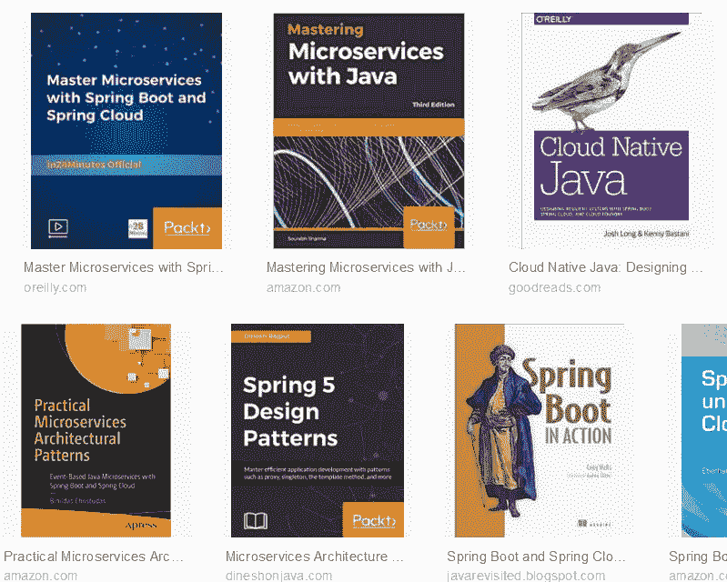
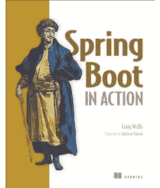
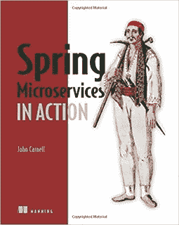
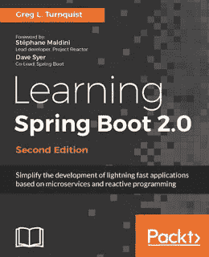
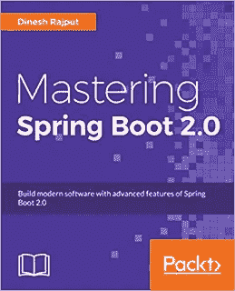

# 2023 年学习 Spring Boot 和春云我最喜欢的书

> 原文：<https://medium.com/hackernoon/top-5-spring-boot-and-spring-cloud-books-for-java-developers-75df155dcedc>

## 用这些令人敬畏的书开始你的 Spring Boot 和春云之旅

如果您是一名 Java 开发人员，并且想了解更多关于 Spring Boot 和 Spring Cloud 框架的知识，那么您来对地方了。在过去，我已经分享了一些最好的 [Spring Boot](https://javarevisited.blogspot.com/2018/05/top-5-courses-to-learn-spring-boot-in.html) 和[春云](http://javarevisited.blogspot.sg/2018/04/top-5-spring-cloud-courses-for-java.html#axzz5DbV6r2Ll)在线课程，今天，我将谈论一些学习 Spring Boot 和春云的最佳书籍。

但是，在此之前，让我们试着了解一下什么是[微服务](https://dzone.com/articles/top-5-spring-microservices-courses-with-spring-boo?edition=366204&utm_source=Weekly%20Digest&utm_medium=email&utm_campaign=Weekly%20Digest%202018-03-07)以及 Spring Boot 和 Spring Cloud 如何帮助 Java 开发微服务。

> 微服务只不过是 RESTful web 服务的扩展，其主要目标是将您的代码分解成小型、分布式和独立的服务，以便更好地管理。

然而，它确实需要深思熟虑的设计和大量的准备工作。

幸运的是， [Spring Boot](https://hackernoon.com/top-5-online-courses-to-learn-spring-boot-in-2019-c2fd7a0282c2) 和 [Spring Cloud](https://javarevisited.blogspot.com/2018/02/top-5-spring-microservices-courses-with-spring-boot-and-spring-cloud.html) 通过提供通用功能简化了您的微服务应用，并允许您通过抽象出基于云的开发所需的细节来专注于业务逻辑。

正如 [Spring Framework](http://www.java67.com/2018/11/top-10-spring-framework-annotations-for-java-developers.html) 简化了 Java 开发一样，Spring Boot 消除了开发基于 REST 的服务[所涉及的摩擦和样板代码。](http://javarevisited.blogspot.sg/2018/01/7-reasons-for-using-spring-to-develop-RESTful-web-service.html#axzz55a8rTeu7)

类似地，Spring Cloud 提供了一套工具，用于将微服务发现、路由和部署到企业和云。这样你就不需要关注*云相关的细节*，可以像现在一样继续编写 Java 应用。

由于 Java 开发现在正在走向一个[云和微服务](https://javarevisited.blogspot.com/2018/02/top-5-spring-microservices-courses-with-spring-boot-and-spring-cloud.html#axzz5Cz1R4cHw)的世界，所以这可能是学习 Spring Boot 和 Spring Cloud 的最佳时机，这样你就可以为不久的将来的巨大机遇做好准备。

# Java 程序员的 5 本最佳 Spring Boot 和 Spring Cloud 书籍

不幸的是，关于这些框架的好书并不多，所以我们没有太多的选择。同时，一些可用的书真的很棒。

随着越来越多的 [Java 开发人员](https://dev.to/javinpaul/10-frameworks-java-and-web-developers-can-learn-in-2019-17ke)学习 Spring Boot 和 Spring Cloud 来开发基于云的 Java 应用程序，你可以期待更多关于这些主题的书籍被撰写和发行。现在，我们将看到市场上目前提供的一些学习 Spring Boot 和 Spring Cloud 的最佳资源。

顺便说一句，在探索 Spring Boot 和 Spring Cloud 之前，Spring 框架的基础知识是强制性的，如果您需要建议，这些在线课程可以帮助您:

1.  [**弹簧框架 5:初学者到宗师**](https://click.linksynergy.com/fs-bin/click?id=JVFxdTr9V80&subid=0&offerid=323058.1&type=10&tmpid=14538&RD_PARM1=https%3A%2F%2Fwww.udemy.com%2Fspring-framework-5-beginner-to-guru%2F)
2.  [**春季大师班——初学者到专家**](https://click.linksynergy.com/fs-bin/click?id=JVFxdTr9V80&subid=0&offerid=323058.1&type=10&tmpid=14538&RD_PARM1=https%3A%2F%2Fwww.udemy.com%2Fspring-tutorial-for-beginners%2F)
3.  [**春天&冬眠适合初学者(包括 Spring Boot)**](https://click.linksynergy.com/deeplink?id=JVFxdTr9V80&mid=39197&murl=https%3A%2F%2Fwww.udemy.com%2Fcourse%2Fspring-hibernate-tutorial%2F)

这里有一些适合 Java 开发人员学习 Spring Boot 和 Spring Cloud 的最佳书籍。

# 1.Spring Boot 在行动

这是从 Craig Walls 那里学习 Spring Boot 的最好的书，Craig Walls 通过他的经典著作《Spring in Action》*教授了大多数 Java 开发人员 Spring 框架。*

*克雷格有一种奇妙的能力，用简单的语言和漂亮的类比解释复杂而乏味的概念。除此之外，你还会在这本书里找到许多美丽的例子。*

*这本书涵盖了 Spring Boot 几乎所有的基本主题，从[自动配置](http://www.java67.com/2018/06/top-15-spring-boot-interview-questions-answers-java-jee-programmers.html)和初学者依赖，以及 Spring Boot 如何简化 Java 开发的一般概念。*

**

*这本书进一步探索了高级概念，如 Spring Boot 致动器，以了解 Spring Boot 应用程序内部发生了什么。它还着眼于 Spring Boot CLI，用 [Groovy](http://javarevisited.blogspot.sg/2018/02/top-3-jvm-languages-java-programmer-learn.html#axzz56WXxxAC0) 进行更简单的 Java Spring 开发。*

*简而言之， [*Spring Boot 在行动*](https://www.amazon.com/Spring-Boot-Action-Craig-Walls/dp/1617292540?tag=javamysqlanta-20) 是学习 Spring Boot 的最佳书籍之一，也是任何想要掌握 Spring Boot 框架的 Java 开发人员的必读之作。*

*为了以防万一，如果你想更主动地学习，你可以把这本书和 Udemy 的 100 步学习 Spring Boot 课程结合起来，这样可以两全其美。*

* [## 用 100 步学会 Spring Boot——从初学者到专家

### 成为 Spring Boot 的专家，在 100 步内开发 REST API 和 Spring MVC Web 应用程序

www.udemy.com](https://www.udemy.com/spring-boot-tutorial-for-beginners/?ranMID=39197&ranEAID=JVFxdTr9V80&ranSiteID=JVFxdTr9V80-X8bScomF0ort1yiR7dRZkQ&LSNPUBID=JVFxdTr9V80)* 

# *2.云原生 Java*

*这是关于基于云的 Java 开发的[书](https://www.amazon.com/Cloud-Native-Java-Designing-Resilient/dp/1449374646?tag=javamysqlanta-20)的精华。我不认为有任何其他书籍成功地涵盖了基于云的 Java 开发和使用 Spring 构建弹性分布式应用程序，比如这本书。*

*两位作者， [Spring Cloud](https://medium.com/u/a17df5ec14a4#axzz5DmwFLA1K) 和 Cloud Foundry 为构建基于云的 Java 应用打下坚实的基础。*

*本书分为四个主要部分，涵盖基础知识、开发分布式 web 服务和微服务、将基于云的应用程序集成和部署到生产环境中，以及一些关于持续集成和交付的指南。*

*简而言之，这是开发基于云的 Java 应用程序最全面的指南之一。如果你愿意，还可以将本书与 [**大师微服与 Spring Boot 和春云**](https://click.linksynergy.com/fs-bin/click?id=JVFxdTr9V80&subid=0&offerid=323058.1&type=10&tmpid=14538&RD_PARM1=https%3A%2F%2Fwww.udemy.com%2Fmicroservices-with-spring-boot-and-spring-cloud%2F) 课程结合，两全其美。*

* [## 借助 Spring Boot 和春云掌握微服务

### 你想和 Spring Boot 一起学习构建令人惊奇的 REST API 吗？你想了解微服务的宣传吗…

www.udemy.com](https://www.udemy.com/microservices-with-spring-boot-and-spring-cloud/?ranMID=39197&ranEAID=JVFxdTr9V80&ranSiteID=JVFxdTr9V80-R.1CaBV23bQdTe1qCz2SFA&LSNPUBID=JVFxdTr9V80) 

# 3.Spring 微服务正在发挥作用

这是另一本关于基于云的 Java 开发的[巨著](https://www.amazon.com/Spring-Microservices-Action-John-Carnell/dp/1617293989?tag=javamysqlanta-20)，但是它关注的是微服务。实际上，这是我从[云原生 Java](https://www.amazon.com/Cloud-Native-Java-Designing-Resilient/dp/1449374646?tag=javamysqlanta-20) 开始之前读的第一本关于这个主题的书。

作者 [Java](https://medium.com/u/d519380586f9#axzz4zuIICRs9) 和 [Spring](http://www.java67.com/2017/11/top-5-free-core-spring-mvc-courses-learn-online.html) 平台构建基于微服务的应用。您不仅会学到这些概念，还会在构建和部署您的第一个 Spring 云应用程序时获得微服务设计的实践经验。

总的来说，对于有 Spring 经验，想用 Java 开发微服务应用的 Java 开发者来说，这是一本理想的书。

你也可以把这本书和**[**Master Java Web Services 和 REST API 与 Spring Boot**](https://click.linksynergy.com/fs-bin/click?id=JVFxdTr9V80&subid=0&offerid=323058.1&type=10&tmpid=14538&RD_PARM1=https%3A%2F%2Fwww.udemy.com%2Fspring-web-services-tutorial%2F) 课程结合起来，既学习 REST Web Services，也学习微服务。**

# **4.学习 Spring Boot 2.0**

**这是另一本[学习 Spring Boot 2.0 的牛逼书](https://www.amazon.com/Learning-Spring-Boot-2-0-microservices-ebook/dp/B01LPRN0Z8?tag=javamysqlanta-20)。这是流行的 Spring Boot 框架的最新版本。作者、Spring HATEOAS 和 Spring Data REST 的开发，同时还担任 Spring 入门指南的自由编辑。**

**所有这些经历在本书中都很明显。我特别喜欢他对细节的解释。例如，在第一个 Spring Boot 的例子中，他解释了一个[@ Spring boot application](http://www.java67.com/2018/05/difference-between-springbootapplication-vs-EnableAutoConfiguration-annotations-Spring-Boot.html)在递归扫描 Spring 组件、启用自动配置和声明类本身可以是 Spring beans 的来源方面做了什么。**

****

**然后他出去解释日志并证明他的观点，这确实巩固了信息。这本书不仅涵盖了 Spring Boot，还非常丰富地测试了 Spring 应用程序。作者有点像测试迷，写了 [Python 测试指南](https://www.amazon.com/Python-Testing-Cookbook-Greg-Turnquist/dp/1849514666?tag=javamysqlanta-20)。**

***[***学习 Spring Boot 2.0***](https://www.amazon.com/Learning-Spring-Boot-2-0-microservices-ebook/dp/B01LPRN0Z8?tag=javamysqlanta-20) 探索与 Spring Boot 一起开发微服务并将 Spring Boot 应用部署到生产中的前景。简而言之，这是一本适合 Java 开发人员学习 Spring Boot 的完美书籍。***

# ***5.掌握 Spring Boot 2.0***

***这是迪内什·拉吉普特关于 Spring Boot 的另一本相对较新的书。他也是一名 Java 博客作者和 Spring 爱好者。他还是 Pivotal 认证的 Spring 专家，也是 Spring 5 Design Patterns 的作者，这是另一本关于 Spring 框架的精彩书籍。***

***这本书的全称是**[*掌握 Spring Boot 2.0:使用 Spring Boot 构建现代、云原生、分布式系统。*](https://www.amazon.com/Mastering-Spring-Boot-2-0-cloud-native/dp/1787127567/?tag=javamysqlanta-20)**正如扩展标题所解释的，它还涵盖了 Spring 云和基于云的 Java 开发。*******

*******在本书中，您将从 Spring 框架的最新版本 Spring Boot 2.0 开始，然后学习基本功能，例如自动配置、启动器依赖性、执行器、Spring Boot CLI 等。*******

**************

*******一旦您熟悉了基础知识，您将探索高级的东西，如定制自动配置以满足您的期望。之后，这本书通过介绍关键的 Spring Boot 工具和服务，探索了[微服务](http://javarevisited.blogspot.sg/2017/12/10-things-java-programmers-should-learn.html#axzz53ENLS1RB)和[云](http://www.java67.com/2018/02/10-books-java-developers-should-read-in.html)场景。*******

*******简而言之，这本书涵盖了开发基于 Spring 的 Java 微服务应用程序所需要知道的一切，从开发到测试和部署，如果你愿意，你还可以将这本书与 [**Spring Boot 微服务与 JPA**](https://click.linksynergy.com/fs-bin/click?id=JVFxdTr9V80&subid=0&offerid=323058.1&type=10&tmpid=14538&RD_PARM1=https%3A%2F%2Fwww.udemy.com%2Fspring-boot-microservices-with-jpa%2F) 课程结合起来，以获得两全其美。*******

***** [## Spring Boot 微服务与 JPA | Udemy

### 了解如何用 Spring MVC 开发实现 JPA (Java Persistence Api)和 MVC 模式的 Java Rest 微服务。

www.udemy.com](https://www.udemy.com/spring-boot-microservices-with-jpa/?ranMID=39197&ranEAID=JVFxdTr9V80&ranSiteID=JVFxdTr9V80-yl..g6CzxjpB24_YOe9SlA&LSNPUBID=JVFxdTr9V80) 

关于学习 Spring Boot 和春云的**最佳书籍**到此为止。这是开发基于云的 Java 应用程序的两个领先的 Java 框架。

这些书不仅会帮助你学习基础知识，还会给你提供在云上创建和部署自己的 Java 应用程序所需的实践经验。

这几本书学习基于云的 Java 开发应该足够了，但是如果需要更多的辅助，还可以参考 [***大师微服务开发搭配 Spring Boot***](https://click.linksynergy.com/fs-bin/click?id=JVFxdTr9V80&subid=0&offerid=323058.1&type=10&tmpid=14538&RD_PARM1=https%3A%2F%2Fwww.udemy.com%2Fmicroservices-with-spring-boot-and-spring-cloud%2F) 进行更多的导师指导学习。

其他 **Java 和 Spring 文章**你可能喜欢:
[Java 开发者可以向 Spring 学习的 3 个最佳实践](https://javarevisited.blogspot.com/2018/06/3-best-practices-java-programmers-can-learn-from-spring-framework.html)
[Spring MVC 在 Java 内部是如何工作的？](https://javarevisited.blogspot.com/2017/06/how-spring-mvc-framework-works-web-flow.html)
[Java 开发者应该学习的 10 件事？](https://javarevisited.blogspot.sg/2017/12/10-things-java-programmers-should-learn.html#axzz53ENLS1RB)
[Java 和 Web 开发人员应该学习的 10 个框架](https://javarevisited.blogspot.com/2018/01/10-frameworks-java-and-web-developers-should-learn.html)
[Java 开发人员的 5 大 Spring 微服务课程](https://javarevisited.blogspot.com/2018/02/top-5-spring-microservices-courses-with-spring-boot-and-spring-cloud.html#axzz5Cz1R4cHw)
[15 Spring Boot Java 开发人员面试问题](http://www.java67.com/2018/06/top-15-spring-boot-interview-questions-answers-java-jee-programmers.html)
[成为更好的 Java 程序员的 10 个技巧](http://javarevisited.blogspot.sg/2018/05/10-tips-to-become-better-java-developer.html)
[深入学习 Spring 框架的 5 个课程](https://javarevisited.blogspot.com/2018/06/top-6-spring-framework-online-courses-Java-programmers.html)
[Java 开发人员应该学习的 10 个 Spring MVC 注解](https://www.java67.com/2019/04/top-10-spring-mvc-and-rest-annotations-examples-java.html)

感谢阅读这篇文章！如果你喜欢这些 Spring Boot 和春云的书，请与你的朋友和同事分享。如果您有任何问题或反馈，请在下面的评论中留言。

p . S .。—顺便说一句，如果你需要更多的选择，这里有一些更多的在线课程，可以深入了解 Spring Boot 和春云:

1.  [**Spring Boot 微服务与 JPA**](https://click.linksynergy.com/fs-bin/click?id=JVFxdTr9V80&subid=0&offerid=323058.1&type=10&tmpid=14538&RD_PARM1=https%3A%2F%2Fwww.udemy.com%2Fspring-boot-microservices-with-jpa%2F)
2.  [**大师微服与 Spring Boot 和春云**](https://click.linksynergy.com/fs-bin/click?id=JVFxdTr9V80&subid=0&offerid=323058.1&type=10&tmpid=14538&RD_PARM1=https%3A%2F%2Fwww.udemy.com%2Fmicroservices-with-spring-boot-and-spring-cloud%2F)
3.  [**掌握 Java Web 服务和 REST API 与 Spring Boot**](https://click.linksynergy.com/fs-bin/click?id=JVFxdTr9V80&subid=0&offerid=323058.1&type=10&tmpid=14538&RD_PARM1=https%3A%2F%2Fwww.udemy.com%2Fspring-web-services-tutorial%2F)
4.  [**100 步学会 Spring Boot——从初学者到专家**](https://click.linksynergy.com/fs-bin/click?id=JVFxdTr9V80&subid=0&offerid=323058.1&type=10&tmpid=14538&RD_PARM1=https%3A%2F%2Fwww.udemy.com%2Fspring-boot-tutorial-for-beginners%2F)

祝您的春云和 Spring Boot 之旅一切顺利，如果您面临任何问题或遇到困难，请随时联系我，我会尽力帮助您。如果方便的话，你也可以在这里留言。

## 你可能喜欢的其他媒体文章

 [## 面向有经验的 Java 开发人员的 10 门高级 Spring Boot 课程

### 高级 Spring Boot 课程为有经验的 Java 开发人员学习 Spring Boot 测试，云和容器…

medium.com](/javarevisited/10-advanced-spring-boot-courses-for-experienced-java-developers-5e57606816bd)  [## 面向 Java 开发人员的 10 个免费 Spring Boot 课程和教程

### 大家好，作为一个 Java 博客的作者和 Java 开发人员，很多人问我关于课程和书籍的问题…

medium.com](/javarevisited/10-free-spring-boot-tutorials-and-courses-for-java-developers-53dfe084587e)  [## 学习 Java 和 Spring 框架中微服务的 7 大课程

### 微服务是软件开发领域的新术语，尤其是在 Java 方面，但它已经在实践中…

medium.com](/javarevisited/top-5-courses-to-learn-microservices-in-java-and-spring-framework-e9fed1ba804d)******