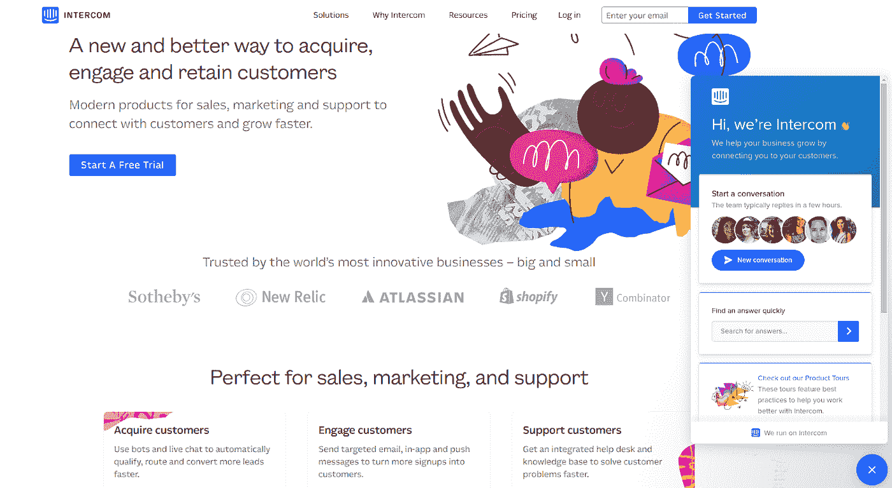
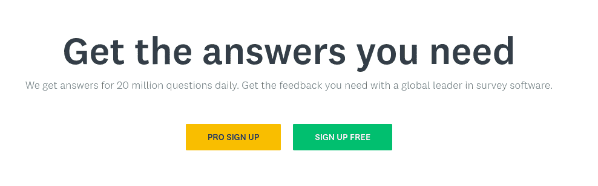
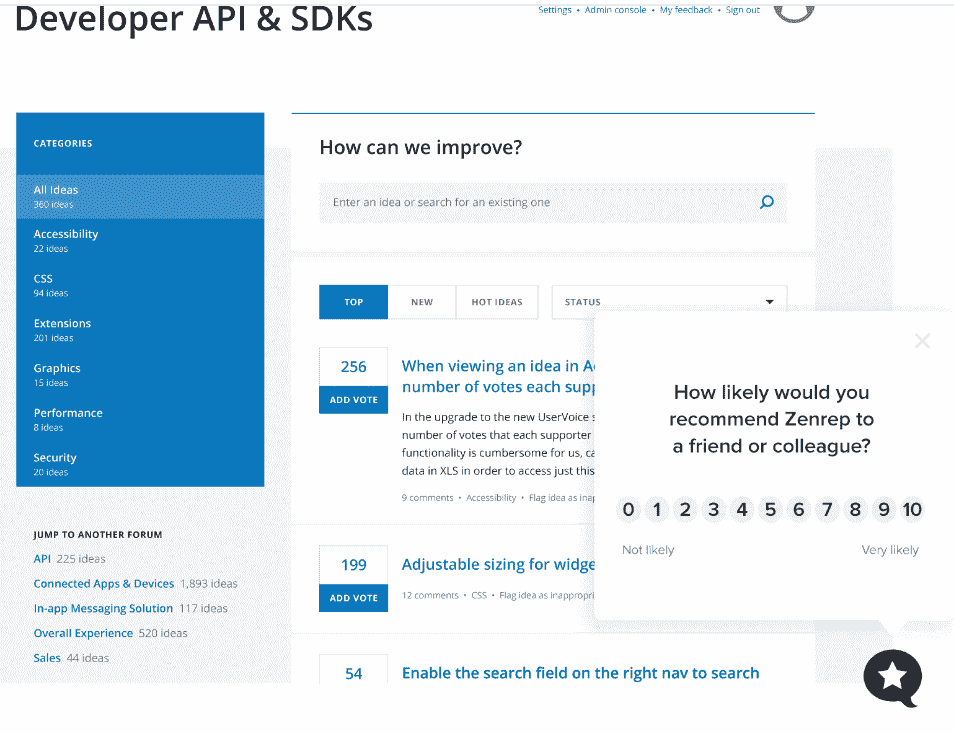
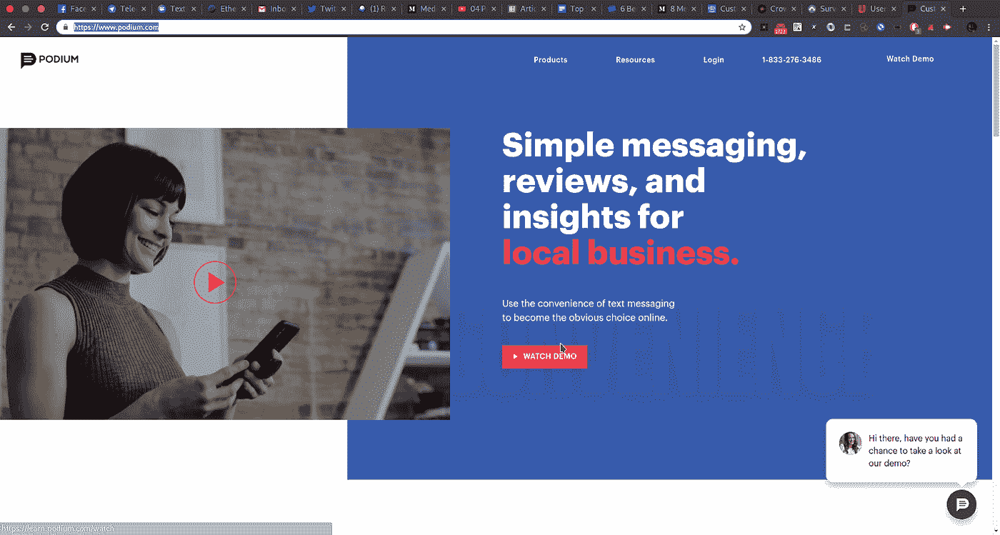
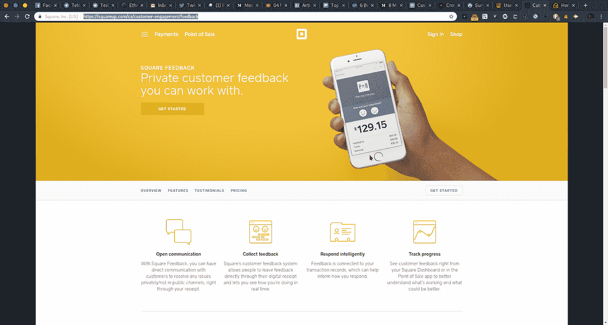

# 前 5 名用户反馈软件和服务

> 原文：<https://medium.com/hackernoon/top-5-user-feedback-software-and-services-6caa071e3362>

吸引或创造与你的用户或潜在用户的反馈循环的诀窍是你传递沟通或潜在沟通的方式，这些用户可能想要利用你的产品或服务。软件套件可以让这变得更容易，或者创建一个全新的生态系统(或者聚合现有的生态系统，让它们变得更容易！)供您对正面和负面反馈做出反应或主动处理。

当您查看此列表时，请记住，您最喜欢的搜索引擎可能会带您进入更多的潜在优势或优势的兔子洞，这些特定的组织和我错过的销售宣传的一部分，或者额外的或更多的精品解决方案，它们可能完全符合您的需求！

你会注意到文本中方便的链接，让你看到一些[世界上最好的和最受欢迎的区块链和加密货币参与和营销公司](https://crowdcreate.us/engagement-marketing)。就像最近这句话！

# 对讲机

[Intercom 是一系列工具，你可以随意添加到你站点的界面上。](https://www.intercom.com/)在最基本的形式中，您还可以设置他们的后端来跟踪和报告不同的用户活力数据——从在页面或功能上花费的时间，或者用户与您的网站的点击次数或其他交互。你可以很容易地[创建聚合数据(在我们的另一个出版物](/@jarettrsdunn/8-methods-or-comments-for-on-getting-user-experience-and-feedback-how-the-best-crowdfunding-f99c1eb2a960)中可以看到其中的一些价值)，让你做出更聪明的数据和更明智的决策。

intercom 的真正魅力在于，您可以使用它来定制调查、NPS 问卷或任何您感兴趣的内容，这些内容都是基于您定义的特定触发器，从您的用户已经在使用的界面中定制的。你也可以通过对讲机运行帮助台——我们都见过他们有用的小？或者网页右下方的其他聊天气泡！我去找了一个例子，大声地问‘你认为对讲机有对讲机吗？’果然——他们有！

Intercom 被评为任何垂直或行业中可用的[最佳用户反馈工具之一，并被全球顶级营销机构推荐](https://crowdcreate.us/)。他们有额外的套件和产品包可供按需消费，并采用分层定价。他们的支持团队在帮助找出他们的平台可以增加价值的各种方式方面表现出色。

# 调查猴子

[SurveyMonkey 可能是这个名单上的老名字之一，但他们的价值陈述已经被证明是正确的，因为它经过了检验和测试](https://www.surveymonkey.com/)。他们的平台允许你为你预先定义的一系列问题创建、联合和收集答案。这可以选择性地发送给现有用户或当前利益相关者列表之外的人，以满足您的所有用户反馈需求——从评估痛点到解决围绕新版本的问题或感受增长机会。一些更加[合拍的营销机构会推荐使用 SurveyMonkey 的用户反馈研究软件](https://crowdcreate.us/)的这种吸引人的方法，因为总的来说，这种效果比更新或未经尝试的技术更有益。他们的套件允许即时反馈和汇总数据，以做出同样更智能的数据和更智能的决策！

# 用户之声

[UserVoice 是一种更有针对性的用户反馈软件](https://www.uservoice.com/)、[由全球顶级互动营销机构推荐](https://crowdcreate.us/)，因为它们有助于找出增长机会存在的原因、方式和时间。您可以收集关于产品数据的反馈和建议，然后收集其他用户的投票，看看哪些痛点或机会最受欢迎或最多产。

# 讲台

[Podium 是同一思路的另一种变体，它允许在市场上或网站上的评论论坛上汇总用户反馈](https://www.podium.com/)，让您主动对⅕或⅖的明星采取行动，同时还可以汇总评论那些为您的组织带来业务的⅘或 5/5 明星。

研究表明，90%的互联网用户在承诺购买或订阅产品或服务之前，会在谷歌、亚马逊或 Yelp 等网站上积极寻找评论或推荐。如果你没有一个知道自己在做什么的活跃的或全职的社交代表，这些类型的评论有时会被错过——Podium 通过提前向你提供这些数据来消除这种需求，这些数据是汇总的和可操作的！

看看吧，他们主页上有对讲机:

# 方形反馈和其他自动回复

与 Square POS 系统连接后， [Square Feedback 允许在购买后自动向您的购买者发送反馈电子邮件](https://squareup.com/ca/customer-engagement/feedback)。这可以被定制来询问你想从购买你的产品的人那里收到的任何 NPS 或其他核心问题——其他自动回复器将与你的 CRM 或商店系统相结合(无论是 WordPress 上的 WooCommerce，[)Magento(查看一下这个作者曾经代表的这家公司的支持，MageMail——你只需支付他们推荐给你的新业务的一小部分！)](https://magemail.co/)、易贝或亚马逊——选择权在你！参考你喜欢的搜索引擎！)

理论上，这种类型的调查——或者更好的是，这种类型的自动回复器，你可以用来创建一系列关于废弃购物车和周年纪念的跟进邮件，基于兴趣或购物车的折扣等——将允许你吸引这些人，否则他们不会完成订单。

Square 的设计更多的是为了吸引那些可能对你的实体产品有正面评价或推荐的人，但他们在这个列表中值得一提，因为他们做了一件很棒的事情

一些更有针对性的精品套装——取决于你使用的软件——可以在用户反馈和参与领域创造大量机会。

# 结论

当你在寻找下一个最好的东西来帮助你提高你的用户或潜在用户的参与度时，我希望这个列表已经帮助你理解了一些竞争对手中的一些关键差异化因素——或者让你进入一些更小的、普通人定制的解决方案的世界，这些解决方案已经存在或者你可以使用你最喜欢的搜索引擎找到！

请随意查看我们关于营销的其他创始文章——特别是区块链和加密货币——以更多地了解这些行业巨头如何定位这些工具来提高您的投资回报率和有效性及效率。

# 插头！

这里有一个技巧: [CrowdCreate 是一家领先的加密参与营销公司](https://crowdcreate.us)，它使用一些顶级的用户反馈工具来提高投资回报率，并为您的组织创造大量新的和经常性的访问者、用户和贡献者。值得一看！