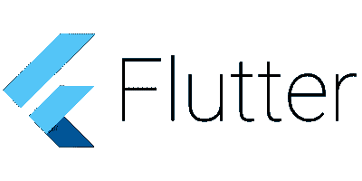

# 2021 年 6 大颤振开发公司

> 原文：<https://medium.com/hackernoon/top-6-flutter-development-companies-in-2019-561af21c842a>

## *自 2017 年 5 月 Flutter early alpha 在 Google 的 I/O 上首次公布以来，它逐渐成为最快的跨平台框架之一，在全球范围内广受欢迎，并及时提高了其稳定性(2018 年 12 月发布了 1.0 版本)。*

今天，在 Flutter alpha 宣布 4 年后，该框架被谷歌和世界各地的开发者用来在 iOS 和 Android 上提供漂亮的原生应用。但是你如何判断一家提供 Flutter 开发服务的公司是否可靠呢？下面，我创建了一个顶尖 Flutter 开发公司的名单，基于 4 个关键因素:他们的经验，成功的 Flutter 项目，对 Flutter 社区的贡献，以及来自 Google 的官方批准。

# **米奎多**

虽然一些公司在 Flutter 1.0 发布后就采用了它，但 [Miquido](https://www.miquido.com/) 是其 alpha 版本的首批早期采用者之一——取得了相当惊人的成果。该公司凭借在 Flutter and React 中的强大组合赢得了移动开发领导者的地位。

Topline 是他们在 10 周内为 Abbey Road Studios 创建的应用程序(致力于 Flutter alpha)，受到了谷歌的赞赏，并在 2018 年 5 月的谷歌 I/O 和 Flutter Live 2018 期间正式亮相。谷歌在 flutter.dev 网站和他们的一系列 [Flutter 开发者故事](https://www.youtube.com/watch?v=_ACWeGGBP4E&t=6s)上也展示了这一点[。](https://flutter.dev/showcase)

Abbey Road Studios 的解决方案并不是 Miquido 团队用 Flutter 编写的唯一应用程序。该公司创建了 i.a [Quidlo 时间表](https://www.quidlo.com/)——一个直观的工作时间跟踪和报告平台，可在 App Store 和 Google Play 上获得。

Miquido 团队还主持和参与了许多 Flutter 社区活动。他们的专业知识赢得了全球颤振开发公司的顶级地位。

# **极客**

[GeekyAnts](https://geekyants.com/) 是 Flutter 最早的采用者之一，自从它早期发布以来就一直在尝试。他们的工作也得到了谷歌核心 Flutter 团队的认可，自 2017 年以来，他们一直是谷歌有限责任公司的注册服务供应商。他们也在许多 Flutter 社区活动中占有重要地位，并且有他们自己的 Flutter 市场。

# **阿里巴巴**

全球最大的在线商务公司之一阿里巴巴(Alibaba)使用 Flutter 开发了先宇应用，该应用已有 5000 多万次下载，并在谷歌的 Flutter 开发者故事系列中出现。

# 非常好的投资和夜店

Formly Posse 是 Miquido Topline 应用程序旁边的一系列 Flutter 开发者故事中的特色，纽约的 Very Good Ventures 和旧金山的[Yakka](https://theyakka.com)都是 Flutter 社区的主要贡献者。 [Very Good Ventures](https://verygood.ventures) 是 Hamilton 应用程序以及在 Google IO 2019 上演示的 KENKEN Flutter Web 应用程序的开发幕后推手。Yakka 维护着流行的 Fluro 路由库。

# **AppInventiv**

在 2018 年世界移动通信大会上宣布 Flutter 测试版后， [AppInventiv](https://appinventiv.com/) 帮助他们的一些客户将其 React 原生应用移植到跨平台 Flutter 应用中。

# **头脑盘点**

[Mindinventory](https://www.mindinventory.com/) 提供使用 Flutter 框架的 app 开发。这个团队充满了 Flutter 爱好者，Flutter meetups 和社区的参与者——他们也用 Flutter SDK 创建了一些项目。

## **免责声明:**

上面的列表涵盖了 Flutter 公司，在我个人看来，考虑到他们的专业知识、社区参与和谷歌的批准，他们是 Flutter 世界中最严肃的玩家。显然，仍然有很多人对 Flutter 产生了兴趣，并且可能很快会加入这个行列。如果你能想到任何公司应该被添加到列表中，请随意在 Google Play 或应用商店的评论中粘贴一些链接。