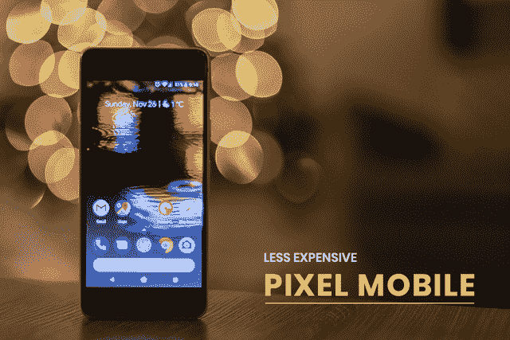
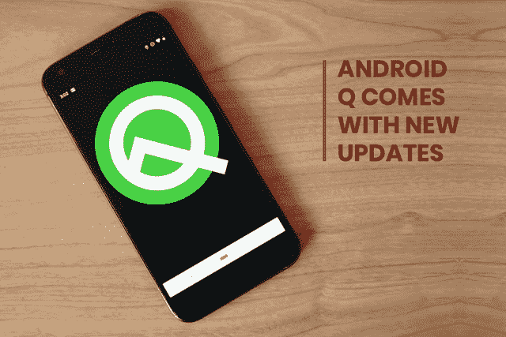
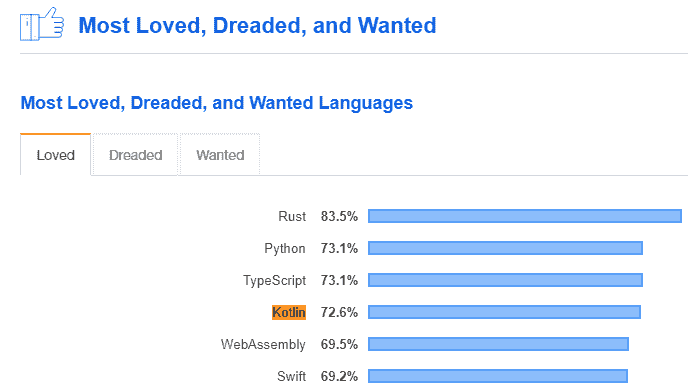
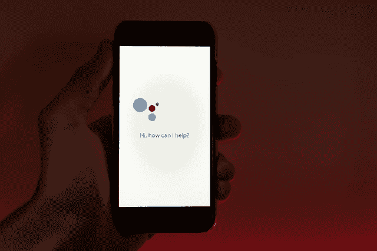

# 9 大谷歌 I/O 2019 公告:改变应用行业

> 原文：<https://medium.com/hackernoon/top-9-google-i-o-2019-announcements-transforming-the-app-industry-d419c7021689>

每年，谷歌都会为其开发者举行一次会议，只是为了帮助他们更新他们的应用程序，使他们跟上最近的创新。它通常从 5 月 7 日开始，到 5 月 9 日结束。此外，这一事件还透露了有关谷歌带来了什么新的信息！

这可能是开发者的会议，但对企业和客户同样重要。谷歌每年宣布的这些更新极大地影响了移动应用开发行业的业务。

每一个 [**移动应用程序开发公司**](https://www.xicom.biz/offerings/mobile-app-development/?utm_source=SM05) 每年都在等待这些公告，我希望你也是其中之一，因为你来到了这里。所以，急切地寻找 2019 年最新的谷歌公告？让我们来看看谷歌今年发布的一系列公告:

> Google I/O 2019 移动应用开发行业亮点:

# 排名第一的谷歌输入/输出亮点:面向大众的廉价 Pixel 手机

这对所有人来说并不意外，因为它的细节已经在市场上泄露了。但尽管如此，谷歌通过在大会上推出 Pixel 3a 和 3a XL 智能手机，使其正式化。这些手机的价格起价为 399 美元。

谷歌正在开发一款高性价比的智能手机。该组织愿意通过进入客户寻求更合理价格的顶级智能手机的全球市场来扩大其市场。此外，它仍在努力超越苹果等竞争对手。

最新的 5.6 英寸 Pixel 3a 手机比以前的型号便宜一半。新像素将花费 399 美元。而 6 英寸像素 3a XL 就要 479 美元。此外，普通的高端像素设备起价为 799 美元。

> 它们有黑色、白色和紫色可供选择。手机的评论也很棒。下面是 Pixel 3 和 3A XL 的功能和销售数字的详细[分析](https://economictimes.indiatimes.com/magazines/panache/can-the-lower-priced-pixel-3a-3a-xl-resurrect-googles-smartphone-dream/articleshow/69385143.cms)

这些即将推出的手机基本上是谷歌现有 Pixel 移动系列的较低版本，它们没有推广任何新功能。这些新的 Pixel 手机的外观与以前的手机非常相似，它们的相机也具有人像和夜间模式。

# 第二大谷歌输入/输出亮点:谷歌助手变得更加有趣

谷歌的下一代助手以更快的速度处理请求。它帮助用户更快地说出命令，而没有任何速度相关的问题。此外，它的*持续对话*功能有助于用户更加流利地说话。

现在，没有必要在每个命令的开头说“嘿，谷歌”。这款下一代谷歌助手将于今年下半年在最新的 Pixel 手机上推出。

除了速度之外，它还有一个名为*个人参考*的特殊功能，可以帮助定制助手。此外，新的谷歌助手可以很容易地与 Waze 和谷歌地图集成。关于即将发布和更新的谷歌助手，这是另一件有趣的事情。

现在，您可以在导航期间和今年晚些时候轻松访问各种精确功能。它将在每部装有谷歌助手的手机上提供。

> 不仅如此，现在你不需要说“嘿，谷歌”就可以在谷歌家居设备和谷歌智能显示器上使用定时器和闹钟。相反，你可以只说“停止”，然后等待小工具接受你的命令。

# #3 谷歌 I/O 亮点:Android Q 有新的更新

在这次 I/O 2019 大会上，谷歌分享了关于其下一代移动操作系统 Android Q 的各种更新。它配备了一种新的*黑暗模式*，可以创建黑色背景和白色文本，这对电池寿命和眼睛都很舒适。

此外，谷歌将增加一些功能，以帮助大众利用小工具，而不是像去年推出的数字健康推送的一部分。

> 根据谷歌的说法，90%使用其计时器的人仍然较少使用应用程序。目前，谷歌正在推出一种聚焦模式，这种模式没有 Youtube 等令人分心的应用程序。

这次 Android 发布会将更多的注意力放在两件重要的事情上——隐私和安全。此外，它将有更快的软件更新和更多的设置，以协助这些问题的背景。

# 排名第四的谷歌输入/输出亮点:新的 Nest Home Max

谷歌与其 Nest 和智能家居团队合作，现在所有智能家居设备都属于 Nest 品牌。Nest 品牌下推出的第一款新设备是 Nest Home Max。

基本上，它是一个 10 英寸显示屏的巨型谷歌 Home Hub。此外，它还拥有 Home Hub 的所有功能和一些更新的功能。例如，您可以将 Hub Max 的摄像头用作家庭安全摄像头，如果您不在家附近，还可以播放实时视频。

此外，它有一个新的面部匹配功能，可以识别每个用户，如果配置和个性化的体验。此外，它还有新的*手势支持*，利用设备上机器学习技术的概念来识别手势，所以现在你不需要说一句话来控制它。

谷歌宣布 Nest Hub Max 将于今年夏天推出，价格为 229 美元。然而，最初的家庭网络中心现在被称为 Nest Hub，其成本价格有所降低。现在，Nest Hub 的成本价降低到了 129 美元。

# 排名第五的谷歌输入输出亮点:Android 现在首先进入 Kotlin

> 谷歌在最近的声明中写道:“Android 开发将越来越以 Kotlin 为先”。

所以，如果你正在制作一款 [**手机应用**](https://www.xicom.biz/offerings/mobile-app-development/?utm_source=SM05) ，那么选择 Kotlin 吧，因为它需要测试、编写和维护的代码更少。

2017 年，谷歌在其 Android studio 中声明支持这种语言。这有助于 Kotlin 在过去两年中在开发人员中获得人气。今天，在 Stackoverflow 最近的一项调查中，Kotlin 是第四大最受欢迎的语言。

> 下面是相同的图形表示:

> 在这次大会上，谷歌在 I/O 2019 上宣布 Kotlin 为 android 应用开发的官方编程语言之一。此外，谷歌表示，它将使用 Kotlin 制作所有未来的 Android 应用程序。

此外，Google 建议 Java 开发者迁移到 Kotlin。预计 It 外包 [**软件公司**](https://www.xicom.biz/offerings/software-development/?utm_source=SM05) 将很快雇佣来自印度的移动应用程序开发人员在 Kotlin 上创建 android 应用程序。

# #6 谷歌输入/输出亮点:直播字幕

有多少次因为语言问题，你理解一部网剧的努力都白费了？这里是谷歌的一个更新，将为 Android Q 上播放的所有音频和视频提供字幕。它提供实时字幕。

> **下面是谷歌就该公司最新工具发布的官方视频——Live caption。这个视频很好地解释了它的工作原理:**

您不需要发送或接收任何类型的数据来使其在您的设备上工作。它不取决于您的视频或音频的来源。此外，谷歌正计划推出“直播中继”，这也将支持直播电话。

> 听起来很有趣。不是吗？这是最新的创新，为每个小企业提供了许多探索的机会。

如果你也想在你的应用中加入这些功能，那么我建议你从 best [**android 应用开发公司**](https://www.xicom.biz/offerings/android-development/?utm_source=SM05) 雇佣精通所有最新技术的 Android 应用开发人员。

# 第七大谷歌输入/输出亮点:网络上的谷歌双工

虽然它还没有在网上发布，但它是谷歌最令人兴奋的更新之一！它将作为一个虚拟助理，将与谷歌助理的集成为您个人工作。

它是基于人工智能技术的特征。它就像一个虚拟的个人助理。它是去年由谷歌推出的，可以根据你的旅行计划打电话预订餐馆或出租车。

它通过历史记录跟踪一切，从你的票到偏好，几乎以一种以前无法想象的方式执行它的服务。这就是它成为 2019 年最具趋势的技术更新的原因！

# ***#8 顶级谷歌 I/O 亮点:微服模式下的谷歌地图***

**当你不能独自导航时，你会不会觉得很生气？**为了最大限度地减少搜索和定位的追踪，谷歌为其地图工具引入了一些新的东西。这项功能是去年为 Youtube 搜索推出的。

你现在可以用即将推出的谷歌地图功能在隐姓埋名模式下秘密搜索地点。谷歌宣布用户将能够自动删除搜索和定位历史一周后，这一消息就来了。

这可以在 3 到 18 个月的时间内完成。回到隐姓埋名模式下的谷歌应用程序，你可以在应用程序和网络上享受这个功能。

# ***#9 顶级谷歌 I/O 亮点:搜索***

你有没有发现在谷歌搜索中很难找到播客？根据谷歌搜索工具的新功能，你可以搜索并保存播客以备后用。除此之外，增强现实功能被集成到移动搜索中。

> 谷歌的最新声明提升了其最重要的产品之一；搜索工具，引人注目。这里有几个你可以在搜索中集成 AR 的例子:

*   **把你的手机摄像头对准杂志上的食谱，谷歌会显示相关视频。**
*   **用您的镜头捕捉一个标志，并查看母语的翻译文本。**
*   把一家餐馆的菜单拿到镜头前，谷歌会向你展示最受欢迎的菜肴。

最近推出的谷歌视觉搜索工具使这一切成为可能；谷歌镜头。用户可以搜索任何东西，以前所未有的全新水平与搜索结果进行交互。

# 让我们总结一下:

因此，今年谷歌带来了几项令人惊叹的功能和技术，如下一代谷歌助手、谷歌双工、更便宜的 Pixel 手机和 Nest Home Max。

此外，谷歌还建议 Java 开发者使用 Kotlin。因此，美国的大多数应用程序开发公司应该坚持这个建议，从而产生了基于科特林的 [**安卓应用程序开发**](https://www.xicom.biz/offerings/android-development/?utm_source=SM05) 。

你有没有想法制作一个可以与谷歌最新更新竞争并保持一致的应用程序？如果是，那就不要浪费时间，联系印度最好的 [**移动应用开发服务**](https://www.xicom.biz/offerings/mobile-app-development/?utm_source=SM05) ，让你的想法变成现实！

> **您觉得 Google I/O 公告中的哪些内容更有趣？在评论框中分享你的观点。并且，一定要与你的家人和朋友分享这篇文章，让他们知道谷歌的最新更新。**