# 2019 年值得关注的顶级区块链平台

> 原文：<https://medium.com/hackernoon/top-blockchain-platforms-to-watch-out-in-2019-aa80e336a426>

Image source binary informatics

区块链技术诞生于 2008 年中本聪发表的一篇名为**“比特币:一个点对点的电子现金系统”**的论文。然而,“区块链”一词从未在论文中具体使用过。本文讨论了一种**“电子现金的点对点版本”**，其中网络通过将交易散列到一个基于散列的工作证明链中来为交易添加时间戳。

另一方面，人们将分布式分类帐定义为一个对等网络，它使用一种特定的共识机制来防止有序的时间戳记录系列的更新。共识机制包括拜占庭容错算法、利害关系证明、工作证明等等。

区块链的一些重要用例是供应链和物流、农业、医疗保健、制造业、物联网应用等等。从头开始构建一个区块链应用程序可能相当复杂；然而， [**区块链平台**](https://www.leewayhertz.com/blockchain-platforms-for-top-blockchain-companies/?utm_source=hackernoon_leewayhertz) 允许开发者 [**轻松开发区块链应用**](https://www.leewayhertz.com/blockchain-development-company/?utm_source=hackernoon_leewayhertz) 。

随着区块链技术每年获得越来越多的关注，现在市场上有几个区块链平台可以用来促进区块链的开发。

> 由于有各种各样的区块链平台，您需要选择一个满足您的业务需求。

# 以下是如何为您的企业选择合适的区块链平台

[**我们根据商家的主观评估和特点，为商家选择了受欢迎且易于使用的区块链平台。**](https://www.leewayhertz.com/blockchain-platforms-for-top-blockchain-companies/) 我们基于以下因素对每个区块链平台进行了定性分析:

*   **活动**
    区块链平台在区块链发展项目方面有多活跃？
*   **网络类型**
    区块链平台支持公共、许可还是私有网络
*   **支持的语言** 区块链平台的 SDK 支持哪些编程语言？
*   **人气** 根据对 GitHub 的贡献和收视率，平台的人气有多高？
*   **GitHub Repo** 平台 SDK 的 GitHub Repo 名称。
*   **成本**
    如果平台是免费的或者是付费的，那么它每年的价格是多少。
*   **技术支持** 平台是否有技术支持专家团队做后盾。

# 以下是我们根据上述因素分析的一些区块链平台:

1.  **以太坊**
2.  **总账锯齿**
3.  **总账结构**
4.  **Hyperledger Iroha**
5.  **开链**
6.  **恒星**
7.  **尼奥**
8.  **EOS**
9.  **海德拉哈希图**
10.  **R3 Corda**
11.  **法定人数**
12.  **多链**
13.  **涟漪**
14.  **学分**
15.  **元素**

## **以太坊**

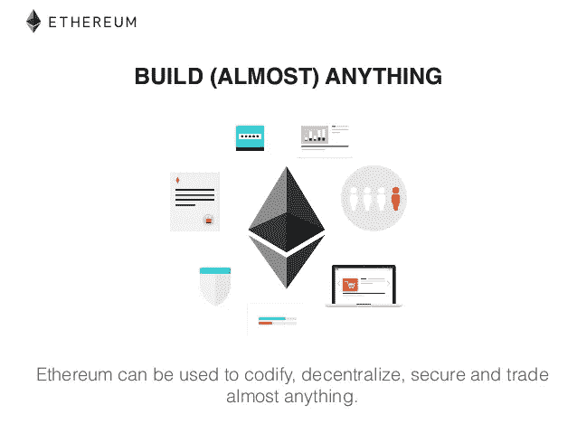

Image source Ethereum

2013 年末，开发团队 Vitalik Buterin、Jeffrey Wilcke 和 Gavin Wood 致力于创建一个基于区块链的开源分布式计算平台以太坊。他们的目标是创建一个完全不可信的智能合约平台。

这是一个开放的区块链平台，允许任何人在区块链技术上开发和运行分散的应用程序。就像比特币一样，没有人可以拥有或控制以太坊平台。它基于以太坊虚拟机(EVM ),为基于以太坊构建的智能合约提供运行时环境。以太坊上的每个节点都运行在 EVM 上。

作为公共区块链平台，它是为限制访问而不是大众消费而构建的。它有一种称为以太的本地加密货币，用于推动整个以太坊生态系统。

> **行业聚焦:**跨行业 **共识算法:**工作证明 **治理:**以太坊开发者 **智能合约功能:**有 **台账类型:**无权限
> **有用链接:**[https://ethereum.org/](https://ethereum.org/)
> [https://github.com/ethereum/wiki/wiki/White-Paper](https://github.com/ethereum/wiki/wiki/White-Paper)

## **总账锯齿**

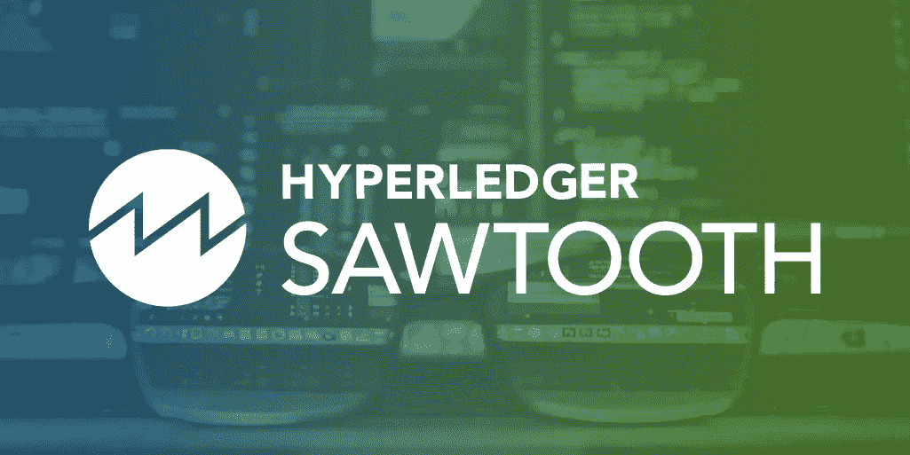

Image source Hyperledger

Hyperledger Sawtooth 由英特尔出资，由 Linux 基金会创建，是广泛使用的 Hyperledger 项目之一，旨在创建、执行和部署分布式分类帐。

这是一个模块化的企业级平台，能够维护数字记录，而不需要中央机构来管理。使用 PoET(运行时间证明)共识机制，Hyperledger Sawtooth 必须与被称为“可信执行环境”的硬件安全解决方案集成，以可信和安全的方式执行代码。

> **行业聚焦:**跨行业 **共识算法:**可插拔框架 **治理:** Linux 基础 **智能合约功能:**是 **总账类型:**有权限
> **有用链接:**[https://www.hyperledger.org/projects/sawtooth](https://www.hyperledger.org/projects/sawtooth)
> [https://sawtooth.hyperledger.org/docs/core/releases/latest/](https://sawtooth.hyperledger.org/docs/core/releases/latest/)
> [https://sawtooth.hyperledger.org/examples/](https://sawtooth.hyperledger.org/examples/)

## **大帐织物**

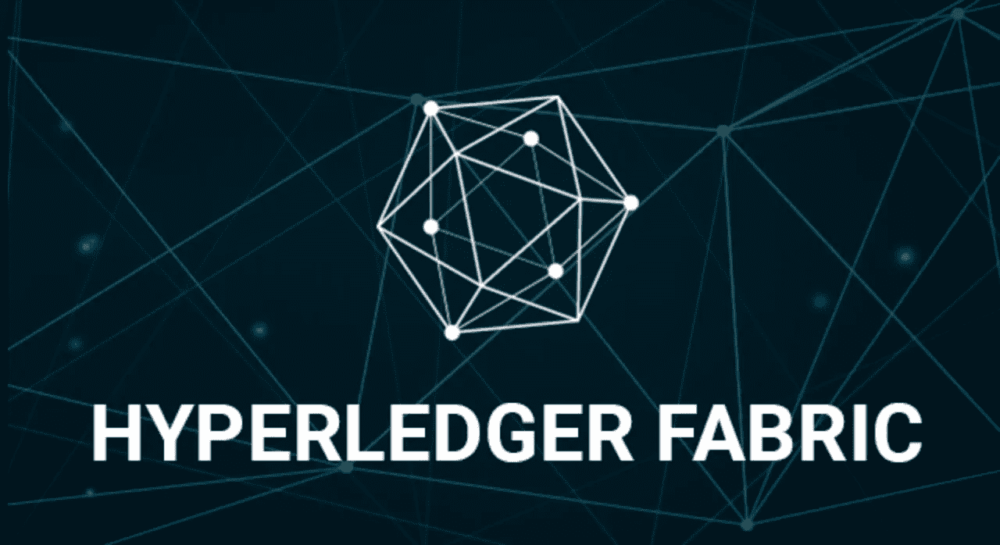

image source Hyperledger

Hyperledger Fabric 也是一个流行的 Hyperledger 项目，旨在使用模块化方法构建区块链应用程序。模块化体系结构使网络设计者能够插入他们选择的组件，例如共识机制、成员服务。这种架构的模块化使 Fabric 不同于其他区块链平台。

Hyperledger Fabric 专为许可网络设计，仅允许已知身份参与系统。只有授权的参与者才能参与 Hyperledger Fabric 平台上发生的交易。

> **行业聚焦:**跨行业 **共识算法:**可插拔框架 **治理:** Linux 基础 **智能合约功能:**是 **总账类型:**有权限
> **有用链接:**[https://www.hyperledger.org/projects/fabric](https://www.hyperledger.org/projects/fabric)
> [https://github.com/hyperledger/fabric](https://github.com/hyperledger/fabric)

## **Hyperledger Iroha**

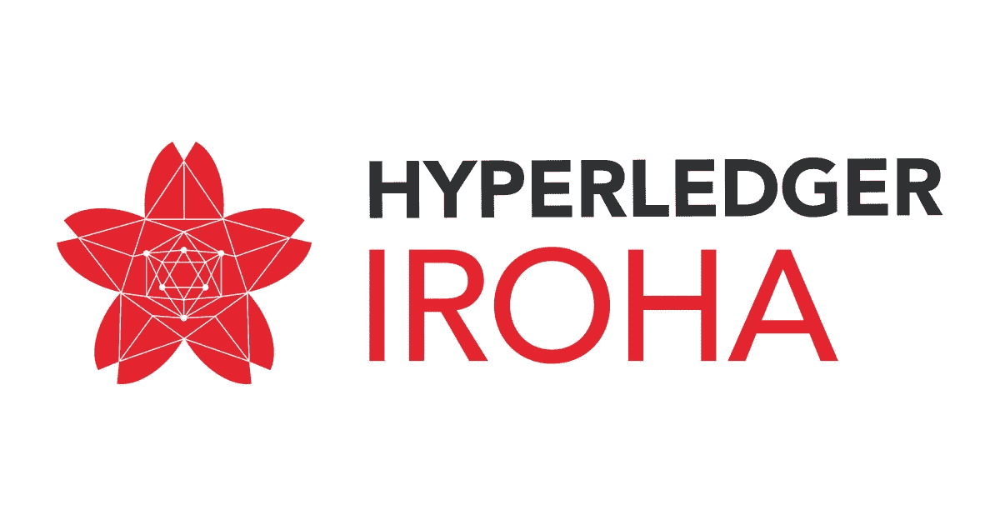

image source Iroha.tech

Hyperledger Iroha 由 Linux 基金会创建，旨在基于区块链技术构建可信、快速和安全的 dApps。基于一个非常快速和安全的共识算法，又一个共识，Iroha 保护节点免受故障或对手节点。

该平台支持 Linux 和 macOS 环境，广泛用于构建供应链和物联网解决方案。和其他 Hyperledger 项目一样，Iroha 也是一个简单的模块化分布式账本系统。

> **行业聚焦:**跨行业 **共识算法:**基于链的拜占庭容错 **治理:** Linux 基础 **智能合约功能:**是 **台账类型:**有权限
> **有用链接:**[https://www.hyperledger.org/projects/iroha](https://www.hyperledger.org/projects/iroha)
> [https://iroha.readthedocs.io/en/latest/](https://iroha.readthedocs.io/en/latest/)

## **开链**

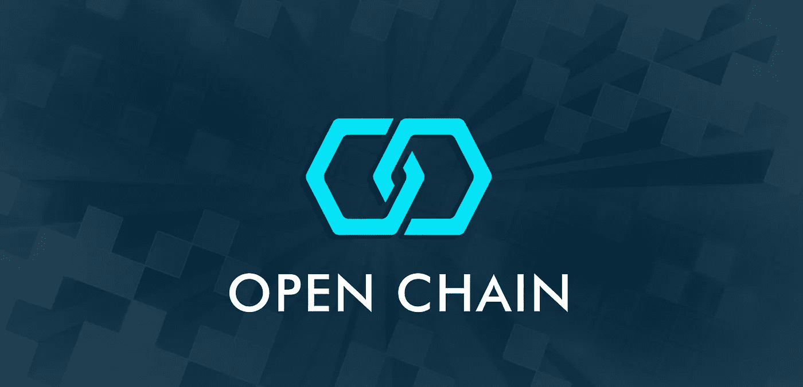

Image source Medium

由 CoinPrism 组织开发的 OpenChain 是一个开源的区块链平台，非常适合希望以可扩展和安全的方式处理数字资产的企业。使用分区共识，一个实例只能有一个授权来验证 OpenChain 平台上的事务。

由于 OpenChain 中没有涉及到 miner，资产管理员可以验证事务。由于 OpenChain 上的交易是免费的，因此它是比任何其他区块链平台都更高效的平台。

> **行业聚焦:**数字资产管理 **共识算法:**分区共识 **治理:** Linux 基础 **智能合约功能:**是 **总账类型:**有权限
> **有用链接:**[https://www.openchain.org/](https://www.openchain.org/)
> [https://github.com/openchain](https://github.com/openchain)

## **恒星**

image source stellar

Stellar 是一个分布式分类账平台，专门用于促进价值的跨资产转移。Stellar 允许开发者在 Stellar 区块链网络之上开发智能设备、银行工具和移动钱包。

借助 Stellar Consensus Protocol (SCP ),无需依赖封闭系统来记录金融交易，就可以达成共识。

与股权证明和工作证明相比，SCP 向新成员开放了金融系统，降低了准入门槛。SureRemit 是利用 Stellar 平台将海外移民与在不同国家提供服务的商家联系起来的应用程序之一。

> **行业聚焦:**金融服务 **共识算法:**恒星共识协议 **治理:**恒星发展基础 **智能合约功能:**是 **总账类型:**公私兼顾
> **有用链接:**[https://www.stellar.org/](https://www.stellar.org/)
> [https://www . Stellar . org/papers/Stellar-Consensus-Protocol . pdf](https://www.stellar.org/papers/stellar-consensus-protocol.pdf)

## **近地天体**

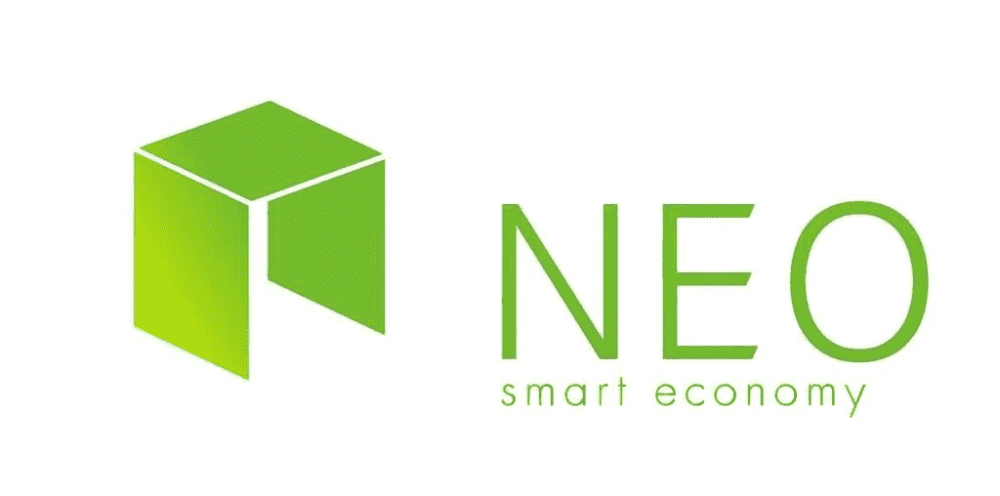

Image source Themercle

由区块链·R&D 公司“OnChain”的成员创建的新区块链平台旨在构建可扩展的 dApps。使用委托拜占庭容错机制，NEO 比其他平台工作得更好。

它有一种被称为“NEO”的本地加密货币，可用于支付交易费用，以在 NEO 网络上运行应用程序。

> **行业聚焦:**智慧经济 **共识算法:**委托拜占庭容错 **治理:**通过 NEO 持有人投票进行链上治理，通过 NEO 基金会支持进行链外治理。 **智能合约功能:**是 **台账类型:**有权限
> **有用链接:**[https://neo.org/](https://neo.org/)
> [https://docs.neo.org/en-us/whitepaper.html](https://docs.neo.org/en-us/whitepaper.html)

## **EOS**

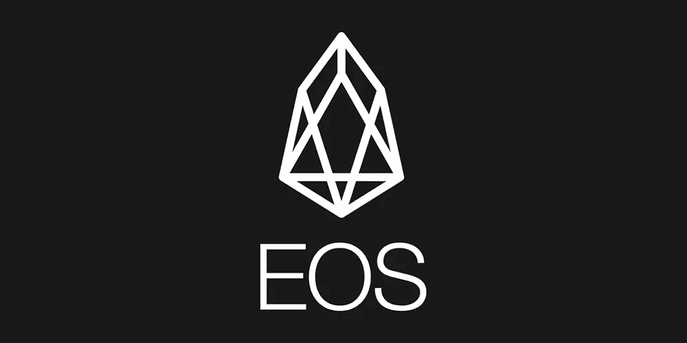

Image source leewayhertz

由私人公司 Block 创立。一，EOS 于 2018 年 6 月作为开源软件推出。EOS 旨在提供去中心化应用程序的托管、智能合约功能、企业区块链应用程序的去中心化存储，并解决比特币和以太坊的可扩展性问题。

EOS 平台还免除了所有用户的额外费用，同时使用多线程和授权的利益证明算法达成共识。

> **行业聚焦:**跨行业 **共识算法:**委托股权证明 **治理:** EOSIO 核心仲裁论坛(ECAF) **智能合约功能:**是 **台账类型:**许可
> **有用链接:**[https://eos.io/](https://eos.io/)
> [https://developers.eos.io/](https://developers.eos.io/)

**海德拉哈希图**

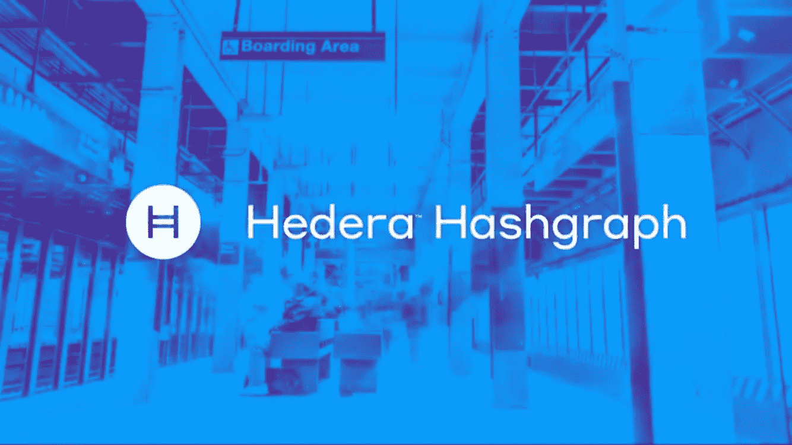

image source steemit

与其他区块链平台相比，Hedera Hashgraph 是一个快速而公平的平台，不需要计算繁重的工作算法证明。该平台具有智能合约的功能。它有一个独特但可选的机制，“绑定仲裁”，允许智能合同与仲裁员的公钥列表一起部署，仲裁员可以添加新功能和修复错误。

通过异步拜占庭容错算法，Hedera Hashgraph 提供了高度的安全性。

> **行业聚焦:**跨行业 **共识算法:**异步拜占庭容错 **治理:**Hedera Hashgraph Council **智能契约功能:**Yes **Ledger Type:**permissized
> **有用链接:**[https://www.hedera.com/](https://www.hedera.com/)
> https://www.hedera.com/whitepaper

**R3 Corda**

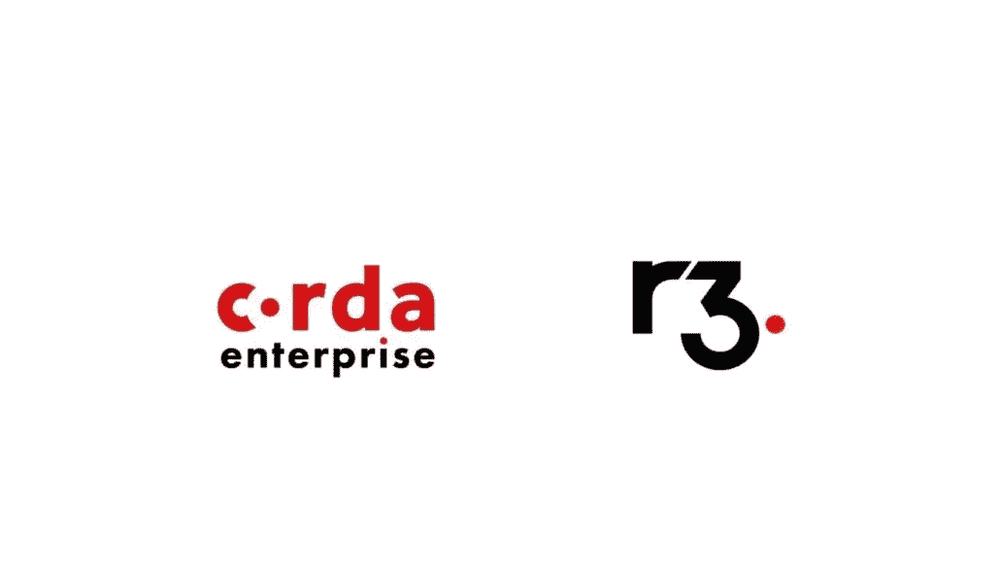

Image source Chatsworth Communications

R3 Corda 是一个创新的区块链平台，允许机构直接使用智能合约进行交易，从而消除商业交易中代价高昂的摩擦。

R3 Corda 最初仅用于金融行业，现在可应用于医疗保健、供应链、政府机构和贸易融资等其他使用案例。

> **行业聚焦:**跨行业 **共识算法:**异步拜占庭容错 **治理:**Hedera Hashgraph Council **智能契约功能:**Yes **Ledger Type:**permissized
> **有用链接:**[https://www.hedera.com/](https://www.hedera.com/)
> [https://www.hedera.com/whitepaper](https://www.hedera.com/whitepaper)

## **法定人数**

image source Google

由摩根大通推出的 Quorum 是区块链以太坊的企业版。通过修改以太坊的核心，该平台可以快速整合以太坊的更新。

这是一个开源的区块链平台，使用基于投票的算法每秒执行数百次交易。由于它是一个许可的区块链平台，它只允许授权的参与者参与平台上的交易。

> **行业聚焦:**跨行业 **共识算法:**多数投票 **治理:**以太坊开发者与摩根大通 **智能合约功能:**无 **账本类型:**有权限
> **有用链接:**[https://www.jpmorgan.com/country/US/EN/Quorum](https://www.jpmorgan.com/country/US/EN/Quorum)
> [https://github.com/jpmorganchase/quorum](https://github.com/jpmorganchase/quorum)

**多链**

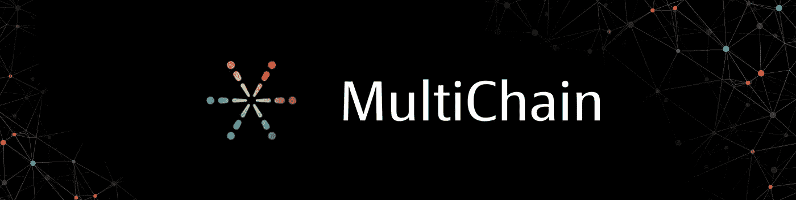

image source medium

Multichain 是一个区块链平台，旨在开发和部署专用区块链，并在对等网络中提供控制和隐私保护。

使用多链平台，可以控制谁可以发送、接收和监控交易，创建流、块和资产。根据业务需求，区块链应用程序可以开发为开放或封闭的区块链。

> **行业聚焦:**跨行业 **共识算法:**分布式共识 **治理:**未提及 **智能合约功能:**有，但它们被称为智能过滤器 **台账类型:**有权限
> **有用链接:**[https://www.multichain.com/](https://www.multichain.com/)
> [https://www . multi chain . com/download](https://www.multichain.com/download/MultiChain-White-Paper.pdf)

## **波纹**

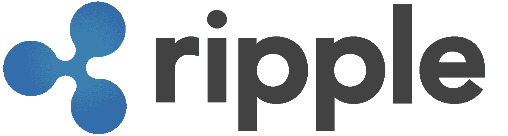

image source Bitcoinwiki

Ripple 旨在通过 RippleNet 连接数字资产交易所、企业、银行和支付服务提供商，ripple net 是一个没有退款的区块链网络。它通过数字资产“涟漪”或“XRP”实现国际支付

使用概率投票，Ripple 可以在网络上的节点之间达成共识。像美国运通、SBI 控股和德勤这样的大品牌正在试验 Ripple 区块链改变支付流程的潜力。

> **行业聚焦:**金融服务 **共识算法:**概率投票 **治理:**涟漪实验室
> **智能合约功能:**无
> **总账类型:**有权限
> **有用链接:**[https://ripple.com/](https://ripple.com/)
> [https://ripple.com/collateral/](https://ripple.com/collateral/)

**学分**

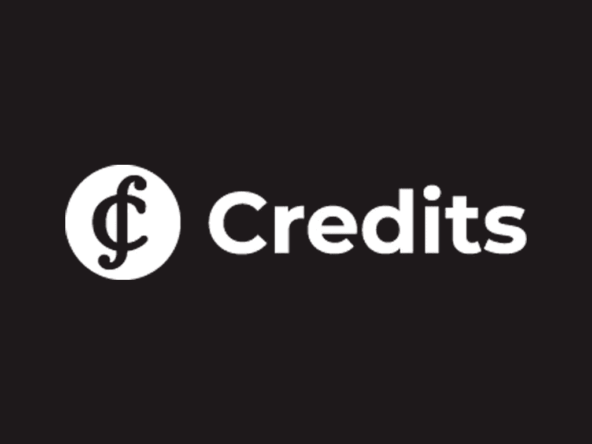

Image source Credits

Credits 是一个基于智能合约和区块链技术构建和执行分散式应用程序(dApps)的开发平台。

它为开发人员提供了广泛的可用于应用程序开发的解决方案。它使用信用决策一致算法来构建可扩展的、健壮的区块链应用程序。

> **行业聚焦:**跨行业 **共识算法:**变种股权证明 **治理:**未提及
> **智能合约功能:**是
> **台账类型:**有权限
> **有用链接:**[https://credits.com/](https://credits.com/)
> [https://developers.credits.com/](https://developers.credits.com/)

## **块流元素**

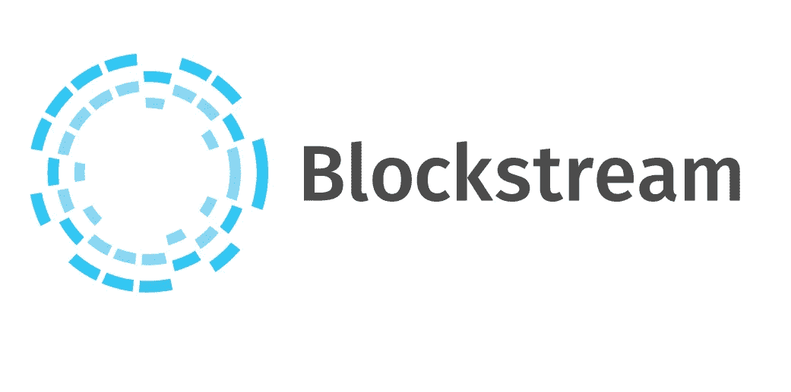

image source blockstream

Elements Blockchain 是一个支持侧链的开源平台，提供对社区成员构建的独特功能的访问。其特点包括保密交易和资产。通过在单个区块链上发行多个可私人转让的资产，区块链元素打开了各种使用案例。

元素区块链使用被称为块签名者的签名者来及时有效地签名和创建块。

> **行业聚焦:**跨行业 **共识算法:**强强联合 **治理:**未提及 **智能合约功能:**无 **台账类型:**有权限 **有用链接:**[https://elementsproject.org/](https://elementsproject.org/)
> 
> [https://github.com/ElementsProject/elements](https://github.com/ElementsProject/elements)

这篇文章将帮助你获得关于流行的区块链项目的信息，这些项目现在正被几家区块链公司用来构建 dApps。作为一家**的区块链开发公司，我们了解上述区块链平台，并拥有一支能够在这些平台之上开发区块链应用的开发团队。**