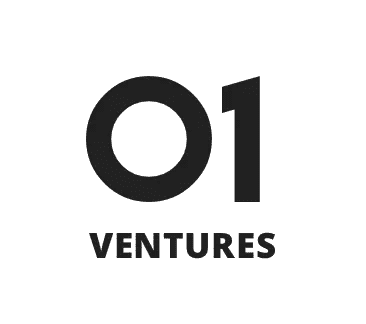
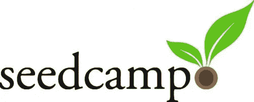
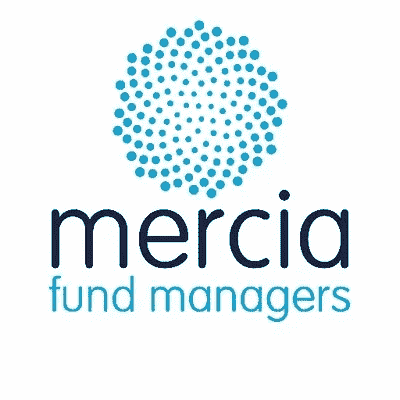
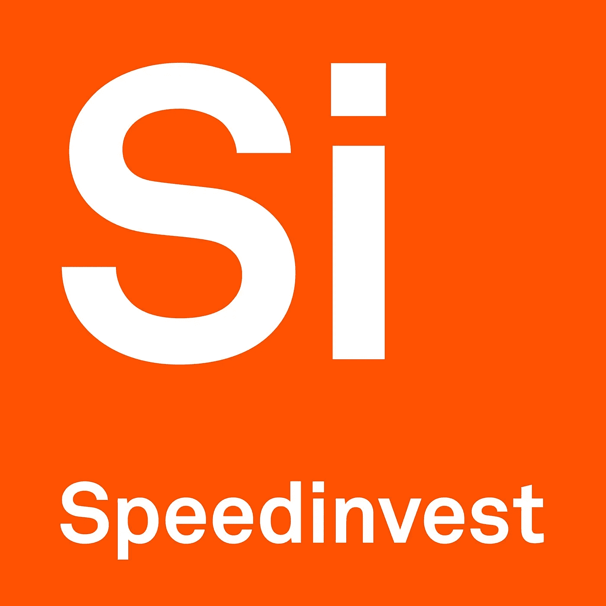

# 欧洲顶级种子基金风投

> 原文：<https://medium.com/hackernoon/top-european-vcs-for-seed-funding-startup-stash-198cea58b7fa>

当你创建自己的创业公司时，要考虑的最重要的事情之一是你将从哪里获得早期资金。当你开始你的项目时，收入可能是稀缺的或仅仅是稳定的，而不是丰富的，你的业务的成功可能是围绕着你是否能获得外部投资来启动你的企业。

考虑到这一点，我们将寻找七家欧洲风险投资公司，它们都是各自选定行业的专家，或许能够帮助你获得持续成功所需的资金。

# [SnO Ventures](http://www.sno.vc/)

snventures 是挪威的一家早期风险投资公司，为与技术相关的初创公司和企业主提供投资。SNÖ Ventures 的团队在与技术相关的风险投资领域拥有丰富的知识和经验，其中一些人的业务取得了成功。

自 Magne Uppman 和 Teodor Bjerrang 于 2015 年成立以来，该公司已在其祖国挪威奥斯陆设立了办事处，并在美国帕洛阿尔托设立了办事处。

**(阅读更多:**[**2019 年你应该追随的 7 位思想领袖**](https://startupstash.com/7-thought-leaders-you-should-be-following-in-2019/) **)**

该公司进行的一轮种子资金的平均规模为 100 万美元。

此时，SNÖ Ventures 只在自己的国家进行投资，投资公司的行业从技术到营销。他们值得注意的两笔投资分别是 2016 年的[及时](https://timelyapp.com/)和 2017 年的 [Inzpire.me](https://inzpire.me/) 。这两轮融资都为上述公司带来了 100 万美元的资金。

Inzpire.me 是一家来自挪威的营销初创公司，旨在将不同的品牌与能够与之合作的合适的社交媒体影响者联系起来。time 是一个时间跟踪应用程序，面向自由职业者，允许他们自动跟踪他们在一项任务上花费的时间，这允许他们准确地按小时收费，更有效地管理他们的时间。

# [01 风险投资](http://www.01ventures.com/)

01 Ventures 是一家英国风险投资公司，总部位于英国首都伦敦。他们专门为深度科技公司提供早期投资。01 Ventures 的投资团队都是各自技术领域的专家，这有助于在投资时指导他们的决策。

01 风险投资主要投资于欧洲的初创公司，但是，他们也投资于美国和中国的公司。

**(阅读更多:** [**从零到英雄:彼得·泰尔创业成功 3 法则**](https://startupstash.com/from-zero-to-hero-peter-thiel-3-rules-for-entrepreneurial-success/) **)**

01 Ventures 由一群投资者于 2015 年创立，他们是 Chris Haley、Correy Voo、Eeswaran Navaratnam 和 Ton van't Noordende。该公司种子融资的平均规模为 187.5 万美元。

目前，该公司已经投资了两家不同公司的种子基金。首先，他们在 2017 年 7 月 3 日投资了 [Bibblio](https://www.bibblio.org/) ，然后在 2017 年 8 月 8 日投资了[tera lysis](https://teralytic.com/)。Bibblio 收到的资金额为 150 万美元，Teralytic 收到的投资为 225 万美元。

Teralytic 是一家总部位于纽约的农业技术公司，旨在通过利用机器学习、先进的传感器技术和土壤分析来帮助农民降低成本，提高作物产量。Bibblio 是一家总部位于伦敦的公司，为出版商和内容创作公司提供一套工具，帮助他们使自己的内容与目标受众更相关，更有吸引力。

# [发明](http://inventure.fi/)

Inventure 是一家芬兰公司，为能够证明自己具有创新精神或在高科技领域工作的初创公司提供早期融资。这家风险投资公司由萨米·兰皮宁和蒂莫·蒂尔库宁于 2005 年创立。

Inventure 将自己标榜为“北欧科技基金”，其主要投资集中在欧洲国家，部分业务在中国进行。他们最近一次种子资金运作的平均规模约为 90 万美元。

Inventure 过去已经投资了许多种子轮，最近值得注意的投资例子是他们在 2018 年 2 月 21 日参与了 [Thirdpresence](https://www.thirdpresence.com/) ，并在 2018 年 6 月 4 日牵头投资了 [OME 健康](https://ome.health/)。

Thirdpresence 是一家总部位于赫尔辛基的公司，提供视频广告服务，由人工智能提供支持，帮助公司在更大范围内与观众互动。OME 健康是一家总部位于伦敦的公司，为其客户提供预防性健康指导和分析。Inventure 向该企业投资了 130 万美元。

# [超级英雄之都](https://www.superherocapital.com/)

超级英雄资本是一家芬兰风险投资公司，专门投资处于早期阶段的企业。他们主要参与企业对企业软件创业，重点是电子商务、金融科技、医疗保健和工业技术领域。

超级英雄资本于 2015 年 6 月 6 日由一群企业家创立，包括 Jakob Stor、Juha Ruohonen、Jussi Harvela 和 Moaffak Ahmed。该公司主要将其投资集中在他们的祖国芬兰。在过去的两年里，他们对其他公司种子期的平均投资总计约为 120 万美元。

**(阅读更多:** [**7 领导从斯堪的纳维亚**](https://startupstash.com/leadership-culture-scandinavia/) **)**

他们最近值得注意的投资的一些例子可以在他们于 2018 年 3 月 27 日对 [Valohai](https://valohai.com/) 的领先投资和他们于 2018 年 6 月 1 日对 [Codescoop](https://www.codescoop.com/) 的领先投资中找到。

Valohai 是一家芬兰初创公司，它提供的系统可以为寻求开发自己的机器学习平台的企业提供培训和基础设施。Codescoop 是一家起源于西班牙的芬兰企业，致力于通过向客户提供开源软件管理和质量跟踪服务来解决繁琐的软件堆栈问题。

# [Seedcamp](https://seedcamp.com/)

Seedcamp 是一个欧洲种子基金，目前总部设在英国伦敦。他们是一家成熟的公司，在投资寻求打入全球市场的早期技术公司方面经验丰富。他们主要涉足金融科技、人工智能和软件领域。

Seedcamp 由 Saul Klein 和 Reshma Sohoni 于 2007 年 5 月 1 日共同创立。该基金主要投资于欧盟的公司，但是，他们在北美也有显著的投资。自 2018 年 11 月以来，他们为最近的投资筹集的平均种子资金为 202.5 万美元。

最近，他们已经进行了一些引人注目的投资。其中一些例子是他们在 2018 年 11 月 15 日对 Ezra 的 400 万美元种子投资，以及他们在 2019 年 1 月 23 日对 [Gameye](https://gameye.com/home) 的 160 万美元投资。

[Ezra](https://ezra.ai/) 是一家美国健康初创公司，总部位于纽约州，旨在通过利用人工智能和高科技医疗成像系统，为早期癌症检测带来革命性变化。Gameye 是一家荷兰游戏初创公司，为多人在线视频游戏提供定制的服务器架构。

# [Mercia 基金经理](https://www.merciatech.co.uk/our-business/)

Mercia Fund Managers 是一家英国风险投资公司，总部位于英格兰西米德兰兹地区的伯明翰。他们主要决定投资西米德兰兹郡的早期技术公司，但是，他们也投资英国各地的其他企业。希望获得投资的初创公司必须向 Mercia 展示他们可以快速增长，并且他们在知识产权概念、技术和产品方面处于强势地位。

Mercia 探索的主要领域是生物科学、软件、工程和数字娱乐。

该公司由马克·佩顿和蒂姆·哈泽尔于 2010 年创立。平均而言，他们对早期企业的种子资金投资总额在 5 万至 25 万英镑之间。在接下来的几轮中，他们有指导原则，要求他们在每个投资组合公司中最多只能投资 100 万英镑。

在过去的一年里，他们投资了许多公司，目标明确。例如，在 2018 年 10 月 3 日，他们向 Aceleron 发起了一项领先投资，然后在 2018 年 11 月 21 日，他们还投资了技术上可竞争的。

Aceleron 是一家总部位于英国的公司，开发锂离子电池，重点是通过使用可持续电池来帮助世界转向更多的可再生能源。Technically Compaitable 是一家提供软件的公司，IT 部门的招聘人员可以使用该软件为他们的候选人创建量身定制的测试，以找到他们招聘的角色的最佳人选。

# [Speedinvest](https://speedinvest.com/)

Speedinvest 是一家奥地利风险投资公司，总部设在维也纳。他们投资早期创业公司，重点是科技公司。他们的主要业务领域集中在欧盟，但是，他们也有强大的全球业务，包括在硅谷的业务。

Speedinvest 开展的主要投资领域涉及金融科技。深度技术、工业技术、消费技术和网络效应。

该公司于 2011 年 6 月 1 日由一群企业家创立，其中包括 Daniel Keiper-Knorr、Erik Bovee、Michael Schuster、Oliver Holle 和 Werner Zahnt。至于他们对种子阶段创业公司的资助水平，他们提供高达 100 万欧元的投资。

Speedinvest 已经参与了一些高调的投资。1 月 22 日，他们在金融科技初创公司 TaxScouts 的种子期启动了他们的主要投资。此外，2018 年 11 月 15 日，他们为[的](https://admix.in/)混合启动了种子资金轮的领先投资。

如前所述，TaxScouts 是一家总部位于英国的金融科技初创公司。该公司的使命是帮助会计师和英国纳税人在网上准备他们的税务，因为英国政府的目标是在该国实现税务数字化。bleach . in 是一家行业首创的初创公司，允许增强现实和虚拟现实的开发者在他们的内容中专门编排广告。他们的目标是让这些广告在用户体验中尽可能无缝。

*原载于 2019 年 2 月 14 日*[*startupstash.com*](https://startupstash.com/seed-funding-vc/)*。*