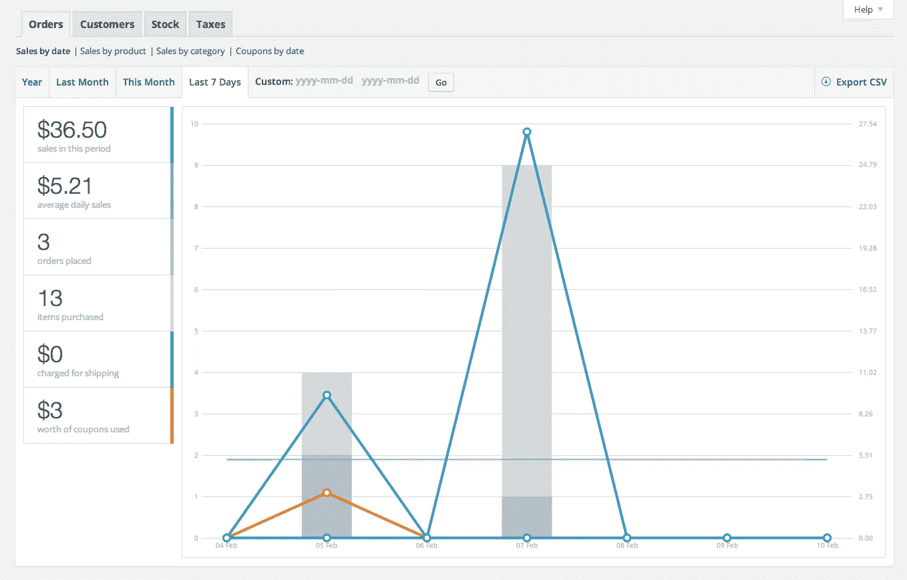
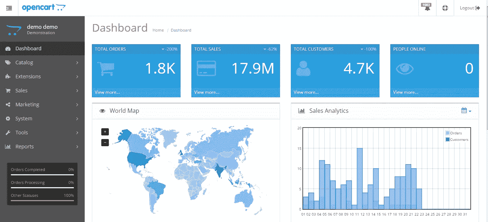

# 2019 年小型企业五大电子商务平台

> 原文：<https://medium.com/hackernoon/top-five-ecommerce-platforms-for-small-business-reviewed-b79751845dcf>

从购买一支笔到出售房地产，一切都可以通过点击一个按钮来完成。

在接下来的系列文章中，请和我们一起踏上旅程，彻底了解电子商务的每一个方面。

那么，你最终决定超越实体建筑了吗？

如果是的话，请仔细阅读这篇文章，在文章结束时，我保证你会清楚全面地了解哪个平台最适合你的企业。

首先，为自己鼓掌，因为这是一个伟大的想法！

***如果能卖——有电商卖！***

数字化销售商品是一个重大决定，既然你已经决定了，你就已经在这趟过山车旅程的中途了。

网上销售有太多的选择。一方面，有易贝这样的老牌网站，另一方面，有亚马逊、阿里巴巴甚至脸书这样的在线市场。

***如今开网店就像开博客一样简单！***

如果你已经是零售商，有大量的电子商务平台可以利用。没有电子商务平台，你将不得不从头开始，通过编写大量代码来开发和设计一切。想象一下，光是开发和测试就要浪费多少时间。

因此，电子商务平台通过提供**现成的**管理系统使整个过程变得简单，你只需上传产品就可以轻松地建立你的在线商店。

但首先，在涉足网上销售领域之前，尤其是如果你刚刚起步，你需要考虑各种因素。

# 决定性因素…

随后提到的要点可以作为确定最佳电子商务平台的起点，为您的目的服务。

**·定价结构** 所有平台都附带一份价目表，其中包含适用的订阅期。现在，如果你是一个小企业主，刚刚涉足电子商务领域，你需要考虑你计划使用的平台的定价结构。一定要确保你对价格结构有详细的了解。您还必须确保电子商务平台的可负担性，这可能还包括**订阅费、送货费和额外税额。**

有很多情况下，商家被要求切换到不同的平台，因为他们提高了价格和成本是完全不合理的。如果一个人不小心，在电子商务平台之间切换会严重破坏你的网站在搜索引擎中的权威。

做好你的研究不要因为选择了错误的平台而自掘坟墓。
与您的团队一起集思广益，收集他们对平台的所有期望。问你想问的每一个可能的问题，以确保所有的基础都包括在内。**一个优秀的电子商务平台需要为你的实体店打造最好的在线商店。**

电子商务的另一个方面是选择最好的托管服务。一个糟糕的托管公司会对你的搜索排名产生不利的影响，使你的网站变慢，并导致显著的下降。

通过适当的努力，缩小至少三个你喜欢的托管服务的范围，列出这些服务的所有优点和缺点，然后进行相应的操作。采取草率和无计划的决定绝对是一条应该避免的道路。

**·SEO 友好度**
如果你不能让你的店铺在谷歌上排名，以上所有的诡计都无关紧要。让你的商店在搜索结果中排名靠前是非常有益的。你希望你的顾客在搜索像你这样的产品时能找到你。
寻找搜索引擎优化友好平台时，一些最重要的因素包括:

向您的网站添加博客的能力。
·使用个性化域名的能力。
·客户可以删除评论。

你的搜索引擎优化努力不应该就此结束。一旦你开始出现在搜索结果中，你将需要不断优化你的产品，以免你的排名随着时间的推移而下降。

**移动友好度** 你知道吗，根据**谷歌**的官方声明，移动用户在全球整个搜索查询中占了惊人的 **50%** 。因此，很难不考虑房间里的大象——在为您的企业最终确定一个电子商务平台时，请确保无论您决定使用哪个平台，都有能力提供移动友好的页面。

这表明，寻找能够让客户快速访问您的网站并在他们的移动或平板设备上购物的平台是极其重要的。

## 2019 年最佳电子商务平台

## 1.网络商务

WooCommerce 不同于这个列表中提到的其他平台，仅仅因为它是一个 **WordPress 插件**。这使得它的应用相当棘手，因为它可能只对一组特定的业务有用。

**名称—** WooCommerce
**价格—变量**。取决于域名和附加插件。
**主题—** 大量优化的主题
**客户服务/支持—** 全天候可用
**易用性—** 适中—必须清楚了解 WordPress
**适用于小型企业—** 推荐
**适用于大型企业—** 需要丰富的编码知识以扩展到更广泛的受众群
**可定制性—** 高

要实现 WooCommerce，你必须了解 WordPress，因为它是直接插入其中的。

此外，WooCommerce 的定价有点难以确定。托管 WordPress 和 WooCommerce 的成本会在一定范围内波动。一个用户的费用会与其他用户不同。

**X-Factor:**
woo commerce 提供了多种多样的分析工具可供选择。有了这些，你可以有效地衡量销售和分析根据日期品牌，统计客户，计算你的每日和每月的销售，甚至估计订单数量。然而，WooCommerce 也内置了许多工具。

**优点:**

*   WooCommerce 免费。作为一个开源的自由软件，你不需要倾家荡产来使用它。此外，它还不时提供免费更新。
*   作为一个 WordPress 插件，它可以定制很多主题，使用起来非常愉快。此外，你也可以下载额外的插件来修改你的网站。

**缺点:**

*   WooCommerce 没有为网店店主提供有效实现 SEO 的必要工具。
*   你必须同时知道 WordPress 和 WooCommerce 来修改你的网站。

## 2.购物化

Shopify 是中小型企业目前可以利用的最成功和最知名的平台之一。它使全球超过 500，000 家企业能够在线销售，并拥有高达 100 万的每月活跃用户群。整个电子商务交易中有相当大一部分是通过 Shopify 处理的，总额约为 460 亿美元。

**名称** — Shopify
**价格—** 从 9 美元到 299 美元/月
**主题—** 付费和免费
**客户服务/支持—** 24/7 支持可用
**易用性—** 高
**适用于小型企业—** 对中小型企业极其有用
**适用于大型企业—**Shopify 等新平台

作为一个平台，Shopify 提供了极大的灵活性。您可以完全定制您的在线商店，并管理您的库存和产品。

Shopify 通过建立一个活跃繁荣的在线社区，店主们可以分享他们的技巧和专业知识，成功地利用了庞大的卖家和用户群。这有助于开发人员跟上行业的最新发展，同时及时发布更新。

**优点:**

*   有一个专用的移动应用程序，所以你可以随时随地跟踪你的商店。
*   Shopify 对搜索引擎优化非常友好。它允许自定义标题标签以及每个类别页面上的元描述。它还允许您创建定制的登录页面，这对于营销目的非常有用。

**缺点**:

*   除了每月的费率计划，Shopify 上的许多主题都需要额外付费。
*   Shopify 仍在努力迎合大型企业。虽然 Shopify Plus 已经推出，但它仍然缺乏处理大量客户群所需的华丽外表。

## 3.Magento

许多技术人员吹捧 Magento 是游戏中最好的优质开源解决方案之一，但对小企业来说就不那么好了。它旗下管理着超过 150，000 个网站和许多财富 500 强企业，确实在企业中很受欢迎。

**名称—** Magento
**价格—** 社区版免费。企业版每月 2200 美元，高级企业版的价格更高。
**主题—** 付费和免费。第三方市场也提供主题**客户服务/支持—** 第三方支持服务
**易用性—** 高
**适用于小型企业—** 过于复杂和昂贵，不适用于小型企业
**适用于大型企业—** 模块化设计极其有益**可定制性—** 中等

**X-Factor:** 可扩展性是 Magento 最突出的 X-Factor 之一。Magento 是按规模制造的，所以无论你是卖 10 个还是 10，000 个产品，Magento 都能应付。

**优点:**

*   **灵活性**——Magento 为用户提供了充分的灵活性，让他们可以根据自己的想法来玩代码和修改网站的各个方面。
*   由于其开源软件和第三方支持，该平台具有极其丰富的**特性**。

**缺点:**

*   **技术专长** —独家 Magento 开发者很难找。作为一个非常扩展和广泛的系统，**(超过 30，000 个文件和 300 个数据库表)** — Magento 有一个广泛的学习曲线，它需要一个相当有经验的开发人员，对面向对象开发有坚实的理解，并有使用核心软件的经验，才能真正理解他们在做什么。
*   **价格** —企业版起价【1,988 美元/月左右，高级企业版费用**49990 美元/年**。

## 4.开放式购物车

Opencart 是一个免费使用的开源电子商务平台。人们可以访问网站并安装软件。虽然一个功能性网站可以免费运行，但如果你想要附加服务，那么每个模块的平均成本从 20 美元到 100 T21 不等(包括销售激励器、搜索引擎优化背包、直观运输等)。

**名称—** OpenCart
**价格—** 免费。尽管每个模块的附加费用在 20-100 美元之间。
**主题—** 不可用
**客户服务/支持—** 文档和论坛
**易用性—** 低
**适合小型企业—** 取决于使用
**适合大型企业—** 取决于使用
**可定制性—** 高。如果你懂编码

**X-Factor:** 用 Opencart 开店的成本即使对于小企业来说也是相当平易近人的。也有大量的附加组件可用，其中许多是免费的——你基本上可以使用不同的支付网关获得一个网站的启动和运行，而在其他平台上，你需要付费。

**优点:**

*   Opencart 不需要广泛的学习曲线。它也更容易安装。新用户可以很容易理解这个平台，这将帮助他们快速设置并开始使用 Opencart。这是因为该解决方案提供的接口非常简单。
*   设计良好的管理界面

**缺点:**

*   Opencart 不能保证高性能的能力。人们需要安装额外的搜索引擎优化，销售和运输等插件。
*   Opencart 不是非常可定制的，这会限制一些业务。

## 5.大商业

虽然电子商务平台的一端由 Shopify 主导，但另一端是 Bigcommerce。就像它的对手一样，BigCommerce 提供了一系列的价格和套餐，适合不同类型的企业。

**名称—** BigCommerce
**价格—** 价格从 29.95 美元/月到 249.95 美元/月
**主题—** 付费和免费
**客户服务/支持—** 全天候提供实时支持
**易于使用—** 价格高
**适合小型企业—** 适合小型企业
**适合大型企业—**

**X-Factor:**
**big commerce**拥有业内最仔细考虑的结账框架之一。它提供了一个最流畅的单页结账体验，这在很大程度上有助于转换。这一点的重要性不可低估，因为收银台是最有可能失去消费者的地方。

**优点:**

*   BigCommerce 提供了大量的托管资源，并有一个专门的团队致力于优化和保持其平稳运行。
*   提供多层安全保护。

**缺点:**

*   只有当你拥有良好的编码技能，广泛的定制才可用。
*   它稍微贵一点。

# 结论性观点

选择电子商务平台需要广泛的研究。每个平台都有自己的一套服务、收费、订阅期、优势和劣势，具体取决于功能。

定制平台肯定会对你有所帮助，但要扩大你的运营，你需要利用这些平台。对于小型企业来说，最大的障碍是决定最合适的平台，从他们的服务中进行选择，并处理他们的局限性。

> **原载于** [**EngineerBabu 博客**](https://www.engineerbabu.com/blog/best-ecommerce-platform-for-small-business/) **作者** [**萨兰西**](https://medium.com/u/5028aadc44f?source=post_page-----b79751845dcf--------------------------------)