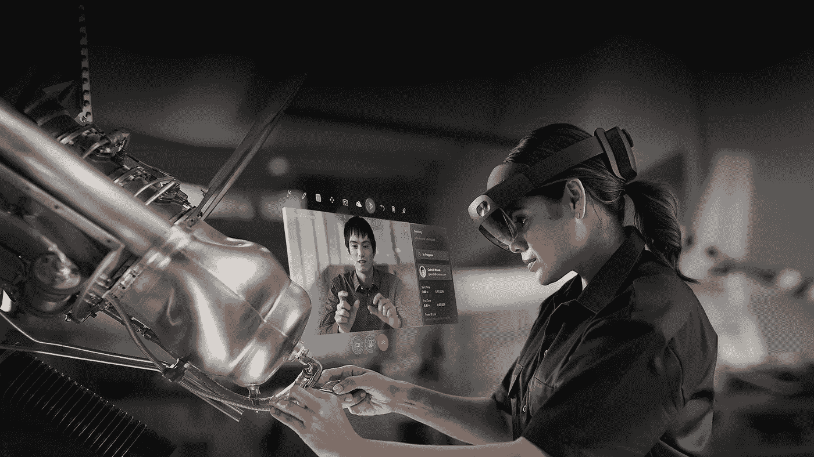
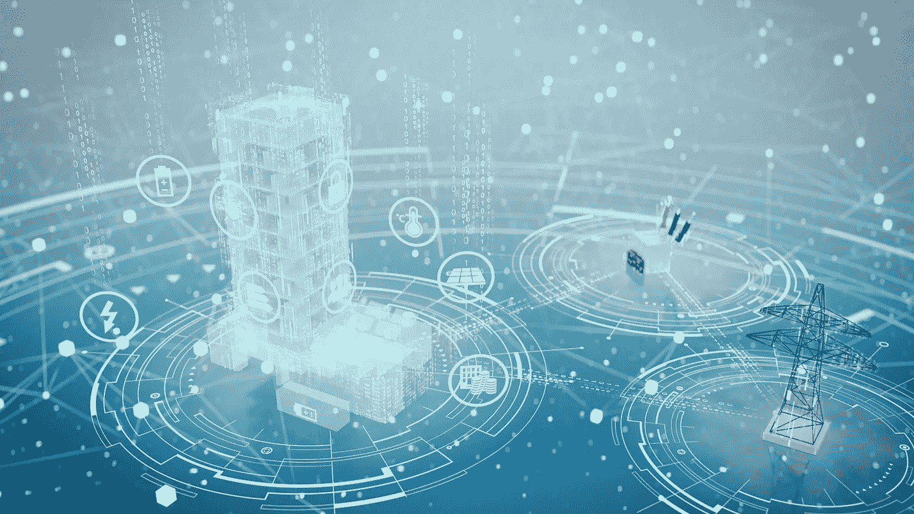
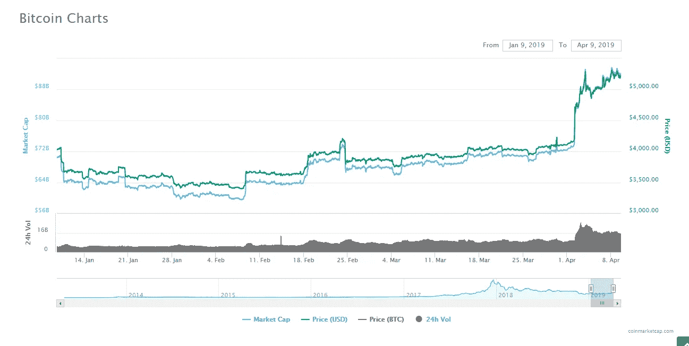

# 当前新兴技术的五大趋势

> 原文：<https://medium.com/hackernoon/top-five-trends-in-emerging-technology-right-now-5b06de440e41>

**与之前的五年相比，我们可以说在过去的五年里，在新兴和颠覆性技术方面，我们已经看到了大量的创新多样性和机构支持。**

以下是一些截至发稿时**新兴技术中最重要的&颠覆性趋势**。

# #5:现实的虚拟替代品

**替代现实和虚拟现实是 20 世纪科幻作家构想的两个奇妙的想法，然而直到过去十年才变得具有商业可行性。**

**AR&VR is**[**预计**](https://www.statista.com/topics/3286/augmented-reality-ar/)**2019 年全球收入将增长 204 亿美元。**

**互动娱乐**已经并且目前正在为先锋 VR 设备进行商业规模的生产，如 **HTC Vive** 和 **Oculus Rift** (后一家公司[于 2014 年被**脸书**](https://www.fool.com/investing/2018/08/31/why-facebooks-oculus-acquisition-hasnt-paid-off-ye.aspx) 收购)。这些范围从沉浸式电子游戏和电影，到实验性的“体验”。

相反，**微软 HoloLens** 从企业对企业的销售模式中获利，提供了另一种现实头盔，被自豪地推销为**“商业混合现实技术】**。

用例包括关键业务视觉效果的交互式三维呈现，例如**建筑架构**，3D 艺术**的创作**，以及**销售点演示**。

# #4:物联网，从城市到家庭

**IoT 代表“物联网”,表示技术解决方案将高级算法与来自互联设备的数据相结合，以提高效率&提高分析能力。**

来自 Gartner 的 2017 年[报告](https://www.gartner.com/en/newsroom/press-releases/2017-02-07-gartner-says-8-billion-connected-things-will-be-in-use-in-2017-up-31-percent-from-2016)预测，到 2020 年底，将有超过 200 亿台互联设备**。**

相比之下，爱立信进行的类似研究预计到 2022 年 T42 将有 290 亿台手机。

一个主要的业务用例是工业制造。在整个供应链中，技术融合促成了许多人所说的第四次工业革命。

这个术语表示机器和计算机之间的**交叉通信的一个进步阶段，能够以前所未有的规模将流程和决策自动化结合起来。**

一个重要的例子可以在[有争议的](https://www.forbes.com/sites/davidphelan/2019/04/12/amazon-confirms-staff-listen-to-alexa-conversations-heres-all-you-need-to-know/)，然而成功的**亚马逊 Alexa** 中看到。

政府也加入了这一行列，许多发达国家的大都市地区宣布并开始实施“智能城市”计划。政府大力投资这一部门的主要例子可见于****和** [**南太平洋**](https://www.zdnet.com/article/south-koreas-iot-in-full-swing-from-water-meters-to-ai-powered-smart-buildings/) **亚洲**。**

****智慧城市解决方案**寻求应用数据驱动决策&自动化技术来改善市民的生活。**

# **#3，2:机器和深度学习(AI)**

****

****‘机器’和‘深度’学习是人工智能(又名 AI)领域内计算&数据科学发展的两个子集。我决定把他们放在一起，因为他们有着独特的亲密关系。****

**他们的目的是基于先前输入数据的增量数据库以及先前决策结果产生的数据来做出决策。**

**据专业研究机构 Statista 称，全球人工智能市场整体将在今年年底前实现**154%的年增长率。****

****在大数据的世界中，这些学习解决方案的应用需要**大型分布式计算机网络**，因为它们是**功率密集型计算过程**。****

****机器学习并不总是需要分布式计算网络，而深度学习专门使用多层人工神经网络。**神经网络**是为了重现人脑决策过程而建造的计算机。****

****自学习分散式计算机网络对于智能城市和物联网项目至关重要。****

****此外，机器和深度学习系统被视为运行在许多**消费者服务**的后端，如网飞和谷歌提供的服务。****

****高昂的相关成本使得它对除企业用户之外的所有用户都是最明智的。****

# ****#1:区块链和分布式账本技术****

********

******区块链(Blockchain)指的是(或者至少最初是)一个去中心化的点对点网络，用于信息和金融资产的数字传输——不变地存储在去中心化的“账本”上。******

****这可能是科技界一个过于饱和的时髦词,然而，在充满坏消息的去年之后，今年已经发生了巨大的发展变化。****

****最近**区块链更像是一个包罗万象的术语**，用来描述所有基于分布式账本技术的交易网络，包括集中式和分散式迭代。****

****这一定义可能会在未来很长一段时间内保持不变，因为今年将会看到**科技巨头发布令人惊讶的重大声明。******

****一个这样的“中枢人物”是 **IBM** ，它最近宣布与几家**国际银行**合作，利用其基于**恒星-区块链**的解决方案( **IBM World Wire** )进行**跨境支付**。****

****Twitter 和 Square fame 的杰克·多西也进行了个人和专业投资，推出了“Square Crypto”。****

*****我的名字是* [***拉斐尔·西曼斯基***](https://www.linkedin.com/in/rafal-szymanski-882422a7) ***。*** *我是一名来自乌克兰的企业家，我的专业知识来自于对 IT 领域几家初创公司的所有权。*****

*****目前，我是* [***全球科技创客公司***](https://globaltechmakers.com/) *的首席执行官，这是一家领先的科技公司，开发 IT 产品，让用户的生活变得更好、更轻松。*****