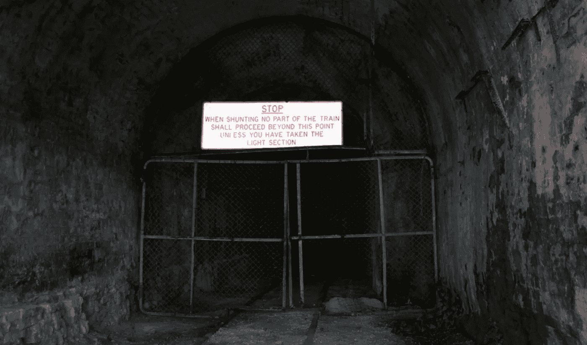
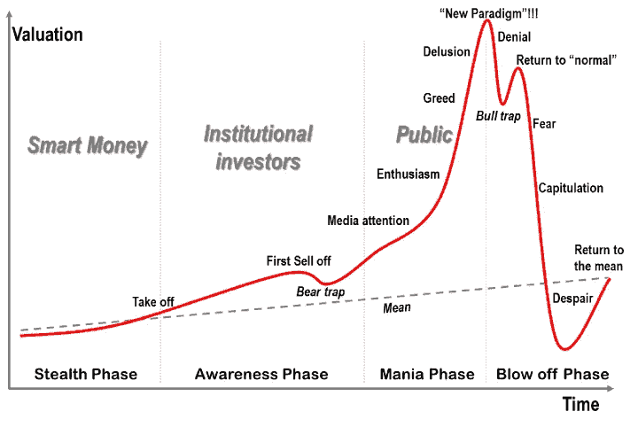
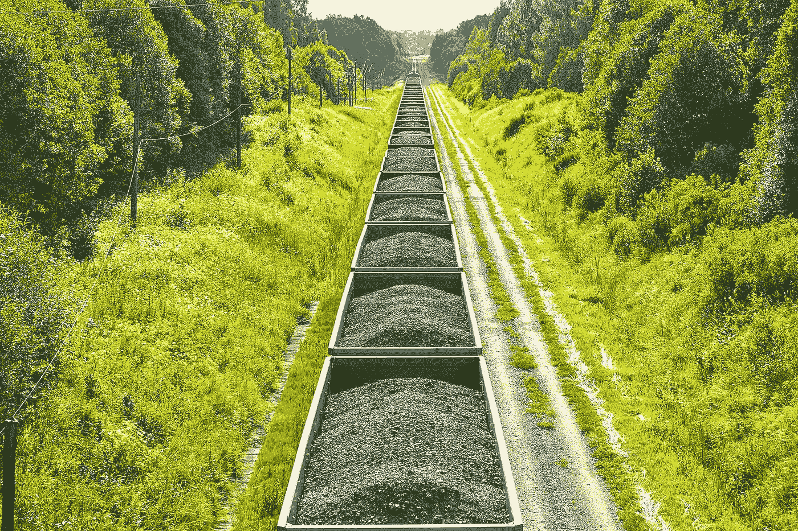
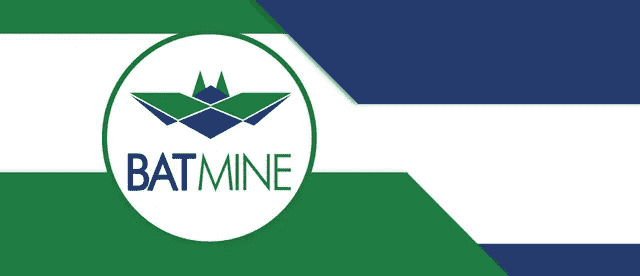
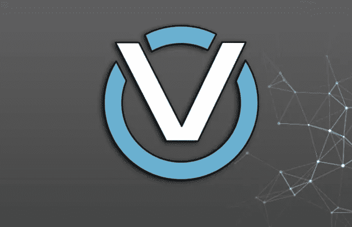
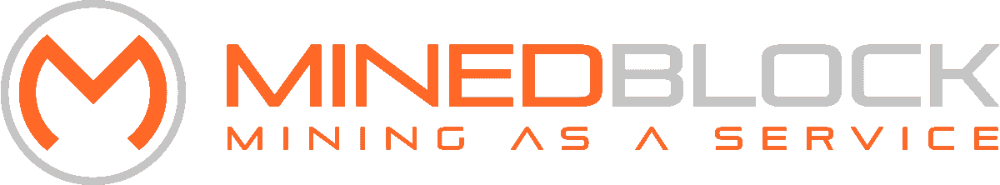
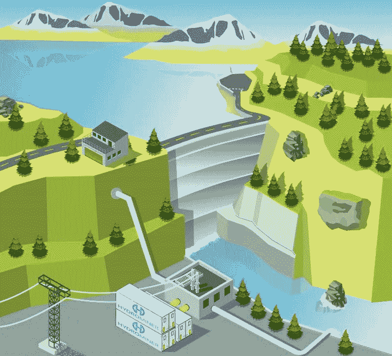
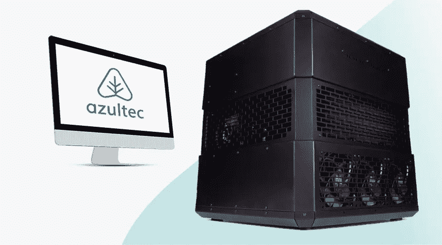
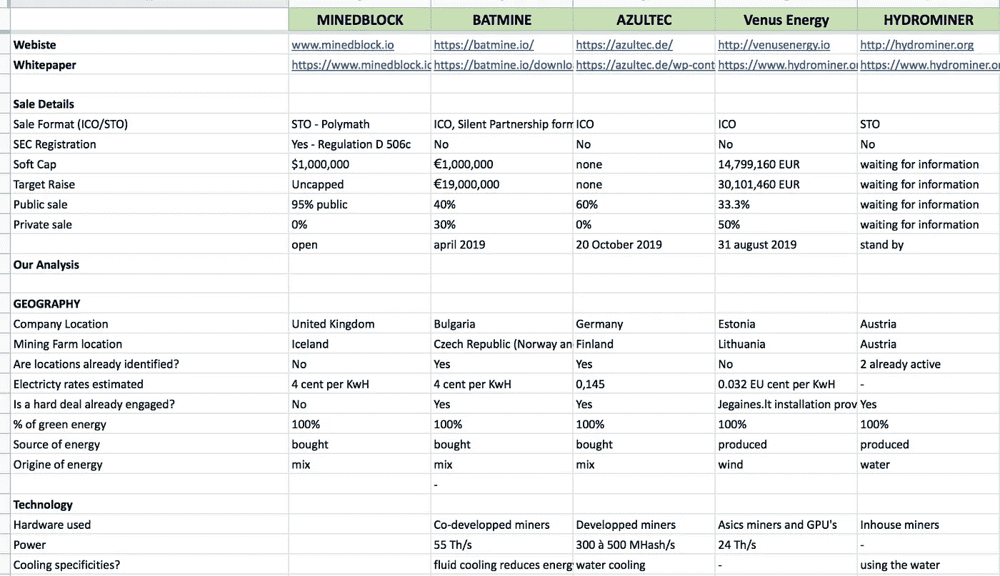
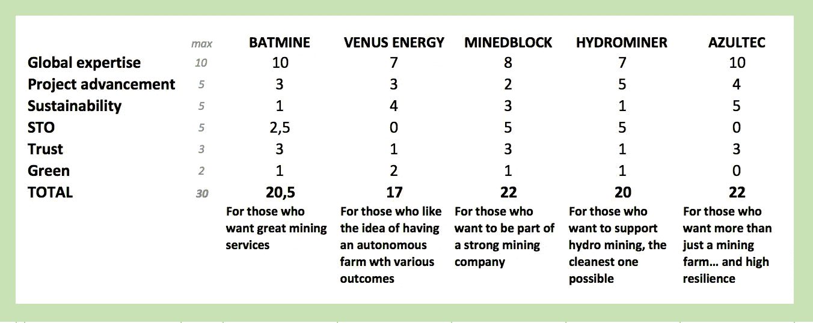

# 顶级绿色采矿加密项目

> 原文：<https://medium.com/hackernoon/top-green-mining-projects-a3127a88f8b1>

## 泡沫的好处是，当它们破裂时，它们使得大扫除成为可能。从采矿服务提供商的角度来看，我们可以说清洗是严厉的。

为什么会这样？
让我们回到几个月前……
-该部门一直是**许多骗局的目标**(它一直是高度针对性的，交易所和区块链项目也是如此)。
-加密货币的**价格大幅下跌**，使得大多数匆忙建造的矿场无利可图，这些矿场的机器效率不高，而且消耗大量能源。
- **采矿因其对气候的影响而受到各大媒体的批评**，被污染网站上的 Javascript 黑客劫持，在不知情的情况下使用互联网用户的电脑进行采矿。
——等等。

> 简而言之，2018 年对矿业公司来说不是非常成功的一年，给该行业留下了不光彩的名声和许多关闭的大门。

# 计时的艺术

如果说我从见到有才华的投资者中学到了什么，那就是当它下跌时你必须买入。当所有人都不感兴趣的时候进入市场。因为那是你生意最好的地方。
不是当某样东西成为焦点时，你才不得不买(你好，来自 2017 年 12 月的 BTC 买家！)，就是大家都在逃避的时候，你才应该去做。

What did they told me… Buy low, sell low ? sell high ? Buy high, sell… Damned… Can’t remember…

这正是正在发生的事情，一般来说是加密，特别是采矿。

2017 年和 2018 年的所有加密投资者都失去了他们的股份，在纯粹的 FOMO 中盲目投资。市场处于最低点。
社交网络无声无息。每个人都认为 crypto 已死。

> 这是典型的绝望阶段，这在崩溃末期的经济周期中众所周知。

这是买入的最佳时机。

**因为只有那些真正有信心的项目才能继续下去。**

> 当最被炒作的项目都在努力筹集几百万美元(姑且撇开发射台假面舞会)，剩下的几个投资者都极度怀疑的时候，谁还想发起一场骗局？谁愿意在这样一个不确定的背景下花费精力建立一个项目，而不确信这个项目是真正非凡的……(而不是像 2017 年那样，只是一个在炒作浪潮中轻松赚钱的机会)？

# 第二代

所以这是我选择**关注第二代采矿服务项目**的时候。这些项目启动的背景与他们的前辈经历的背景截然不同。

## 1.以低得多的加密价格盈利是必要的。

明智地管理您的资源。优化一切可以优化的东西(设备、位置、电价、团队等。).可能在最困难的时期找到返回的解决方案…一旦坏天气过去，就重新开始采矿。

## 2.必须考虑碳足迹。

众所周知，电力系统是一场生态灾难。很有可能很快就会出台法规来减少排放，要么对企业进行经济处罚(许多国家已经对污染最严重的汽车采取了这种做法，这些汽车在购买时被课以重税或限制使用)，要么干脆禁止排放。今天，只考虑采矿业务而不问能源来源的问题是不负责任的，也是目光非常短浅的证明。

## 3.有必要考虑一个受管制的市场

越来越多的国家已经制定了法律来管理加密项目的活动或其税收。它不再是遥远的西部，而是一个文明的国家(嗯，好吧，不完全是……)。项目将不得不开始承担责任，不再做任何愚蠢的事情。

> 这三个主要变化迫使项目追求卓越。

与他们的父辈截然不同，他们考虑得更周全，更可靠，更强壮。

**因此，我调查了正在启动的项目，我认为这些项目最有趣，并且符合以下标准:**
-正在进行或即将进行的 **ICO/STO/IEO** ，
-专注于加密货币**采矿**，
-以及坚决的**绿色**方法。

Wanna join the green mining trend?

在我能够分析的所有项目中，**我选择了 5 个在我看来鹤立鸡群的项目**。我分析了 5 个高质量的项目，并与团队进行了联系，以便更好地理解他们的方法。你会发现他们每个人都描述了他们的策略，以及我觉得他们做事方式中有趣(或不太有趣)的地方。
汇总表将总结这一比较。

*免责声明:此列表纯属个人主观。它并没有假装详尽无遗(你也可以给我发其他这类项目的链接，如果你有的话)。这绝不是投资建议。我已经尽可能地尝试与项目验证他们的信息，但一些错误可能已经潜入其中。*

# 蝙蝠矿

Batmine 是一家总部设在保加利亚的欧洲公司(为了享受 10%的税收优惠),计划在捷克共和国开设采矿中心。
**他们将提供广泛的服务:经典的云挖掘、托管服务(他们管理客户的设备和电源)、硬件销售。**通过使用他们的代币——BATE——进行支付，将有可能获得这些服务。

## 的+

该项目似乎进展顺利:已经确定了一项交易，以保证每千瓦时 4 美分的供应价格，并且确定了采矿场的位置。
他们**与一名专家共同建造**他们的矿工，以获得高性能和适应性。会非常快(他们宣布 55 秒/秒)。他们还在开发一种流体冷却过程，可以将冷却的能源成本降低 95%。
在他们的商业计划中，他们计划大量投资 R **&** D (20%)和**设备** **更新** (25%)。这是令人放心的，因为它是这个市场中的一个关键元素，在这个市场中，一切都可能很快过时，并且在项目中经常被遗忘。
Batmine 把云计算的利润 **100%返还给矿商**(包括被开采区块所包含的交易成本，历史上被矿业公司攫取但没有重新分配)这是最诚实的。他们将通过一个不公开的合作伙伴关系，将 10 年利润的 30%合同转让给投资者**。如果你想出售或转售，投资所有权将是可转让的。如果代币本身仍然是一种公用事业，投资者可以通过利润分享计划从证券的优势中获得部分利益。在 ICO 期间，您购买投资产品并获得免费代币作为奖励。
团队是**让人放心**而白皮书非常**完整**。**

## 那个-

它仍然是一个**实用令牌**(这使他们能够更灵活地快速启动)，而安全令牌将允许他们走得更远(没有 10 年的期限限制)，并且更加放心(在令牌发行之前、期间和之后需要提高透明度，法律可持续性等)。宣布的每千瓦时 4 美分的价格令人惊讶，因为这与欧洲最便宜的国家(冰岛)的价格相当，而捷克共和国的价格大约在 20 美分左右。但是直接交易可以解释这个价格。
**没有强有力的替代选项**以防落密寻找新的出路，从而增加了项目的风险。

# 金星能源

总部位于爱沙尼亚的金星能源公司是那些希望成为深刻变革的参与者的矿业公司之一。金星能源公司想生产绿色电力，而不是简单地为自己提供绿色电力。**因此，该公司计划在波罗的海附近多风的立陶宛海岸建造风力涡轮机。**其目标:能够安装 2 至 6 台风力涡轮机(软/硬上限),发电量低于 0.32 美分/千瓦时。这个价格，如果真的实现，将非常有吸引力(相比之下，欧洲最便宜的冰岛的官方价格是 0.04€)。
该公司将只提供云采矿，基于其低成本的电力接入。

## 的+

一个开发自己的**绿色能源生产解决方案**而不仅仅是购买的项目。安装和维护涡轮机的项目看起来很严肃:他们有一个报价，已经与安装伙伴(Jegaines.lt)建立了联系，等等。
代币将通过交易所( **IEO** )分发，表明他们相信/有能力支付上市费用。
在加密货币价格过低的情况下**中断采矿和售电**的可能性显然已经在考虑之中。即使投资者的转售价格有限(0.007€ /千瓦时)，这也能在密码永久下跌的情况下提供弹性。

## 那个-

我很难理解这个项目。事实上，我甚至不确定我是否完全理解了用户端的最终操作(这并不是因为缺乏与团队的互动，我也不认为我是愚蠢的。).白皮书很笼统，谈论了很多关于环境(采矿作业……)的内容，却很少谈到他们提供的服务，而且方式也不清楚。为了得到答案，我不得不进行长时间的交流。这让我有点害怕:**要么是项目不清晰，要么是团队难以解释**会难以推销。
代币将允许以较低的成本访问平台，但平台仍将对每发现一个区块收取 20%的佣金。让我们看看这是否会使它的接入成本对未成年人来说过于昂贵。
该团队声称在采矿和加密货币方面有资格，但在 WP 中没有提到这一点，并且 **LinkedIn 的个人资料大多是空的**或者没有该领域的经验。如果高管们的 KYC 已经在 ICO 长凳上走过，就不可能了解他们真正的专业知识。

# MINEDBLOCK

[Minedblock](https://www.minedblock.io) 是一家矿业公司，有一个非常简单的主张:他们将建立一个伟大的矿业公司，公司的人可以成为股东。没有云开采计划，没有硬件租赁:人们付费购买一些股票，然后享受每月收入，并参与公司增长的决策。他们是符合 SEC 要求的**第一矿业公司**。
该团队计划在英国测试其所有系统后，在冰岛建造(低能源成本和 100%绿色)。

## 的+

**STO** :公司收入的 75%将与股东分享。公司和股东有着相同的利益:获得强劲且可持续的收入。

计划在第二阶段建造**太阳能** **面板**，以降低对加密价格的依赖，并能够在熊市持续的情况下出售电力。在建设大型数据中心和工程冷却设施方面经验丰富。
**代币** **回购** **方案**帮助增加未来价值(每月 5%，最多回购所有代币的 50%)

## –

白皮书很快，停留在项目的表面。我从与团队的交谈中学到了很多，并且有了更多的信息，这些信息最初在文档中分享。如果他们看起来是优秀的工程师，如果他们想在大众销售中有更大的影响力，他们可能会提高他们的沟通技巧。他们真的对自己的项目很有信心，但应该花更多的时间与大家分享:)
“创业精神”的背后:所有人现在仍处于早期阶段**，因为他们等待投资开始建设。没有 MVP /仪表板()，没有电力交易，没有定义精确的位置，等等。你需要相信当投资完成时将开始完成所有过程的团队(因此安全是重要的！).**

# **水力采矿**

**当我们谈论绿色电力时，我们并不知道它是否真的那么绿色。有点像电动车，它的电池其实污染很大。[水力采矿](https://www.hydrominer.org)将赌注押在了**水力发电**上，它被认为比其他可持续能源更清洁、更可预测。我喜欢这样。
他们不直接生产电力，而是直接在澳大利亚租赁设施，并计划在亚美尼亚这样做。他们使用海运集装箱来制造存放在水坝附近的采矿模块。
**项目已经启动几个月了**，他们的采矿中心存在。他们的令牌已经被交换并在交易所上市，但他们很快将推出其令牌的安全版本，这就是该项目出现在此列表中的原因。**

****

## **的+**

**项目**启动**，他们去年在 ICO 期间已经筹集了 7346 ETH。
愿意转向安全令牌，在我看来，这是加密中最投入的形式。
**R & D 关于矿工和冷却**(与 3M 公司的 Novec liquids 合作)。
在技术上看起来非常****先进** : Hydrominer 的技术团队专门设计采矿设施的物理基础设施，并部署采矿硬件。调整和优化单个矿工和 GPU 是他们日常工作的一部分，管理硬件和软件的更换和升级也是如此。****

## ****那个-****

****他们按消耗的每度电收费，而不是按哈希收费。基本想法很有趣，但它取决于他们的矿工的效率(电力、故障、改进……)，这使得很难将他们的设备租赁与其竞争对手的设备租赁进行比较，因为我们知道我们在购买什么。
**LinkedIn** **个人资料**无法访问，几个月来一直没有好消息，这总是让人有点害怕……
他们似乎经历了**转向安全**的延迟，同时由于法律原因**不得不停止采矿**。这给整个项目带来了真正的风险。****

# ****AZULTEC****

****在这个选择中，Azultec 有点偏边，但我觉得他们的互补方法非常有趣。
凭借在硬件冷却方面的强大专业知识(通过两家创始公司)，他们知道自己在说什么。当每个人都试图降低能耗并提高硬件性能时，他们的知识将非常有用，这通常会将冷却问题置于讨论的核心。
他们的策略不一定是使用绿色电力。更确切地说，这是关于**重新利用机器使用的电力来做点什么。简而言之，Azultec 没有损失机器产生的热量，而是将其回收(高达 72%)并赋予其第二次生命(房屋供暖、水加热……)。这是我也欣赏的另一种看待生态的方式。为了做到这一点，他们依靠完全由他们设计的**矿工**。******

****

**Azultec 的项目专注于硬件的**销售(他们已经在做了)和云计算中心**的建设**(他们 ICO 的目的)。
与其他 100%专注于加密货币开采的项目不同，Azultec 设备将用于**不同的任务，以最大化利润和占用率:开采、云渲染、云存储** …因此，私人获得的设备将能够在早上制作 3 个小时的 3D 渲染，然后花时间开采，等待获得新的任务…同时加热家庭热水器的水。****

## **的+**

**高度通用的产品:云存储，云渲染…在加密丢失的情况下适应性很强。
来自创始公司的在技术和沟通方面拥有丰富经验的团队。
先进设备:他们的 300 个立方体获得了 2019 年 CES 创新奖。
这可能是一个非常好的战略计划:他们通过适应性强、修复迅速的迷你模块分散计算中心，这可能会引起很多人的兴趣……他们重新利用这些模块产生的热废物，为他们发明一种非常时髦的第二生命。
通货紧缩机制集成到代币中(所有用于支付的代币都将被烧毁)，这有助于支撑价格。白皮书非常全面，令人放心。**

## **那个-**

**令牌的有用性有待证明。“客户可以使用他们的代币在购买采矿硬件时获得折扣。此外，渲染场或云存储服务也可以打折购买。”这将导致高速度的使用，但对其保护提供很少的激励。我更喜欢安全令牌。
关于预期盈利能力的信息很少，难以预测。**

# **总结**

**所以我们有:
- 2 **纯采矿项目** : [Batmine](http://batmine.io) 和 [MinedBlock](http://minedblock.io)
- 2 个项目管理**采矿**和它们的**当地电力生产**，无论是[金星能源](http://venusenergy.io)的风能(生产它)还是[水力采矿](https://www.hydrominer.org)(暂时租赁它)
- 1 **云计算项目**整合**

**我对这 5 个项目非常感兴趣。**

**我在一份详尽的表格中汇集了与他们的战略有关的各种信息。**

****

**=> [你可以在这里查看完整的表格](https://docs.google.com/spreadsheets/d/1JmjEml22BzvU820ZWWxD87Oijbax019WhhimrWrqVR4/edit?usp=sharing)**

# **为了清楚起见，我还根据 6 个标准在这个小汇总表中总结了我的分析:**

## **1.专业知识**

**项目的严肃性，团队的技术能力，矿工的表现等等。
= > 10 分**

## **2.项目推进**

**项目的进展:已经启动，纯理论的，合作伙伴已经签署，等等。
= > 5 分**

## **3.可持续性**

**项目的可持续性，以两种形式:
-是否真正考虑到硬件性能的损失，是否正在进行研发工作？在完全加密崩溃的情况下，有没有 B 计划可以让这个项目存活下来？
= > 5 分**

## **4.合法的**

**项目是安全令牌还是实用令牌？很明显，我更倾向于前者，我相信这是一个更可靠的来源，在一个法规即将出台的时代。
= > 5 分**

## **5.信任**

**更主观的标准:项目的总体感觉是什么，文档提供的信任程度是什么，社区、团队答案和个人资料可以揭示…
= > 3 分**

## **6.格林（姓氏）；绿色的**

**项目真正绿色到什么程度(简单的能源购买？具体产量？其他？)
= > 2 分**

## **获胜者是…**

****

**RESULTS**

**如你所见，这些项目彼此非常接近。**

> **我个人比较喜欢 [Minedblock](https://www.minedblock.io) 和 [Azultec](https://azultec.de) 。Minedblock 是因为它是纯粹的采矿，以非常可信和高效的方式进行(STO，经验丰富的团队，启动/低成本思维)。Azultec 的多才多艺的商业策略减少了对加密市场的依赖。**

**如果我在这里分享我的个人观点，我诚挚地邀请你深入研究这些项目，提出你自己的观点。
因为你知道，在 crypto(和其他地方)这是规则:**做你的尽职调查！**:)**

***请在下面评论，告诉我你为什么同意，你为什么不同意，我忘了谁等等:)***

**@ericbal**