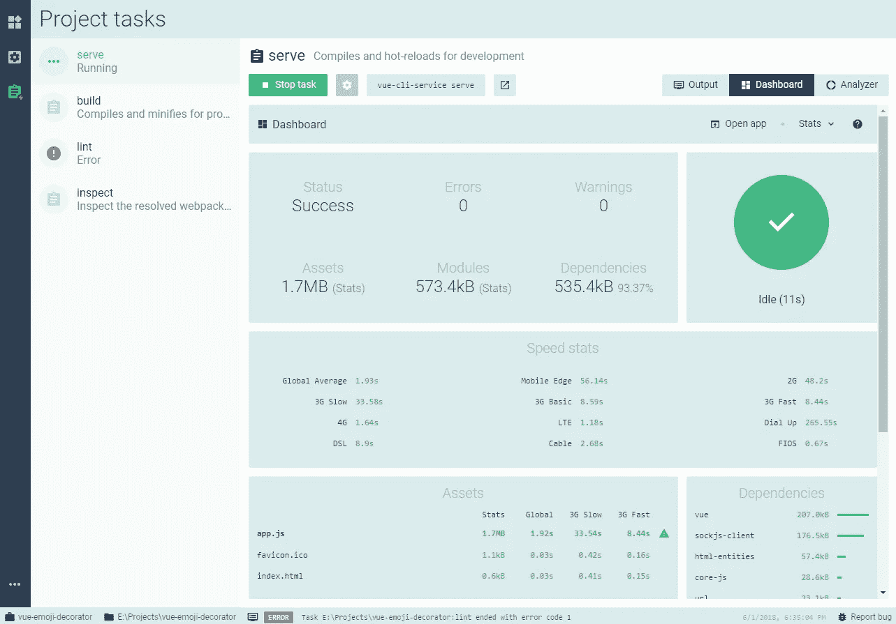
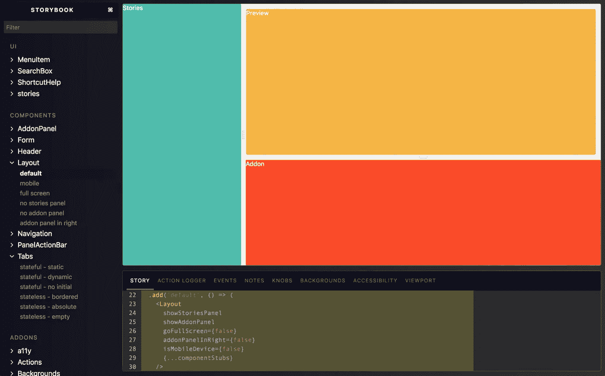

# 2019 年值得关注的 10 大 JavaScript 趋势

> 原文：<https://medium.com/hackernoon/top-javascript-trends-to-watch-in-2019-3ff6dd3cbf48>

深呼吸。2018 年结束了。如果你已经埋头于项目中，这篇文章将带你了解 2018 年最大的 [JavaScript 发展](https://hackernoon.com/javascript/home)，以及一些关于 2019 年将会带来什么的预测。

您可以利用这一点来了解接下来应该学习哪些框架。如果你想了解更多的背景，可以看看[去年的 JS 趋势帖子](https://x-team.com/blog/top-javascript-trends-2018/)。

# React vs Vue(哦，还有角度)

脸书经历了有史以来政治上最糟糕的一年，但是你不会通过观察 T4 的反应就知道这一点。到目前为止，前端框架仍然是所有框架中最主要的，也是最受欢迎的。

React 引入了新的上下文 API，更准确的错误报告，以及 [*挂钩*](https://reactjs.org/docs/hooks-intro.html) ，这是一个无需编写类就可以使用状态和其他 React 功能的功能(目前处于测试阶段)。

这并不是说 [Vue.js](https://vuejs.org/) 已经落后了。相反，Vue 也有出色的更新，即 [Vue CLI v3](https://blog.usejournal.com/getting-to-know-the-new-vue-cli-3-user-interface-a173b00128bd) ，这是一个新的(漂亮的)CLI 工具，用于创建预配置的 Vue 应用程序和检查性能统计数据。这个框架又有了相当大的发展，它的开源社区仍然和以前一样热情和活跃，VueConf 一年比一年受欢迎。

当然，还有这个:

> *我认为 Vue 在今年的 JS 状态框架中获得了最高的满意度(91.2%)——感谢我们的用户，我们的目标是做得更好！希望我们能改变不想再用的 568 人的想法；)*[*https://t.co/7MrM8Y4ekq*](https://t.co/7MrM8Y4ekq)
> 
> *—尤雨溪(@游雨溪)*[*2018 年 11 月 19 日*](https://twitter.com/youyuxi/status/1064659533975429120?ref_src=twsrc%5Etfw)

更不用说棱角分明的 T1 了。仅仅从 JS 调查的[状态来看，似乎我们可能很快需要给 Angular 上生命维持系统😂，从 2017 年到 2018 年，“不会再使用它”的比率上升了 24 个百分点，而 2016 年到 2017 年仅上升了 3 个百分点。](https://2018.stateofjs.com/front-end-frameworks/angular/)

众所周知，Angular 仍然不会很快死去。当在谷歌中比较搜索词时，React 和 Angular 仍然远远领先于 Vue。类似的工作:提到 Angular 和 React 的工作比提到 Vue 的多得多。[这篇文章](/zerotomastery/tech-trends-showdown-react-vs-angular-vs-vue-61ffaf1d8706)对此进行了更详细的描述，但可以说 Angular 还远没有死，而且肯定还能给你找份工作。

# Node.js 和后端环境

2018 年 [Node.js 用户调查](https://nodejs.org/en/user-survey-report/)证实了我们在 X-Team 看到的许多情况:

ES2017 现在被更广泛地采用。大多数开发人员计划在 2019 年增加 Node 的使用量。

Rust、Go、Python 和 Java 越来越受欢迎，导致一些开发人员扩展他们的技能组合以保持相关性。

特别是，他们提到 Node.js 的开发者希望在 2019 年增加对 Go 的参与，但我们看到每年都有开发者希望转投 Go。然而，可用工作的大量缺乏继续使你在 2019 年如何度过学习时间成为一场赌博。

GraphQL 越来越受欢迎，这也有助于向 Node 引入更多的开发人员，因为大多数 GraphQL 教程都教授使用 Node + Express 实现。

Next.js 的受欢迎程度继续上升，但并没有多少大公司愿意迈出这一步。当然，虽然仍然是一个伟大的选择

# GraphQL

2018 年最大的成功故事。不要成为仍然不知道它是什么的 17% JS 开发者的一部分，因为这列火车正在快速行驶。GraphQL 作为 REST APIs 的替代品，在过去的两年中，它以令人难以置信的速度增长。

GraphQL 客户端 Apollo 每周被下载 50 万次，而一年前是每周 1 万次。21%的节点用户也在使用 GraphQL。

Github、网飞、PayPal、Salesforce、Atlassian、Reddit——仅举几个拥有疯狂流量的公司为例，它们已经在利用 GraphQL 的可伸缩性。

更少的代码(运行更快)，一致的性能，更好的安全性—

GraphQL 最大的好处之一是它允许客户端只获取他们想要的数据。不应该再有欠取或过取了。

也可以看看 X-Teamer Bartosz 克洛尔的[graph QL 简介教程。](https://www.youtube.com/watch?v=gZTCRe8Hr9g)

期待在 2019 年看到更多的 GraphQL。

# 有一个应用程序可以做到这一点

渐进式网络应用(PWAs)的兴起意味着网络应用已经变得和移动应用一样好了。去 m.facebook.com[的](https://m.facebook.com/)和实际的脸书手机 app 对比一下。你能看出有什么不同吗？因为我不能。

话虽如此，应用程序对于移动设备*和桌面设备*仍然非常重要。随着用 JavaScript 构建应用程序变得越来越容易，JavaScript 也正在渗透到应用程序开发中。

你将使用的工具要么是桌面应用的 [Electron](https://electronjs.org/) 要么是移动应用的 [React Native](https://facebook.github.io/react-native) ，尽管 [NativeScript](https://www.nativescript.org/) 也值得关注。

在今天的大多数公司，对话都围绕着**React Native vs .**[**Flutter**](https://flutter.io/)，谷歌的竞争对手，利用 Dart(这篇[深度文章](https://hackernoon.com/why-flutter-uses-dart-dd635a054ebf)将解释为什么 Dart 是一个好的选择)。

我个人会等到 2019 年，然后再过多地投入到 Flutter 中，主要是因为 React 是一个常见的技能，你可以应用到 React Native 中，并且仍然可以从使用 Flutter 中获得大多数好处。也就是说，这将取决于脸书对 React Native 的投资，以决定未来 2 年 Flutter 的表现有多强。

# 测试，测试…这东西开着吗？

就 JavaScript 测试而言，没有太多新的报道，因为这几乎是一个公平的竞争环境。

前三名分别是 [Jest](https://jestjs.io/) 、[摩卡](https://mochajs.org/)、[茉莉](https://jasmine.github.io/)。

Jest 在 2018 年继续保持强劲领先，并将持续到 2019 年。

# 故事书

今年发布了 [Storybook 4.0](/storybookjs/storybook-4-0-is-here-10b9857fc7de) ，它现在支持六个新的视图层(包括 Ember 和 Svelte)，并且它现在与 React Native 更好地集成，这是 React Native 阵营的一个伟大胜利。

当然，他们不得不加入黑暗模式列车😂：

《T2》的故事(看我在那里做了什么？)的故事，继续受到来自其社区的创新和风格的推动。它现在是最受欢迎的 UI 组件浏览器，并且继续是我最喜欢的开发社区之一。

# 最终，Webpack 占了上风

去年，[网络包](https://webpack.js.org/)的一个竞争对手加入了这个行列:[包裹](https://github.com/parcel-bundler/parcel)。

尽管在这么短的时间内，它在 Github 上获得的明星甚至比 GraphQL 还多，但不要指望它会很快淘汰 Webpack。

相反，它将在开发生态系统中服务于一个不同的目的:向初学者介绍构建工具，并在没有 Webpack 膨胀和设置复杂性的情况下作为辅助项目的一个快速和肮脏的选择。

另一方面，我认为我们可以有把握地假设 5 年内不会出现。

# 编译成 JavaScript 的语言

TypeScript、Elm、ClojureScript——在过去的几年里，我们看到它们都在继续启发一种更智能、更安全、更优雅的编码方法。这是 JavaScript 蛮荒的西部非常需要的运动。

每年，我都会指出[原因](https://reasonml.github.io/)(脸书对已经成熟的 OCaml 的挑战)是 JS 的下一件大事，尤其是 React 开发者。React 的创造者乔丹·沃克在创造 React 之前就已经思考了理性；但是在那个时候，像 TypeScript 这样的东西还不存在，也没有人对学习另一种语法和编译成 JS 感兴趣。

尤其是 TypeScript 真正帮助 Reason 在 2019 年和 2020 年开始获得更大的动力。

我如此相信理性，以至于我们甚至邀请了 ReasonConf 的组织者，在过去的一年里，通过为我们社区举办的私人研讨会来启发我们。

也就是说，TypeScript 已经遥遥领先，将是一个强有力的竞争对手，加上 WebAssembly 终于准备好了，这将引入一群新的竞争对手，就像越来越受欢迎的 Rust 一样。

但由于 React 对当今开发的巨大影响，到 2020 年，只要开发社区在编码方法上继续成熟，你绝对会将 React 视为 JS 生态系统的重要组成部分。

# 盖茨比

盖茨比的故事继续令人惊叹。2018 年，它[融资 380 万美元](https://thenewstack.io/gatsbyjs-the-open-source-react-based-ssg-creates-company-to-evolve-cloud-native-website-builds/)，从此火了起来。

[越来越多的品牌](https://www.gatsbyjs.org/showcase/)正在利用 Gatsby 的力量建立他们的静态网站，同时仍然能够使用 GraphQL 从任何地方提取数据。

2019 年只会继续看到更多的盖茨比被采用，特别是当庞大的 WordPress 生态系统也开始更多地拥抱它。

# 设计和开发合并

成帧器，sketch 加 react-sketchapp

与此同时， [react-sketchapp](http://airbnb.io/react-sketchapp/) 引起了巨大的轰动，它允许你用高质量的 react 组件同步和渲染你的草图资源。对于那些已经转移到 Figma 的人，请确保查看他们的 API。

Figma 采用的兴起尤其有趣，因为很明显，设计师的技能已经不仅仅是艺术作品，而是通过 Figma、 [FramerX](https://framer.com/) 等伟大的工具成为开发团队的一员。

我预计我们将在 2019 年继续看到更多像这样的交叉工具，因为它们一直是开发者的梦想。

# 2019 年学习材料

*   GraphQL
*   vue . j
*   故事书
*   网络包
*   电子
*   反应自然
*   盖茨比
*   react-sketchapp
*   菲格玛
*   组成者

我错过了一个你认为重要的趋势吗？在下面留下评论，让我们添加到列表中。

你是 JavaScript 开发者吗？在任何地方工作，加入对开发者来说最有活力的社区，同时获得资金做更多你喜欢的事情。[了解更多关于 X-Team 的信息。](http://x-team.com/join)

*原载于 2019 年 1 月 12 日*[*x-team.com*](https://x-team.com/blog/top-javascript-trends-to-watch-in-2019/)*。*

 [## JavaScript -黑客正午

### JavaScript 是一种高级的、动态的、无类型的和解释的编程语言。除了 HTML 和 CSS，JavaScript 是…

hackernoon.com](https://hackernoon.com/javascript/home)