# 2019 年顶级移动应用开发趋势

> 原文：<https://medium.com/hackernoon/top-mobile-application-development-trends-in-2019-5bc1ba19188>

## 你是创业公司吗？一个产品公司？或者，一个想了解 app 趋势的手机 app 开发者？如果是的话，那么在这篇文章中你会发现我已经记下的今年最热门的移动应用开发趋势。

在过去几年与 ValueCoders(离岸移动和软件开发的 IT 外包公司)合作了数百个项目后，我可以说一件事——如果每个成功的移动应用程序都有一些共同点，那么它就是背后的一个伟大的想法。

然而，*“想法”*的含义并不是你已经想到的奇妙设计，也不是你计划在你的移动应用中包含的独特功能。我想说的是这会给你的想法增加多少价值。

因此，在你开始下一个移动应用程序开发之前，你应该[雇佣业内最优秀的移动应用程序开发人员](https://www.valuecoders.com/hire-developers/hire-mobile-app-developers)，他们也需要问自己这样的问题

***你的移动应用需要什么？你需要做什么来使它工作？***

***谁是你的观众？开发您的移动应用程序的最佳方式是什么？***

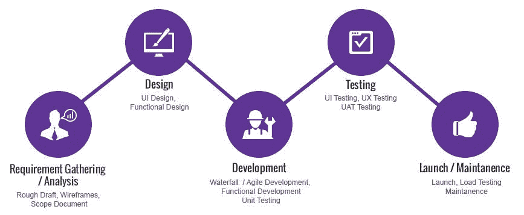

所有这些问题的一个简单答案是— ***把握移动应用发展趋势的脉搏*** 。它也解决了你的移动应用程序的一个伟大的想法的目的。

***也读:*** [***创业公司 30 个简单的手机 App 思路(AI、ML、& AR/VR)***](https://hackernoon.com/30-simple-app-ideas-for-startups-ai-ml-blockchain-ar-vr-f7cab5de0def)

我想在这里补充的是，每个移动应用程序都是不同的，应用程序的趋势和技术总是在变化和发展。然而，我在这里分享的是一条关于 2019 年移动应用趋势的相当标准的信息。

我很快会更详细地介绍应用趋势。在此之前，先看看全球移动应用的使用情况。

*   ***全球*** [***移动应用收入***](https://www.statista.com/statistics/269025/worldwide-mobile-app-revenue-forecast/) ***预计将通过应用商店和应用内广告产生 1889 亿美元的收入。*** *(参考下图)*

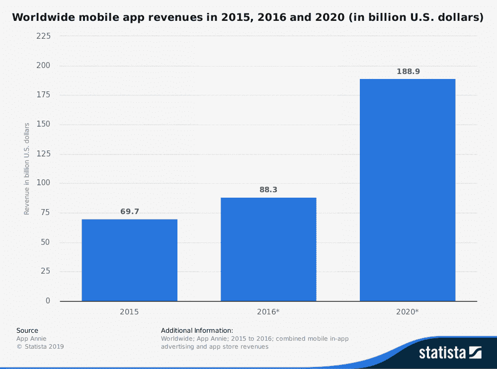

*   ***根据特定地区的收入，2022 年，美国消费者预计将通过应用商店在移动应用上花费超过 340 亿美元。***

作为移动应用程序开发领域的专家，我一直关注着移动应用程序的发展趋势。此外，不用说，无论你是一名移动应用程序开发人员，还是你正在经营一家企业，或者打算在[租赁一个编码器](https://www.valuecoders.com/hire-developers)，在移动领域接受教育对你来说都很重要。

我已经缩小了 2019 年的顶级移动应用趋势。以下是你需要知道的。

## **应用趋势# 1——移动应用开发策略的人工智能**

我们大多数来自开发者社区的人都尝试过深度学习和机器学习来构建移动应用程序。像 [FaceApp](https://faceapp.com/) 、 [Replika](https://replika.ai/) 、 [Cortana](https://www.microsoft.com/en-us/cortana) 、 [Siri](https://www.apple.com/siri/) 、谷歌助手和 IRIS 这样的应用对科技开发者来说已经不再陌生。

事实上，深度学习与机器学习合作时，可以通过为您提供有价值的数据和实时分析，为您的移动应用程序开发项目创造奇迹。

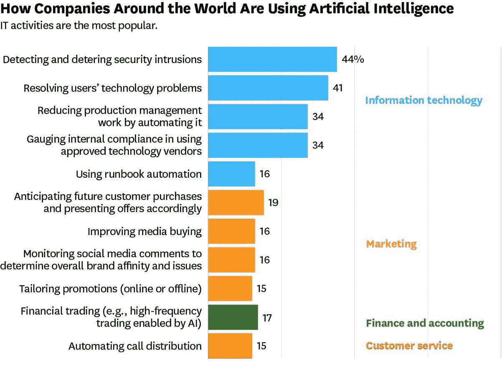

***一些关于人工智能行业增长的有用数据-***

***预计到 2020 年人工智能产业将上升至 400 亿美元。***

***ML 行业正以 42%的速度增长，到 2022 年将达到 90 亿美元。***

虽然人工智能技术已经成为热门产品，但你仍然需要通过它的许多组件来正确地了解它的特性。例如，聊天机器人将在人工智能技术的部署中发挥更重要的作用。

对于移动应用程序开发者来说，现在很容易将聊天机器人集成到他们的网站和应用程序中。在未来几年，你会看到聊天机器人更像虚拟助手，感觉就像你在和真人交谈。

***也读:*** [***5 聊天机器人创意业务 2019 年应该考虑的***](https://hackernoon.com/5-chatbots-ideas-business-cant-afford-to-miss-in-2019-e59cd41e01f8)

人工智能还可以帮助限制癌症治疗中的毒性，为医生提供更合适的治疗选择，如遵循命令和跟踪任何形式的癌症的强化学习。

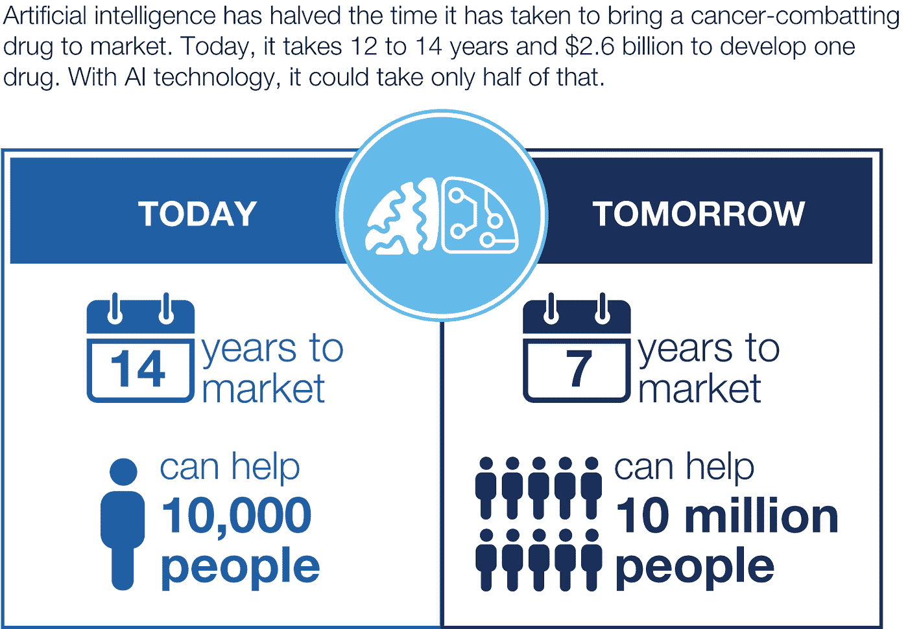

## **应用趋势# 2——VR 和 AR 将被部署到更多的移动应用中**

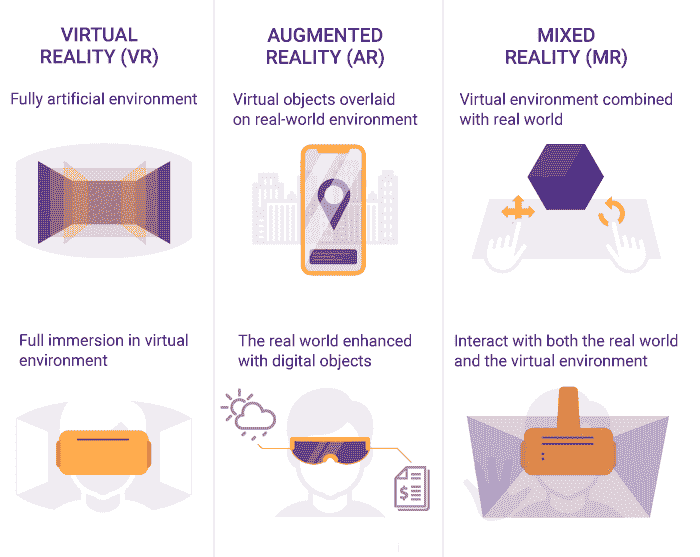

2019 年将有更多的移动应用适应增强现实和虚拟现实。这些应用程序将真实世界的体验融入到您的移动应用程序中。增强现实移动应用的最好例子是[口袋妖怪 Go](https://play.google.com/store/apps/details?id=com.nianticlabs.pokemongo&hl=en_US) 。这是游戏功能的细节-

所有的元素，像草，树，天空，游戏中的人都存在于现实中，你可以通过你的相机看到。

但在现实中，你通过设备看到的所有元素实际上都不存在。

[**重要统计**](https://expandedramblings.com/index.php/pokemon-go-statistics/)

***据报道，《口袋妖怪 Go》已经创造了 12 亿美元的收入，下载量约为。7.52 亿次。***

***全球约有 500 万活跃用户在玩《口袋妖怪 Go》。***

更好的说法是，这对这个游戏品牌来说确实是一个巨大的成功。这就是为什么越来越多的公司将尝试使用增强现实和虚拟现实应用来推动他们的移动应用下载和业务收入。

## **应用趋势#3 —面向移动应用开发者的 5G 技术**

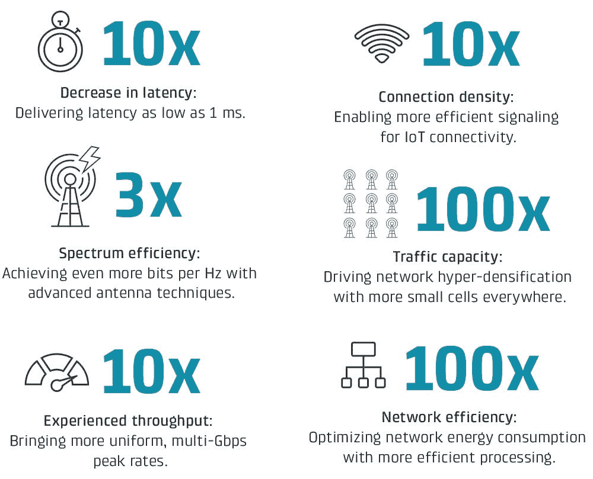

5G 技术将成为 2019 年最受欢迎的应用开发趋势。对于移动应用开发者来说，技术将永远改变移动性。成千上万的应用程序开发者正在考虑 5G 移动技术，以增强他们的应用程序在数据安全、速度、3D 游戏、增强现实方面的功能，并为他们的移动应用程序添加新功能。

与这些领域相关的发展将受到 5G 的巨大影响。也就是说，开发者应该期待在他们的移动应用上看到更多的用户，因为你将为他们提供比以往更好更快的顶级速度。

定制网络片和超低网络延迟等功能有助于提高移动应用的响应能力和速度，而不仅仅是较慢的互联网连接。

**例如**、 *AT & T 最近推出了其* [***AT & T 5G 创新***](https://about.att.com/story/2019/creating_5g_today.html) *计划，以 5G 的力量继续创造和发展新的客户体验。该计划旨在让移动应用开发者将 5G 理念带入生活体验。*

我还建议应用程序开发人员在开发和测试他们的移动应用程序时使用 5G 网络速度。这一点很重要，因为专门在拥有快速 Wi-Fi 和 5G 等高速蜂窝服务的地区开发的应用程序，对于速度有限的用户来说，运行令人满意。

## **应用趋势#4 —移动应用开发的即时应用**

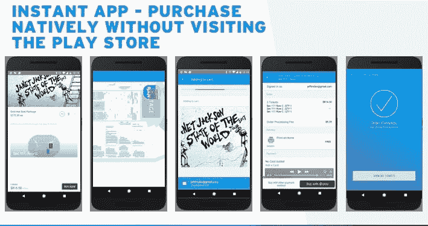

即时移动应用程序的概念日益流行。最棒的是，即时应用不仅在个人中很受欢迎，移动应用开发公司也发现它们很有用，因为与常规移动应用相比，它可以帮助 **iOS 和** [**Android 应用开发者**](https://www.valuecoders.com/hire-developers/hire-android-developers) 实现更好的转化率。

比如像[***Hollar***](https://www.hollar.com/)*和*[***NYTimes***](https://play.google.com/store/apps/details?id=com.nytimes.android&hl=en_US)*这样的*app，通过使用即时移动应用，转化率分别提高了 20%和 27%。**

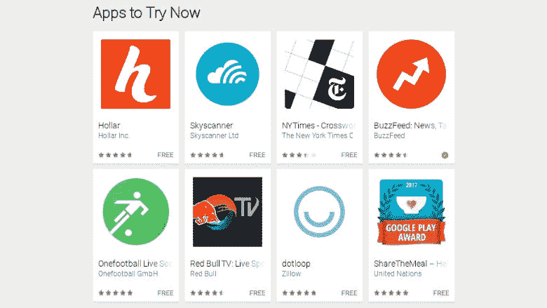

此外，游戏行业的顶级开发品牌如 **King** 和 **Hothead** Games 也通过使用即时移动应用程序提高了他们的玩家获取率。

简单来说，即时移动应用是一种本地移动应用，你不需要下载并安装在你的 Android 或 iOS 智能手机上。

*   与普通移动应用相比，它们的尺寸更小。
*   这些应用程序提供了网站的基本功能。
*   提供出色的用户体验
*   不会占用手机内存的额外空间。

此类应用程序的更多示例包括—****[**【纽约时报纵横字谜】**](https://www.nytimes.com/crosswords)**[**红牛电视**](https://www.redbull.com/int-en/tv/)**[**愿望—购物乐趣**](https://www.wish.com/?&hide_login_modal=true)**和 **Skyscanner** 。此外，2019 年将有更多面向开发者和个人的即时应用出现。**********

## ******应用趋势# 5——移动应用开发领域的物联网趋势******

****移动应用开发的物联网已经成为一个与时俱进的大产业。使用这项技术，移动应用程序开发人员可以创建直观的平台，通过应用程序控制不同的非 IT 设备。****

****几乎所有的科技巨头都已经开始开发物联网友好应用。 ***预计到 2020 年，物联网投资将达到 1200 亿美元。*******

****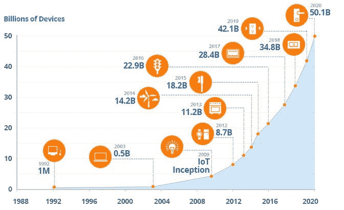****

****物联网移动应用程序开发人员必须选择一个可行的应用程序开发平台。那么最佳策略应该是什么呢？为了帮助你做到这一点，我整理了以下几点:****

****[**Android Ubidots**](https://ubidots.com/docs/devices/android.html#preparing-your-ubidots-account)—手机应用开发者可以使用 Android 平台创建一个可以连接到 ubi dots 的账户。通过这样做，你将能够在智能手机上推送你的应用。****

********—该平台为您的应用开发项目提供类似物联网的功能。********

******[**Thingworx**](https://www.ptc.com/en/products/iot/thingworx-platform) —这个平台为你提供了一个先进的工具来推广你的移动应用。一般来说，Thingworx 之所以受欢迎，是因为它有以下好处:******

*   ****分离产品和服务很容易。****
*   ****支持业务活动的优化。****
*   ****改善移动应用的整体用户体验。****
*   ****帮助您建立和确定新的收入渠道。****

****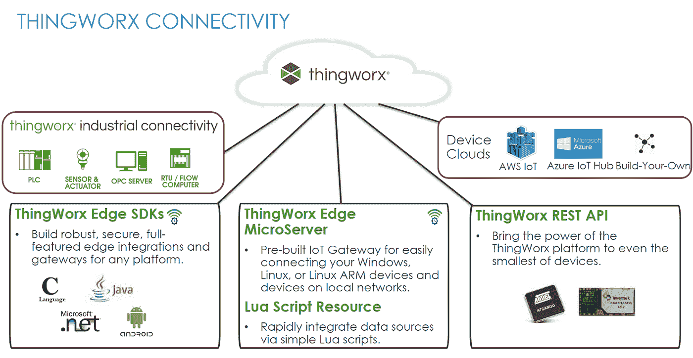****

****移动应用开发者的另一个最佳平台是 Forester Wave 报告，它有助于为您的应用开发项目创建可行的物联网策略。****

## ******App 趋势#6 — 2019 移动钱包年******

****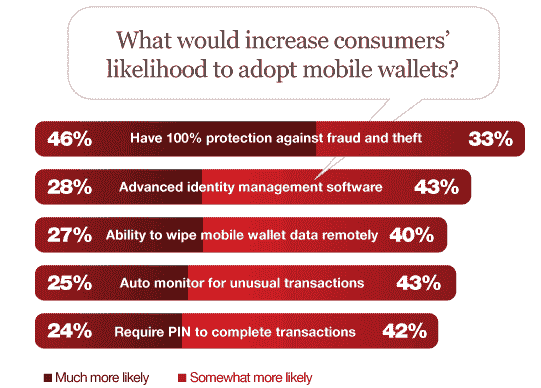****

****2019 年，客户将转向移动商务，因为物联网和分散平台等技术正在进入移动支付，并为移动应用提供更多安全交易选项。****

****像三星这样的品牌正在使用移动钱包为他们的客户提供一个更方便、更安全的货币交易和账单支付平台。此外，加密的[三星手机钱包](https://play.google.com/store/apps/details?id=com.samsung.android.spay&hl=en_US)应用程序确保用户的钱保持安全，免受可能的盗窃和漏洞。由于互联网支付系统需要快速和安全的货币交易渠道，移动钱包应用程序的趋势很受欢迎。****

****例如，iOS 11 中的[***Apple Pay***](https://support.apple.com/en-us/HT207886)***是点对点货币支付系统进行数字交易的最佳方式。*******

## ******最后的话******

****play store 中有一百万个移动应用程序。你必须面对竞争，才能在这个竞争激烈的领域脱颖而出。为了使您的移动应用程序开发取得成功，让自己了解最新的移动应用程序开发趋势和技术是非常重要的。****

****我希望通过我在这里分享的这些观点，让你对 2019 年的顶级移动发展趋势有一个完整的了解。****

****此外，虽然对企业来说，确定所有这些移动应用程序开发趋势的确切好处有点困难，但如果你是这种情况，只需联系行业专家或[雇用移动应用程序开发人员](https://www.valuecoders.com/mobile-application-development)就可以让你的应用程序在移动应用程序市场中脱颖而出。****