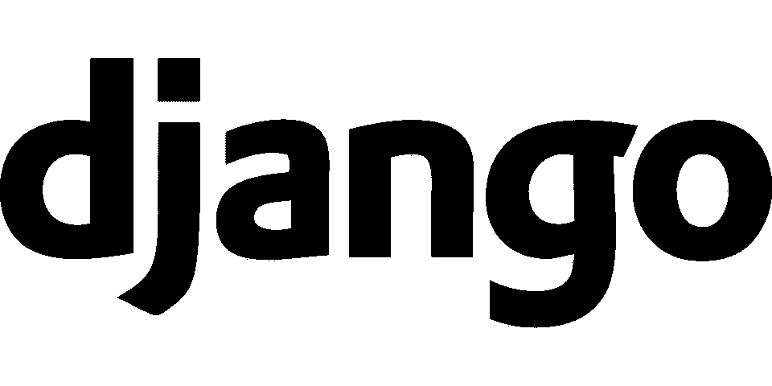
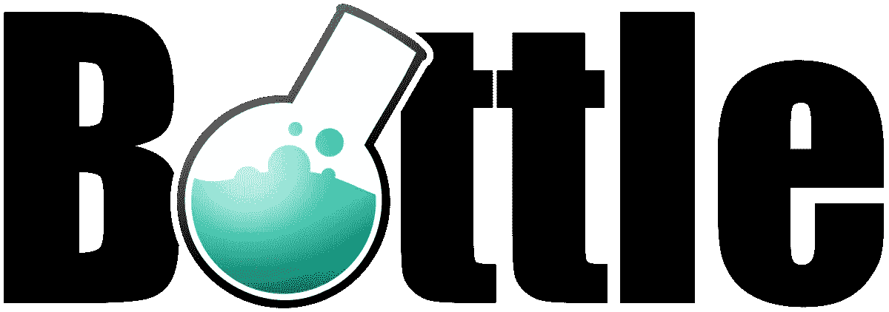
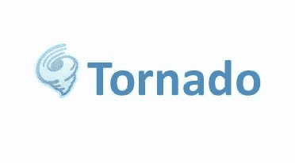

# 2019 年要学习的顶级 Python Web 开发框架

> 原文：<https://medium.com/hackernoon/top-python-web-development-frameworks-to-learn-in-2019-21c646a09a9a>

## 总结:快速概述 python 中的趋势框架，以及如果您想开始使用 python 进行 web 开发的职业生涯，您需要学习的内容。

Photo by [Artem Sapegin](https://unsplash.com/@sapegin?utm_source=medium&utm_medium=referral) on [Unsplash](https://unsplash.com?utm_source=medium&utm_medium=referral)

# Python 在市场上的流行

Python 是一种面向对象、解释型、动态类型和交互式的编程语言。大多数开发人员使用的最流行的编程语言之一是 *Python。* Python 是机器学习工程师和数据科学家的骨干工具。但是这种流行不仅仅局限于特定的领域，如 ML、数据科学和 AI。而且还将其普及扩展到其他技术领域，如 Web 开发、IOT 等等。这都是因为它有一个独特的语法，这使得它不同于 it 行业中可用的其他编程语言。它也被认为是初学者和开发者的友好语言。

# 什么是 Web 框架？

Photo by [DiEtte Henderson](https://unsplash.com/@dietteh06?utm_source=medium&utm_medium=referral) on [Unsplash](https://unsplash.com?utm_source=medium&utm_medium=referral)

正是这些包和模块的集合让我们能够非常容易地创建 web 应用程序，而不必处理线程管理、进程管理和协议管理等低级活动...在框架的帮助下，我们可以在很短的时间内非常有效、轻松地构建我们的应用程序。 ***框架就像是给开发人员的礼物，因为它让开发人员的生活变得更加轻松愉快。***

由于 python 在 web 开发行业中也被相当多的开发者所使用。因为它可读性强，维护方便。当我们谈论 web 开发时，我们应该同时关注应用程序的前端和后端。在 web 开发环境中，后端框架由服务器端编程中使用的语言和某些工具组成。python 在开发应用程序的后端部分时使用了荒谬。

在 python 中，对于 web 开发，有两种类型的框架可用

# **全栈框架**

它为开发者提供全面的支持，包括表单生成器、表单验证和模板布局等基本组件

市场上有很多全栈 Python 框架，但下面列出的是 2019 年你可以学习的 4 个顶级全栈 Python web 开发框架，以提高你使用 Python 进行 web 开发的职业生涯。

# 姜戈

Source: Google.com

Django 是一个高级 Python Web 应用程序开发框架，它鼓励我们快速开发东西，它使用实用主义设计。由经验丰富的开发人员构建，它解决了 Web 开发的许多麻烦，因此您可以专注于编写应用程序，而无需重新发明轮子。它是免费和开源的。

## 特征

1.  **快得离谱—** 它旨在帮助开发人员尽可能快地从头到尾完成应用程序。
2.  **满载—** 它包括几十个额外的组件，您可以使用它们来处理常见的 Web 开发任务。Django 负责用户认证、内容管理、站点地图、RSS 提要和许多其他任务——开箱即用。
3.  **放心安全—** 非常有效地提供安全，帮助开发者避免许多常见的安全错误， ***如 SQL 注入、跨站脚本、跨站请求伪造、点击劫持*** 。其用户认证系统提供了一种安全的方式来管理用户帐户和密码。
4.  **高度可扩展—** 地球上一些最繁忙的站点使用 Django 的能力快速灵活地扩展，以满足最大的流量需求。
5.  **难以置信的多功能性—** 公司、组织和政府已经使用 Django 构建了各种各样的东西—从内容管理系统到社交网络再到科学计算平台。

# Web2Py

Source: Google

这是一个免费的开源全栈 python 开发框架，允许用户快速开发。它是一个跨平台的框架，支持所有流行的操作系统。该框架通过 web 服务器、SQL 数据库和基于 web 的界面简化了 web 应用程序开发过程。它允许我们通过 web 浏览器构建、编辑、部署和管理 web 应用程序。这个框架的一个关键特性是，它使用票据授予机制来跟踪错误及其状态。它有内置的组件来管理 HTTP 请求、反应、会话和 cookies。

## 特征

1.  **设置简单—** 无需安装和配置。
2.  **跨平台—** 它可以运行在Windows、Mac、Unix/Linux、Google App Engine、Amazon EC2 以及几乎所有通过 Python 2.7/3.5/3.6/pypy 托管的网站上。
3.  **数据库连接—** 它可以轻松地与SQLite、PostgreSQL、MySQL、MSSQL、FireBird、Sybase、Oracle、IBM DB2、Informix、Ingres、MongoDB 和 Google App Engine 协同工作。
4.  **安全性—** 它可以防止最常见类型的漏洞，包括跨站点脚本、注入漏洞和恶意文件执行。 *web2py 使用 MD5 或 HMAC+SHA-512 哈希算法来保护存储的密码。*

# 涡轮齿轮

Source: Google

TurboGears 是一个免费、开源、数据驱动的全栈 web 应用开发 Python 框架。它构建在 TurboGear1、Django 和 rails 之上。它旨在克服各种广泛使用的 web 开发框架的缺点。开发 web 应用程序需要较少的设置。借助 Javascript 开发工具，开发人员可以简化 web 应用程序。

## 特征

1.  与 MochiKit Javascript 库集成。
2.  命令行工具。
3.  它支持 SQLObject 和 SQLAlchemy。
4.  它支持多个数据库。

# 立方体网络

Source: Google

CubicWeb 是一个语义、免费和开源的 Python Web 框架，它使开发人员能够通过重用组件(称为立方体)并遵循众所周知的面向对象设计原则来高效地构建 web 应用程序。对于语义 web 应用程序开发来说，这是一个很好的解决方案，可以提高可重用性、质量和效率。

## 特征

1.  它有良好的安全工作流程。
2.  它还支持资源描述框架(RDF)和 Web 本体语言(OWL)。
3.  它使用关系查询语言(RQL)来简化与数据相关的查询。

# 非全栈框架

非全栈框架也被称为微框架，因为它不像全栈框架那样有很多组件。

最重要和最广泛使用的非全栈 web 开发框架是—

# 瓶

Source: Google

Flask 是基于 Werkzeug 和 Jinja 2 的 Python 微框架。主要目的是开发一个强大的 web 应用程序基础。与 Django 相比，Flask 最适合小而简单的项目。

**特性**

1.  轻量级框架。
2.  兼容谷歌应用引擎。
3.  内置的开发服务器和调试器。

# 樱桃派

Source: Google

CherryPy 是一个极简的 Python Web 框架。它使用面向对象的范例来开发 web 应用程序。这种方法帮助开发人员在短时间内开发 web 应用程序。

## 特征

1.  它拥有强大的配置和灵活的插件系统。
2.  它可以很容易地同时在多个 HTTP 服务器上运行。
3.  它内置了缓存、编码、会话、认证、静态内容等工具。

# 瓶子

Source: Google

这是一个快速、简单和轻量级的用于 Python 的 WSGI 微型网络框架。它作为单个文件模块分发，除了 Python 标准库之外没有其他依赖关系。它是一个易于使用的轻量级框架，通常用于构建小型 web 应用程序。它主要用于开发 API。

## 特征

1.  它允许用户以更简单的方式访问表单数据、文件上传、cookies 和其他与 HTTP 相关的元数据。
2.  它有一个内置的 HTTP 服务器。

# 龙卷风

Source: Google

它是一个带有异步网络库的 python web 框架。通过使用非阻塞网络 I/O，Tornado 可以扩展到数万个开放连接，使其成为长轮询、WebSockets 和其他需要与每个用户长期连接的应用程序的理想选择。

## 特征

1.  非阻塞 HTTP 客户端。
2.  它具有高质量的性能。
3.  它允许我们实施第三方认证和授权方案，即(谷歌，脸书，推特)

# 结论

以上给出的框架是 2019 年 Python 最好的、应用最广泛的全栈和非全栈后端 web 应用开发框架，供你学习。由于技术领域的快速发展，根据现代 web 应用程序开发场景，这些框架越来越受欢迎。

总的来说，每个框架都有自己的优点和缺点。每个程序员/开发人员都有他/她的编码风格和偏好。你需要根据你的需求来评估这个框架。我真的希望你在这篇文章中找到了一个有趣的框架。😄😃😄