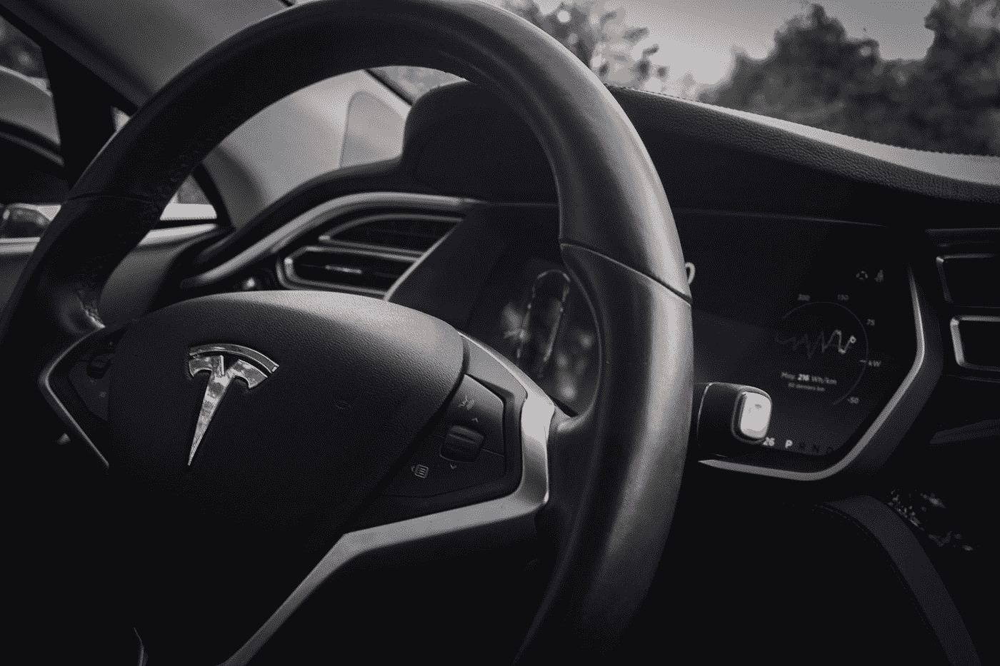
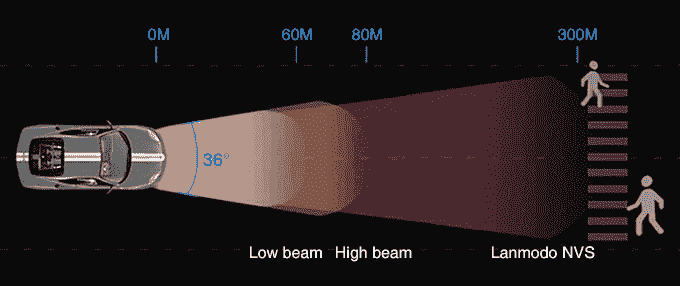

# 人工智能在汽车中的顶级现实应用

> 原文：<https://medium.com/hackernoon/top-real-world-applications-of-ai-in-automobiles-d270fcaaaaab>

Photo by [Jp Valery](https://unsplash.com/@jpvalery?utm_source=medium&utm_medium=referral) on [Unsplash](https://unsplash.com?utm_source=medium&utm_medium=referral)

人工智能将会一直存在，而且它已经在汽车行业找到了很多用途。像特斯拉、梅赛德斯、日产和起亚这样的公司似乎正在支持智能汽车的努力，这篇文章将看看人工智能在这方面的一些贡献。

# **驾驶员辅助和附加安全**

虽然人工智能可能还不能完全掌握方向盘，但它肯定会成为一个令人敬畏的副驾驶员。

人工智能提供了完美的高级安全性，有助于提高联网车辆的功能。这些功能也有助于客户、监管机构和汽车制造商更加熟悉人工智能系统。

通过监控各种传感器，AI 可以对危险情况进行分级。然后它可以通知司机，或者采取一些紧急措施来避免事故。

借助夜视系统，如 [Lanmodo 1080P 全彩色图像夜视系统](https://www.lanmodo.com/lanmodo-1080p-automotive-night-vision-system.html)，安全驾驶也成为可能。这款驾驶助手提供广角视野、远距离高分辨率视野等等，旨在确保驾驶员能够正确观察前方路况。Lanmodo 夜视系统的一些规格如下:

1.  开发夜视系统的初衷是考虑夜间驾驶的安全性。据报道，大多数车祸发生在晚上，其中大多数是由于能见度低或天气恶劣造成的。Lanmodo 夜视系统是为喜欢在夜间驾驶的人提供的驾驶安全辅助系统，驾驶员不需要一直盯着屏幕，有了这个系统，他们可以获得清晰明亮的图形辅助。Lanmodo 1080P 夜视系统的可视距离可达 300 米，这样，它将帮助驾驶员更快地了解路况，更容易避免事故。
2.  Lanmodo 1080P 全彩色图像夜视系统对于总是在夜间驾驶的卡车司机来说很有用。正如我们所知，通常卡车的车身较长，这将导致卡车尾部的视觉障碍。这样，Lanmodo 1080P 全彩图像夜视系统配置后视摄像头，对货车尾部进行监控，保持行车安全。后视摄像头的连接线长达 600 米，几乎适用于所有车型。
3.  同时，对于视力不好的老人也很有帮助，因为 Lanmodo 1080P 全彩色图像夜视系统的屏幕采用 8.2 英寸高清屏幕，1080P 高分辨率，全彩色图像，使交通状况清晰地显示在屏幕上。
4.  借助外部电源，夜视系统还可用于夜间活动，如夜钓、摄影等。

# **AI 汽车保险**

人工智能与保险业有一个主要的共同特征，这是一件大事。这两个功能都花了很多时间来思考未来的老年人。

当然，保险行业已经接受在汽车中使用人工智能作为帮助提供实时风险评估的手段，这一点也不奇怪。

然而，这还不是全部。如果发生意外事故，AI 还会加快索赔过程。

人工智能在保险公司的应用带来了保险技术领域，通过使用深度学习和人工智能，保险行业可以通过各种方式变得更加有效。

# **AI 在助推制造过程**

除了改变汽车的功能，人工智能现在正在改变汽车的制造方式。

我们都知道装配线上的机器人是如何工作的，早在 60 年代，它们就能帮助组装汽车。然而，新的是智能机器人能够与人类一起工作，而不是与他们并肩工作。

早在 2018 年，起亚就开始与现代背心外骨骼合作，以开发能够在装配线上工作的可穿戴工业机器人。该公司将人工智能视为未来增长的主要领域，他们立即组建了一个机器人团队，负责开辟道路。

现代无椅外骨骼和背心外骨骼是可穿戴机器人，可以改善对工人背部、膝盖和颈部的保护，同时帮助他们轻松移动，并帮助他们执行繁琐的任务。

人工智能还在其他方面帮助开发汽车。

有了协作机器人，汽车制造商现在可以感知人类工人在做什么。[机器人使用人工智能](https://hackernoon.com/cambridge-analytica-what-the-media-wont-tell-you-772d7ec80e4)来调整它们的动作，以确保它们在工作时不会撞到人类工人。

自动导向车辆也用于有效地将材料放置在不需要人工输入的地方。借助人工智能，自动送货车辆可以识别道路上的物体，并绕过它们。

此外，人工智能驱动的焊接和喷漆机器人现在可以做比它们被编程做的更多的事情。有了人工智能，他们可以检查材料设计中的不规则之处，并做出必要的调整。

# **驾驶员跟踪**

人工智能还能让汽车留意司机。

总部位于以色列的初创公司 eyeSight 利用深度学习和人工智能提供了一系列汽车解决方案。先进的飞行时间相机和红外传感器有助于他们从各个方面检测驾驶员的行为。