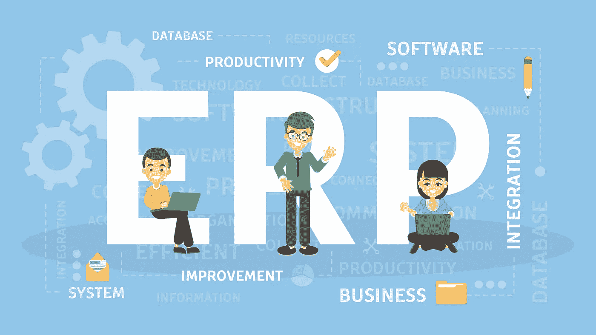
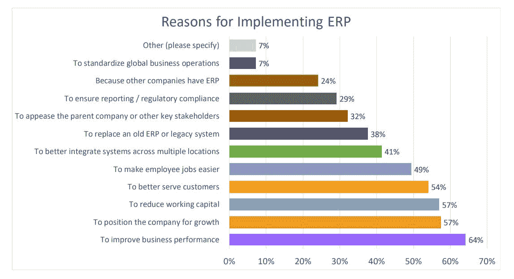
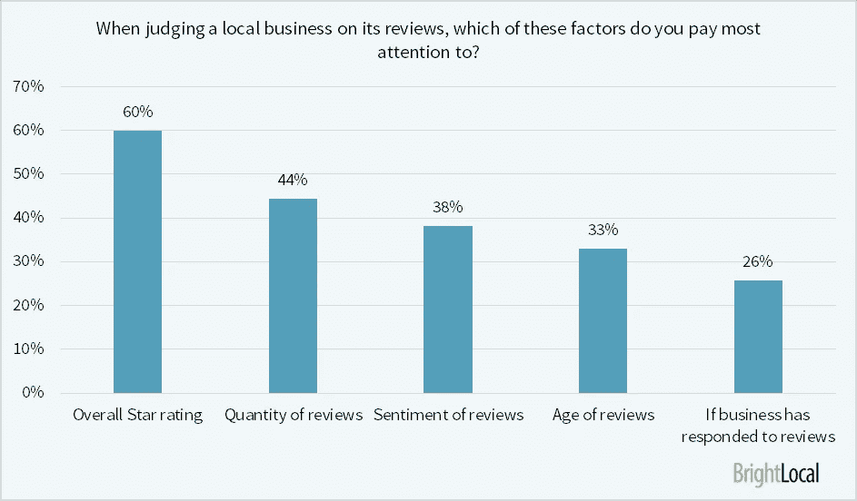
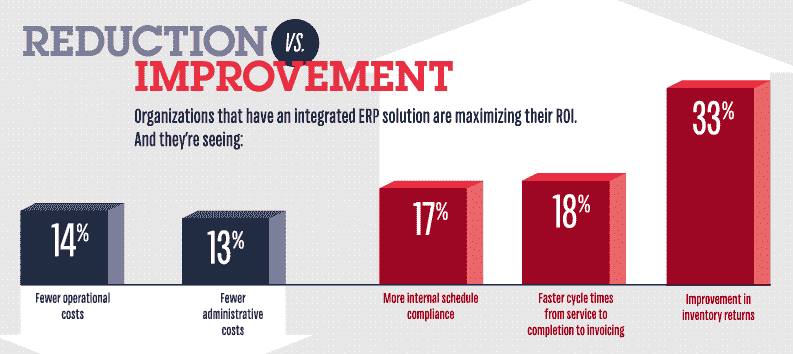

# 为您的企业投资 ERP 系统的几大理由

> 原文：<https://medium.com/hackernoon/top-reasons-to-invest-in-an-erp-system-for-your-business-e2ec3b471ec6>

# 什么是 ERP 系统？

根据 [Investopedia](https://www.investopedia.com/terms/e/erp.asp) ，

> 企业资源规划(ERP)是公司用来管理和集成其业务的重要部分的过程。许多 ERP 软件应用程序通过将运营公司所需的所有流程集成到一个系统中来帮助公司实施资源规划。ERP 软件系统可以集成计划、采购库存、销售、市场营销、财务、人力资源等等。

投资 ERP 软件可以帮助企业[提高业务绩效](https://www.encorebusiness.com/blog/new-erp-systems-deliver-bottom-line/)并使组织的某些流程自动化。据估计，到 2020 年，ERP 软件市场价值将达到[416.9 亿美元。这个数字确实令人印象深刻，但当每天都有大量新技术涌现时，很难决定你的企业应该投资哪种技术。为了在游戏中保持领先，企业主寻找市场上的每一种工具是很重要的。ERP 系统也不例外。](https://www.alliedmarketresearch.com/press-release/global-ERP-software-market-is-expected-to-reach-41-69-billion-by-2020.html)

ERP 解决方案帮助您收集、存储和管理来自企业不同部门的数据。它可以消除数据重复并提供完整性，因为它从多个来源收集组织的共享数据。

让我们讨论一下您的企业需要 ERP 系统的一些原因。

Panorama Consulting

# 更好的会计核算和更高的生产率

为了在成长阶段取得成功，记录你的财务状况是很重要的。然而，这并不是一件容易的事情，尤其是当你的公司呈指数增长的时候。交易的复杂性增加了，没有一个集中的系统就很难管理它们。

数据输入任务可能相当乏味。根据 Smartsheet 报告，40%的员工一周花四分之一的时间做重复性的工作。在合适的 ERP 解决方案的帮助下，您可以将枯燥的任务自动化。ERP 系统可以跟踪您的交易，从而避免重复的数据输入工作，这是容易出现人为错误。

这为您的员工节省了大量时间，并提高了生产率。它还通过集中式平台提高了运营数据的可见性。

# 更好的分析

借助集中式数据库，您的业务分析和报告可以得到改善。ERP 软件是一个神奇的商业智能工具，可以记录所有的输入数据。有了 ERP 软件的帮助，生成报告变得容易多了。用 ERP 可以在几分钟内完成需要几天的研究。

借助 ERP 系统，您可以获得一个可定制的仪表板。主管只要登录系统就可以看到所有的报告。从收入报告到支出报表，您只需点击一下鼠标就可以访问所有报告。这可以帮助你获得更好的洞察力，让你做出更好的决定。这些报告你不需要依赖任何人。此外，您可以指定对这些报告的访问级别，以便只有授权人员才能查看公司数据。

# 软件的更多节约和标准化

这是真的，你将需要投资大量的钱前期实施 ERP 系统，许多企业主可能会认为这种投资是超过他们将永远能够节省。但这不是真的，尤其是如果你想扩大你的业务。你可以通过 ERP 系统获得巨大的投资回报。

首先，ERP 系统将你公司中分散的各种流程和系统绑定在一起。因此，您的员工可以轻松地从一个中央系统访问数据。工作人员不需要在各种系统上寻找信息。相反，他们将能够立即访问他们需要的信息，因为在中央系统上检索数据要容易得多。统一的系统也提高了安全性。

而且，你不需要在几个系统上培训你的员工。这不仅会减少花费在培训上的资金，还会减少相关的后勤工作。

# 更快乐的顾客

客户满意度比以往任何时候都更重要。在这个数字时代，人们几乎一切都依赖互联网。如果你想和朋友一起吃饭，你会搜索周围最好的餐馆。互联网是件大事。几乎 84%的顾客相信在线评论是个人推荐，这使得顾客评论比以往任何时候都更有影响力。

brightlocal.com

很明显，顾客寻找各种因素来判断一个地方企业。因此，让你的客户开心和满意是很重要的。做到这一点的最佳方式是提供以客户为中心的服务。ERP 系统可以通过多种方式确保客户满意。这些系统中的大多数都配备了 CRM 工具。该工具可以访问跨业务功能的所有数据。

集成的 CRM 工具可以为您提供所有必要的客户详细信息，如账单信息和订单历史记录。因此，你可以更好地了解你的客户的需求。它可以让你制定你的战略，并为你的客户提供他们想要的东西。

# 统计和数字

根据[调查](https://www.themarlincompany.com/blog-articles/hidden-costs-employee-miscommunication/)，小企业每年因沟通不畅损失高达 42 万美元，而大公司因沟通不畅损失高达 6240 万美元。此外，员工每天会损失 40 分钟的生产力。

ERP 系统通过帮助企业[收回资金](https://assuredrecover.com/)为企业提供了很多好处。它的实施将[运营成本降低了 14%](https://www.business.com/images/content/58a/d9f882f87b1207f720e8a/0-0-/),同时将管理成本降低了 13 %,并在其他方面有所改进。

ERP 对所有类型的企业都很重要，无论其规模大小。从食品连锁店到[钻石](https://tingdiamond.com/)珠宝店、餐馆、航空业，仅举几例，所有企业都可以从 ERP 软件中受益。以航空业为例。它需要准确及时的决策来提高效率。

工作成本非常高，对公司来说，跟踪所有交易、退款详情、订单历史记录、账单信息等客户数据非常重要。它还可以记录常旅客获得的奖励积分和航空里程。您也可以尽快[出售里程](https://sellmilesasap.com/)以换取现金。你看，ERP 对每个行业都挺有利的。数据安全、多币种会计、库存管理、实时数据、MIS 报告是 ERP 系统的一些功能，这也使其适用于航空业。

**以下是一些主要的 ERP 提供商:**

# SAP ERP

SAP ERP 是由一家德国公司 SAP SE 开发的领先企业资源规划软件之一。它为 180 个国家的 335，000 名客户提供服务。 [SAP 软件的全称形式](https://inui.io/sap-full-forms/)是系统、应用程序、产品中的数据处理。它提供对分析应用、关键数据和其他重要工具的访问，帮助您的企业取得成功。它配备了 CRM 工具、供应链管理、财务管理、人力资本管理等。

由于它被企业广泛使用，许多人开始学习 SAP。但是作为初学者，了解业务流程、 [SAP 缩写列表](https://inui.io/sap-acronyms/)和项目概念是很重要的。

# Netsuite ERP

Netsuite ERP 为快速发展的大中型企业提供 ERP 解决方案。这是一个完整的和可扩展的 ERP 解决方案。使用 Netsuite ERP，您可以自动化各种流程，如收入管理、计费、财务管理、订单管理等。您可以为您的公司获得一个集中的解决方案，其商业智能和财务管理操作的结合使其脱颖而出。

# Microsoft Dynamics GP

就收入而言，微软是全球领先的软件供应商。Microsoft Dynamics GP 是一款 ERP 软件，可帮助中小型企业更好地管理其供应链、财务、计费等。它允许企业以更快的速度更智能地工作。Dynamics GP 在北美、英国、新加坡、澳大利亚、新西兰、南美和其他一些有合作伙伴支持本地化的国家/地区提供。中小型企业可以节省 IT 基础设施成本，因为它利用了云。

**其他一些 ERP 软件公司:**

*   Oracle ERP 云
*   奥多奥
*   SYSPRO
*   鼠尾草提取物
*   璀璨明珠
*   Epicor ERP

对于大多数公司来说，ERP 系统的优势远远超过其实施成本。但是在投资 ERP 系统之前，一定要做好调查。希望你将能够增加投资回报，并节省大量的金钱，你的企业是由于沟通不畅或其他错误，可以通过 ERP 系统避免损失。