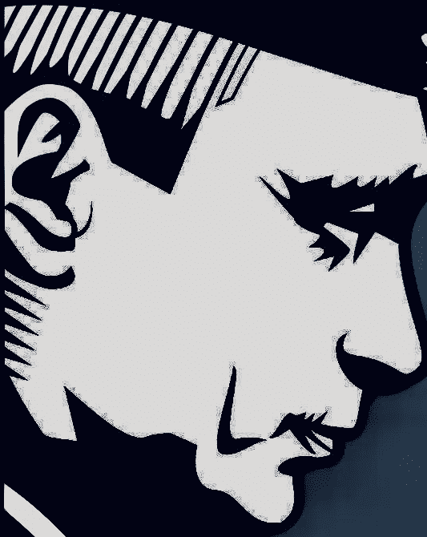

# 俄罗斯的网络中断威胁

> 原文：<https://medium.com/hackernoon/total-autonomy-or-an-april-fools-joke-c9dc5e9df899>

## 像苏联火车头一样全速前进的俄罗斯承诺，到 2020 年，95%的互联网流量将由国内服务器提供。在国外，普京在这一问题上的言论近乎妄想，是保护国家免受外部网络犯罪侵害的根深蒂固的要求——华盛顿已经指责了他的这些违法行为。但是西方真的没有罪恶感吗？

Photo by [George Cerny](https://unsplash.com/photos/3wdav4GAThM?utm_source=unsplash&utm_medium=referral&utm_content=creditCopyText) on [Unsplash](https://unsplash.com/search/photos/russian-script?utm_source=unsplash&utm_medium=referral&utm_content=creditCopyText)

# 愚人节快乐

今年早些时候，RBK Rosbizneskansalting 的消息来源报道称，俄罗斯政府宣布打算在四月前的某个时候断开该国与国内互联网 Runet 的连接。对于外部观察者和那些反对普京在该国的独裁统治的人来说，该法律似乎很严厉，同时要求俄罗斯的 IP(互联网提供商)应该保护 Runet 免受外部网络威胁。

**面对网络犯罪、错误信息和假新闻的持续威胁，俄罗斯愿意与世隔绝，这表明普京和他的克里姆林宫伙伴们相信，俄罗斯迟早会在信息高速公路上成为一个自给自足的实体。**

切断联系被视为一种临时措施，如果成功的话，这将导致一种永久的状态。据报道，该国的私营和国有电信公司都参与了受控关机，卡巴斯基实验室反病毒联合创始人[娜塔莉亚·卡巴斯基](http://www.itp.net/593612-a-day-in-the-life-of-natalya-kaspersky)是该组织的负责人。随着克里姆林宫走廊里的偏执情绪升温——就像白宫和唐宁街一样——俄罗斯的首席议员们担心，西方对莫斯科入侵他们的指控可能会很快导致华盛顿和伦敦采取令人憎恶的网络对策。一些人认为切断网络的举动加速了俄罗斯的孤立。

如果该法案获得通过，电信公司将需要通过克里姆林宫管辖下的路由点改变互联网流量。这一举措将导致信息在国外的传播速度减慢，或者完全停止，这完全是俄罗斯政府的心血来潮。

# 昂贵的实验

许多专家说，这种行动的成本非常昂贵，不切实际，而且很有可能会对该国的互联网运营造成相当大的干扰。

> 这肯定不是俄罗斯企业和普通民众想要看到的。

负责国家审查的联邦执行机构 Roskomnadzor 负责人亚历山大·扎罗夫(Aleksandr Zharov)******】所拥有的权力及其可能的走向，以及如果该法案获得通过，它将如何被使用，这是一个有趣的问题。******

****Roskomnadzor 最近提交了它希望谷歌在该国屏蔽的网站名单。然而，到目前为止，还不知道到底有多少这样的网站被屏蔽了，但是一些被谈论的数字超过了 75%。****

****这些举措的一个不利方面是，它将给克里姆林宫财政带来压力。为了帮助 Roskomnadzor 实施主权互联网立法，将严重依赖国家预算资金。然而，与此相反的是国家审计院，它认为这一行动将导致商店中服务和消费品的不可避免的增长，更不用说需要巨额资金来吸引更多的员工到 Roskomnadzor 执行工作并支付所需的技术。****

> ****再一次，在街上袭击普通人。****

# ****反对的声音****

****尽管有审计院，但也有其他组织发出了不同的声音:总部位于喀山的人权组织 [Agora](https://en.wikipedia.org/wiki/Agora_(organization)) 的创始人兼负责人帕维尔·奇科夫(Pavel Chikov)说:“该法案是对互联网自由的严重威胁。”****

> ****不管对错，奇科夫的话讲了一些道理。但也许这正是俄罗斯需要的，以加强其安全措施，并驱逐西方通过网络手段干涉该国的任何想法。****

****这一举动被认为是对俄罗斯的巨大邻国中国的政策的模仿，也是对俄罗斯的防火长城的模仿，防火长城屏蔽了 YouTube、Twitter 和脸书等主要网站。****

********

****Tsar Putin will stop at nothing to secure his country’s security — and who could blame him. Source: FreeVectors.com****

****随着莫斯科发出所有这些喧嚣，特朗普和他的西方盟友一段时间以来一直将网络攻击的罪责直接归咎于普京，难怪华盛顿正在通过谈论更多制裁来恐吓莫斯科。****

****由于最近发生的一系列事件，克里姆林宫所谓的黑客黑魔法受到了密切关注，世界反兴奋剂机构(World Anti-Doping Agency)丑闻和俄罗斯“所谓的”民主党(Democratic party)电脑网络黑客攻击是美国指责俄罗斯的两个最引人注目的案例。****

# ****审查是双向的****

****然而，它必须是双向的，但例如，输入“美国政府对俄国的黑客攻击”或“英国对克里姆林宫的网络攻击”，在谷歌上得不到任何结果。很难找到关于美国对俄罗斯网络攻击的搜索结果。****

> ****以下是谷歌搜索“美国政府对俄罗斯的黑客攻击”第一页的前五个结果:****

****俄罗斯:我们没有黑美国民主党。但是如果我们做了，我们就可以免于起诉……喉舌是致命武器，就像在外交场合……哦，算了吧:来源:登记处****

*******美国政府指责俄罗斯选举黑客攻击归因:信息战与“俄罗斯最高级官员”有关:来源:*银行信息安全******

*******美国应如何回应俄罗斯涉嫌黑客攻击:来源:*第五域******

*******随着美国公用事业遭到黑客攻击，俄罗斯可能从网络间谍走向网络战争:来源:*对话******

*******与俄罗斯有关的黑客攻击了欧洲和拉丁美洲的政府，被称为 Fancy Bear 或 APT28 的黑客组织干涉了 2016 年总统选举。来源:* Vox******

> ****我想为“英国对克里姆林宫的网络攻击”做同样的事情，但结果是相似的，所以不值得。所以我没有浪费你的时间。****

# ****黑暗艺术****

****因此，华盛顿和伦敦正在对俄罗斯玩类似的“黑暗艺术”，这似乎与谷歌及其对短语、新闻等的审查(或完全排除)相勾结。任何关于俄罗斯或其盟友遭受网络攻击的消息。****

> ****俄罗斯和西方都是有罪的一方。****

****美国国务卿迈克·蓬佩奥最近前往匈牙利首都布达佩斯，试图遏制俄国和中国对欧洲的控制。在与该国总理维克托·欧尔班(Viktor Orban)交谈时——他与克里姆林宫的关系很友好——这位美国政治家想再次警告欧尔班，他的国家在能源方面依赖俄罗斯。这次[会议](https://www.theguardian.com/us-news/2019/feb/11/mike-pompeo-to-meet-viktor-orban-on-tour-of-central-europe)很可能是川普的一个战略，目的是重新在欧洲站稳脚跟，对抗俄国在该地区日益增长的影响力。****

********

****The Cyber Dark Arts, a thing both Russia and the United States can be accused of. Source: Wicked Weed Brewing****

# ****未来安全****

****无论未来发生什么，普京都正确地认为，面对日益增长的网络犯罪现象和搜索引擎及互联网传播的假新闻，此举将保证他的国家的安全。这些措施能否长期奏效，谁也说不准。然而，如果他们这样做了，俄罗斯及其卫星通过网络审查找到了安全，也许其他国家——美国及其许多西方盟友——会效仿。****