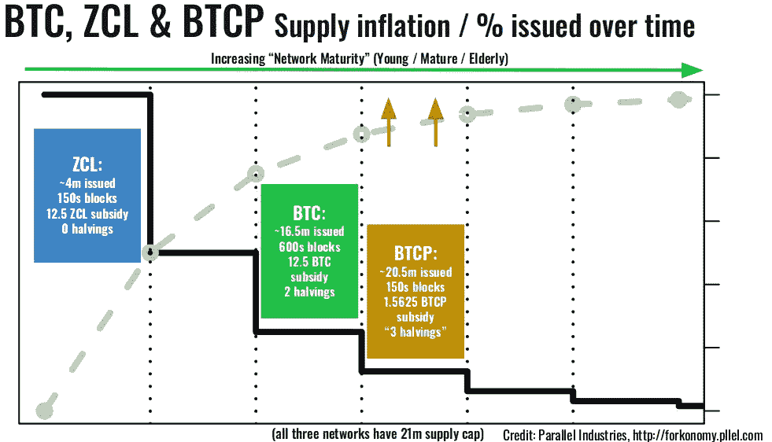
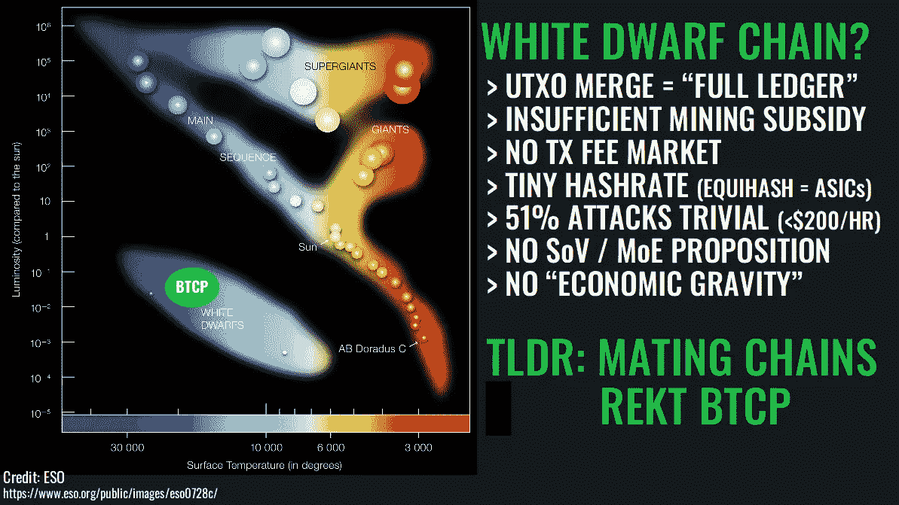
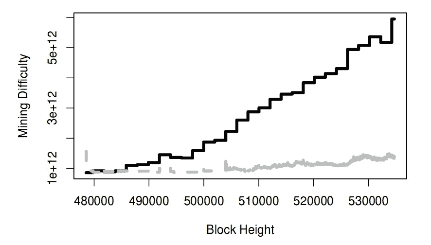
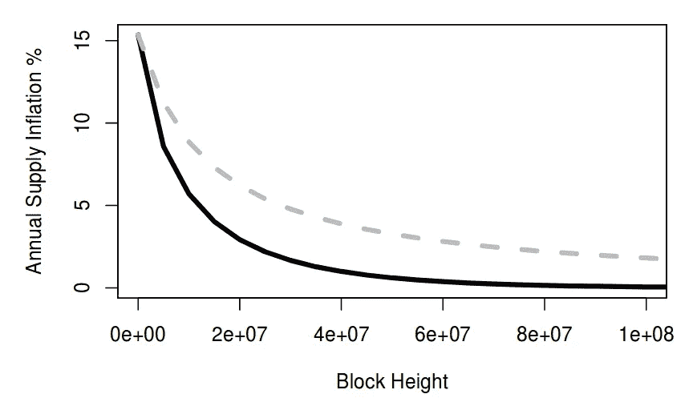

# 走向一门分析学科

> 原文：<https://medium.com/hackernoon/towards-an-analytical-discipline-of-forkonomy-summer-2018-e6da993ee3f9>

【注:本作品于 2018 年夏季在[pllel.com](http://pllel.com)以手稿形式撰写并自行发表，[最后一次修订于 8 月 10 日](http://www.pllel.com/industries/wp-content/uploads/180810-forkonomy-v3.pdf)。数据来自 2018 年 9 月 [ETC 峰会的推文、原稿和演示幻灯片。](https://www.youtube.com/watch?v=d_7f16_29Mc)[刚刚发表了后续评论](https://hackernoon.com/forkonomy-revisited-where-are-they-now-73fbfbec6b4d)。视频和推文形式的 TLDRs，向下滚动查看全文。]

**摘要**注意力被引向第一个 UTXO 合并 *fork-merge* 将 Zclassic 和比特币分类账历史合并到所谓的比特币专用网络中。讨论了对老化的区块链生态系统、突出的少数民族加密货币网络碎片和分歧派别的潜在影响。

**1。引言和文献综述:迄今为止的福克经济学经典**

**1.1 分叉经济、分叉和分叉能力**

关于加密货币， *forkonomy* 可以被认为是对软件代码库和协议网络碎片化的研究，这些软件代码库和协议网络包括以无许可或信任最小化方式运营的分布式社区和/或利益相关方。就像天文学利用观察和理论来理解和预测宇宙学特征和现象一样，下面是一个类似的尝试，将区块链分析和历史先例应用于理解不同货币网络派别分叉趋势的基本和紧急特征。

在开源计算机科学领域中，项目代码库分叉的概念是很好地建立的，并且当独立的开发者群体以不同的路径开发一个现有的软件时出现，创建单独的和不同的软件。Torvalds 从 1991 年开始的原始 Linux 内核已经被分成无数的后代项目[1]。随着 2009 年比特币网络的推出，可证明的数字稀缺性和安全分散的开源价值转移协议的前景成为现实。这是通过系统联网、基于 UTXO(未用交易输出)的会计、弹性数据架构、密码术和热力学元素的新颖组合实现的[2]。随着时间的推移，采用区块链和三重分录会计的无许可分类账系统达到高度的概率交易终结，存在*代码库*和*分类账分叉*【3】的前景。在本文中，区块链被定义为一种时间有序的、线性的、仅附加的数据结构，采用加密技术来实现高保证、防篡改的交易分类账。

加密货币的代码库分支与 Linux 内核分支之间的关系密切对应，创建了一个独立的项目，该项目通常由一个新的 genesis 块启动，该块可能共享共识规则，但其交易历史与其祖先完全不同。这种关系类型的一个例子是比特币(BTC)和莱特币(LTC)之间的关系，这种方法可以被认为是一种静态分叉，因为该过程对时间几乎不敏感。相比之下，分类帐分叉创建了一个独立的不兼容网络，与祖先网络共享其历史，直到发生分叉事件，通常称为*链分裂*。

共识规则的改变或网络交易历史的变更可能是这种断裂的原因，无论是有意的还是无意的。这种情况可以被认为是*动态分叉*，因为该过程是实时发生的。通常，当网络升级软件、共识规则或实现新功能时，一部分网络参与者可能会被留在缺乏开发者、社区、钱包或交换支持的残余时间线上。最近，五分之一运行比特币现金(BCH)的节点——BTC 的阿沙-256 *少数族裔分类账叉*大大放宽了块大小限制——与 BCH 网络分离，并且在几周后撰写本文时，相当数量的潜在节点仍与规范的 BCH 区块链断开连接[4]。

**1.2 叉子是由什么构成的？**

残余网络和可行的分裂派别之间的区别并不清楚，也难以客观地参数化。通过社交媒体平台，敌对战略、政治花招和(真实或合成的)意图和支持的公开信号是一个重要因素。临界质量和利益相关者买入的概念在表面上起作用，因为生态系统的分裂将被描述为*强负和*通过调用关于网络效应和价值主张的梅特卡夫定律【5】。任何由工作证明(PoW)在热力学上保护的区块链都容易受到攻击向量的影响，例如所谓的 *51 %* 或*多数攻击*，导致*重组*(链重组)，因为满足链选择规则的多个候选出现。这可能导致针对交易所等实体的*重复花费*相同资金不止一次的可能性，这些实体不需要足够的确认来确保交易最终在对抗环境中的可靠性。如果一个网络分裂成多个互不相连的群体，控制着不太重要的计算资源的对手将可以使用永久或从 Nicehash 或 Amazon EC3 等来源租用的计算资源来控制多数 hash rate[6]。

一个突出的例子是以太坊开发者和领导干部(ETH)与面向规范账户的以太坊区块链(ETC)的分歧，原因是利用了一个有缺陷的智能合约项目，该项目类似于一个被称为*DAO*(分散自治组织)的准证券化分散投资基金【7】。在这种情况下，以太坊内部人员决定牺牲不变性和延伸审查阻力，以便对 DAO 参与者进行有效的救助，这些参与者开始对整个以太坊网络、内部人员资产持有、代币供应和思想份额产生“大到不能倒”的影响[8]。虽然这两种方法都有缺陷和可玩性，但还是采用了社交媒体咨询流程和在线投票来得出这一结论[9]。在类似于回滚的*不规则状态转换过程*中，矿商、交易所和开发商在私人渠道上展开了协同努力，暴露了组成网络参与者的权力结构中固有的集权程度。

将经典以太坊(DAO 攻击者保存其战利品的地方)从一个残余的*消灭链*转变为一个可行的(如果有争议的话)少数分叉的关键事件是 Bitsquare 和 Poloniex 交易所的决定，将攻击者的时间线与 Chandler Guo 等高调的矿业参与者、gray Invest(数字货币集团的子公司)等资源丰富的金融组织和 Charles Hoskinson 等前开发团队成员一起列为以太坊经典(ETC)，以公开声明和部署支持、开发人员和重要的哈希拉特，以捍卫原始以太坊网络[12]ETC 现在是一个独立的主权网络，其优先事项、特征和目标与 ETH 不同，如第 4 节所述。

**1.3 电力网络中暂态分岔动力学**

在粒度级别，随着新的有效块被挖掘器或验证器发现并被添加到由网络的链选择规则确定的规范链，区块链的高度递增。在 PoW 共识机制中，这种无领导竞争是通过将随机数(顺序循环的任意变量)与建议的块报头相结合来进行的，以生成散列，然后将散列与网络难度进行比较，网络难度与针对网络的计算资源的数量密切相关。如果发现散列低于网络的难度要求，假定在构建候选块的过程中没有违反其他共识规则，则网络通常认为它是有效的。当挖掘器宣布建议的块时，它通常通过八卦协议在网络上传播，由此节点将所有消息广播给连接的对等体。

由于加密散列函数是确定性的(尽管具有不可预测的输出),并且存在满足难度要求的可能散列值的广泛子集，所以竞争的挖掘者可能在非常相似的时间找到一个以上的有效候选块是完全可能的。在这种情况下，开始各种块传播竞争，这种竞争用于允许网络就交易分类帐的最新状态达成共识。由于只能有一个具有特定高度的块，所以如果出现多个候选块，如果验证节点群的子集在最新的块上没有取得压倒性的一致，则出现网络划分的前景。

在孤儿和叔伯的情况下，这种划分可能是短暂的，它们代表被丢弃的时间线，因为规范链建立在另一个候选块上。术语“叔叔”主要用于基于以太坊的网络中，因为部分补贴被分配给孤立块，因此作为安慰奖，用于产生不成为规范链的一部分的有效块。以太坊目前每天资助叔叔们大约 3000 ETH，在撰写本文时相当于超过 100 万美元[11]。增加的孤儿率也可能指示网络上的恶意行为，例如 51 %攻击、自私挖掘或在接受输入对等连接的可到达节点上的分布式拒绝服务向量。

由于对等(P2P)加密货币网络等部分同步分布式系统的消息传播特性，协议设定的中值块间时间(更通常称为块时间)与孤儿和叔叔的发生率之间存在反比关系，BTC/BCH 为 600 秒，ETH/ETC 为 15 秒。随着区块时间的缩短，孤立区块的可能性增加，通过矿工聚集在一起形成所谓的采矿池，可能会产生一些缓解效应。如果块容量的利用率也增加，也可以预期增加孤儿率的类似效果，因为大量的信息必须在网络节点周围传播。自 2017 年 10 月以来，由于采矿补贴减少、网络拥塞和区块大小增加，ETH 叔叔的费率一直在增加，而 ETC 的费率保持更加一致，这至少部分是由于规范以太坊链上的交易量较低[12]。

可能有一个植根于自然科学的基本基础，提供了对区块链日益增长的分化趋势的洞察。这些现象可能是熵偏差的结果，也就是说，根据牛顿物理学，发散路径是阻力最小的路径。热力学第二定律指出，经历不可逆过程的封闭系统的总熵(不能做有用功的能量)永远不会减少。换句话说，能做的就是阻止秩序陷入混乱，继续努力，不让可用的能量减少。在网络分叉的环境中，可以将 PoW 加密货币网络构建为封闭的热力学系统，该系统具有增长的区块链(不可逆过程),挖掘参与者的密码散列作为进入系统的工作。更进一步，尽管系统中正在进行的工作，链分裂将满足热力学第二定律，因为它与系统中增加的无序有关。因此，加密货币网络的*能量动力学*可能为网络中分类账分叉的不测事件提供了一个合理的基础，这种不测事件不会对它们造成强烈的惩罚或阻止。

另一个广泛遇到的分类账分叉问题是*重放攻击*。在两个最近划分的网络片段共享相同或非常相似的代码库和交易历史的情况下，除非采取特定的措施，否则存在非常真实的可能性，即想要发送加密货币的网络用户可能会无意中在两个网络片段上发送交易，从而使交易意外重放。重放保护可以通过小的代码库改变来实现，该代码库改变允许网络区分来自一个特定片段的事务。一个相关的问题是，在基础层出现分叉和链状分裂时，缺乏优先权，这可能会随着协议的发展而增加，这些协议有助于在区块链上发行非本地资产、代币和链外支付渠道。随着链外协议在复杂性、功能性和互操作性方面的激增和增长，这个问题很可能会变得更加复杂。

自私挖掘——也称为阻塞抑制——是一种假设的攻击媒介，在阻塞时间相对较长的 PoW 网络上，挖掘寡头最有效地利用这种媒介。它可以由发现有效块的矿工来进行，但是该块被扣留并保密，而不是立即广播给对等体。然后，矿工开始在前一个秘密块的顶部搜索有效块，目的是在另一个参与者找到另一个有效的第一块之前找到有效的第二块。有人声称，对于资源充足的对手来说，这种策略比诚实开采更有利，2013 年的研究发现，当敌对实体控制网络所拥有的总计算资源的四分之一时，比特币很容易受到拦截攻击。[13]自然，这是一个比 51 %攻击所需的多数哈希码低得多的界限。然而，这种攻击向量的功效最近受到了争议，发现该策略仅在难度调整后的一段时间内表现良好。考虑到这一点，可以对比特币协议进行相当小的修改(尽管需要升级共识)，以降低这种攻击的可能性[14]。

自私挖掘与分叉潜在相关，因为在自私挖掘参与者存在的情况下，链分裂可能更有可能。自私开采的一个可能启发是发布空区块(以获取传播时间的效率),比特大陆控制的开采池 Antpool 定期长时间开采这些区块，尽管存在网络拥塞和前述交易费用，这表明潜在收益大于诚实的采矿者的区块回报和交易费用[15]。有证据表明，2018 年 5 月，日本加密货币网络 Monacoin 可能发生了自私的采矿攻击，一连串的区块仅包含区块高度 1329837 和 1329846 之间的 coinbase(采矿补贴)交易。然而，要明确区分 51 %和自私的挖掘攻击媒介是罪魁祸首并不容易。由于 Monacoin 的难度调整发生在每个区块，自私采矿的机会有点有限，攻击者的战利品在攻击时相当于不到 100000 美元[16]。顽固采矿建立在这种方法之上，以促进诚实和自私采矿极端之间更广泛的混合策略[17]。Zhang 等人提出了一种针对链选择规则集的自私挖掘抑制和分叉解决策略改进，他们探索了审查攻击向量，如 Miller 在 2013 年[19]最初假设的通过羽毛分叉建立黑名单[18]。

羽毛状分叉可以理解为采矿参与者(更可能是联营体而不是单个实体)可采用的一种策略，以拒绝在近期历史中包含不利交易的时间表顶部构建区块。通过这样做，羽毛分叉参与者还可以激励其他采矿参与者也在短时间内加入羽毛分叉。然而，如果大部分计算资源保持真实，则该向量是无效的。张和合著者提出了一个名为“发布或灭亡”的比特币缓解升级，该升级将稍微修改链选择规则，以包括当前正在处理的块中孤立块的所有哈希。然而，提议的初始框架中严格的同步性假设与典型加密货币网络的特征不匹配，并且没有针对链分裂或故意分叉做出规定[20]。

**1.4 分叉和网络治理**

出于一系列原因，在信任最小化的加密货币网络(如 BTC)中，对硬分叉(不可逆的协议升级或放松现有的共识规则集)的抵制往往很强烈。如果正交利益相关者激励的微妙平衡在潜在分歧事件面前失败，缺乏控制实体可能导致链分裂和网络分割。BTC 网络实施的隔离证人(SegWit)最终在 2017 年作为向后兼容的软分叉实现，此前 BTC 网络的组成利益攸关方进行了数年的密集政治和战略操纵。这种需要事实上的绝对多数或由 miner 信令测量的全体一致的紧急共识的链外治理流程已被证明是管理 BTC 网络的低效和可博弈的机制[21]。某些利益相关者群体，如维护 BTC 参考比特币核心软件客户端实现的开发人员，无法轻易与矿业寡头和所谓的大块倡导者就 BTC 网络的最佳技术轨迹达成一致。

该解决方案通过重组块内容，主要是通过添加第二个 Merkle 树，包括见证(签名)数据，但不包括 coinbase 事务，结合了对事务可扩展性和网络容量增加的修复。这最初被认为是一个硬分支，由于创造性的工程，只发现可作为一个选择加入的软分支来实现。尽管如此，矿业选区的主要利益相关者强烈反对 SegWit，因为它会使以前秘密的专有效率优势(称为隐蔽的 ASICBoost)在规范的 BTC 链上无效[22]。一个基层 BTC 社区运动为 SegWit 的实施发起了一个所谓的用户激活软分叉(UASF)，采矿场运营商 James Hilliard 提出了一个保全面子的比特币改进提案(BIP91)，这两个提案共同促成了 SegWit 升级在 2017 年夏天的最终锁定[23]。

2017 年 8 月发生了一个新的有争议的网络分区，因为 SegWit 锁定了稍后的激活，导致比特币现金(BCH)网络拒绝了 SegWit，而是选择了线性链上扩展。这是以块大小增加的形式实现的，这具有将网络资源负担外部化到节点运营商的效果，主要是以增加带宽和存储性能要求的形式。BCH 仍然被视为 BTC 的敌对分类账叉，因为其高调人物的选民声称，他们的网络更接近于比特币协议的初始白皮书规范[24]，因此有资格成为“真正的比特币”。相比之下，PoW——也被称为中本聪共识——选择规范的 BTC·区块链作为累计难度最大的链，满足最初的 Satoshi 客户端代码库和比特币白皮书中列出的共识规则。在没有得到 BTC 网络所有支持者压倒性同意的情况下，通过改变区块大小和放松共识规则集，很难找到 BCH 支持者声称自己是典型的比特币区块链的依据，而不诉诸情感、权威或其他逻辑谬误。克雷格·s·赖特(Craig S. Wright)的持续存在和他对比特币鼻祖的宣称是这些合法性尝试的一个例子[25]，尽管这些主张似乎正在大幅减弱。

**1.5 采用利害关系证明的分支和网络**

中本聪共识的替代方案，如利益证明(PoS)和拜占庭容错(BFT)的各种方法，是分布式系统研究和开发中积极探索的主题。在前面利用蛮力保护网络的过程中，PoS 共识协议必须通过替代手段满足持久性和活性的特性。持久性与交易历史的不变性有关，而活跃度与网络同步性有关，因为有效的交易将被可靠地包括在分类帐中。

阿尔格兰德承诺通过一种新颖的区块铸造过程来抵抗分叉，该过程采用了一种加速的 BFT 机制，不断变化的委员会被赋予区块提案特权。该协议尚未在无许可环境下实施，由于目前没有对区块创建的验证者补贴的规定，因此对知识产权保护和网络内利益相关者激励体系的担忧持续存在[26]。在像 Ouroboros 这样的纯粹的利害关系证明系统中，没有分配块创建特权的热力学元素，而是基于硬币余额的控制来授予权利。

这导致了对上面讨论的面向功率的网络的一组不同的基于分叉的挑战。无利害关系问题源于在纯 PoS 网络中维护多个时间线时缺乏大量资源成本。在电力网络中，必须投入资源来寻找有效块，因此对于恶意行为者来说，维持多个区块链时间线会有很大的损失。在 PoS 中，这种损失很小或者不存在，因此，如果一个这样的分支失败并且没有被充分地构建，则增殖从链中的不同点分支的多个时间线几乎没有缺点是可行的。如果对手从钱包中获得足够多的“旧股份”，不再控制当前分类账中的余额，但以前控制，那么无风险也增加了重组的可能性。一旦积累了足够多的旧股份，用户就可以开始在替代时间线上构建，以便超越诚实的时间线，因此如果选择规则不提供针对这种方法的保护，则成为规范链。远程攻击使用无利害关系来用不诚实的时间线播种拜占庭网络节点，使得加入网络的节点在确定哪个是规范的区块链时会面临重大挑战。

Stake grinding 是在 Blackcoin、Peercoin 和 NXT 采用的早期 PoS 实施中观察到的一种攻击向量类别，其中块验证器采取措施，通过研磨(或在参数空间中顺序搜索)验证器选择和/或块创建权限的“随机性”，在块创建机制的预期工作上寻找不诚实的优势[27]。Cardano network 提出的基于 PoS 的共识机制家族 Ouroboros 声称已经通过采用复杂的密码元素(如可验证的随机函数和 genesis 证明)解决了这些攻击向量，以促进基于利害关系的终结性、可证明的安全性和动态可用性，使得节点可以在任何时候加入网络并从 Genesis 引导。然而，公共 Cardano 网络的实现还没有发生，所以 Ouroboros 的安全模型还有待于在野外测试[28]。

考虑到对分散网络的弹性和合法性以及相关网络效应损失的实际和感知威胁的巨大负面潜力，基于区块链的协议网络证明分叉阻力的能力为其价值主张提供了巨大优势。Decred 是一个混合 PoW/PoS 货币网络的例子，该网络正在实施一个称为 Politeia [29]的链外提案和治理机制。由于硬币持有人拥有基于股权权重的投票权，他们有能力通过由多数利益相关者就包括硬分叉在内的事项达成共识的机制来保持矿商和开发商选区的诚实。这些教训表面上是从开发团队编写 BTC 客户端的经历中学到的，他们认为比特币核心开发者生态系统没有对其进行客观评估。Decred 的分叉阻力是通过以下事实有效实现的:大多数利益相关者在少数链上没有投票权，它将保持停滞，因为块不会在新贵网络上创建或传播。

最近出现了另一类 fork，由网络发布和/或代码开源之前的派系斗争引起。这些似乎类似于现有区块链网络中有争议的政治派别，尽管在公共领域几乎没有具体的信息。最近，前功能 Tezos 生态系统中出现了几个不同的实体，它们不支持 Dynamic Leger Solutions (DLS)在推出其 mainnet 时做出的决定，特别是最近决定要求对其 2017 年令牌中的“了解你的客户”( KYC)信息进行去匿名化，该令牌去年筹集了相当于数亿美元的捐款。除了表面上的类似于安全的捐赠需要反洗钱(AML)程序来处理 DLS-Tezos 网络上的未来索赔之外，在撰写本文时，存在三种备选的非 KYC 实施方案:TzLibre、nTezos 和 OpenTezos。公众对这些群体知之甚少，但随着执法机构更广泛地采用区块链法医工具，预先功能网络有效地分为白人 KYC 人和黑人非 KYC 人是一种可能重复出现的现象[30]。在撰写本报告时，Tezos 有一个可运作的 betanet，TZLibre 似乎已调整战略，成为 DLS-Tezos 网络内的主要委托赌注者(或 Tezos 的说法是面包师),并为推翻 KYC 执行决定开展活动。

**1.6 分支有利于 ASIC 电阻**

自从 SHA-256 专用集成电路(ASICs)于 2012 年首次为比特币网络开发以来，新贵网络中出现了选择替代哈希算法的趋势，以避免与特定类型的计算资源相关的少数网络相关的问题。一系列现有的和新的算法，例如 Scrypt、CryptoNight、Blake 2b、Ethash 和 Equihash，相对于 SHA-256 具有大大增加的存储器需求，分别被实现到诸如 Litecoin、Monero、Siacoin、Ethereum 和 Zcash 的网络中，假设存储器硬度将阻止这些算法的 ASICs 的开发，因为并行处理的能力将通过系统存储器瓶颈而大大降低。这种算法通常被称为抗 ASIC 的，然而这似乎并没有保持这种情况，因为现在存在用于所有上述散列函数的 ASIC。

回想起来，未能阻止专业硬件开发是不可避免的。随着加密货币网络的估值增加，设备制造商分配大量资本开发专用集成电路的动机超过了下行风险。其他促成因素包括采矿硬件工程的优化、半导体制造的进步以及更成熟的 SHA-256 ASIC 市场的利润压缩，这些因素鼓励硬件制造商多元化。由于采矿硬件业务竞争极其激烈，为新算法开发专用集成电路是在极度保密的情况下进行的，因此参与者不会失去他们的先发优势。事实上，人们普遍认为(如果没有最终证明的话),许多矿业制造商会在宣布他们的设备和出售单位之前秘密开采。作为质量保证过程的一部分，在发货前对电子设备进行光测试是没有争议的，但是，ASIC 制造商或合作伙伴出于合理否认的目的，秘密地、逐步地将 ASIC 部署到网络中，并在几个池中散布 hashrate 以避免检测[31]。此外，有许多实例表明(由贝加尔、Innosilicon 或比特大陆等制造商)会宣布一种新的 ASIC 类型，并暗示有限运行稀缺的印象，以维持设备盈利能力的价值主张。然后会出现所谓的供应倾销，即制造商出售如此多的专用集成电路，以至于购买者获得投资回报的可能性为零。在线秘密专用集成电路的加密货币的网络安全性也是一个问号，因为设备制造商“测试”他们的大批量设备将比使用中央处理单元(CPU)、图形处理单元(GPU)或现场可编程门阵列(FPGA)的现有参与者具有不对称的优势，并可能轻松获得大多数网络哈希码，使 51 %的攻击变得微不足道，对网络价值主张产生严重影响。一些采用抗 ASIC 理念的网络——其目标是最大限度地在采矿层分散化——对怀疑或发现其网络上的 ASIC 作出反应，提出一个分叉(根据情况而定的硬或软),以将哈希算法更改为与原始算法足够不同的备选算法，从而使 ASIC 无效。正如在 forks 不可逆转地改变 PoW 网络上的开采参数的所有情况下一样，如果原始链上保留足够的计算资源，那么它就有希望避免消亡并作为独立网络生存下来。在这种情况下，大量的 ASICs 被生产出来，然后通过散列算法调整而面临变得不兼容的威胁，这些机器将很可能被迫保留在原始链上，或者切换到没有经历这种分叉的较小网络上进行挖掘。已经假定，诸如向量处理器的新的 CPU 体系结构可能出现在当前或未来几代 ASICs 中，这将允许在硬分叉改变散列算法之后保持在它们的预期网络上的更大能力。通过分析为存储硬算法(如 Ethash)开发的专用集成电路的有限效率增益，与之前观察到的 SHA-256 相比，一种比传统专用集成电路具有更大计算灵活性的替代技术配置是一种合理但未经证实的假设[32]。

为了与上述动机形成对比，黛安断言，对于在足够有价值的网络上使用的算法来说，专用集成电路是不可避免的。因此，它们应该被认为是网络成功采用这些特殊散列算法后出现的现象。由于 ASIC 在运营成本(以每瓦特哈希数衡量的能效)和资本支出(ASIC 每美元成本的哈希数)方面实现了比通用硬件更大的效率增益，因此有助于工业采矿设施和它们可以获得的规模经济。因此，分叉改变哈希算法的反应只是暂时缓解了专用硬件的发展，事实上，随着更加通用的硬件的设计，定期调整可能会变得不那么有效。事实上，这种协议变化可能有利于资源充足的硬件制造商，因为他们将更有能力部署资本和资源来生产新的硬件。制定此类协议变更所涉及的决策制定流程也可能受到破坏或次优结果的影响，如第 1.3 节[33]中讨论的 DAO 失败后以太坊的链分裂。

最近有两个网络对 ASICs 的表现采取了不同的方法，它们是 Monero 和 Siacoin。Monero (XMR)是一种专注于隐私的加密货币，拥有健康的社区、活跃的开发人员生态系统和强大的理念，通过促进有利于 GPU 挖掘的 ASIC 抵抗来维护挖掘级别的去中心化。随着 XMR nethash 在 2018 年 1 月和 2 月开始急剧攀升，ASIC 采矿被怀疑是秘密进行的，随后制造商比特大陆和贝加尔宣布 XMR 的 ASIC 即将发货[34]。2018 年 4 月，Monero 进行了一年两次的预定硬分叉，这有助于定期的协议升级，并包括对 CryptoNight 哈希算法的调整，以使 ASICs 无效。大约在硬分叉的时候，XMR 经历了 nethash 的突然 80 %的下降，稳定在大约 40-50%的下降。在 fork 之前，超过 90 %的 hashrate 来源不明/匿名，而 fork 之后，来源不明的 hashrate 比例稳定在 30–40%左右。因此，关于计算资源的分布和出处的透明度水平增加了与池活动允许的推断一样多的粗略试探法。对于在算法变更上达成共识所采用的方法仍存在一些问题，有些人呼吁保持耐心或维持现状。随着 Monero 的 hard fork 的实施，还有一个相当超现实的采矿设备价格极端波动的事件。Baikal 在 ASIC 上宣传“买一送四”的优惠，这将加剧商品 nethash 在 ASIC 友好的 CryptoNight 网络上的倾销。一些被认为是从 Monero 分裂出来的派系宣布支持原来的链条，他们也宣布了自己的立场，但似乎在很大程度上已经变得无关紧要。

Siacoin (SC)是一个通过分散式 P2P 架构提供安全和防审查数据存储的网络。一家名为 Obelisk 的硬件制造商与 Siacoin 的创始人关系密切，正在开发 Blake 2b ASIC，并为 SC1 接受了大量的预购订单。比特大陆似乎已经截获了与该设备相关的信息，并利用其规模经济和权宜之计，通过在方尖碑矿工之前交付 Antminer A3，进一步向方尖碑预购客户提供积极的折扣，抢在他们前面。这可能是通过利用更快但次优的集成电路开发过程，如布局布线，而不是方尖碑所采用的完全定制的布线。外人不知道的是，方尖碑在他们的设备中设计了第二个后备算法，这样对 Siacoin 协议的软分叉调整就足以使比特大陆 ASICs 失效。然而，这并没有得到执行，而是进行了一次无争议的硬分叉，以重新校准困难的调整算法和预计网络散列值大幅增加的阻塞时间【36】。

**2。研究目的和方法**

【does Forkonomy 的目标是什么？

作为一门处于早期发展阶段的假定分析学科，佛经济学目前既是一种视角，也是一套连贯的工具和方法。对分类账分叉进行比较分析的概念并不新鲜，但是这种定量观察和定性推理的高级组合并不常用于描述加密货币中出现的现象。通过采取比现在和最近更广阔的视角，forkonomy 旨在洞察面向区块链的 P2P 货币网络的可能命运。未来的目标是建立足够复杂的模型，以便可以从网络观察和模拟中阐明未来情景概率的公平预测。许多概念都是从作者之前研究过的天文学、宇宙学和物理学中借用的。

**2.2 研究方法和资源**

这项工作依赖于大量的原始和二手数据来源，如文中所引用的。通过使用区块探索者[Blockchair.com](http://Blockchair.com)、 [Blockchain.info](http://Blockchain.info) 、 [Etherscan.io](http://Etherscan.io) 、 [Etherhub.io](http://Etherhub.io) 、 [Bchain.info](http://Bchain.info) 、[Monerohash.com](http://Monerohash.com)和[Bitinfocharts.com](http://Bitinfocharts.com)以 CSV 或 JSON 格式导出数据，实现了对 BTC、BCH、ETH、ETC、XMR、MONA、ZCL 和 BTCP 的区块链分析。这被导入到统计计算套件 RStudio(基于 R 构建)中，用于清洁、处理、分析和可视化。网络范围的观察和推断使用公开可用的资源进行:用于 BTC 和 BCH 的节点计数和实现版本的 [Coin.dance](http://Coin.dance) ，用于 ZCL 和 BTCP 网络散列的 [Crypto51.app](http://Crypto51.app) ，用于 BCH 的延展交易的 [Doublespend.cash](http://Doublespend.cash) ，用于高级网络启发式的 [Coinmetrics.io](http://Coinmetrics.io) ，以及用于网络令牌价格、供应发行和货币政策的[Onchainfx.com](http://Onchainfx.com)。

**3。案例研究:分叉合并的出现**

**3.1 简介**

在 2017 年 Breaking Bitcoin conference 的一次演讲中，Eric Lombrozo 假设了共享相同出处和相似代码库的链收敛的管理过程的理论可能性，这可能被认为是链合并。埃里克·沃尔进一步发展了这个想法，表面上是作为 BTC 和 BCH 在链分裂后重新结合的潜在机制，但在野外并不存在突出的例子。这可能受到熵偏差的影响，也就是说，根据第 1.3 节[37]中讨论的热力学，发散路径是阻力最小的路径。

**3.2 通过 UTXO 跨链合并进行 Fork-Merge**

在上述链合并概念的基础上，*分支合并*的概念在今年早些时候被引入，作为一种机制，通过这种机制，可以从一个名为 Zclassic (ZCL)的 Equihash PoW 网络人工合成一个名为比特币私有(BTCP)的 BTC 分类分支，Zclassic()本身是 Zcash (ZEC)的代码基分支，而 Zcash()最初是从 BTC 代码基[38]派生的。这有点类似于基于 Git 的存储库协议中的“Fork + Merge”操作。由于 BTC 和 ZCL 网络拥有不同的历史，正如其独特的 UTXO 集所证明的那样，并且代码库进一步分化，这不是一个微不足道的过程[39]，并且可能进一步受到熵偏差的阻碍。比特币引入的 UTXO 分类账会计模型是通过跟踪交易的支出或未支出来管理的。未用交易产出有助于硬币持有者的结余，而已用产出则没有。为了维护这样的分类账，每笔交易可能由一个或多个输入(具有非零余额的 UTXOs)和两个或多个输出组成。这是因为 UTXOs 可能没有被部分消费，因此在交易完成后，UTXO 中剩余的任何值必须作为新的“零钱”UTXO 返回，其方式类似于消费纸质法定货币纸币并被返回不同的纸币和硬币。

这种跨链 UTXO 整合背后的量化参数值得进一步研究。随着时间的推移，BTC 和 ZCL 的网络在控制采矿补贴排放方面具有相同的关系。

ZCL 的目标盖帽时间为 150 秒，盖帽奖励为 12.5 ZCL，840000 盖帽奖励减半期(尚未达到)和 2100 万 ZCL 最大供应量。

BTC 有一个 600 秒的目标街区时间，最初奖励为每街区 50 BTC，尽管这已经经历了两次补贴减半，现在的价值为每街区 12.5 BTC——目前大约 BTC 街区高度为 540000，减半期为 210000 街区。图 1 显示了一段时间内 BTC 矿业补贴和货币发行的特征。

因为每减半的时间在两个网络上大致相等，所以减半的数量可以用作网络成熟度的近似试探。迄今为止，ZCL 尚未经历减半，可被视为一个年轻的网络，其特点是高采矿补贴，激励矿工以约 100 %的高有效年供应通胀率为代价确保链，发行了约 2100 万枚 ZCL 硬币中的 450 万枚。BTC 处于第二和第三个减半的中间，因此可以被认为是一个成熟的网络。自网络启动以来，补贴已经下降了 75 %, BTC 共开采了 2100 万个煤矿中的约 17 个，有效年供应通胀率约为 4 %。在区块空间需求上升的时期，交易费市场已经出现，在高峰时期为矿工提供了比区块报酬更高的收入[40]。这种情况对于所有基于区块链的货币网络的长期可行性至关重要，这些货币网络采用电力作为安全保障，并具有固定的渐进供应曲线，因为该网络必须继续激励矿工提供电力[41]。大多数基于 UTXO 的加密货币也采用了 BTC 的货币发行政策，以声称围绕供应限制的类似价值主张。

通过合并这些 UTXO 集合，BTCP 已经综合创建了一个 Equihash 区块链网络，该网络拥有尚未发行的 2100 万枚硬币中的约 50 万枚，可以忽略不计的年度供应通胀，因此在撰写本文时，采矿补贴仅为 1.5625 BTCP，相当于约 0.0035 BTC。然而，与 BTC 不同的是，BTCP 未能建立一个交易费市场，为了适当激励矿商保护网络，交易费必须高于交易价值本身。

BTCP 矿业盈利能力的其他特殊风险来自非自愿硬币持有者可能的供应冲击，如果 BTCP 硬币价格突然上涨，他们更有可能开始清算，以及来自多个硬件供应商的专业 Equihash ASIC 采矿硬件的不断出现，部署了更丰富的商品 hashrate [42]。

Fig. 1\. The relationship between BTC block height, mining subsidy and supply issuance.

**3.3 *分叉经济学*:分叉合并对货币网络的影响**

分叉合并过程实际上在第三和第四个减半之间创造了一个*年老的*BTCP·区块链(如图 2 所示)，对矿工来说没有保护的动力，因此作为权力货币网络的价值主张最小。许多非自愿分配给 BTC UTXO 所有者的 BTCP UTXO 已经无人领取，无疑是由于 1:1 空投对 BTC 方面的低价值或防止私钥泄露风险。在许多方面，BTCP 现在正经历着一个永恒的后分叉后遗症，这是由分叉合并中设计的不平衡激励结构造成的。该活动不对称地使 ZCL 持有者受益，其每枚硬币的价格比 BTC 低得多，但也使持有者有权获得 1:1 的空投。对于那些在分叉合并宣布之前持有 ZCL 余额的人来说，情况尤其如此，因为在分叉合并之前的 30 天内，ZCL 的市场价格以美元计算上涨了近百倍[43]。

由于 ZCL 和 BTCP 在采矿补贴价值和网络年龄(不是上面讨论的“有效成熟度”)方面的差异，ZCL 似乎保留了一个相当有凝聚力的利益相关者群体——矿工、交易所、用户等——尽管许多开发商在分叉时放弃了项目。相比之下，BTCP 似乎已经失去了大多数 fork 前的支持者，并且未能在主要交易所上市以获得流动性，从而提高其作为投机资产的价值定位。BTCP vs ZCL 可能被认为是*叉形诱导排放曲线疲劳*的一个极端案例。也就是说，fork-merge 过程导致加密货币网络同时易受多数攻击，并且无法引导自身进入安全可靠的状态，因为在缺乏链上交易费用市场的情况下，老年网络中可用的块补贴不足以激励计算资源。缺乏针对 BTCP 的此类攻击的证据可能是因为缺乏链上交易量和相关的菲亚特等价价值，这使得即使是低成本的攻击也是一种资源浪费。此外，交易平台似乎预见到了这种攻击的可能性，因为通常需要 25-50 次确认才能认为 BTCP 存款已确认并可在交易所消费。

2018 年，出现了 BTC 分类账分叉的趋势，与带有原始创世块和分类账的代码库分叉相比，其市值大幅膨胀。这至少部分是由于大部分供应的有效隔离，基本上是注意力锁定的，因为 BTC UTXO 所有者既没有经济动机也没有意识形态动机来以访问私钥的潜在费用和不便为代价参与。在 BTCP 和 ZCL 的网络上，可观察到的链上交易量(不包括屏蔽交易，屏蔽交易通常只占使用量的极小一部分)非常少，日均交易量远远低于 100 万美元，而 BTC 的日均交易量约为几十亿美元。就 hashrate 而言，ZCL 的网络 hashrate 大约是 BTCP 的 25 倍，而其名义市值却比少 3 倍[44]。其结果是，BTCP 链非常容易受到 51 %的攻击，这是一个采用租用 hashrate 的普通向量——根据撰写本文时的数据，多数攻击的 1 小时成本约为 200 美元。对于一个名义价值(使用市值作为粗略的试探)约为一亿美元的网络，交易中断的可能性似乎很高，足以排除 BTCP 作为货币网络的任何现实建议。如果多数股权收购在加密货币网络中变得微不足道，交易所将不愿将其上市，因为在不要求对交易最终性进行充分确认的情况下，它们将成为双重支出攻击的主要受害者[45]。

Fig. 2\. Generalised emission curve and supply schema for cryptocurrency networks deriving their accounting and monetary characteristics from Bitcoin. Each “step down” represents a halving of block subsidy, halving in effective supply inflation rate and an advancement in the lifecycle phase of a blockchain network. Emission curve and supply schema for ZCL (blue), BTC (green) and BTCP (orange) networks compared visually.

**4。讨论:老龄化对区块链和突出的少数民族分叉的影响**

BTCP 正在经历的排放曲线疲劳，加上交易费市场的缺乏，导致网络不安全，缺乏价值主张。事实上，这是任何年老的战俘区块链的可能未来之一。通过与恒星生命周期的类比，*白矮星链*的绰号可能适用于 BTCP。与天体残余一样，高成熟度和低经济引力阻止了网络吸引实质性的增长，最终不再拥有起作用的临界质量。有一种前景是，BTCP 将试图过渡到 PoS 或 dPoW，以寻求躲避热力攻击。最近，出现了没收“不活跃”UTXOs 的前景，以便从 BTCP 的注意力锁定持有者那里释放硬币供应，从而提供进一步的矿工补贴，以吸引更大的 hashrate[39]。BTCP 的支持者在 fork 之前的营销中引用了“Satoshi 的愿景”这一不真诚的比喻，尽管很难看出中本聪的赛博朋克原则是如何通过没收他控制下的 UTXOs 的机制得到尊重和兑现的。

对于 BTCP 来说，另一种被称为连锁死亡螺旋的结果也是可能的。如果 Equihash 资源被充分地激励到其他地方，网络可以完全停止发出块。这是 BTC 在 BCH 链分裂时特别关注的问题，尽管具有讽刺意味的是，正是 BCH 生产了严重拖沓的闭塞，闭塞间隔有时达到几个小时。这是由于 BCH 网络继承了 BTC 网络的困难，同时只拥有前 BTC 哈希拉特的一小部分。调用定制的难度调整算法来快速向下调整 BCH 网络难度，以反映少数 SHA-256 BCH 网络片段的低得多的网络散列。在 BTC，除了原始规范的 2016 块窗口之外，缺乏这样的难度调整机制，这被视为来自敌对分类账分叉的潜在攻击媒介[46]。

从 BTCP 案例研究中得出的启示的重要性是由于缺乏现存的有机老年区块链网络。在这些分布式环境中观察到的紧急行为可能不同于利用密码经济学、分布式系统或博弈论观点的假设研究。部分由于 BCH 难度调整过程和执行类似功能的后续算法，BTC 和 BCH 已经偏离了大约 7000 个区块链长度(图 3)，这相当于自链分裂以来 BCH 的有效年龄增加了大约 50 天。其结果是，在其他条件不变的情况下，BCH 区块链将比 BTC 更早达到下一个整体补贴减半的目标。再加上 BCH 与 BTC 共享 SHA-256 采矿算法，但现在的哈希拉特少了约十分之一(图 4)，采矿者保护少数 BCH 网络的经济动力不断下降。由于 BCH 拒绝 SegWit，目前没有针对交易可扩展性实施的修复，也没有准备好部署的替代方案，51 %的攻击对于几个 BTC 矿池来说已经变得微不足道，重复支出交易的频率越来越高，这使得任何货币稳健性或支付效用主张的概念都成为严重问题[48]。

Fig. 3\. Chain dynamics of BTC (blue) and BCH (red) networks August 2017–18, as visualised through the benchmarking of “chain time” versus Earth time. Data from Blockchair.com.

Forkonomy assessment of BTCP (Aug/Sep 2018)

通过观察过去竞争 ASIC 散列的网络，例如 Litecoin 和 Dogecoin，已经观察到，一旦与主要竞争者共享挖掘算法的 PoW 网络的安全性被认为受到损害，可以利用两个主要类别的补救措施。为了保持去中心化和网络主权，采用替代的和独特的 PoW 算法是一种选择，但是对于像 BCH 这样的面向 ASIC 的网络来说，这是令人不快的。一种替代方案是实施合并挖掘，从而特定算法的主导网络上的 PoW 计入合并挖掘网络上的 PoW[49]，或者定期检查点公证-也称为延迟 PoW -将最新块散列到最安全的区块链中，如少数等散列网络 Komodo [50]所利用的。如上所述，United Bitcoin 和 Bitcoin Private 等少数分支机构也提出了没收“不活跃”UTXOs 或账户余额的建议。

规范以太坊网络等可能会有一个不同于典型少数分支的未来，因为分叉之间的发展路径已经出现分歧，ETH 打算尝试过渡到采用 Casper 共识协议家族的 PoS[51]，同时将块发布补贴大幅减少到每个块 0.6 ETH[52]。如果多个相互竞争的 Ethash ASICs 和高性能 FPGA 位流分布得更广，ETC 可能会保持强大的价值主张，成为规范、分散和不变的以太网，具有健全的货币政策和热力学上有保证的网络安全。如图 5 所示，ETH 的年等效供应通胀率约为 7.5 %，且没有象征性供应的最高限额，而 ETC 的通胀率约为 5.75%，由于供应限额固定，预计下降速度会更快。ETC 还取消了所谓的“难度炸弹”,该炸弹旨在通过使采矿越来越无利可图来抑制采矿。

Fig. 4\. Difficulty (as proxy heuristic for hashrate) comparision of BTC (black) and BCH (grey) networks August 2017–18\. Data from Blockchair.com

Fig. 5\. All-time supply inflation comparison of ETC (black) and ETH (grey). Data from ECIP1017 [53].

**5。分叉的未来前景**

与任何新的研究领域一样，关于开源协议网络内部派系或外部实体(如竞争对手区块链、立法者和硅代工厂)如何影响加密货币网络的分叉趋势，仍然存在许多开放式问题。Sztorc 的分叉期货概念有其优点，因为在实施之前，市场可以实时评估和定价竞争性的愿景。这有助于评估对竞争派别提出的各种选项的支持，通过使用市场评估竞争想法的价值，潜在地防止相当大比例的链分裂。[54].

Kiayias 等人提出的 velvet fork 可以通过增加协议升级的包容性和兼容性，以及对不运行 velvet fork 升级的网络参与者的最小侵入性，来帮助减轻潜在的网络一致性故障[28]。在分散式挖掘池 P2Pool 的 sharechain 中发现了一个成功实现 velvet fork 的示例，它跟踪与接近但不低于网络难度限制的块哈希相对应的挖掘份额。为了减少挖掘池中个体参与者的奖励差异，股份由股份链跟踪[55]。

正在进行的针对加密货币交易所 Bitgrail 的诉讼涉及试图从法律上强制执行 Nano(以前的 Raiblocks) block-lattice 网络的回滚，以收回因软件漏洞而丢失的令牌。很难想象会有这样一种结果，即作出一项具有充分全球或无边界管辖权的法律声明，来迫使一个网络中的大量成员违背他们的动机行事。这很可能会引发派系网络瓦解事件[56]。

更广泛地假设，随着福克经济学的经典扩展到包括新的和涌现的现象，可能会发展出进一步的美学学科，用这些学科来编纂、分类和表征所有形式的信任最小化网络划分。与天体结果一样，焓和熵的相互作用可以为加密货币网络的命运建模提供一个通用的基础，该领域的进一步工作正在进行中。从这里提出的本体论和观察基础出发，认识论论文可以被认为是“哲学方法”【57】和“哲学方法”*。*

***致谢***

*感谢众多尊敬的同仁的校对、评论和指正。*

***参考文献***

*1.Linux 发行版列表，维基百科。[https://en.wikipedia.org/wiki/List_of_Linux_distributions](https://en.wikipedia.org/wiki/List_of_Linux_distributions)。最后访问时间 2018 年 8 月 10 日。*

*2.中本聪(2008)比特币:点对点电子现金系统。[http://bitcoin.org/bitcoin.pdf.](http://bitcoin.org/bitcoin.pdf.)*

*3.Delgado-Segura，s .，Prez-Sol，c .，Navarro-Arribas，g .，Herrera-Joancomart，J. (2017)对比特币 UTXO 集合的分析。IACR 密码 ePrint 档案，1095 年。[https://eprint.iacr.org/2017/1095.pdf](https://eprint.iacr.org/2017/1095.pdf)*

*4.BCH 节点状态，硬币舞。[https://cash.coin.dance/nodes#nodeVersions.](https://cash.coin.dance/nodes#nodeVersions.)最后访问时间:2018 年 8 月 10 日。*

*5.Metcalfe，B. (2013)以太网 40 年后的 Metcalfe 定律。载于:计算机，第 46 卷，第 12 期，第 26-31 页。【https://doi.org/:10.1109/MC.2013.374\. 号*

*6.Bonneau，J. (2018)恶意区块链收购。比特币 18:第五届比特币和区块链研究研讨会论文集。*

*7.马克博士赞菲尔。v .，和 Sirer，例如(2016)呼吁暂时暂停执行 DAO，[http://hacking distributed . com/2016/05/27/DAO-呼吁暂停执行。](http://hackingdistributed.com/2016/05/27/dao-call-for-moratorium.)*

*8.BitMEX Research (2018)重访道，[https://blog.bitmex.com/revisiting-the-dao.](https://blog.bitmex.com/revisiting-the-dao.)*

*9.Buterin，V. (2017)区块链治理笔记，[https://vitalik.ca/general/2017/12/17/voting.html.](https://vitalik.ca/general/2017/12/17/voting.html.)*

*10.van Wirdum，A. (2016)以太坊经典社区导航到未来的独特路径，[https://bitcoinmagazine . com/articles/ether eum-Classic-Community-Navigates-a-Distinct-Path-to-the-Future-1471620464/](https://bitcoinmagazine.com/articles/ethereum-classic-community-navigates-a-distinct-path-to-the-future-1471620464/)。*

*11.Conner，E. (2018) EIP 1234:君士坦丁堡以太坊街区奖励减免一案，[https://medium . com/@ Eric . conner/A-Case-For-ether eum-Block-Reward-Reduction-in-constantin-EIP-1234-25732431 fc 77](/@eric.conner/a-case-for-ethereum-block-reward-reduction-in-constantinople-eip-1234-25732431fc77)。*

*12.以太坊大叔利率，以太扫描。[https://etherscan.io/chart/uncles.](https://etherscan.io/chart/uncles.)最后访问日期:2018 年 8 月 10 日。*

*13.Eyal，I .和 Sirer，E. G. (2014)多数是不够的:比特币挖掘是脆弱的。金融加密和数据安全国际会议，436–454。斯普林格，柏林，海德堡。*

*14.Grunspan，c .和 Perez-Marco，R. (2018)关于自私采矿的盈利能力。IACR 密码 ePrint 档案，1805 年。*

*15.比特币空积木木块椅。[https://blockchair.com/bitcoin/blocks?s =尺寸(asc)。](https://blockchair.com/bitcoin/blocks?s=size(asc).)最后访问时间 2018 年 8 月 10 日。*

*16.Monacoin 街区探索者。[https://bchain.info/MONA/.](https://bchain.info/MONA/.)最后访问时间:2018 年 8 月 10 日。*

*17.Nayak K .，Kumar，s .，Miller，a .，和 Shi，E. (2016)顽固挖掘:一般化自私挖掘并与 Eclipse 攻击相结合。IEEE 欧洲安全与隐私研讨会 305–320。萨尔布吕肯欧元和便士。【https://doi.org/:10.1109/EuroSP.2016.32 号*

*18.张，r .和 Preneel，B. (2017)出版或灭亡:对比特币自私挖掘的向后兼容防御。在 RSA 会议上的密码学家跟踪，277–292。斯普林格，查姆。*

*19.Miller，A. (2013) Feather-forks:强制执行散列值低于 50%的黑名单。https://bitcointalk.org/index.php?topic=312668.0.[最后访问时间:2018 年 8 月 10 日。](https://bitcointalk.org/index.php?topic=312668.0.)*

*20.Hacken (2017)对 Hashpower 的抢购。[https://hacken . io/WP-content/uploads/The-Rush-for-hashpower . pdf](https://hacken.io/wp-content/uploads/The-Rush-for-Hashpower.pdf.)最后访问时间 2018 年 8 月 10 日。*

*21.Sclavounis，O. (2017)理解公共区块链治理，[https://www . oii . ox . AC . uk/blog/Understanding-Public-区块链-governance](https://www.oii.ox.ac.uk/blog/understanding-public-blockchain-governance)*

*22.BitMEX Research (2018)秘密与公开 AsicBoost，[https://blog . bit MEX . com/graphical-illustration-of-a-a-bit coin-block](https://blog.bitmex.com/graphical-illustration-of-a-bitcoin-block)*

*23.Hilliard，J. (2017) BIP91，[https://github . com/bit coin/bips/blob/master/bip-0091 . mediawiki .](https://github.com/bitcoin/bips/blob/master/bip-0091.mediawiki.)最后访问时间 2018 年 8 月 10 日。*

*24.Ver，R. (2018)为什么我认为比特币现金是比特币，[https://www . yours . org/content/Why-I-Think-bit coin-Cash-is-bit coin-6 CB 2d da 7 ca 08](https://www.yours.org/content/why-i-think-bitcoin-cash-is-bitcoin-6cb2dda7ca08)*

*25.O'Hagan，A. (2016)，Satoshi 事件，[https://www . lrb . co . uk/v 38/n13/Andrew-oh agan/The-Satoshi-Affair](https://www.lrb.co.uk/v38/n13/andrew-ohagan/the-satoshi-affair)*

*26.Castor，A. (2018)无激励，[https://www . coin desk . com/No-Incentive-阿尔格兰德-区块链-斯帕克斯-辩论-密码术-事件](https://www.coindesk.com/no-incentive-algorand-blockchain-sparks-debate-cryptography-event)*

*27.Poelstra，A. (2016)关于替代硬币的论文，[https://download.wpsoftware.net/bitcoin/alts.pdf](https://download.wpsoftware.net/bitcoin/alts.pdf)*

*28.Kiayias，a .，Miller，a .，和 Zindros，D. (2018)工作证明的非交互式证明。https://eprint.iacr.org/2017/963.pdf[IACR 密码学 ePrint 档案馆](https://eprint.iacr.org/2017/963.pdf)*

*29.https://github.com/decred/politeia.[政府网站](https://github.com/decred/politeia.)最近一次访问时间:2018 年 8 月 10 日。*

*30.[水晶区块链分析，https://crystalblockchain.com。](https://crystalblockchain.com.)最后访问时间:2018 年 8 月 10 日。*

*31.n . say RES(2018)比特大陆面临秘密采矿的新指控，[https://hacked . com/bitmain-Faces-New-encounters-of-Secret-Mining/](https://hacked.com/bitmain-faces-new-accusations-of-secret-mining/)。最后访问时间 2018 年 8 月 10 日。*

*32.BitMEX Research (2018)新以太坊矿工可能成为游戏规则改变者，[https://blog.bitmex.com/nextstageinmining.](https://blog.bitmex.com/nextstageinmining.)上次访问 2018 年 8 月 10 日。*

*33.p .黛安(2018)认为有害的抗 ASIC 分叉，[https://pdaian.com/blog/anti-asic-forks-considered-harmful.](https://pdaian.com/blog/anti-asic-forks-considered-harmful.)最近一次访问于 2018 年 8 月 10 日。*

*34.Wilmoth，J. (2018)制造商持有 CryptoNight ASIC Firesale after Monero Hard Forks，[https://www . ccn . com/Manufacturer-Holds-CryptoNight-ASIC-Firesale-after-Monero-Hard-Forks。](https://www.ccn.com/manufacturer-holds-cryptonight-asic-firesale-after-monero-hard-forks.)最后访问时间 2018 年 8 月 10 日。*

*35.来源:Bitinfocharts，[https://bitinfocharts.com/comparison/monero-hashrate.html.](https://bitinfocharts.com/comparison/monero-hashrate.html.)最后访问时间:2018 年 8 月 10 日。*

*36.Vorick，D. (2018)加密货币开采的状况，[https://blog . sia . tech/The-State-of-Cryptocurrency-Mining-538004 a 37 f9b](https://blog.sia.tech/the-state-of-cryptocurrency-mining-538004a37f9b)。最后访问时间 2018 年 8 月 10 日。*

*37.Lombrozo，E. (2017)在打破比特币会议上的演讲，[https://www.youtube.com/watch?v=0WCaoGiAOHE](https://www.youtube.com/watch?v=0WCaoGiAOHE)*

*38.Biryukov，a .和 Khovratovich，D. (2016) Equihash:基于广义生日问题的非对称工作证明。[https://eprint.iacr.org/2015/946](https://eprint.iacr.org/2015/946)*

*39.比特币私人白皮书，https://btcprivate.org/whitepaper.pdf.[最后访问 2018 年 8 月 10 日。](https://btcprivate.org/whitepaper.pdf.)*

*40.比特币 Block 500439，来源:https://blockchair.com/bitcoin/block/500439.[Block chair Explorer](https://blockchair.com/bitcoin/block/500439.)最后访问时间 2018 年 8 月 10 日。*

*41.Ammous，S. (2018)比特币标准:中央银行的分散化替代方案。约翰·威利父子公司。*

*42.再来说说 ASIC 矿业，Zcash 论坛，[https://forum.z.cash/t/let-s-talk-about-asic-mining/27353.](https://forum.z.cash/t/let-s-talk-about-asic-mining/27353.)最后访问 2018 年 8 月 10 日。*

*43.来源:OnChainFX，[https://onchainfx.com/asset/zclassic.](https://onchainfx.com/asset/zclassic.)最后访问时间:2018 年 8 月 10 日。*

*44.资料来源:MiningSpeed Pool Monitor，[https://pool.miningspeed.com。](https://pool.miningspeed.com.)最后访问日期:2018 年 8 月 10 日。*

*45.来源:PoW 51%攻击成本，[https://www . crypto 51 . app .](https://www.crypto51.app.)最后访问 2018 年 8 月 10 日。*

*46.Wong，J. I .，比特币现金可能导致比特币“死亡螺旋”，Quartz，[https://qz . com/1127817/bit coin-cash-BCH-price-could-lead-to-bit coin-death-spiral](https://qz.com/1127817/bitcoin-cash-bch-price-could-lead-to-bitcoin-death-spiral)*

*47.来源:http://www.blockchair.com 木椅。最后访问时间 2018 年 8 月 10 日。*

*48.来源:BCH Doublespend Monitor，[http://double spend . cash .](http://doublespend.cash.)最后访问时间:2018 年 8 月 10 日。*

*49.Judmayer，a .、Zamyatin，a .、Stifter，n .、Voyiatzis，A. G .和 Weippl，E. (2017)合并采矿:诅咒还是治愈？在数据隐私管理、加密货币和区块链技术中，316–333。斯普林格，查姆。*

*50.延迟工作证明白皮书，[https://github . com/SuperNETorg/komodo/wiki/延迟工作证明(dPoW)-白皮书](https://github.com/SuperNETorg/komodo/wiki/Delayed-Proof-of-Work-(dPoW)-Whitepaper)*

*51.卡斯帕以太坊 Github，[https://github.com/ethereum/casper.](https://github.com/ethereum/casper.)最近一次访问是在 2018 年 8 月 10 日。*

*52.格里菲斯，v .和布特林，V. (2017)卡斯珀友好的终结小工具，【https://arxiv.org/pdf/1710.09437.pdf *

*53.马祖尔，M. (2016) ECP1017，[https://github.com/ethereumproject/ECIPs/pull/20/files.](https://github.com/ethereumproject/ECIPs/pull/20/files.)最后一次访问于 2018 年 8 月 10 日。*

*54.Sztorc，P. (2017) Fork 期货(通过交易所)，[http://www.truthcoin.info/blog/fork-futures/](http://www.truthcoin.info/blog/fork-futures/)*

*55.Zamyatin，A .，Stifter，n .，Judmayer，A .，Schindler，p .，Weippl E .，Knottenbelt W .(短纸)一个野丝绒叉出现了！包容性区块链协议在实践中的变化。比特币 18:第五届比特币和区块链研究研讨会论文集。*

*56.Gordon，S. (2018)加密货币集体诉讼的 Nano 团队目标，[https://bitcoinmagazine . com/articles/Nano-Team-Target-Cryptocurrency-Class-Action-circuit/](https://bitcoinmagazine.com/articles/nano-team-target-cryptocurrency-class-action-lawsuit/)*

*57.安托诺普洛斯，A. M. (2017 年)《叉子学:对叉子的研究》，[https://www.youtube.com/watch?v=rpeceXY1QBM.](https://www.youtube.com/watch?v=rpeceXY1QBM.)*

# *感谢阅读。在你走之前！*

> *如果你觉得这篇文章有趣，请👏并在你能分享的地方分享。记住，你最多可以鼓掌 50 次——这对可见度和温暖模糊的感觉真的有很大的影响。欢迎大家来 www.pllel.com[和推特](http://www.pllel.com)上闲逛。*