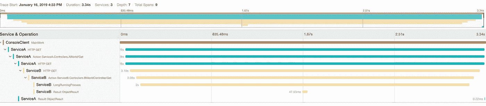
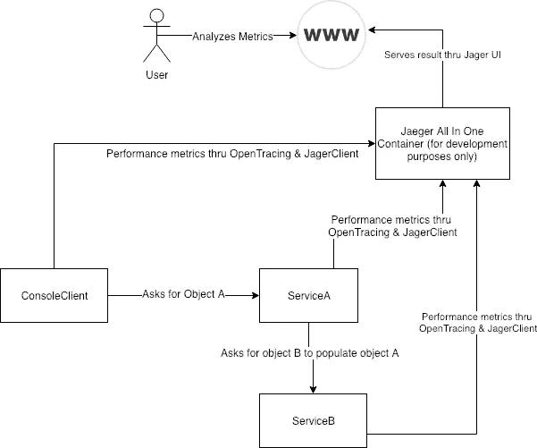

# 使用 OpenTracing & Jaeger 像老板一样跟踪您的请求

> 原文：<https://medium.com/hackernoon/trace-your-requests-like-a-boss-with-opentracing-jaeger-cc8a07a0edc0>


credits: jaegertracing.io

假设您的服务每秒钟收到数千个请求，您进行大量日志记录，并且不会错过日志记录系统中的任何异常。突然，运营团队向您发送了一条消息，指出 id 为`X`的客户在生产过程中出现了一个错误，而您无法理解为什么您周围的所有人都过度紧张……然后事情就发生了变化。客户`X`其实是老板的朋友！(*真实故事)*

好吧…让我们看看你能做什么:

你在你的日志系统上搜索了`X`,然后一直等待，因为有数 TB 的日志。然后你用一个更详细的查询比如`userId=X not in this and that but in this at time t`再试了一次，得到的结果……哦，又是一个问题！`Error: wrong query syntax.`你的队友说你需要把`not in this`换成`in not this.`，你也修好了，等了大约 10 秒，屏幕上出现了 24 个结果！现在您已经准备好分析它们了。

… 10 分钟后…

你发现`ServiceA`调用了服务`ServiceB`，而`ServiceB`中的方法`LongRunningProcess`用了 3 秒，服务`A`返回 500。

毕竟，你很高兴在大约 20 分钟内找到 bug。

让我们假设你使用*开放式追踪*和*耶格*来回放这个过程。

*   您在浏览器上访问了 Jaeger UI
*   您将`userId=X`写入标签并设置日期
*   您点击了搜索，结果如下:



Example request that Jaeger traced

几秒钟后，你会明白`LongRunningProcess`实际上用了 3 秒钟，结果是`ServiceA`返回了`500.`

开放追踪是分布式追踪的开放标准，Jaeger 是实现该标准的工具。请提前查看官方文档中的 Jaeger 架构。

今天，我们将使用为我们的演示环境创建 2 个 API 和 1 个控制台客户端。网芯。我还将使用我自己编写的简单包装器，因为在我看来它带来了简单性。



开始吧！

## 克隆存储库并准备您的环境

如果您的工作空间中已经安装了`.net core`和`docker`，您就可以开始了。

获取`Jaeger`的 docker 图像并运行它:

```
docker run -d --name jaeger \
  -e COLLECTOR_ZIPKIN_HTTP_PORT=9411 \
  -p 5775:5775/udp \
  -p 6831:6831/udp \
  -p 6832:6832/udp \
  -p 5778:5778 \
  -p 16686:16686 \
  -p 14268:14268 \
  -p 9411:9411 \
  jaegertracing/all-in-one:1.6
```

克隆我为这篇文章准备的回购:[https://github.com/skynyrd/opentracing-with-jaeger](https://github.com/skynyrd/opentracing-with-jaeger)

我们有一个。net 核心解决方案包含 4 个项目:`ConsoleClient`、`ServiceA`、`ServiceB`和`JaegerWrapper.`，我们将逐一介绍。让我们从`JaegerWrapper`开始了解耶格客户端的动态。

## JaegerWrapper:为了句法糖——因为为什么不呢？

为了使用 Jaeger 客户端，我们首先需要了解跟踪在我们的代码中是如何工作的。

> 一个**轨迹**是通过系统的数据/执行路径，并且可以被认为是一个[跨度](https://www.jaegertracing.io/docs/1.8/architecture#span)的有向非循环图。
> 
> 一个 **span** 表示 Jaeger 中的一个逻辑工作单元，它有一个操作名、操作的开始时间和持续时间。跨度可以被嵌套和排序以模拟因果关系。
> 
> Jaeger 官方文件。

在应用程序中，我们需要一个跟踪器来管理我们的跨度。为了简单起见，我强烈建议在微服务中使用一个跟踪器。创建`Tracer`并注册后，jaeger 客户端库默认开始分析系统中的控制器，甚至我们不需要为此创建一个单独的`Trace`和`Span`，都是由`OpenTracing.Contrib.NetCore`库创建的。然而，如果我们想要分析一个特定的方法，或者添加一些额外的标签/日志到我们的范围，我们需要创建一个`Trace`并绑定一个`Span`到它。

*重要提示:如果您在系统中有另一个活动 span 时创建并激活了一个 span，它将成为子 span。你可以在上图中看到。父跨度可扩展。*

我为此写了一个简单的构建器，`JaegerWrapper`是一个包含它的类库，如果你喜欢，你可以使用/复制。

```
_traceBuilder
  .WithSpanName("LongRunningProcess")
  .WithTag(new StringTag("exampleTag"), "exampleValue")
  .TraceIt(() =>
  {
    Thread.Sleep(3000);
  });
```

举个例子，这个代码块用于上图中黄色横条表示的`LongRunningProcess`跨度。我们给它添加了`exampleTag: exampleValue`，我们甚至可以使用`WithLog`方法添加更复杂的结构。`TraceIt`消耗的时间在 GUI 中以跨度持续时间的形式发布。在这个例子中，我使用了一个简单的`Thread.Sleep(3000)`，但是你也可以返回一些东西(`Func`而不是`Action`)，例如:

```
var result = _traceBuilder
              ...
              .TraceIt(() => 
              {
                 return "something"
              }
```

## 通过 API 传递

如果你打算 HTTP 调用一个服务，并且你想保留你的 span 生命期，你需要以某种方式通知其他服务。

在大多数情况下，您希望使用`OpenTracing.Contrib.NetCore`包来自动化配置，但是如果您很好奇，下面是其背后的逻辑:

Jaeger 用 HTTP 头来解决这个问题，HTTP 头将附加到请求中。您还可以使用`JaegerWrapper`进行更多的抽象:

Still using the OpenTracing.Contrib.NetCore is the clearest option for the APIs.

## WebAPIs 的配置

对于`ServiceA`和`ServiceB`，我们需要为 Jaeger 注册服务:

```
// In ConfigureServices method of Startup class:GlobalTracer.Register(Tracer);
services.AddOpenTracing();
```

如果您还想使用包装器，您可以简单地添加这些:

```
**var** serviceProvider = services.BuildServiceProvider();services.AddScoped<ITraceBuilder>(t => 
    **new** TraceBuilder(serviceProvider.GetService<ITracer>()));
```

## 示例呼叫

看看`ServiceA`的`AWorldController`，我们在那里调用`ServiceB`但是没有使用任何 JaegerClient 或者 JaegerWrapper 方法。这是因为我们添加了`OpenTracing.Contrib.NetCore`库，它神奇地在黑盒中跟踪我们的请求。

```
**private static async** Task<**dynamic**> GetBObject(**string** id)
**{
    var** httpClient = **new** HttpClient
    {
        BaseAddress = **new** Uri("http://localhost:7334")
    };

    **var** result = **await** httpClient.GetAsync($"/bworld/id/{id}");

    **if** (result.IsSuccessStatusCode)
    {
        **return await** result.Content.ReadAsAsync<**dynamic**>();
    }

    **throw new** Exception("uncovered area.");
**}**
```

并检查 ConsoleClient 的主要方法。这一次，由于这不是一个 WebAPI，我们使用 JaegerWrapper 手动跟踪我们的调用。

```
traceBuilder.WithSpanName("MainWork")
    .WithHttpCall(client, url, HttpMethod.Get)
    .TraceIt(() =>
    {
        **var** response = client.GetAsync(url).Result;

        **if** (!response.IsSuccessStatusCode)
            **throw new** Exception("uncovered area for the demo.");

        **var** responseBody = response.Content.ReadAsStringAsync().Result;
        Console.WriteLine(responseBody);
    });
```

几年前我在制作中使用了`Zipkin`而不是`Jaeger`，因此我不想写任何关于性能的东西。但是我可以说齐普金表现得很好。如果你有 Jaeger 的制作经验，请在下面评论，我很好奇！

感谢阅读。