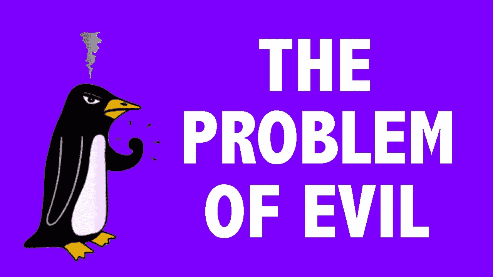
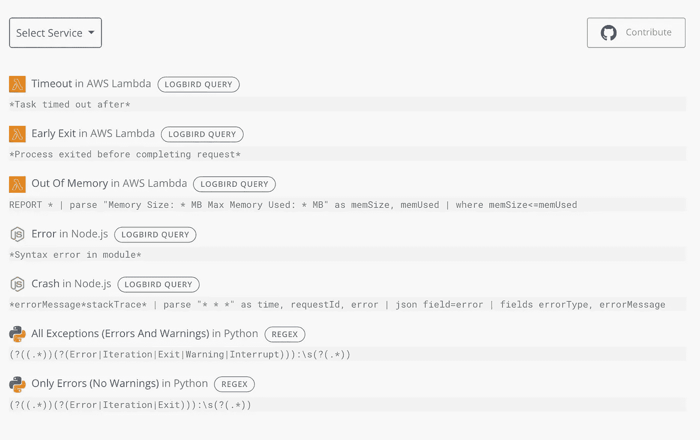
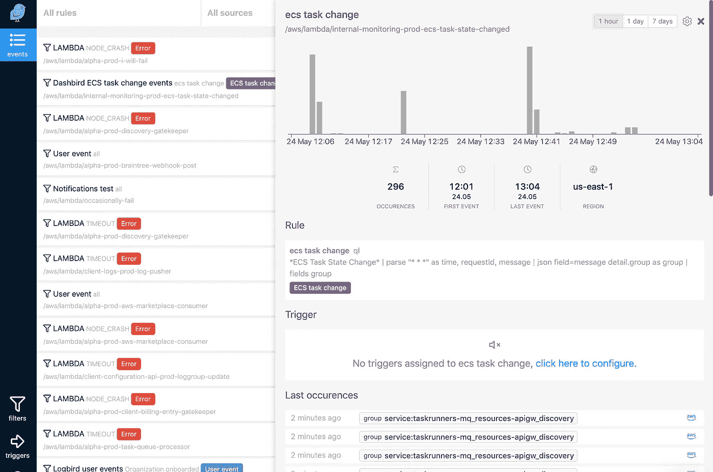

# 跟踪云应用中的活动

> 原文：<https://medium.com/hackernoon/tracking-activity-in-cloud-applications-4f1eb5ff2cbb>

## 读到这里，你可能已经在云上建立了一些东西，并且知道现代的云应用可能是相当分布式和复杂的。

读到这里，你可能已经在云上建立了一些东西，并且知道现代的云应用可能是相当分布式和复杂的。

对于许多开发人员来说，构建分布式云应用程序引入了一个有趣的问题。

## 跨您的(托管)云应用程序跟踪事件。

例如，您如何知道您的任何一个服务(ECS、Lambda、Auth0)中发生了错误或其他事件？如果你还没有找到一个好的答案，不要担心。你并不孤单。很多开发人员似乎都在为此而挣扎。

但我想我们已经想通了。

# 问题是

我怎么知道这是个问题？嗯，我们运行了一项服务，它可以跟踪成千上万开发者使用的 4k AWS 账户中的 25 万个 Lambda 函数。

我们是当今最广泛采用的无服务器监控产品。

我们已经和很多开发商谈过了。

## 人们带着以下问题来找我们:

*   我可以跟踪 Lambda/API Gateway/app sync/其他错误吗？
*   我如何跟踪对我的代码执行不致命的事件(比如当一个
    DynamoDB 调用因 ThroughputExceeded 错误而失败，但执行继续进行时)？
*   像签约、付款、搅拌这样的定制商务活动怎么样？也需要一种好的方法来跟踪它们。

几个月前，我们决定适可而止——让我们为社区一劳永逸地解决这个问题。

那我们做了什么？

# **我们建造了世界上第一个日志网关！**

它被称为 [Logbird](https://logbird.io) ，本质上，它从日志中解析事件并将其转发。

它可以识别从 AWS Lambda 错误、API 网关错误配置、缓慢的 API 或数据库调用到代码异常的一切。Fargate、ECS、Appsync、RDS、CloudTrail、ELB……不胜枚举。

踢球者？**它不保留日志**——这意味着…它将比现有的任何日志分析服务便宜得多，可扩展性也更好。

> 简而言之，日志分析永远不会针对大规模托管应用进行经济高效的定价。

**但是 Logbird 可以。**

因为它解析日志流并捕获事件**并丢弃其余的。**

另一个踢球者？您可以通过发送 SNS 通知以及从中提取的数据来对单个事件做出反应。这使得除了错误跟踪之外还有很多很酷的东西。

# 可能性是无限的。

您不仅可以跟踪应用程序中的故障和问题。您可以自动化工作流程。您可以构建备选的执行流，或者通过日志在应用程序之间进行通信。

> 在事件驱动、混合、分布式应用程序的世界中，日志可以作为一种替代的通信渠道。

让那件事过去一会儿。

# 图书馆

Logbird 有自己的查询语言，但它也支持正则表达式和 glob 模式来匹配事件。所有这些都使得开发人员可以轻松创建自己的过滤器。

## 然而，这还不够。

我们向前迈进了一步，推出了一个社区驱动的[过滤器库](https://logbird.io/docs/rules/rule-library/)，允许您为无服务器社区做贡献。这会让你在几分钟内就能开始工作，而不是几个小时。

# 今天上市

Logbird 已经过测试，并且已经被几十个构建无服务器应用程序的团队使用。今天，我们为你打开它。[欢迎你来试试看！这是测试版，我们不收费。](https://logbird.io)

现在让我们回到构建出色的应用程序上来！