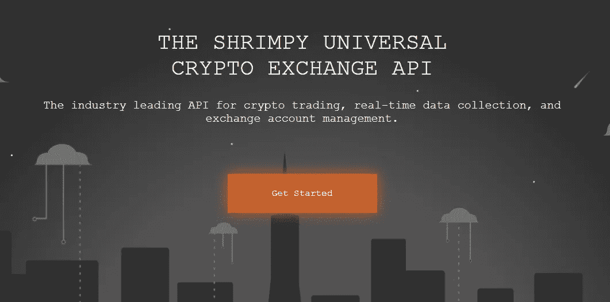
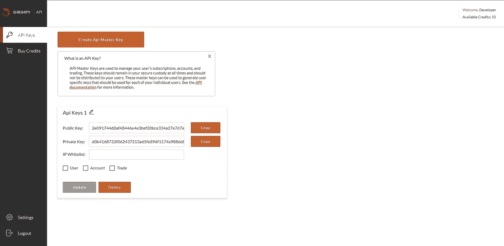
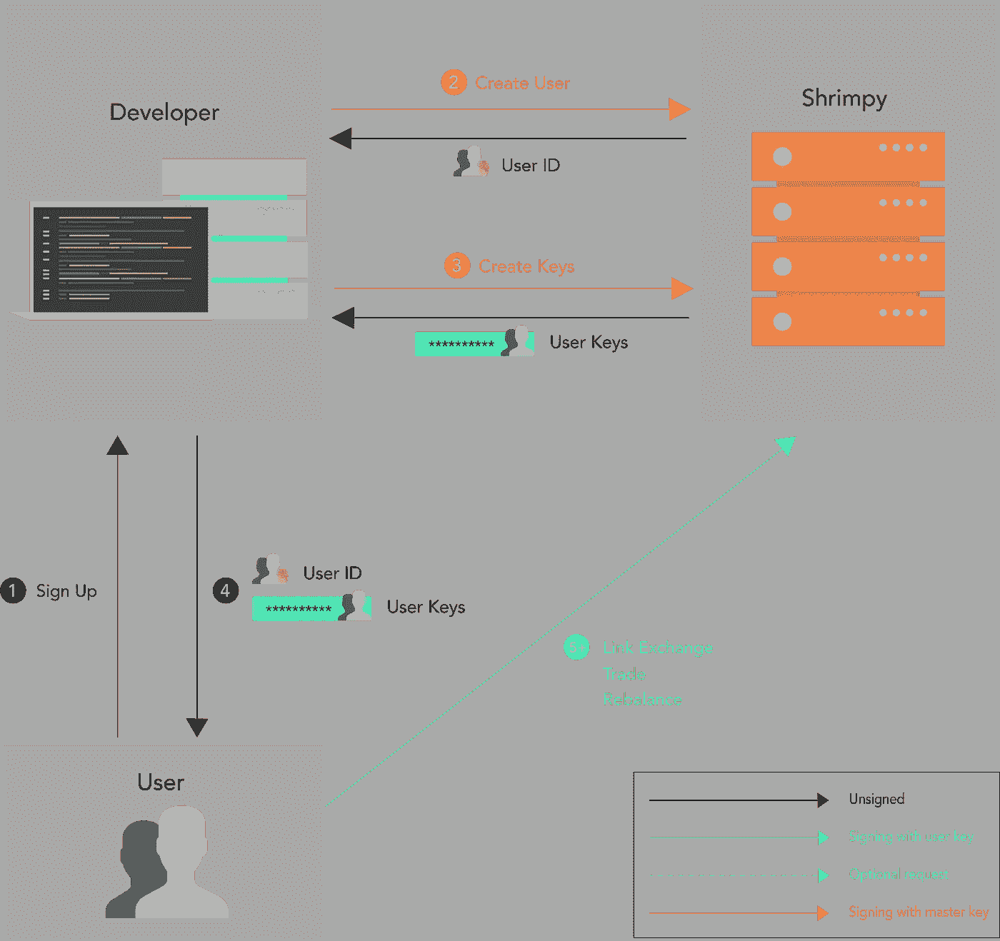

# 通过 API 交易加密货币

> 原文：<https://medium.com/hackernoon/trading-crypto-through-apis-a84b23cd05b>


因此，你是一名高级加密货币交易员，或者可能是一名希望无缝接入每个主要交易所的应用程序开发人员。您对 API 环境有一个大致的了解，但是可能不知道使用 Shrimpy 来管理所有 exchange API 连接的强大功能。继续读！

在本文中，我们将向您展示如何使用 API 设置加密货币交易。由于 Shrimpy 提供的通用开发工具，这一过程可以在每个主要的交换中重复进行。另一种选择是像 CCXT 这样的库，它要求你为每个交易所编写定制代码，管理基础设施，并扩展服务器群，在每个交易所执行交易和收集数据。

[](https://blog.shrimpy.io/blog/shrimpy-vs-ccxt-centralization-in-a-decentralized-ecosystem) [## Shrimpy vs CCXT:分散生态系统中的集中化案例

### 加密货币领域有一种让一切开放、去中心化和免费的驱动力。当谈到…

blog.shrimpy.io](https://blog.shrimpy.io/blog/shrimpy-vs-ccxt-centralization-in-a-decentralized-ecosystem) 

# 创建并连接您的 API 密钥

在我们指导您完成 API 交易步骤之前，您需要创建交易所 API 密钥。关于如何生成交换 API 密钥的详细说明可以在[这里](https://help.shrimpy.io/)找到。

[](/@ShrimpyApp/linking-bittrex-api-keys-tutorial-8657c779c9f4) [## 链接 Bittrex API 密钥[教程]

### 通过将 API 键连接到 Shrimpy，使多样化和重新平衡变得容易。

medium.com](/@ShrimpyApp/linking-bittrex-api-keys-tutorial-8657c779c9f4) 

# Shrimpy 加密交易 API



Shrimpy 通用加密交换 API 连接到每个主要的交换。这提供了与交换交互的统一接口。Shrimpy 开发人员 API 可以用来防止这些违规行为，而不是了解每个单个交换的怪癖和独特问题。

开发者可以直接用 Shrimpy 存储 API 密钥，甚至在 Shrimpy 的统一接口上进行交易，而不是管理用户 API 密钥和每个交易所的连接。

我们的旅程从 Shrimpy 开发人员 API 开始。

[](https://developers.shrimpy.io/) [## 面向开发者的加密交易 API

### 业界领先的加密交易、实时数据收集和交易账户管理 API。

developers.shrimpy.io](https://developers.shrimpy.io/) 

# 注册您的开发者帐户

使用 Shrimpy 通用加密交换 API 需要你首先在 Shrimpy 开发者平台[这里](https://developers.shrimpy.io/)注册。注册是免费的，每个人都可以获得 10 个免费积分，这足够测试开发者 API 10 个月了。

# **创建主 API 密钥**

您首先必须创建一个新的 **API 主密钥**来使用 Shrimpy API。您还必须在**设置中启用**多因素认证**。**

在开发者仪表板中，选择**创建 API 主密钥。**通过向您的电子邮件提交 API 密钥请求来验证您的帐户。完成电子邮件请求验证并返回到开发人员控制面板。

在 **API 密匙下，你现在应该会看到一组新的私有/公共 **API 密匙。**这些密钥与 Shrimpy 通信以创建用户、授权订阅和执行交易。出于安全原因，您必须再次通过 2FA 验证您的帐户才能查看**私有 API 密钥**。复制并保存**公钥**和**私钥。****

**注意**:保证你的公钥和私钥的安全！主密钥不应与任何人共享。如果您希望用户能够在自己的设备上进行交易，可以使用主密钥来生成用户密钥。用户密钥旨在与用户共享。我们将在接下来的章节中更详细地讨论这一点。



在您的主 API 密钥设置中，您将能够添加 IP 白名单并启用特定的 API 密钥功能，分为**用户、账户、**和**交易。让我们详细检查一下这些功能。**

# **用户设置(创建用户/用户 API 密钥)**

## **创建用户**

在您开始交易之前，我们需要创建一个可以与交易所交互的用户。用 Shrimpy 很容易做到这一点！

> 注意:这些请求是用主 API 密钥签名的。

> **请求**

```
POST https://dev-api.shrimpy.io/v1/users
```

> **请求正文**

```
{
    "name": "customnameforthisuser"
}
```

> **响应**

```
{
    "id": "701e0d16-1e9e-42c9-b6a1-4cada1f395b8"
}
```

## **创建用户 API 密钥**

还可以为每个用户创建用户 API 密钥。与主 API 密钥不同，用户 API 密钥是专门为管理单个用户而设计的，可以与相关用户共享。这使得他们可以通过直接向 Shrimpy 发送请求来管理自己的个人帐户。

多个 exchange 帐户可以链接到一个用户 API 密钥。因此允许一个用户用一个用户 API 密钥管理无数的 exchange 帐户。这个用户 API 键可以执行交易，收集账户信息，或者访问每个连接的交易所的全部订单数据。

> 注意:这些请求是用主 API 密钥签名的

> **请求**

```
POST https://dev-api.shrimpy.io/v1/users/<userId>/keys
```

> **请求示例:**

```
POST https://dev-api.shrimpy.io/v1/users/701e0d16-1e9e-42c9-b6a1-4cada1f395b8/keys
```

> **回应:**

```
{
    "publicKey": "51ac18b7d208f59b3c88acbb1ecefe6ba6be6ea4edc07e7a2450307ddc27ab80",
    "privateKey": "85c977ef4070f1deee70192ba7fd5a6caf534f891e4918cfffec11cd6b625e77db4f80347cb436bcaa8882231bacb02f0798a696f101fdd1ef268d66fc63c213"
}
```

# 帐户设置

为了完成交易设置，我们还需要链接一个我们将用于交易的 exchange 帐户。与前面的例子类似，我们将使用 Bittrex 作为我们想要链接的交换。

> 注意:这些请求可以用用户 API 密钥进行签名。

## 连接 Exchange 帐户

> **请求**

```
POST https://dev-api.shrimpy.io/v1/users/<userId>/accounts
```

> **请求示例**

```
POST [https://dev-api.shrimpy.io/v1/users/701e0d16-1e9e-42c9-b6a1-4cada1f395b8/accounts](https://dev-api.shrimpy.io/v1/users/701e0d16-1e9e-42c9-b6a1-4cada1f395b8/accounts)
```

> **请求正文**

```
 {
    "exchange": "bittrex",
    "publicKey": "GOelL5FT6TklPxAzICIQK25aqct52T2lHoKvtcwsFla5sbVXmeePqVJaoXmXI6Qd",
    "privateKey": "SelUuFq1sF2zGd97Lmfbb4ghITeziKo9IvM5NltjEdffatRN1N5vfHXIU6dsqRQw",
}
```

> **响应**

```
{
    "id": 1234
}
```

完美！现在我们已经设置好了用户。开始交易吧！

# 贸易

## 账户余额

为了知道一个账户在交易所持有哪些资产，我们需要收集余额数据。这可以通过 Shrimpy 轻松实现。

> 注意:这些请求可以用用户 API 密钥进行签名。

> **请求**

```
GET https://dev-api.shrimpy.io/v1/users/<userId>/accounts/<exchangeAccountId>/balance
```

> **请求示例**

```
GET [https://dev-api.shrimpy.io/v1/users/701e0d16-1e9e-42c9-b6a1-4cada1f395b8/accounts/123/balance](https://dev-api.shrimpy.io/v1/users/701e0d16-1e9e-42c9-b6a1-4cada1f395b8/accounts/123/balance)
```

> **回应**

```
{
  "retrievedAt": "2019-01-09T19:17:33.000Z",
  "balances": [
    {
      "symbol": "KCS",
      "nativeValue": 2306,
      "btcValue": 0.33486579,
      "usdValue": 1327.8775274784
    },
    {
      "symbol": "ETH",
      "nativeValue": 4.0e-8,
      "btcValue": 1.4960564e-9,
      "usdValue": 5.9324652822859e-6
    }
  ]
}
```

厉害！获取我们外汇账户的余额就这么简单。

## 执行交易

让我们看看用 Shrimpy 进行交易有多容易。我们将使用以下端点:

> **请求**

```
POST https://dev-api.shrimpy.io/v1/users/<userId>/accounts/<exchangeAccountId>/trades
```

这个端点提供了一个简单的方法来通过 Shrimpy APIs 执行单个交易。我们需要做的就是指定“从”资产、“到”资产和“金额”。有了这些信息，Shrimpy 将通过报价货币(如有必要)智能地安排您的交易，以完成交易。

> 注意:这些请求可以用用户 API 密钥进行签名。

> **请求示例**

```
POST [https://dev-api.shrimpy.io/v1/users/701e0d16-1e9e-42c9-b6a1-4cada1f395b8/accounts/123/trades](https://dev-api.shrimpy.io/v1/users/701e0d16-1e9e-42c9-b6a1-4cada1f395b8/accounts/123/trades)
```

> **请求体**

```
{
    "fromSymbol": "BTC",
    "toSymbol": "ETH",
    "amount": "0.01",
}
```

就是这样！您现在已经通过 Shrimpy 的交易 API 成功提交了交易。那不是小菜一碟吗？

现在我们已经完成了执行交易的过程，让我们探索一些其他可用的有用的端点。

## **市场数据**

现在，你可能想知道如何根据市场数据执行交易策略。Shrimpy 可以根据完整的订单簿或报价机收集市场数据。在本例中，我们将查看股票行情。有关订单数据，请参考我们的 [API 文档](https://developers.shrimpy.io/docs/#market)。

> **请求**

```
GET https://dev-api.shrimpy.io/v1/exchanges/<exchange>/ticker
```

> **请求示例**

```
GET https://dev-api.shrimpy.io/v1/exchanges/kucoin/ticker
```

> **回应**

```
[
  {
    "name": "Bitcoin",
    "symbol": "BTC",
    "priceUsd": "3700.0089335",
    "priceBtc": "1",
    "percentChange24hUsd": "4.191224354581092",
    "lastUpdated": "2018-12-19T22:51:13.000Z"
  },
  {
    "name": "Ethereum",
    "symbol": "ETH",
    "priceUsd": "100.114205389399",
    "priceBtc": "0.027057825",
    "percentChange24hUsd": "5.432113558652999",
    "lastUpdated": "2018-12-19T22:51:13.000Z"
  },
  ...
]
```

## 开始建造

这些端点应该足以开始构建许多应用程序。如果您需要其他特性，请查看[Shrimpy API](https://developers.shrimpy.io/)以获得更多功能。我们支持限价订单、未平仓订单、完整订单簿数据等等。每个端点都有不同的使用案例。

为了浓缩和简化上面的所有步骤，我们为 Shrimpy 的加密交易 API 创建了一个流程图。



# 摘要

让我们快速浏览一下执行与 Shrimpy 的第一笔交易的步骤。

*   在这里通过 Shrimpy UI [创建了一个主密钥。](https://developers.shrimpy.io/)
*   创建了一个用户。
*   已创建用户密钥。
*   链接了一个交换。
*   完成了一项交易。

# Shrimpy API

[](https://developers.shrimpy.io/) [## 面向开发者的加密交易 API

### 业界领先的加密交易、实时数据收集和交易账户管理 API。

developers.shrimpy.io](https://developers.shrimpy.io/) 

Shrimpy 为希望将可扩展的加密交易功能集成到应用程序中的开发人员提供了最先进的 API。

Shrimpy 的加密交易 API 是作为一个基于云的解决方案创建的，以解决几个加密开发者的障碍，包括**交易所交易**、**产品可扩展性**和**用户管理。**有了 Shrimpy 的 API 在手，开发人员可以专注于创造下一个时代的开创性产品，这些产品将塑造加密的未来。

Shrimpy 的 API 与以下交易所和 API 端点兼容:币安 API、CoinbasePro API、Bittrex API、北海巨妖 API、Gemini API、Poloniex API、Huobi API、KuCoin API、Bibox API、BitMart API 和 HitBTC API。

交易者和开发者可以利用 Shrimpy 现有的交易基础设施进行交易平台/应用开发，而不必管理与每个交易所的连接。

最初发布于 [blog.shrimpy.io](https://blog.shrimpy.io/blog/trading-crypto-through-apis)