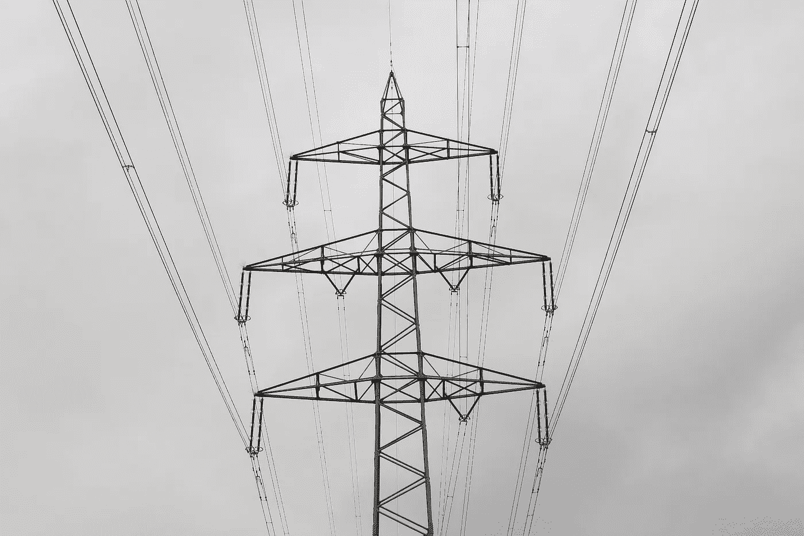
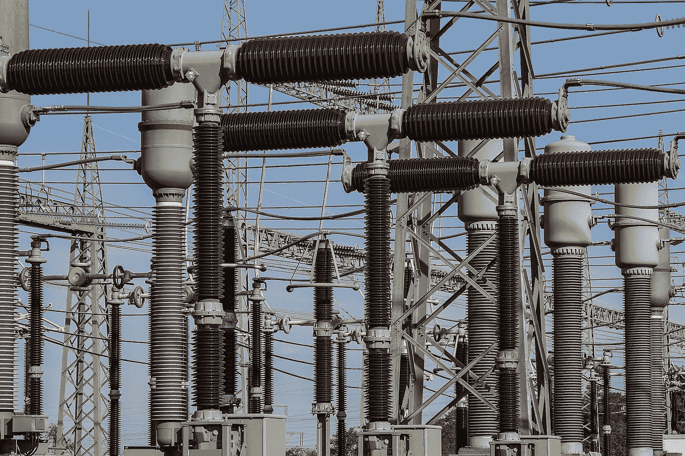
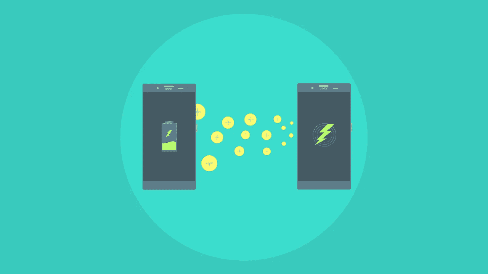
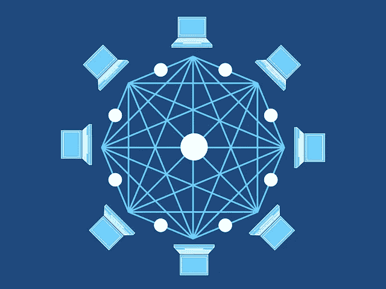
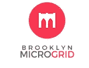
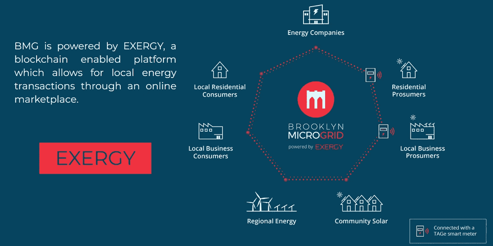

# 交易能源:区块链会颠覆能源行业吗？

> 原文：<https://medium.com/hackernoon/trading-energy-will-blockchain-disrupt-the-energy-industry-34a6a9e90112>

## 作者 Ledgerback，与 [Joshua Sagisi](https://medium.com/u/c165c4fafcd?source=post_page-----34a6a9e90112--------------------------------) 合作

## 布鲁克林微电网如何试图通过结合区块链和微电网技术来本地化能源行业

T 能源行业是一个可以从区块链技术中获益良多的行业。

在能源行业，区块链有许多应用，如碳排放核算、点对点(P2P)能源交易(与本地能源交易同义)、激励可再生能源生产(如 Solarcoin)和改进“智能”电表[3][4][5]。

在这篇文章中，我们将讨论 P2P 能源交易，这是使之成为可能的两项主要技术，区块链和微电网，以及布鲁克林微电网，这是一个位于纽约布鲁克林的 P2P 能源交易微电网项目。

# P2P 能源交易

P2P 能源交易顾名思义，就是在不使用中介的情况下，从一个人或实体(生产者)到另一个人或实体(消费者)的能源交易。

## 可再生能源生产/消费

在美国的大部分地区，能源消费者除了州政府选择的向居民提供能源的公用事业之外，几乎没有其他能源生产选择。

然而，随着光伏(PV)太阳能电池板(以下简称“太阳能电池板”)在过去 50 年中的兴起，以及太阳能成本在过去 10 年中迅速变得更便宜，日常消费者终于有机会通过将太阳能电池板安装到他们的家中(以下简称“房主”)(住宅太阳能屋顶也可称为分布式能源)[10]而成为能源生产者。

这样一来，这些房主就有机会利用净计量政策(不幸的是，这一政策受到了公共事业的沉重打击)。

净计量政策允许房主在一个月内生产的能源多于消耗的时候获得净计量信用，然后可以从下个月的账单中扣除。一般来说，多余的能量被送回公用事业公司，公用事业公司贷记房主[2][6]。

> 净计量信用=产生的能量减去消耗的能量。

除了净计量信用，房主还可以获得可再生能源信用(rec)，这是一个人有权获得可再生发电的非电力属性的法律证明，当可再生能源产生每小时 1 兆瓦(MWh)的电力并输送到电网时即可获得。

根据房主和公共事业单位之间的协议，房主可能还必须将他们的 rec 出售给公共事业单位[7]。

## 公用事业垄断

但是，为什么生产能源的房主只能向公共事业公司提供他们的可再生能源，而不是其他没有太阳能电池板但仍想使用可再生能源的房主呢？

> 为什么房主不能直接向其他消费者出售他们的可再生能源？

房主之间不能相互出售的主要原因是，州政府对公共事业向消费者提供能源提供了法律垄断。

国家为公共事业提供法律保护背后的一般推理是，能源行业是一个导致自然垄断的行业，因此庞大的基础设施和资本成本使得任何公司几乎不可能进入市场，即使这样，也不可能向消费者充分提供能源[8][9]。

这在 100 年前可能是正确的，但在今天，随着可再生能源和电池技术的进步，这就不一定正确了[8][9]。

## P2P 能源交易需求

有许多消费者希望有能力生产和消费(“prosum[e/option]”)可再生能源，但不幸的是负担不起[11]。

与其要求消费者建立一个太阳能屋顶，或者从他们的公共设施中购买一个包含可再生能源的混合能源计划(但是，你必须警惕公共设施采用 rec)，消费者应该可以选择从他们的太阳能邻居那里购买可再生能源[11] [12]。

不幸的是，目前的系统要求公用事业公司在消费者和需要可再生能源的消费者之间扮演中间人的角色，即第三方中间人[8][9][11][12]。

如果 P2P 能源交易可以在澳大利亚等其他国家实施，那么没有理由(除了合法垄断)P2P 能源交易不能在美国实施，在澳大利亚，弗里曼特尔市正在测试 Power Ledger 的 P2P 能源交易网络[13]。

为了让 P2P 能源交易网络发挥作用，区块链是必要的，但当与微电网结合时，它会变得更加强大。

# 区块链和微电网

## 区块链

首先是我们最喜欢的话题，区块链。

区块链是一种不可变和不可逆的数字公共账本，它允许分布式计算机网络验证交易的真实性，而不需要中央权威机构[14]。

当应用于能源领域时，区块链系统可以提供所有能源生产和消费数据及其交易的安全、透明和分散的分类账。此外，区块链可以通过智能合约实现 P2P 能源交易的自动化。

智能合同(不要与法律合同混淆)是存储在区块链上的自动执行程序，它促进了双方基于商定条款的价值交换(可以是任何东西)。

智能合同可以通过提供一个自动化的市场来实现能源交易的自动化，在这个市场中，消费者可以相互竞价购买可再生能源[15][16]。

## 微电网

其次，微电网。

传统电网将“家庭、企业和其他建筑连接到中央电源……但这种互联性意味着当电网的一部分需要维修时，所有人都会受到影响”[18]。

微电网是“在明确定义的电力边界内的一组相互连接的负载和分布式能源，作为相对于电网的单一可控实体。微电网可以连接和断开电网[使其能够][与电网一起]或[独立地]以孤岛模式运行[17]。

微电网是“具有控制能力的本地能源电网，这意味着它可以与传统电网断开连接，自主运行”[17][18]。

微电网和传统电网的区别在于，微电网是一个自治实体，它连接到传统电网，但可能会断开连接并“自主运行”[17][18]。你也可以把微电网想象成猫，把传统电网想象成人。猫可以依靠人类获得食物和住所，但猫不需要依靠人类生存。

社区可能出于各种原因选择使用微电网，包括:

*   备份“以防紧急情况”；
*   削减成本；
*   连接“对于传统网格应用来说太小或不可靠的本地资源”；
*   变得“能源独立”；和
*   它们“更加环保”[17][18]。

# 布鲁克林微电网

Brooklyn Microgrid Logomark.^^^

Brooklyn Microgrid (BMG)是一家根据纽约州法律成立的受益公司，归 LO3 能源公司所有，于 2015 年开始运营，目标是创建自给自足的微电网[18]。

Exergy Infographic.^^^

BMG 计划实施一个虚拟的本地能源交易市场，由()提供动力，这是一个专门为能源交易开发的区块链平台[18]。

BMG 的 P2P 能源交易方法可以给布鲁克林社区带来一定的好处。

首先，BMG 消费者将对他们的能源供应商有更多的选择，而专业消费者将获得更大的消费基础[16][19]。

*第二个*，BMG 将通过激励当地房主和企业安装屋顶太阳能，从而减少该地区的温室气体排放量，使布鲁克林更加可持续发展。

*第三*，BMG 将使布鲁克林更具能源弹性，因为微电网可以脱离传统电网自主运行，特别是在发生飓风桑迪等天气事件时。

*第四*,(火用)的区块链的使用将简化交易并提供透明度以发展当地的能源市场【16】【19】。

BMG 提倡权力下放，因为成员不再依赖一个集中的公共事业机构来买卖能源，而是可以直接与其他成员交易买卖可再生能源。

此外，BMG 提高了透明度，因为消费者和消费者知道能源来自哪里，并且他们已经*实际上*消耗了可再生能源，这对于那些与 SolarCity 等太阳能供应商签署电力购买协议(PPAs)或太阳能服务协议(SSAs)的消费者来说可能不是这样[21]。

## 布鲁克林微电网的现状

BMG 目前正致力于开发“戈瓦努斯和布鲁克林公园坡社区”的社区微电网

BMG“将在 2019 年初推出一个‘模拟’能源市场，然后推出[ir]实时市场”[16][19]。

该地区的任何人都可以通过下载 BMG 移动应用程序并注册为消费者或能源生产用户来参与模拟市场[16][19]。

如果您是 prosumer，您需要在您的家中或公司安装交互式网格元素生成(TAG-e G2)和智能电表[16][19]。

TAG-e G2 是一种通过 WiFi 或以太网连接将安装在家庭或企业的智能电表连接到当地能源市场的设备，即数据通过互联网发送[16][19]。

欲了解更多信息，请访问 BMG 的官方网站。

# 结论

区块链在能源行业的应用时机已经成熟，尤其是在 P2P 能源交易方面。

P2P 能源交易顾名思义，就是在不使用中介的情况下，从一个人或实体(生产者)到另一个人或实体(消费者)的能源交易。

为了使 P2P 能源交易成为当前系统的可行替代方案，需要采取新的监管措施来消除合法垄断，并实施可能与微电网相结合的区块链[8][9][11][12][17][18][19][20]。

然而，我们建议将区块链实施与微电网相结合，以充分实现区块链在该地区的电力。

对我们来说，值得庆幸的是，像布鲁克林微电网这样的公司正在承担使 P2P 能源交易成为可能的任务，不仅对布鲁克林，而且对世界其他地方都是如此，以证明区块链和微电网可以使社区更加清洁，更具能源弹性。

# 我们需要您的反馈！

请回复或给我们发邮件，让我们知道您对这篇文章的想法。

非常感谢您的反馈，没有反馈我们无法改进。^^

# Greyscail 区块链评论

Greyscail Blockchain Review 是一个由对新兴技术、社区和想法充满热情的研究人员和作家组成的社区驱动的分散网络。

特别是，我们想回顾区块链的应用，以便读者可以看到区块链如何在许多不同的行业，领域，倡议和计划中实施。

如果您对区块链和新兴技术、社区和想法充满热情，请随时给我们写信，就某项工作或我们如何改进我们的流程进行合作。^^

更多信息请访问 [www.ledgerback.coop.](http://www.ledgerback.coop.)

## 笔记

如果您认为有必要进行修正，^^=可以给我们发送消息或留下回复。

^^^ =徽标、标志或任何其他标志的使用仅用于规范用途，绝不构成或形成此类公司对此处表达的观点或 Greyscail 区块链评论的认可。这篇文章中提到的公司和 Greyscail 区块链评论没有任何关系，也不应该从这篇文章的内容中得到暗示。

## 参考

[1]可再生能源证书(RECs)，环境保护署(EPA)，[https://www . EPA . gov/green power/Renewable-Energy-Certificates-RECs，](https://www.epa.gov/greenpower/renewable-energy-certificates-recs)最近一次访问时间为 2019 年 3 月 20 日。

 [## 可再生能源证书(RECs 美国环保局

### 可再生能源证书(REC)是一种基于市场的工具，代表着财产…

www.epa.gov](https://www.epa.gov/greenpower/renewable-energy-certificates-recs) 

[2]什么是 SREC？净计量信用解释，EnergySage，[https://news . energy sage . com/net-metering-and-srecs-explained/](https://news.energysage.com/net-metering-and-srecs-explained/)，2017 年 4 月 11 日。

 [## 2019 年净计量信用和 SRECs 解释|能源储存

### 人们通常认为 SRECs 和网络计量是一回事，但实际上，这种比较就像苹果和橙子一样…

news.energysage.com](https://news.energysage.com/net-metering-and-srecs-explained/) 

[3] Stephen Lacy，区块链上的点对点能源交易可能如何工作，GreenTechMedia，[https://www . GreenTechMedia . com/articles/read/How-Peer-to-Peer-Energy-Trading-on-the-区块链-may-Work，](https://www.greentechmedia.com/articles/read/how-peer-to-peer-energy-trading-on-the-blockchain-might-work)2018 年 4 月 03 日。

 [## 区块链上的点对点能源交易可能如何工作

### GTM Research 在能源区块链领域追踪的 122 家初创企业中，有 22 家专注于…

www.greentechmedia.com](https://www.greentechmedia.com/articles/read/how-peer-to-peer-energy-trading-on-the-blockchain-might-work) 

[4]智能电表:指南，英国政府，[https://www.gov.uk/guidance/smart-meters-how-they-work,](https://www.gov.uk/guidance/smart-meters-how-they-work)2013 年 1 月 22 日(出版)，2018 年 1 月 4 日(更新)。

 [## 智能电表:指南

### 智能电表是下一代煤气表和电表，提供一系列智能功能。对于…

www.gov.uk](https://www.gov.uk/guidance/smart-meters-how-they-work) 

[5] Solarcoin，Solarcoin，[https://solarcoin.org/,](https://solarcoin.org/)最后访问时间 2019 年 3 月 20 日。

 [## 太阳能币

### 申请根据实际生产数据获得的免费 SolarCoins SolarCoin。一年几个数据点是…

solarcoin.org](https://solarcoin.org/) 

[6]净计量指南，Mass.gov，[https://www.mass.gov/guides/net-metering-guide](https://www.mass.gov/guides/net-metering-guide)

 [## 净计量指南

### 净计量允许客户抵消他们的能源使用，并将能源转移回他们的电力公司…

www.mass.gov](https://www.mass.gov/guides/net-metering-guide) 

[7] [Chris Lau](https://www.wri.org/profile/chris-lau) 和 Jaineel Aga，可再生能源证书的底线，世界资源研究所，[https://www . wri . org/publication/Bottom-Line-Renewable-Energy-Certificates，【2008 年 11 月。](https://www.wri.org/publication/bottom-line-renewable-energy-certificates)

 [## 可再生能源证书的底线

### 可再生能源证书(rec)，也称为“绿色标签”、“绿色证书”和“可再生能源信用”，…

www.wri.org](https://www.wri.org/publication/bottom-line-renewable-energy-certificates) 

[8] [Adam B. Summers，](https://www.ocregister.com/author/adam-summers/)结束垄断保护以修复 PG & E 和其他公用事业，《奥兰治县登记册》，[https://www . ocregister . com/2019/03/16/End-monopoly-protections-to-fix-PGE-and-other-utilities/，](https://www.ocregister.com/2019/03/16/end-monopoly-protections-to-fix-pge-and-other-utilities/)2019 年 3 月 16 日，中午 12:00(已发布)，2019 年 3 月 16 日，下午 12:01(已更新)

 [## 结束垄断保护，修复 PG&E 和其他公用事业

### 关于太平洋天然气和电力公司的未来，以及天然气和电力服务的总体前景，人们的疑问越来越多…

www.ocregister.com](https://www.ocregister.com/2019/03/16/end-monopoly-protections-to-fix-pge-and-other-utilities/) 

[9] Steve Corneli 和 Steve Kihm，分布式能源会结束公用事业的自然垄断吗？、电策、[https://emp.lbl.gov/sites/all/files/Corneli_29June2016.pdf,](https://emp.lbl.gov/sites/all/files/Corneli_29June2016.pdf)2016 年 6 月 29 日

[10]大卫·马丁，为未来供电……感谢你邻居的可再生能源，可再生能源世界，[https://www . Renewable Energy World . com/articles/2019/03/Powering-the-future-thanks-to-your-neighbors-Renewable-Energy . html，](https://www.renewableenergyworld.com/articles/2019/03/powering-the-future-thanks-to-your-neighbors-renewable-energy.html)2019 年 3 月 19 日。

 [## 为未来提供动力…感谢您邻居的可再生能源

### 分布式能源(DER)，如住宅太阳能电池板，不仅改变了能源系统的方式…

www.renewableenergyworld.com](https://www.renewableenergyworld.com/articles/2019/03/powering-the-future-thanks-to-your-neighbors-renewable-energy.html) 

[11]本·席勒，当你可以从你的朋友那里购买电力时，你不需要能源公司:公用事业公司正在被破坏，因为人们互相出售他们的能源，没有中间人，FastCompany，2015 年 3 月 16 日，[https://www . fast Company . com/3040833/You-dont-Need-a-Energy-Company-When-You-Can-Buy-Power-Your-friend](https://www.fastcompany.com/3040833/you-dont-need-an-energy-company-when-you-can-buy-power-from-your-friend)。

 [## 当你可以从朋友那里购买电力时，你就不需要能源公司了

### 虽然通信网络在上个世纪有了很大的发展，但电网几乎没有任何变化…

www.fastcompany.com](https://www.fastcompany.com/3040833/you-dont-need-an-energy-company-when-you-can-buy-power-from-your-friend) 

[12] Julia Franz，一种去当地的新方式:从你的邻居那里购买太阳能，公共国际广播电台(PRI)，[https://www . PRI . org/stories/2017-07-28/new-way-go-local-Buy-solar-energy-your-neighbors，](https://www.pri.org/stories/2017-07-28/new-way-go-local-buy-solar-energy-your-neighbors)2017 年 7 月 28 日，美国东部时间上午 8:

 [## 一种新的本地化方式:从邻居那里购买太阳能

### 如今的绿色趋势是去当地——如果城市人可以在他们的…

www.pri.org](https://www.pri.org/stories/2017-07-28/new-way-go-local-buy-solar-energy-your-neighbors) 

[13] [马克·艾梅姆，](https://www.ccn.com/author/mark-emem)澳大利亚:Power Ledger 的区块链能源平台在弗里曼特尔上线，加密货币新闻网(CNN)，[https://www . ccn . com/Australia-Power-ledgers-区块链-Energy-Platform-Goes-Live-in-Fremantle，](https://www.ccn.com/australia-power-ledgers-blockchain-energy-platform-goes-live-in-fremantle)2018 年 8 月 12 日。

 [## 澳大利亚:Power Ledger 的区块链能源平台在弗里曼特尔上线

### 澳大利亚沿海城市弗里曼特尔开始了一项试验，允许一些居民用太阳能发电…

www.ccn.com](https://www.ccn.com/australia-power-ledgers-blockchain-energy-platform-goes-live-in-fremantle) 

[14] Mark E. Burge， *Apple Pay，比特币和消费者:未来公共支付法的基础知识*，7 Hastings L.J. 1493，1529 (2016)(“在小误差范围内”)。

[15]史蒂文·怀特，什么是智能合同？、投资区块链、[https://www . investinblockchain . com/what-is-a-smart-contract/、](https://www.investinblockchain.com/what-is-a-smart-contract/)2018 年 3 月 21 日。

 [## 什么是智能合同？

### 是什么让区块链对各种商业企业、技术社区，甚至…

www.investinblockchain.com](https://www.investinblockchain.com/what-is-a-smart-contract/) 

[16]布鲁克林微电网 101，布鲁克林微电网，[https://www.brooklyn.energy/bmg-101](https://www.brooklyn.energy/bmg-101)[，](http://brooklynmicrogrid.com/)最后访问 2019 年 3 月 20 日。

 [## BMG 101 |布鲁克林微电网|社区供电能源

### 编辑描述

www .布鲁克林能源](https://www.brooklyn.energy/bmg-101) 

[17]微电网定义，伯克利实验室的微电网，[https://building-microgrid.lbl.gov/microgrid-definitions,](https://building-microgrid.lbl.gov/microgrid-definitions)最近一次访问是在 2019 年 3 月 20 日。

 [## 微电网定义|建设微电网

### 以下是美国 DOE MEG 和 CIGRE 6.22 WG 的定义措辞。

building-microgrid.lbl.gov](https://building-microgrid.lbl.gov/microgrid-definitions) 

[18] Allison Lantero，微电网如何工作，能源部，【https://www.energy.gov/articles/how-microgrids-work,】T2，2014 年 6 月 17 日。

 [## 微电网如何工作

### 作为我们“能源如何工作”系列的一部分，这个博客解释了微电网是如何工作的。

www.energy.gov](https://www.energy.gov/articles/how-microgrids-work) 

[19]布鲁克林微电网，布鲁克林微电网，【http://brooklynmicrogrid.com/, 最近一次访问是在 2019 年 3 月 20 日。

 [## 布鲁克林微电网|社区供电能源

### 布鲁克林微电网正在开发一个社区供电的微电网。参与者可以参与可持续能源网络…

www .布鲁克林能源](https://www.brooklyn.energy/) 

[20] Leon Kaye，布鲁克林微电网寻求扰乱纽约市的电力垄断，TRIPLE PUNDIT，[https://www . TRIPLE PUNDIT . com/story/2019/Brooklyn-micro grid-Seeks-Disrupt-nycs-Power-Monopoly/27411，](https://www.triplepundit.com/story/2019/brooklyn-microgrid-seeks-disrupt-nycs-power-monopoly/27411)2016 年 3 月 16 日。

 [## 布鲁克林微电网试图打破纽约的电力垄断

### 在纽约市，一个人的水电费平均每月约为 75 美元。当然，重点是平均的:如果你…

www.triplepundit.com](https://www.triplepundit.com/story/2019/brooklyn-microgrid-seeks-disrupt-nycs-power-monopoly/27411) 

[21] Tim McDonnell，《太阳能漏洞公用事业公司可以使用游戏能源信用额》，WIRED，[https://www . WIRED . com/2016/01/The-Solar-pool-Utilities-Can-Use-to-Game-emissions/，](https://www.wired.com/2016/01/the-solar-loophole-utilities-can-use-to-game-emissions/)2016 年 1 月 20 日，下午 02:53。

 [## 公用事业公司可以利用太阳能漏洞来获得能源信用

### 几年前，加州大学伯克利分校的能源律师史蒂文·韦斯曼开始购物…

www.wired.com](https://www.wired.com/2016/01/the-solar-loophole-utilities-can-use-to-game-emissions/)