# 迁移学习:方法和实证研究

> 原文：<https://medium.com/hackernoon/transfer-learning-approaches-and-empirical-observations-efeff9dfeca6>

> 如果数据是货币，那么迁移学习就是穷人的救星

Comparison of two different models (More on it later)

虽然关于这个主题的学习资源并不缺乏，但只有少数人能够将理论和经验结合在一起，并且足够直观。原因？？我想我们并没有按照我们储存在大脑中的方式来传递知识。我相信用简单的方式表达复杂的话题是一门艺术，所以让我们掌握它。

让我们开始一系列的博客，在那里我们将尝试讨论为什么事物是这样的，以及在机器学习领域中它们背后的直觉。排在第一位的是**迁移学习** (TL)。我们将以一个简洁的关于 TL 的介绍开始，然后是我解决的问题陈述。我们将看到如何在 Tensorflow 中通过各种方式实现 TL，并研究 TL 环境中的每个调优参数如何影响模型统计数据(最有趣的部分！！).最后，我们将看到结论、提示和技巧，以及我能找到的一些最佳参考资料。

## 介绍

一个好的天真的定义看起来是这样的:“它是将知识从一个领域转移到另一个领域的能力”。从技术上来说，它是:“使用在一个设置(任务 1)上训练的权重来拟合另一个设置(任务 2)上的模型”。我们通常在以下情况下使用迁移学习:

1.  任务 2 的数据集很小，但我们仍想训练一个模型。(小数据的存在并不是我们想要使用 TL 的唯一情况，我们将在后面看到)
2.  任务 1 和任务 2 是相似的，即它们具有相似的低级特征。任务越相似，这个概念就越适用。

迁移学习可以应用于各种领域，但我们将限制在图像的背景下讨论。

根据相似性和可用数据量，以下是不同场景的方法。

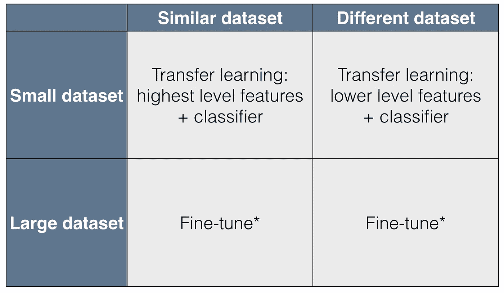

***Figure 1*** *: Different approaches in Transfer Learning based on type of datasets (Source : cs231n.github.io)*

但是在深入研究这些方法之前，让我们先研究一下迁移学习的两种主要方式:

1.  **使用原来的模型架构** **作为特征提取器**并在其上构建。这类似于我们在典型的机器学习问题的情况下通常所做的。我们手动设计特征并将它们输入到我们的模型中。但在这种情况下，特征工程的繁重工作是由预训练的模型基于它所学习的内容来完成的(通过学习，我们总是参考权重)。一旦获得了提取的特征，就可以将它们提供给自己的新模型。所以前一个模型的最后一点成为你下一个模型的输入。你可以把这个叫做“*即插即用型*”。只需移除顶层，添加一个新的代替它。瞧啊。！！，你已经有了一个新的模型。
2.  **微调** **预调整重量**。在上面的例子中，我们没有试图修改权重，而是将它们用于特征提取。但这不是我们想要的情况下，图像有点不同。我们希望模型能够*重新学习*它已经学习的部分或全部功能。但这不就和从零开始训练差不多了吗？？不，不是的。举个例子就清楚了。假设我已经学会了如何写“E”。现在想学写“F”。我应该从头开始重新学习一切吗？？不。我只需要擦掉下边的像素，我就学会了一个新字母。

因此，直觉上，如果您确信两个任务的底层特性是相同的，那么应该使用第一种情况。如果不是，您可能需要对模型进行微调。

在某些情况下，甚至两者一起使用。模型的某些部分保持原样，而某些部分则进行了微调。坚持住，稍后你会找到详细的可视化例子。

回到四个不同的场景，下面是我们解决它们的方法:

1.  任务 2 具有**较小的数据集**和**，与任务 1 的**相似:

这里的微调不是一个好主意，因为模型会过度拟合，因为新的梯度是基于少得多的(多样的)数据计算的。疑惑？？。假设预训练的权重是一些随机的权重。然后归结为通常的深度学习场景。如果你输入较少的数据，它会溢出。图像越相似，预训练的权重就越多，这将有助于避免过度拟合，因此可以去除的样本就越少。

因此，最好使用权重来提取特征，然后在此基础上训练分类器。

2.任务 2 具有**较小的数据集**，但**与任务 1 的**不同:

好的，让我看看。不能用微调，因为数据小。并且您不能使用顶层的特征，因为图像是不同的(顶层的特征是特定的)。现在怎么办？？你可以遵循上面同样的直觉，从倒数第二层而不是倒数第二层提取特征(不确定这是不是一个单词:P)。这是因为与输出图层中的要素相比，此图层中的要素更加通用。

3.任务 2 有**更大的数据集**和**类似于任务 1 的**:随意微调。

4.任务 2 有**更大的数据集**和**不同**到任务 1:同样，微调是可行的。但是你猜怎么着，你可以用这些数据从头开始训练一个新的模型。:P

现在，让我们从问题陈述开始。

# 问题陈述

使用迁移学习执行 OCR。

**任务 A** :包含 5 个字符串的图像。原始模型可以以 99%的准确率执行 OCR。权重被存储起来，稍后用于任务 b。该数据集有 100，000 个样本，足以从头开始训练一个模型。

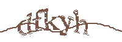

**Figure 2**: Sample Images for Task A

**任务 B:** 包含 6 个字符串的图像。除了长度之外，一个很大的区别是两幅图像中存在的噪声类型。这一个，作为对比的训练数据竟然只有**的 200 个**样本！！！

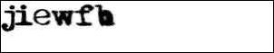

**Figure 3**: Sample Images for Task B

印象深刻？如果你认为我们可以使用在任何其他 OCR 样本上完成的训练来执行任何 OCR，那么有一些很好的指示给你。

有一些重要的幕后步骤/事实使这一工作。

1.  **噪声去除:**第一个是使任务 2 的图像达到与任务 1 相同的标准。我所说的标准是指消除噪音。就像你不能通过阅读梵文在数学考试中脱颖而出一样，你也不能指望模型根据它从未见过(或很少见过)的特征进行预测。例如:第二个图像中字符的不同粗细是该模型的一个新特征。记住:这样的差异越多，模型就越难适应新的情况。

2.**输入大小:**这是我们没有太多控制权的地方。首先要做的是:

*学习的参数数量∝输入图像的尺寸*

因此，我们想要使用的预训练权重矩阵具有根据第一幅图像的维度。但是你猜怎么着……两张图片大小不同。更直观地说:我们要求模型给出它从未见过，因此也从未计算过的参数值。因此第二个图像被调整大小和修改(添加额外的白色像素行)以匹配原始图像。

3.**类:**这是类似于数学-梵文的例子。如果模型只学习了“A”，你就不能指望它预测“A”。这适用于任何两种你想应用迁移学习的情况。由于两个图像可能的字符是相同的，即[a-z],我们可以毫不犹豫地使用它。

**实施**

终于是时候了。型号 A 的架构如下所示。它有 3 个卷积层，后面是 3 个完全连接的层。

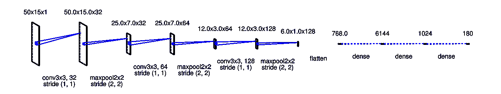

**Figure 4**: Network Architecture for Task A

我们将通过两种方法来实现这个概念。

# 方法 1

**恢复权重:**

Restoring weights and Importing graph structure

如果你想了解存储和恢复 tensorflow 权重文件的基础知识，[这篇](http://cv-tricks.com/tensorflow-tutorial/save-restore-tensorflow-models-quick-complete-tutorial/)是一篇非常好的文章。

接下来，我们提取将在模型 B 中使用的所有变量/参数的值(权重)。记住，任务 B 的模型架构与任务 A 的相同，直到*瓶颈层。* **瓶颈层**是模型 B 的架构不同于模型 a 的层。因此瓶颈层之后的层的权重是没有用的(至少在我们的情况下，否则它取决于任务。比较显示在本博客的结尾)。

让我们得到预训练变量的值。

`tf.trainable_variables()`给出了在模型 a 中训练的所有变量。这包括所有权重矩阵以及偏差。因此，在我们的例子中,`tf.trainable_variables()`给出了以下输出:

`conv2d/kernel:0
conv2d/bias:0
conv2d_1/kernel:0
conv2d_1/bias:0
conv2d_2/kernel:0
conv2d_2/bias:0
dense/kernel:0
dense/bias:0
dense_1/kernel:0
dense_1/bias:0
dense_2/kernel:0
dense_2/bias:0`

如您所见，每个变量名有两个部分。第一部分是定义变量的层的名称，后面是变量的类型，即内核(通常的权重矩阵)或偏差。

回到瓶颈层，它是倒数第二层，在我们的例子中，它就在输出层之前。上一步中恢复的变量对应于红色部分(如下所示)。这部分就是我们所说的**特征提取器**模型的一部分。绿色部分是实际的**分类器**，它完成最终的分类工作。

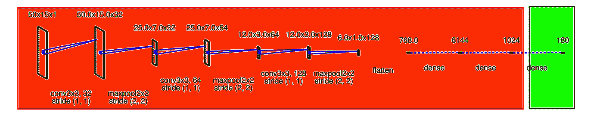

**Figure 5**: Red portion is responsible for feature extraction and the Green portion does the classification.

特征提取器有更多的功能。它可以进一步分为两组层。一组是冻结的( **R** 表示红色)，即它的重量不变。第二个( **B** 代表蓝色)是我们进行微调的地方。

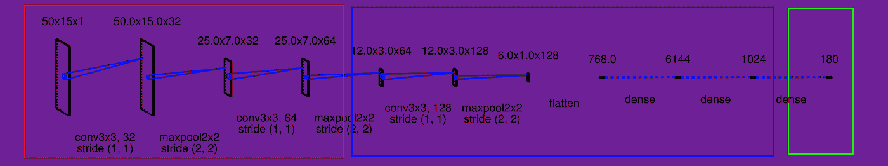

**Figure 6**: Red Portion refers to the frozen layers. Blue portion refers to the layers which are fine tuned.

我们想要微调的层数( **B** )与我们想要保持不变的层数( **R** )将取决于相似性。下图以相似性递减的顺序展示了不同的场景。最上面指的是图像几乎相同的情况。

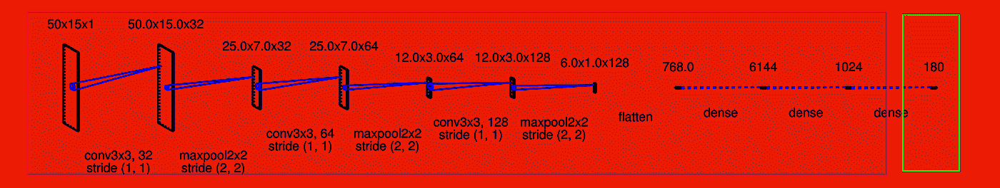

**Figure 7**: Both tasks are similar. No need to change the pretrained weights (Hence no **B** and only **R)**

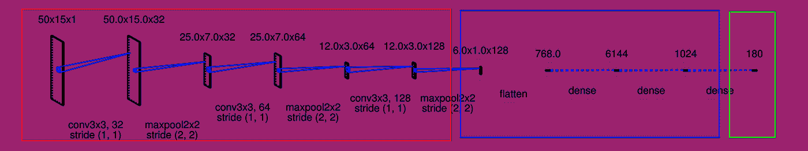

**Figure 8**: The Tasks are a bit different but not completely. So we can use low level features as they are (**R)** and fine tune the upper ones (**B**)

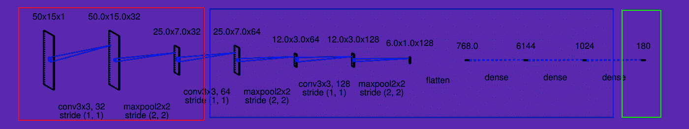

**Figure 9**: Variation of the above case

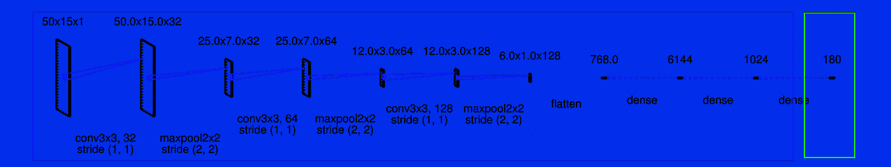

**Figure 10**: Tasks are very different. So we don’t want to use any of the pretrained weights as such. So we fine tune them and hence only **B.**

那么在我们的案例中，我们将使用哪一个呢？？最后一个。

绿色部分的修改非常直观。由于两个任务的字长不同以及其他不同，原始分类器需要重新学习以输出 6 个字母而不是 5 个。该分类器的输入是提取到瓶颈层的特征(即通过 **R** 和 **B**

> 对于 **R** 和 **B** 部分，架构(即层及其神经元的数量)应该保持不变，因为恢复的权重矩阵的尺寸应该与之兼容。但是，绿色部分可能与原始模型不同。对我们来说，我们不需要额外的层。只有输出层神经元需要修改。

这是任务 B 的模型的样子(图 11)。除了输出层，每一层都保持不变(架构，而不是权重)。

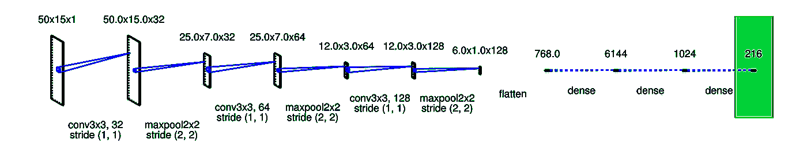

**Figure 11**: Model architecure for Task B

因此，我们微调我们的情况下所有层的权重。但是绿色部分的重量呢？我们是微调这部分的预训练权重还是随机初始化它们？稍后将详细介绍。

让我们继续看代码。

**定义图层**

用于训练任务 1 的原始模型中的第一卷积层如下:

当用于任务 2 时，相同的层看起来像:

增加的参数有:`kernel_initializer`、`bias_initializer,`和`trainable`。前两个用于用预训练的权重初始化核和偏置权重。而第三个是声明我们是否想要修改该层的权重。

如果我们想做**微调**即 **B** 部分，`trainable = *True*`，否则为*假*如果想冻结权重并按原样使用这一层，则为 **R** 部分。

# 方法 2

除了`trainable`参数之外，导入图表和用预调整的权重初始化权重的步骤与上述相同，其替代方法如下所示。选择性训练和冻结层的第二种方法如下:

```
train_vars = tf.get_collection(tf.GraphKeys.TRAINABLE_VARIABLES,
scope="dense[12]")training_op = optimizer.minimize(loss, var_list=train_vars)
```

让我们假设我们只想训练输出和倒数第二层，而冻结较低的层。第一行获取密集层 1 和 2(倒数第二层和输出层)中所有变量的列表，这是要训练的变量。这忽略了其余层中的变量。接下来，我们将这个有限的可训练变量列表提供给优化器的 minimize()。其余的层现在被冻结了:它们在训练中不会移动(这些是冻结层)。

# 观察

理论到此为止。是时候做一些令人兴奋的事情了。让我们调整一些常见的参数，通过绘制图表来比较和研究它们的效果。

让我先描述一下传说；准确度分两级计算:
字符级(橙色线)= *正确预测的字符数/样本中的字符总数*
单词级(绿色线)= *正确预测的完整单词数/样本总数*

例如:如果实际单词是“xmladj ”,而预测单词是“xmladt ”,那么单词级别的准确度= 0，字符的准确度是 5/6。蓝线代表字符级训练精度。所以，简而言之，你要观察主要是绿色的线。我们开始吧！！

1.  **可训练层数的影响**

**左**:只训练最后一层。其余的都冻结了。
**右**:所有的层都是可训练的，并且可以微调。

**Figure 12**: **Left** : Only the last layer is trained. Rest all are frozen. **Right** : All the layers are made trainable and are fine tuned.

*直觉:*
由于图像差异较大，仅重新训练输出层是不够的(左图)。低层次的特性也需要轻微的改变，因此微调所有的层就可以了。

**2。学习率的影响**

**左**:学习率= 0.001。
**右**:学习率= 0.0001。

**Figure 13**: **Left** : Learning rate = 0.001\. **Right** : Learning rate = 0.0001

*直觉:*
学习率指导我们朝着最优点迈出多大的步伐。较低的学习率(R)需要更多的历元数，但收敛速度与较高的学习率一样好。但是一般来说，保持任务 2 的学习速率小于任务 1 的学习速率是更可取的。这是为了确保大梯度更新不会扭曲预训练权重值。所以我们首先让重量稳定下来，然后让它向内层传播。

**3。最后一层初始化 vs 未初始化**

对于这两种情况，除了输出图层之外的所有图层都被冻结。
**左**:即使输出层也用预训练的权重初始化并微调。
**右**:输出层从零开始训练，即初始权重随机。

**Figure 14**: **Left** : Even the output layer is initialized with the pretrained weights and fine tuned. **Right** : The output layer is trained from scratch ie with random initial weights.

*直觉:*
等等。什么？？图表完全一样！！。有趣的是，这意味着输出层的预训练权重(L)并不比随机权重(R)好。这是因为图像差异很大，以至于预先训练的权重没有用。

**4。样本数量的影响**

**左**:样本数 50
**右**:样本数 200

**Figure 15**: **Left** : Number of samples 50\. **Right** : Number of samples 200

直觉:但值得注意的是，与 200 个样本的情况相比，50 个样本的情况下测试精度波动很大。这是因为批次大小与样本数量相同。由于较小的批量导致更频繁的重量更新，而没有观察到合理的大量数据，该模型无法确定其预测，因此出现了这一观察结果。

# 摘要

1.  通常，原始模型的输出层应该被替换，因为它很可能对新任务毫无用处，甚至可能没有新任务的正确输出数量。
2.  类似地，原始模型的上面的隐藏层不太可能像下面的层一样有用，因为对新任务最有用的高级特征可能与对原始任务最有用的特征显著不同。您希望找到要重复使用的正确层数。
3.  尝试首先冻结所有复制的层，然后训练您的模型，看看它的表现如何。然后尝试解冻一两个顶部隐藏层，让反向传播调整它们，看看性能是否有所提高。训练数据越多，可以解冻的层就越多。
4.  如果您仍然无法获得良好的性能，并且只有很少的训练数据，请尝试删除顶部的隐藏层，并再次冻结所有剩余的隐藏层。您可以迭代，直到找到要重用的正确层数。如果您有大量的训练数据，您可以尝试替换顶部的隐藏层，而不是删除它们，甚至添加更多的隐藏层。

# 参考

我能找到的一些最好的资源:

**博客:**

1.  史丹福的 cs 231n:【http://cs231n.github.io/transfer-learning/ 
2.  塞巴斯蒂安·路德:【http://ruder.io/transfer-learning/】T4。迁移学习的良好起点。
3.  [http://cv-tricks . com/tensor flow-tutorial/save-restore-tensor flow-models-quick-complete-tutorial/](http://cv-tricks.com/tensorflow-tutorial/save-restore-tensorflow-models-quick-complete-tutorial/)。保存和恢复 tensorflow 模型的好教程。

**论文:**

1.  [深度神经网络中的特征可转移程度如何](https://arxiv.org/abs/1411.1792)
2.  [迁移学习调查](https://web.kamihq.com/web/viewer.html?source=extension_pdfhandler&file=https%3A%2F%2Fpdfs.semanticscholar.org%2Fa25f%2Fbcbbae1e8f79c4360d26aa11a3abf1a11972.pdf)

**书籍:**

1.  使用 Scikit-Learn 和张量流进行机器学习。这本书对迁移学习有很好的介绍。

这还不是全部。但足够让你开始了。如果你觉得我错过了什么，或者你有任何澄清，请留下你的评论。

还有对了，别忘了转移你的*转移学习。*