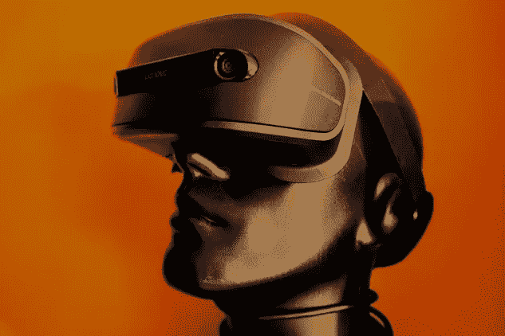

# 超人类主义——未来时代的幽灵哲学

> 原文：<https://medium.com/hackernoon/transhumanism-ghost-philosophy-of-a-future-age-3034ab2dd170>

## 超人类主义是一个新的代名词，因埃隆·马斯克(Elon Musk)和商界其他未来主义者的商业冒险而流行开来。让它如此迷人的是，这项技术——至少在某些形式上——已经存在。我们现在需要做的就是把它和人类结合起来，然后这将是一场通往巅峰的竞赛。但是到底是什么的顶部呢？

Will there come a time when man and machine are integrated into a transhumanist ideal? Photo by [coincidence](https://unsplash.com/photos/OIkcRmlRbsM?utm_source=unsplash&utm_medium=referral&utm_content=creditCopyText) on [Unsplash](https://unsplash.com/search/photos/robots?utm_source=unsplash&utm_medium=referral&utm_content=creditCopyText)

我们已经看过了所有的电影，不是吗？ [*AI:人工智能*](https://www.imdb.com/title/tt0212720/) *、* [*I、机器人*](https://www.imdb.com/title/tt0343818/) 以及 2018 年的 [*升级*](https://www.rottentomatoes.com/m/upgrade_2018) 。人体增强。科技创造了我们成为超人的潜力。超越我们所认为的能力，正如*智人*智人一样，是可能的。

这一立场的反对者——来自世界上有组织的宗教的神创论者以及具有保守倾向的人——反对人工智能的技术进步，就像他们是大蒜的吸血鬼一样。

> 我们不知道我们害怕什么。

谁也不能责怪他们。谁知道未来会从那些头脑足够灵活、能够带来技术革命的人那里得到什么呢？

> 不管我们喜不喜欢，超人类主义正在迅速逼近。

今天，大企业正在向人工智能(AI)投入数十亿美元，不知道它将走向何方，但仍然对此感到兴奋。高度独特而又先进的技术的融合将创造出一个很快就会面目全非的怪物。当这种情况发生时，我们的物种将如此依赖创新，以至于我们将通过我们的神经网络与基于机器的人工智能的融合过程，成为一个统一的现象。身体上和神经上整合成一个可操作的实体。

> “随着时间的推移，我认为我们可能会看到生物智能和数字智能更紧密的融合。”
> 
> -埃隆·马斯克

在接下来的二十年里，人类将会和我们所创造的技术创新一样发展和进化。在所有这三个方面:心理上，身体上和行为上，我们作为一个物种，将基于我们对自身技术进步的相互依赖而得到增强。

A transhumanist person, perfect in every way. Photo by [Markus Spiske](https://unsplash.com/photos/q8ajgadT6Lc?utm_source=unsplash&utm_medium=referral&utm_content=creditCopyText) on [Unsplash](https://unsplash.com/search/photos/robots?utm_source=unsplash&utm_medium=referral&utm_content=creditCopyText)

随着时间的推移，这种进化变化将对我们生活的其他领域产生影响，如我们在社会中的行为、治理、商业关系和传统道德价值体系。

在斯坦尼斯拉夫·莱姆的《星际日记》*中，飞行员艾昂·蒂奇的第二十一次航行讲述了*的故事，“一个在自同构主义者的一千年统治后实现了完全的身体和精神可塑性的文明”*虽然这个故事只是娱乐性的科幻小说，但它在一定程度上承认并展示了潜在技术在创造一个超越生物和进化可能性限制的人方面的作用。*

**

*Stanislaw Lem, science fiction writer. Source: WikiCommons*

# *增强假说*

*在未来，人类的身体会变得更强壮、更聪明。我们将在植入物方面超越我们目前的能力，可穿戴应用将成为常态。宇航服将给我们巨大的力量，让我们实现过去只能梦想的事情。我们将能够通过植入我们耳朵的语言翻译器用他们的母语与韩国人交谈，并通过植入我们的虹膜来拍照和录制电影。我们大脑中的微芯片将连接到我们的神经网络，然后直接连接到假肢或其他外部仿生应用程序，以多种方式改善我们的生活。*

*人工智能将呈现给我们的每秒计算数百万复杂问题的能力将使这一梦想成为现实。机器学习将给予我们超能力，与人工智能合作，与脑机接口(身体质量指数)合作，有时被称为脑机接口(MMI)以及其他一些术语，可以打开前所未有的渠道。*

> *但是在表面之下隐藏着一些错误。*

*许多人担心人工智能和其他形式的技术创新的进步有一天会取代对人类的需求。人类在社会中的角色将是短暂的，最终将由机器人控制。埃森哲首席技术和创新官保罗·多尔蒂(Paul Daugherty)对此持超人类主义立场，他认为人工智能在我们生活中的优势将在[“培训师、解释者和维持者”领域为人类创造就业机会。](https://sloanreview.mit.edu/article/will-ai-create-as-many-jobs-as-it-eliminates/)*

> *隧道尽头的光。*

# *快速的思维过程*

*目前，像脸书和 T2 这样的大企业正在开发将有效改变人类交流的脑机接口。语言话语，以及我们使用这些交际操作的方式，此时受到许多因素的限制，包括我们说话的速度和我们在任何时候可支配的字数。这与徒手写字或在电脑上打字是一样的:我们一秒钟/分钟能写和打的单词是有限的。人类在生理上有无法超越的极限。然而，BMI 将能够改变这一点，并在许多认知领域给我们带来更快的速度和更高的准确性:*

## *BMI 可以:*

*   *增强“内部认知机制”，即我们的记忆如何通过更好地组织通过经验和感官体验传入我们大脑的编码数据来发挥作用，然后将其系统地存储起来，以便于流畅地检索*
*   *雷·库兹韦尔(Ray Kurzweil)支持用“混合思维”改善人类基本交流工具的“外部认知机制”，他认为人类和网络智能的合作将导致更大的语言能力增强，未来我们不仅会被其他人理解，也会被机器智能理解。随着微软 Cortana、苹果 Alexa 和其他第一代人机双向交流聊天机器人的出现，这一点已经部分实现*
*   *使用连接在人类和人工智能应用的神经网络之间的生物传感器植入物，改造我们的嗅觉和触觉感官模式*
*   *增强我们对时间和空间的多维模式的理解和认知功能，如果应用正确，这可以赋予我们 360 度视觉的能力*
*   *让我们——尽管这是成功植入身体质量指数系统的一个明显优势——提高思维速度和解决问题的能力*

# *移情革命*

*虚拟现实，以及我们对它的接受，将在未来发挥主导作用，当它通过给我们一个独特的视角来看待他人的生活和行为，让我们与他人产生共鸣。人类的神经通路将被 BMI 联系起来，让我们对其他人的思维和理性有一个独特的视角。人们希望，这将使我们更容易受到他人的灾难、信仰和价值体系的影响。而且，如果使用得当，可以阻止战争、苦难和其他在 21 世纪初似乎太常见的人为疾病。*

> *“人工智能是让机器做一些如果由人来做则需要智能的事情的科学”*
> 
> *——[马文·明斯基](https://en.wikipedia.org/wiki/Marvin_Minsky)*

***情商，以及一个人表现出来的情商水平，可能在一个人对虚拟世界所展现的外部现象学对象的反应中发挥关键作用。至少在理论上，情商水平较高的人能够更好地回应他们人类行为特征视野中的物体发出的信号，例如呼吸模式、语调和眼神交流等。***

**

*Napalm victim during the Vietnam War. We have become too desensitized to war. Maybe experiencing it through VR will bring us closer to the victims’ own lives. Source: Wikipeida*

*通过虚拟现实技术，让人们有机会忍受——比如说一场战争及其所有可怕的后果——可以让他们对他们经历的虚拟体验产生共鸣，然后希望这将改变他们的政治信仰以及他们对自己国家的好战倾向的看法。这可能会改变一个人对其国家外交政策的个人看法，对难民的态度以及他们如何看待和花钱。*

# *生意，生意，生意*

*继《金钱》之后，未来学家认为人工智能将发展工业领域，智能工厂将成为常态。人们将与他们的人工智能同行合作，以提高他们的生产率，并提供关于工作表现的建议，以及人工智能在个人目标和表现的任何领域提供一对一的培训和指导。在董事会中，当董事和经理在某些职能上被人工智能部分取代时，人类领导也将发生转变。*

**未来几十年，先进的机器学习也将使通过复杂的算法追溯研究和分析过去的使用案例和市场趋势的历史统计数据变得更加容易，并将其用于未来预测。量子计算机形式的更先进机器的应用将使这一问题变得更加复杂。**

# *人类超人类的最终目的地*

*FReid rich Nietzche[*übermensch*](https://www.britannica.com/topic/superman-philosophy)*超人哲学可能很快就会到来。我们身体的技术增强并不是一个新理论。改进自我是人类的天性，也是几个世纪以来众所周知的目标。**

> **“他们相信我们能够也应该根除衰老这一死亡原因；我们可以也应该利用科技来增强我们的身体和头脑；我们可以也应该与机器融合，最终按照我们更高理想的形象重塑我们自己。”**
> 
> ****—《成为一台机器**[***:遭遇后人类未来***](https://wellcomebookprize.org/book/be-machine)****的作者马克·奥康奈尔******

******为此，我们正在为自己创造更好的生活，至少从物质上来说。通过融合我们的身体，即仿生/机器人应用的生物和解剖部分，我们将默认地创造一个具有更大体力和更大智慧的存在。更不用说延长的寿命，如果与我们将被集成的机器的生命周期一致，我们可能会达到不可估量的年龄。******

> ******很遗憾迈克尔·杰克逊不能活着看到这一幕了！******

********然而，我们真的要往这个方向走吗？********

******由于显而易见的原因，这种方法对我们未来的好处，对于人类发展和我们能够控制和理解我们的环境的方式来说，可能是天文数字。然而，由此而来的是伦理和进化领域的困境。******

******当我们谈论老年人、精神残疾者或体弱者，延长他们的生命，或者至少让他们在困境中感到更舒适时，这种关于更发达人类的超人类梦想都是美好的，但我们其他人呢:年轻、强壮、聪明的哈佛毕业生，没有健康问题，当然也没有精神障碍。******

> ******然后呢？******

******我们只是在没有损坏的东西上进行改进吗？我们相信这会让我们成为更好的人吗？******

******许多人都这样做。******

******随着超人类主义的支持者如愿以偿，尤塞恩·博尔特保持了 10 年的 9.58 秒 100 米世界纪录不会再保持很长时间了。******

******仿生人——要么植入碳纤维，要么进行其他令人眼花缭乱的技术创新，比如马斯克的神经系带概念:******

> ******“…你有你的边缘系统，皮层，然后是数字层，有点像皮层上的第三层，可以很好地与你共生…与你的皮层神经元的某种接口…通往你所有神经元的完整道路。”******

******激动人心和令人恐惧的程度相当。在接下来的几年里，技术领域的事情将会前所未有地升级。******

******所以，朋友们，系好安全带，因为我们要去的地方不需要道路！******

************

******Maybe one day we will have 360-degree vision. Photo by [Liam Charmer](https://unsplash.com/photos/Aifb5-daBPs?utm_source=unsplash&utm_medium=referral&utm_content=creditCopyText) on [Unsplash](https://unsplash.com/search/photos/robots?utm_source=unsplash&utm_medium=referral&utm_content=creditCopyText)******