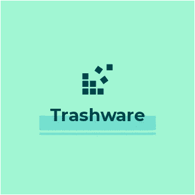
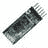

# 垃圾桶——IOT 重新定义

> 原文：<https://medium.com/hackernoon/trashware-iot-redefined-306058cc48b9>

垃圾桶是一个旨在通过智能设备清洁环境的项目。

Trashware

# 这个项目中使用的东西

> 硬件组件-

Arduino UNO&genu ino UNO×1

超声波传感器— HC-SR04(通用)×1

HC-05 蓝牙模块×1

SG90 微伺服电机×1

> 软件应用和在线服务

[Arduino IDE](https://www.hackster.io/arduino/products/arduino-ide?ref=project-6549f5)

[OpenCV](https://www.hackster.io/opencv/products/opencv?ref=project-6549f5)

# 故事

在这个项目中被黑的设备使用图像识别来识别可回收和不可回收的废物，并将它们分成两个不同的垃圾箱。

> *硬件*

以下零件用于构建此项目-

*   Arduino UNO
*   超声波传感器— HCSR04(通用)
*   HC-05 蓝牙模块
*   SG90 微型伺服电机

> *软件*

以下软件包用于支持该项目-

*   Arduino IDE
*   OpenCV
*   计算机编程语言
*   Clarifai REST API

> *如何构建*

*   根据`ultrasonic_with_bluetooth/ultrasonic_with_bluetooth.ino`文件中的配置连接超声波传感器和蓝牙模块。
*   将`.ino`文件上传到 Arduino 并连接到您的电脑。
*   现在配置软件部分。在项目目录中，运行以下命令-
*   `virtualenv Trashware`
*   对于 Windows — `cd Trashware/Scripts && activate`
*   适用于 Linux 和 Mac — `source Trashware/bin/activate`
*   现在运行终端中的`Main_Program.py`
*   如果一切顺利，那么程序会在屏幕上显示超声波传感器的读数。您还可以通过下载 arduino 仿真器来查看 Android 或 IOS 设备上的传感器读数。
*   如果物体保持在超声波传感器前方 30 厘米的范围内，那么`Webcam_Capture.py`通过连接到计算机的网络摄像头捕捉图像，`Image_Prediction.py`预测捕捉到的图像并将其分类为可回收或不可回收。
*   如果物品是可回收的，那么伺服电机将向右旋转 45 度，将其倾倒在可回收箱中。如果物体是不可回收的，那么伺服电机向左旋转 45 度，将其倾倒在不可回收箱中。

> *注意——伺服电机的代码将在以后的提交中添加。观察存储库的变化。*

如果你愿意，可以分享和分享这个项目。
*随意拉请求和开放议题。*

# 源代码

# prakhargurunani / [垃圾桶](https://github.com/prakhargurunani/trashware)

2019 年 4 月 11 日对**主**分行的最新承诺

[**下载为 zip**](https://github.com/prakhargurunani/trashware/archive/master.zip)