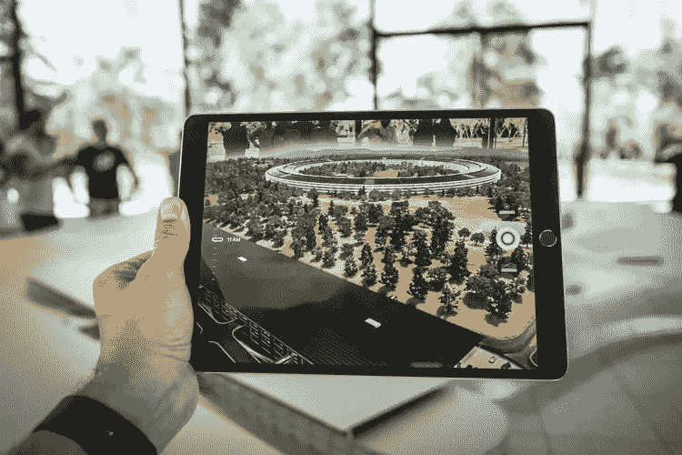
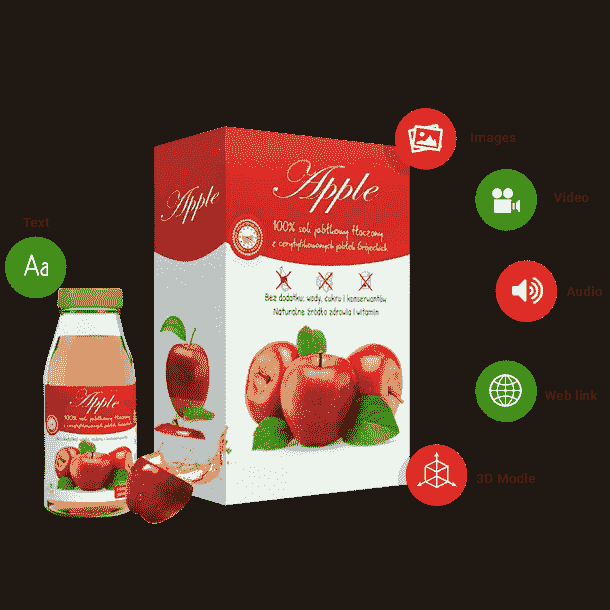
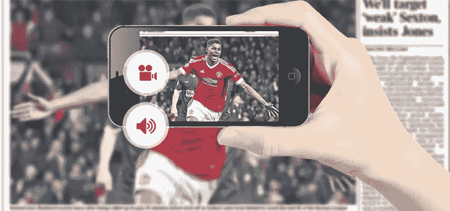

# 印刷媒体行业的增强现实广告正在发生什么？

> 原文：<https://medium.com/hackernoon/trends-of-augmented-reality-advertising-in-print-media-industry-2c773bf46d7>

pic credit: [https://unsplash.com/@steve_j](https://unsplash.com/@steve_j)

印刷媒体非常有效，因为它允许零售商与顾客联系，并向公众传播他们的信息。

黄页、传单、目录和电子邮件等印刷媒体成为接触客户的首选方式。

先进的增强现实技术出现后，企业发现了一种接近用户和客户的创新方式。现在，各大品牌利用面向印刷媒体的增强现实应用来介绍他们的商业宣言。

[AR 解决方案](http://www.quytech.com/augmented-reality.php)允许用户扫描与品牌相关的相关内容。因此，AR 帮助用户体验品牌及其服务的广告的虚拟形式。

> 随着时间的推移，增强现实技术变得越来越普及，这就是为什么三分之一的企业都在整合他们的广告策略。

在印刷活动的 [AR 的帮助下，](http://url.whate.ch/10d4d)它再次站在了市场营销的最前沿。企业正在利用 AR 技术制造热潮，使购物变得更加有趣、迷人和令人兴奋。这也意味着企业的更大销售，帮助他们掌握涉及 AR 的印刷项目。

## **如何在广告中使用增强现实来推动平面媒体**

为了增强客户体验和参与度，品牌正试图推出 AR 应用来宣传他们的服务。印刷媒体中的 AR 解决方案允许消费者查看具有动态颜色和纹理的产品的 3D 设计。

> **通过集成 AR 技术，商家允许用户扫描特殊标记的平面广告，开始通过移动设备与全息风格的内容进行互动**。

pic credit: [https://unsplash.com/photos/87oz2SoV9Ug](https://unsplash.com/photos/87oz2SoV9Ug)

这些 AR 解决方案为用户提供了难忘的体验。

这吸引了用户更多地体验解决方案，从而间接促进了企业的销售。因此，增强现实应用改变了你公司的视觉形象。通过添加视觉层和添加游戏元素，可以启动具有沉浸式体验的增强现实运动。

印刷媒体的 AR 应用程序将吸引客户的所有注意力。因此，它可以使您的业务解决方案看起来令人难以置信，比以往任何时候都更有吸引力。

## **平面媒体增强现实广告应用的趋势。**

1.  **增强现实包装活动**

***增强现实为营销人员打开了新的大门，让他们能够对客户产生有效的影响。***

它可以作为传统营销策略的补充，来吸引你的潜在客户。广告中的增强现实正在帮助包装行业在用户更个性化的情感层面上推广产品。它有助于用户了解使包装 AR 应用程序更加个性化的业务。

借助增强现实广告活动，客户将看到覆盖在贵公司产品上的数字信息。它通常包括动画 3D 图像或视频，让客户感受、思考并做出决定。

## **2。带沉浸式屏幕的 AR 广告**

增强现实为品牌提供了身临其境的前景，提高了用户的品牌意识。那些想要了解产品更多信息的用户可以将特定品牌的 AR 广告应用可视化。它将现实插入到静态图像中，刺激用户利用体验。

***这些身临其境的屏幕用于印刷媒体和营销活动，增加产品到达选定目标的机会。*** 因此，通过实现增强现实，客户看到自己被虚拟生物包围，他们用真实的情感体验。

## **3。印刷媒体中的增强现实**

***通过在印刷媒体中集成 AR，将视觉内容带入另一个维度。*** 3D 模型、图像、视频可以带来新的机会，因为平面媒体中的 AR 应用程序可以为品牌印刷媒体的任何页面带来活力。杂志、小册子、传单添加了增强现实，以身临其境的体验推动营销活动。

大品牌使用的 3D 建模器为这种增强现实应用程序创建 AR 内容，以便用户可以一起阅读和查看所有内容。用于构建 AR 应用程序的简单而动态的 3D 动画充当品牌营销的复杂应用程序。

**底线**

到目前为止，很明显，印刷媒体的增强现实可以为您的品牌活动增加另一个维度[印刷媒体的增强现实](http://www.quytech.com/augmented-reality-in-publication.php)为商业印刷媒体增加价值。因此，随着时间的推移，AR 变得越来越容易获得，用户也越来越了解 AR 概念。因此，广告市场的增强现实允许在印刷、数字和现实世界之间建立强有力的联系。

感谢您阅读我的文章。如果您有任何问题，请随时给我发电子邮件。你也可以通过 Linkedin 联系我。也可以在 [Twitter](https://twitter.com/quytech) 关注我。

*最初发表于*[*【www.whatech.com】*](https://www.whatech.com/mobile-apps/blog/545323-trends-of-augmented-reality-advertising-apps-in-print-media)*。*