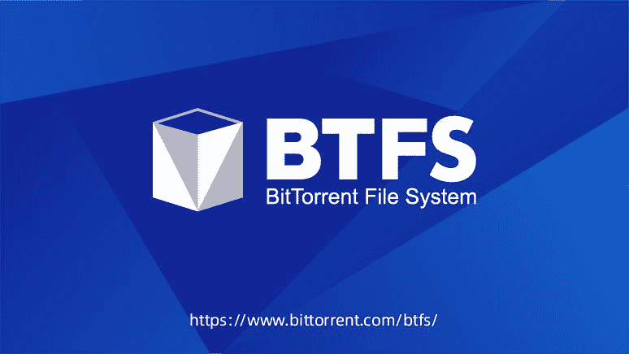
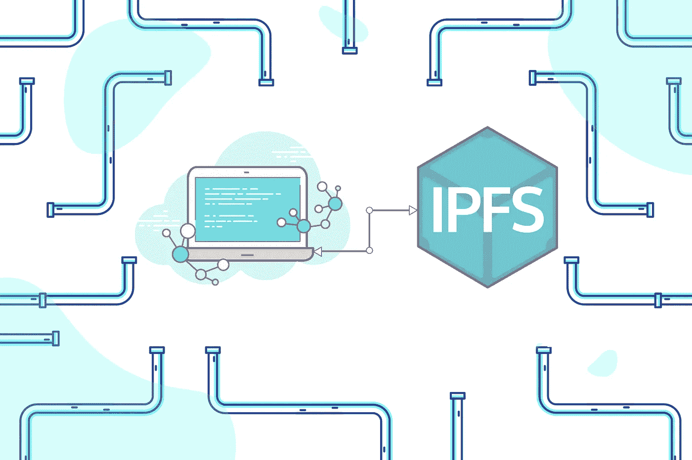

# 创展示基于 IPFS 的新 BitTorrent 文件系统

> 原文：<https://medium.com/hackernoon/tron-reveals-new-bittorrent-file-system-based-upon-ipfs-7492a3d17b21>

TRON 最近与 BitTorrent 合作发布了新的分散存储系统，称为 BitTorrent 文件系统(BTFS)。分散存储系统基于众所周知的星际文件系统(IPFS)。

最初，BitTorrent 发布于 2001 年，是基于互联网的文件共享的先驱之一。现在是 2019 年，BitTorrent 再次寻求彻底改变我们共享数据的方式，以及如何激励用户使用区块链技术参与 BitTorrent。

# IPFS 简介

最初，IPFS 是基于 Filecoin ICO 项目，该项目最初筹集了 2.5 亿美元，主要投资者包括 Y Combinator，Naval Ravikant，Andreessen Horowitz，Union Square Ventures Sequoia 和文克莱沃斯资本。考虑到他们筹集了多少资金，我们可以看到对分散投资的明确需求和兴趣。目前，最成熟/最受支持的项目之一是 IPFS 项目。

在其核心，IPFS 是一个版本化的文件系统，存储文件及其各自的版本，非常像 Git。它还定义了关于如何在网络上存储和分发文件的规则，使其成为一个分布式文件系统。

网络中的每个文件都可以通过 IPFS 协议使用内容地址系统来访问，而不是使用 HTTP 请求来请求数据。IPFS 生态系统中的文件由其哈希定义，哈希构成了内容地址系统的基础。这个散列定义了一个对象的根，其他的可以在它的路径中找到。

IPFS 最酷的一点是你请求的数据被访问的方式。每当您请求一个文件时，协议将查找哪些节点保存了所需的数据。它将从离你最近的节点请求文件，而不通过中央服务器。

简而言之，IPFS 和 HTTP 的区别在于，HTTP 请求某个位置的数据，而 IPFS 请求某个文件的位置。

Source image: [District0x Education Portal](https://education.district0x.io/district0x-specific-topics/understanding-technology-behind-district0x/ipfs/)

# BitTorrent 文件系统怎么样？

TRON 在 6 月 30 日宣布他们的 [BitTorrent 文件系统(BTFS)](http://www.bittorrent.com/btfs/) 已经通过了所有的内部测试，并将很快推出。它将作为 BitTorrent 堆栈中的一个重要元素，以分散的方式存储文件。

和 IPFS 一样，BTFS 也是基于 BitTorrent 的最初想法，在 BitTorrent 中，数据是点对点共享的。有了 BitTorrent Speed，用户就有动力参与播种过程，以鼓励数据在网络中传播并减少下载时间。每当用户帮助在 BitTorrent 网络中播种数据时，都会受到 BitTorrent (BTT)令牌的激励。

除了支持 BitTorrent，BTFS 还将作为需要分散存储的 TRON dApps 的主要存储层。它将帮助 TRON dApp 生态系统向前发展，因为开发人员能够在 BTFS 中存储状态，并利用 TRON 不久前发布的新 TRC-20 令牌标准。

【BTFS 官方新闻稿可以在这里**。**

# *创建 btf 背后的原因是什么？*

*世界上最大的 P2P 网络 BitTorrent 仍然依赖于集中式 Torrent 文件分发。这些种子库容易出现安全漏洞、中断和审查。有许多攻击 torrent 主机 web 服务器降低服务可靠性的实例。通过利用 BTFS 的版本控制属性的 torrent 文件的分散存储库，用户可以更可靠地访问 torrent 文件。*

*传统的文件存储系统有许多固有的缺点，如集中信任、由单个机构或组织进行全面控制、政府实施审查的能力、高成本、锁定效应和低容错性。例如，维基百科自 2017 年年中以来在土耳其被屏蔽，但通过 BTFS，网站可以以分散的方式托管，以便抵抗审查。*

# *孙正义对 2019 年的愿景*

> *“BTFS 是我们创造一个去中心化的互联网的使命中的一个持续的步骤，让每个人都能分享网络商务的财富，”Jusin Sun 说。*

*Justin Sun 表示:“我们正在创建一个具有 BTFS、BitTorrent Speed 区块链集成和 BTT 公用令牌的平台，让用户在世界各地快速、私下地相互交流，而无需中间人或政府干预。”。*

**

*Image source: Justin Sun announcement via [CryptoGlobe](https://www.cryptoglobe.com/latest/2019/05/tron-foundation-announces-bittorrent-file-system-btfs-protocol/)*

*Justin Sun 希望消除中间商的原因是，所有经济利润的 36%是由收入超过 10 亿美元的前 1%的公司产生的。通过利用 TRON 和 BitTorrents 生态系统，他希望带回这些超额利润的一部分(来自广告销售、数据收集等。)通过增加对 dApps 的使用。*

*在 2019 年末，BTT 令牌将开始与 BTFS 网络集成，以激励创建一个健康、公平、高效的文件共享和存储市场。此外，在 BTFS 加速器培养数十个 BTFS dapp(2019 年第四季度)的同时，将推出一个全面的工具集，引领 BTFS 社区成长为业内最大、最活跃的社区之一。*

*目前，BitTorrent 拥有约 1 亿用户的活跃用户群，以及超过 1，000 个 TRON 完整节点。mainnet 计划于 2019 年第三季度向公众开放。TRON 希望通过此次发布利用其 dApps 生态系统，进一步扩大其用户群。*