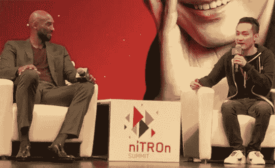
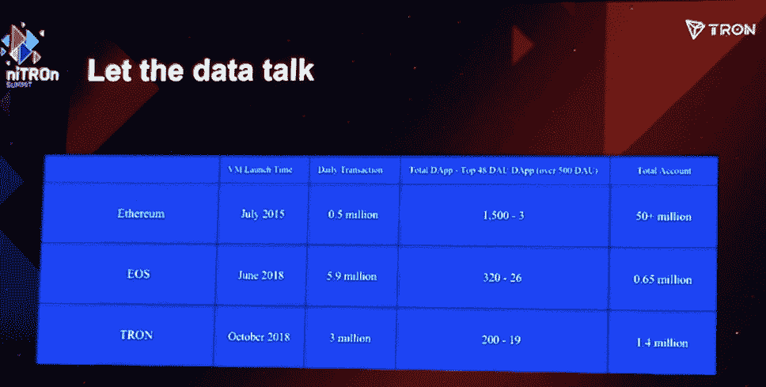
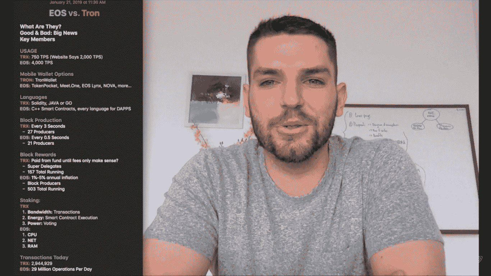
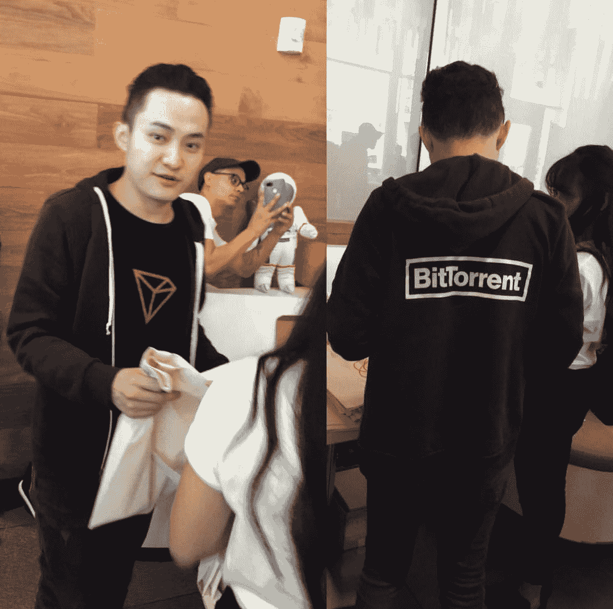

# 创峰会:BitTorrent 之战如何推动区块链的大规模采用

> 原文：<https://medium.com/hackernoon/tron-summit-how-bittorrent-will-drive-mass-adoption-for-the-blockchain-c9ac03590095>

## **BTT ICO 宣布 1 月 28 日空投，2 月 11 日空投**

*TRON CEO & Founder Justin Sun onstage with NBA legend Kobe Bryant at the Nitron Summit in San Francisco (photo credit: Martine Paris)*

根据 [ForbesCrypto Markets](http://www.forbescrypto.com/) 的数据，TRON 是上周一排名第三的热门货币，其加密货币 TRX 跃升 5.03%，目前是市值排名第九的加密货币。这紧随其首次亮相 [NiTROn 峰会](https://www.nitron.org)之后，上周在三藩市举行的开发者大会甚至给 EOS 社区中最持怀疑态度的人留下了深刻印象。

TRON 富有魅力的 28 岁首席执行官兼创始人 Justin Sun 在开场白中自豪地穿上他的 BitTorrent 连帽衫，讲述了它最近收购了开创分布式文件共享的传奇点对点网络，使其成为世界上最大的分散式生态系统。为了追求 BitTorrent 每月 1 亿的活跃用户，Sun 在去年上半年击败了其他几个区块链，包括 Neo，根据 Coindesk 的消息，Neo 出价 1.7 亿美元，比 TRON 的 1.2 亿美元高出近 5000 万美元。两家公司当时的市值差不多(Neo 为 15 亿美元，Tron 为 16 亿美元)，但 Sun 对加速上市的承诺帮助敲定了这笔交易。

在一个情绪激动的时刻，孙谈到了 2017 年 9 月 4 日 ICO 禁令在中国实施时 TRON 所经历的艰难时期，以及他们如何被迫在旧金山重新开始。孙[说](https://twitter.com/bitboy_hodl/status/1086311309308641280)“无论多糟糕，我们都不放弃。”

孙是福布斯 30 位 30 岁以下企业家之一，他创办了 Peiwo(中国的 Snapchat)，在 Ripple 开始了他的职业生涯，并得到了阿里巴巴创始人马云的指导。今年夏天，Variety 估计他在 TRX 的持股在 47.8 亿美元左右。只要看看电影《创》[预告片](https://youtu.be/gU6Jfz2jOHA)就能看到他在工作中的营销能力。这可能正是区块链消费者所需要的，以获得大规模采用。

TRON trailer, The Future is Now

专注于招募下一代区块链开发者来发展 TRON 生态系统，Sun 希望通过像最近的 100 万美元加速器这样的项目提供资金和用户获取支持，TRON 将成为开发者的首选平台。

**只能有一个**

TRON 开发者社区的负责人李葱直接针对 EOS，展示了一张幻灯片，上面只写着“#3”，他展示了一些数据来支持 TRON 现在是第三大开发者社区的说法。

*Cong Li, Head of Developer Community at TRON presenting stats at NiTron Summit in San Francisco last week (photo credit: Martine Paris)*

创创的闪电式扩张在中国是一种流行的商业策略，自一年前问世以来，一直是区块链开发商争议的焦点。以太坊的创始人 Vitalik Buterin 指责 TRON 公然[剽窃其白皮书，社区中的许多人继续对 Tron 的数字表示怀疑。](https://www.ccn.com/vitalik-buterin-continues-to-troll-tron-over-whitepaper-plagiarism-allegations/?fbclid=IwAR1_hmYHnm8WnctGjX_OAHAO3CmBCKINcjXKvuRI34S9DDTI5FtaO-rf9II)

在 NiTron 峰会之后，播客达拉斯·拉什，EOS 社交奖励应用 [KARMA](/@karmaapp/karma-version-1-is-now-live-daec207cfdcc?fbclid=IwAR3rJqFOF9JPLqkim0ZEAMuiUv8nfGT7Li9kx3mHiTs6lk_49nIz71eNpPs) 的创始人，仔细观察了这两个平台的统计数据。在他最近的[视频](https://www.youtube.com/watch?v=brYqvsd0XyY&feature=youtu.be&fbclid=IwAR2X1rUQt18l_0iDYBB51VOJLYpJw6ltYqgZLC4zf9Qb-T5UlSTLUFP5-Io)，*EOS v TRON:The Race To Mass Adoption，*中，他对钱包创建、每秒交易和其他关键指标的差异提供了宝贵的见解。

*Podcaster Dallas Rushing comparing EOS to TRON*

**关于 BitTorrent 的一切**

该节目最大的新闻是围绕 BitTorrent 的标记化的细节。

BitTorrent 令牌($ term)将于 2019 年 1 月 28 日上午 7 点(太平洋标准时间)在币安 Launchpad 独家发售，不包括美国、中国和其他受限制的司法管辖区，然后于 2 月 11 日空投给 TRX 持有者，未来六年每月继续空投。点击[这里](https://launchpad.binance.com/details.html?projectId=25)和[这里](/bittorrent/bittorrent-foundation-unveils-more-details-regarding-bittorrent-btt-airdrops-for-tron-trx-8bbd194f8a87)了解更多信息。$BTT 将允许 BitTorrent 的客户竞标并获得上游带宽的分配，然后用于购买内容，给直播表演者小费，以及在 BitTorrent 的直播功能推出后众筹新作品的创作，据 Sun 称，如果一切按计划进行，可能会在 2019 年的某个时候推出。

监管 BitTorrent integration(又名 Project Atlas)的贾斯汀·诺尔(Justin Knoll)表示，这是一个可选的扩展，缓解了那些不想参与新令牌经济的人的担忧。他在这里进一步解释了:

TRON’s Justin Knoll explaining the tokenization of BitTorrent

仍有一些人质疑 BitTorrent 将如何在一个令牌*有*和*无*的世界中前进。

我问 Consensys 的解决方案架构师 Pavan Katepalli，他是否认为 BitTorrent 的令牌化可行。

“我不这么认为，”他说，“因为 torrents 的用户正在使用它们，因为他们不想花钱，这个系统已经在没有任何资金进入的情况下工作了 15 年。人们免费共享文件。TRON 应该拥抱 BitTorrent 这样的大规模基础设施，并与 AWS 竞争。”他补充说，“代币可以激励人们分享不容易获得的内容，但他们也可能会购买或播放这些内容。当我还是个孩子的时候，我经常看动漫，我下载了整个系列，并持续分享了一年，因为我想帮助其他人观看。这就是 BitTorrent 拥有的那种社区。”

在 EOS 社区颇具影响力的弗雷德·克鲁格(Fred Krueger)是移动加密钱包 EOS Lynx 的创始人，他的看法稍微乐观一些。在他题为“关于创和 TRX 的一些想法”的脸书邮报上，他写道，“我在旧金山创峰会上…创实际上已经成功地建立了一个有效的 dApp 平台。许多在 EOS 上运行的同类应用在 Tron 上也运行良好。BitTorrent 收购可能会成功。Tron 将为这些每月 1 亿用户提供代币，用于优先服务/更好的下载等。这绝对是一个合理的想法，根据具体的实现，它可能会被一些人接受。即使是 1%的吸收也会使 Tron 比 EOS 大。这些年来，我学会了不要低估那些看起来斗志昂扬的公司。创很可能会内爆，BTT 的策略可能会失败，等等…但他们似乎正在进入一个与 EOS 和 ETH 完全正交的市场，并产生真实的数字。我会 100%密切关注此事。”

他补充道，“有趣的是，在会议上，许多用户根本没有听说过 EOS。平行宇宙。”

**Poppy 弹出窗口**

*Justin Sun at Poppy Pop-Up Shop taking selfies with fans and showing off swag available with the GRID Troncard. (Photo credit: Martine Paris)*

在“Token Economics”*演示期间， [Sesameseed](https://sesameseed.org/) 的联合创始人、TRON 超级代表 Juliun Brabon 宣布，预装 TRX 的 [GRID Troncards](http://troncard.io/) 正在分发给与会者，供他们在附近的 Poppy 弹出式商店使用。我没有机会激活我的卡，但我有机会与在场与粉丝见面并展示如何使用卡的孙正义自拍。目前处于私人测试阶段，GRID Troncard 正被推广为一种匿名购买、持有和消费 TRX 的方式，无需支付任何费用，也是一种在 TRX 丢失或被盗时找回它的方式。Poppy POS 允许零售商处理 TRX 支付，类似于 [Bitpay](https://bitpay.com/integrations/) 允许零售商接受预付 VISA 卡形式的比特币。这也可能是大规模采用的另一条途径。*

*优图伯·本·阿姆斯特朗(又名[小男孩](https://www.youtube.com/channel/UCjemQfjaXAzA-95RKoy9n_g)与我分享了他对这一消息的兴奋。“BTT 是一个很好的惊喜，我很想知道他们如何为罂粟寻找零售商。一旦亚马逊和沃尔玛开始接受加密，这将是一个游戏规则的改变。”*

**(我的文章预告为* [*《金融科技时报》*](https://thefintechtimes.com/tron-tokenization-bittorrent/)*1 月 26 日星期六发帖)**

*观看达拉斯狂奔， *EOS v TRON:大规模采用竞赛*:*