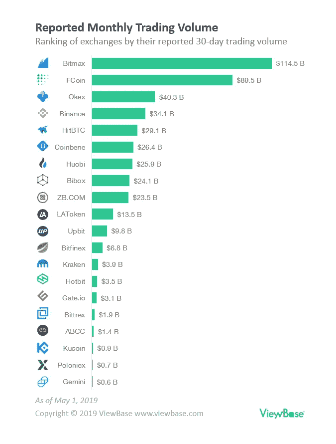
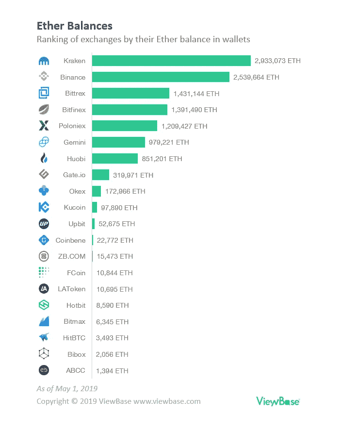
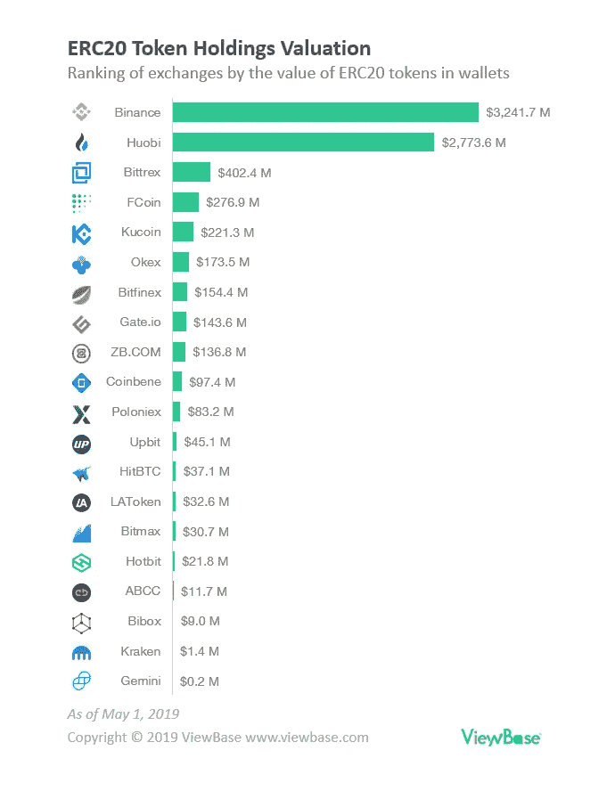
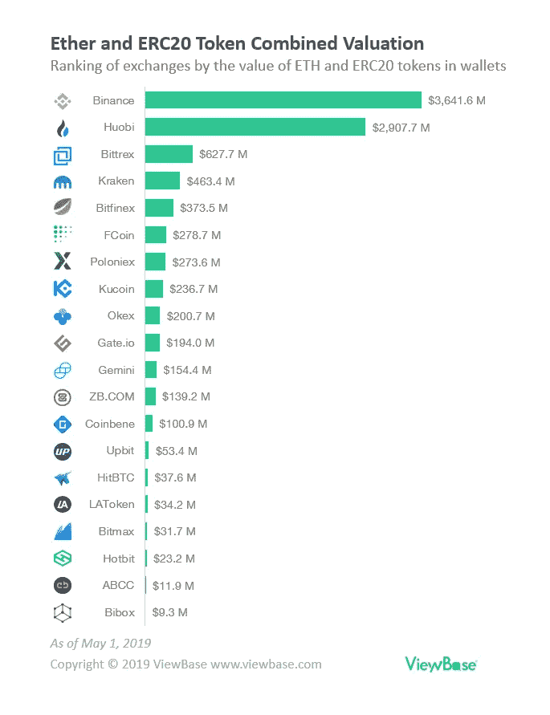

# 根据区块链数据对加密货币交易所进行真实排名

> 原文：<https://medium.com/hackernoon/true-ranking-of-crypto-exchanges-according-to-blockchain-data-40d55fac40d7>

"在淘金热期间，这是做扒手生意的好时机."—正如商业格言所说，过去一年，许多新的加密货币交易所涌现出来，以利用加密货币市场的淘金热。

令人惊讶的是，在报告的交易量方面，一些新来者似乎正在超越现有的参与者。许多新的交易所——包括 BitMax、Fcoin、Coinbene、Bibox、Fatbtc、LBank 和 Bibox——都报告交易量超过了币安、北海巨妖和 Bitfinex 等老牌交易所。

然而，有充分的理由对报告的交易量持怀疑态度。Bitwise Asset Management 最近的一份报告揭示了加密货币市场中伪造交易量的流行，根据他们的研究，伪造交易量占总交易量的 95%。2018 年 12 月，韩国一家主要交易所 UpBit 被指控编造价值 1.1 亿美元的交易量。

# 区块链从不说谎

为了找出加密货币交易所的真正排名，我们在 [ViewBase](https://www.viewbase.com) 向区块链分析公司寻求答案。

毕竟，区块链的关键优势之一是其透明度。不利用不断增长的区块链数据将是一种浪费。

在我们的研究中，我们查看了区块链以太坊各个交易所的钱包，分析了它们的以太币和 ERC20 代币的历史余额。

选择以太坊区块链是因为以太是市值和交易量第二大的加密货币。绝大多数初始硬币发行(ICO)代币也在以太坊区块链发行。

# 按 ETH 余额排列的交易所排名

我们根据交易所钱包中存放的乙醚量对交易所进行了排名，并将其与它们报告的交易量进行了比较。

按市值计算，以太是第二大加密货币，大多数交易所将以太作为与其他替代货币的主要交易对手。因此，我们预计一个交易所的乙醚平衡将合理地与其交易量成比例。否则，低余额但高交易量的交易所就是洗盘交易的典型标志。

可以看出，以太网余额和交易所报告的交易量之间存在巨大差异。

就乙醚平衡而言，北海巨妖、币安、Poloniex、Bitfinex、Bittrex 等老牌公司似乎仍保持着领先地位。

# 按 ERC20 代币余额进行的交易所排名

接下来，我们根据存放在交易所钱包中的 ERC20 代币的价值对交易所进行了排名。

绝大多数初始硬币发行(ICO)代币都是在以太坊区块链发行的，从 Omisego 这样的老牌项目到 Fetch 这样的最新 IEO 代币。AI 和 Celer。因此，我们预计存放在交易所的 ERC20 代币的估值与其报告的交易量成合理比例。

同样，ERC20 代币的估值与交易所报告的交易量之间存在巨大差异。

然而，除了通常的老牌玩家之外，也有新人进入顶级排名，如 Huobi、FCoin 和 Kucoin。

这是有道理的，因为这些较新的交易所被称为 altcoin 交易所，用户在那里交易小型加密货币，而北海巨妖和波洛涅克斯等老牌交易所被称为菲亚特网关，用户在那里交易大型加密货币，如以太。

# 按 Ether 和 ERC20 令牌的组合价值进行的交易所排名

最后，我们计算了交易所钱包中持有的 Ether 和 ERC20 代币的总价值，以获得交易所排名的更完整的图片。

使用此指标，我们将排名靠前的交易所确定为:

1.  **币安**
2.  **霍比**
3.  **Bittrex**
4.  **北海巨妖**
5.  **Bitfinex**
6.  **FCoin**
7.  **波洛涅克斯**
8.  **库币**
9.  **好的**
10.  **Gate.io**

# 区块链数据和报告量的差异

为什么报告的交易量和区块链的数据有如此大的差异？有几种可能性，从最坏的情况到最坏的情况:

1.  算法交易机器人:这是最乐观的可能性。做市算法机器人可能会积极交易并相互竞争，尽管缺乏流动性，但仍能产生高交易量。
2.  保证金交易:一些交易所，如 FCoin，提供杠杆交易，允许用户通过从交易所借款进行超过他们拥有的交易。
3.  **缺乏用户信任**:用户在交易所交易，但他们对交易所的信任不足以将他们的资金留在交易所的钱包里。
4.  **秘密交易**:控制着大量密码供应的交易商或实体可能在进行自我买卖，以制造一种虚假的购买活动假象。
5.  这是最坏的情况，但也是最有可能的。新交易所报告称，交易量完全是凭空捏造的。他们有强大的动机伪造交易量，因为 coinmarketcap 是加密货币交易商的热门网站，更高的排名可以吸引更多用户。

# 弱者的崛起

我们的研究证实了虚假交易量的普遍存在，老牌公司——北海巨妖、币安、Poloniex、Bitfinex、Bittrex——仍处于领先地位。

然而，它也揭示了一个新兴的交易所群体，这些交易所的排名正在上升，用户对它们的信任足以将大量密码存入他们的交易所钱包。

这些交易是:

1.  火币
2.  FCoin
3.  库科恩
4.  Gate.io

老牌交易所不应急于将这些较新的交易所斥为伪造交易量，并考虑更认真地对待这些竞争对手。

# 可信度和信任在加密中仍然很重要

> 你希望这些消息保密多久？…只要人类还能作恶，我就希望它们能一直保持秘密。
> 
> —尼尔·斯蒂芬森，Cryptonomicon，1999 年

虽然听起来很讽刺，但加密货币领域的大部分仍然依赖于老式的信任和可信度。当大多数加密项目和交换处于法律执行的灰色地带(或者至少在 SEC 管辖范围之外)时，信任就更加重要了。

透明度是建立信任和信誉的必要因素。但正如最近的 Bitfinex/Tether 戏剧所展示的那样，许多加密空间仍然笼罩在秘密甚至欺骗之中。

区块链的设计本质上已经是透明的，但除非投资者能够分析和理解区块链的数据，否则问责制仍将难以实施。我们在 [ViewBase](https://www.viewbase.com) 正在采取措施解决这一差距，我们的目标是建立一个更加健康和值得信赖的密码行业。

*不使用集中保管钱包的交易所(如比特币基地、Bitstamp)不包括在本研究中，因为跟踪成千上万个人用户钱包中的余额在技术上具有挑战性。*

如果任何交易所希望挑战我们的研究结果，请与我们(viewbase.com 团队)分享您的以太坊钱包地址，我们将更新我们的研究结果。

*更多详情以及本次研究中使用的以太坊钱包地址列表，请查看:*[*https://www.viewbase.com/coin/ethereum*](https://www.viewbase.com/coin/ethereum)