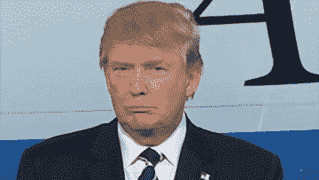

# 特朗普的比特币大战

> 原文：<https://medium.com/hackernoon/trumps-bitcoin-beatdown-a847f5026fb7>

## 总统的最新推文预示着比特币和加密货币的末日。那就不奇怪了

Photo by [David Libeert](https://unsplash.com/@deefbelgium?utm_source=unsplash&utm_medium=referral&utm_content=creditCopyText) on [Unsplash](https://unsplash.com/search/photos/graffiti-trump?utm_source=unsplash&utm_medium=referral&utm_content=creditCopyText)

# 听着，伙计们！

当然，他不会。很明显，不是吗？任何与他的权力基础，他在世界上的地位相违背的事情，都要付出代价。

因此，没有人对特朗普总统最近关于加密货币特别是比特币的推特风暴感到惊讶:

> 我不是比特币和其他加密货币的粉丝，它们不是货币，其价值波动性很大，而且是建立在凭空之上的。不受监管的加密资产会助长非法行为，包括毒品交易和其他非法活动……”

钱不也是这样吗？

虽然他对其波动性的看法可能是正确的，但他对其如何促进非法行为的看法肯定是错误的(确实如此，但不超过菲亚特)，就像特朗普的宇宙中一直存在的那样，这是 100%干净和完全的胡说八道，是从他窃取灵感的其他一些金融大师那里回收的。

**他走得更远，批评脸书的** [**天秤座**](https://en.wikipedia.org/wiki/Libra_(cryptocurrency)) **虚拟货币，在激烈捍卫美元之前评论说“它几乎没有地位或可靠性”，但这是意料之中的，不是吗？**

尽管总统对脸书的左翼偏见不满，但这也可以被解释为只是一个烟幕弹。脸书可能会被指责为美国国家安全局最大的哈巴狗，是暗中监视美国民众的工具，实际上是特朗普的拥王者。

## 没有社交媒体帝国的协助，他会成为总统吗？

不过，现在让我们忽略猜测。

因为也许特朗普对天秤座来说根本不重要。政治家特朗普总有一天会离开人世，在退休后度过余生，或者继续经营他的商业帝国，直到他的金锁脱落，他倒下死去，而扎克将继续统治数字领域，如果下一任总统和下一任总统允许的话。

除了反特朗普的人群、自由意志主义者和那些厌倦了被在银行和其他金融机构工作的吃白食者压榨的普通人之外，这是特朗普对未来变化感到不安的一个迹象，这种现状的转变已经持续了太长时间，并利用了人们对本应照顾他们的机构的信任。

现在有了一种“货币”，一种独立于政治猫捉老鼠的全球游戏的交换模式，一群分散的节点坚定地反对自菲亚特成立以来他们一直在听的废话。

适可而止。

*不管他的观点如何，这最终对比特币有利。*

川普发表声明后不久，[比特币较前一天](https://www.independent.co.uk/life-style/gadgets-and-tech/news/trump-bitcoin-twitter-cryptocurrency-price-facebook-libra-regulation-a9001861.html)增长了 1%。

许多业内人士称之为特朗普泵，这是牙买加房地产公司最喜欢的白痴——我指的是儿子——的镀金推特对价格的意外看涨提振。

> 总统先生，请多批评！比特币国家为他的推特给他们带来的免费宣传而哭泣。

特朗普显然已经从白宫大厅里他的顾问们的窃窃私语中听到了足够多的信息，知道什么时候有什么东西在捣乱，破坏了几代人以来一直坚定不移的思维模式。

Source: Giphy

尽管许多菲亚特、美元和唐纳德·特朗普的支持者认为比特币和加密货币的社区和用例还不足以引起翻天覆地的变化，随着越来越多的政治家、商界人士和好莱坞影响者不断加入加密潮流，它可能会看到未来政治格局的变化。

虽然总统对加密货币的态度并不令人惊讶，但这可能是其他世界领导人效仿的开始，他们会竭尽全力将聪的遗产纳入他们渴望的中央集权控制。

然而，双方都有旅鼠，为了一个我们都不知道的未来，冒着掉下悬崖的风险。

或者特朗普确实知道。

我不会放过他的。