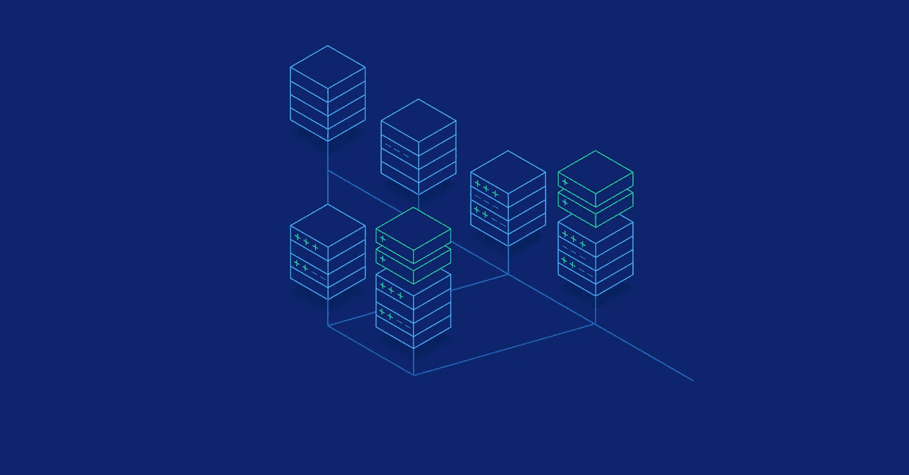
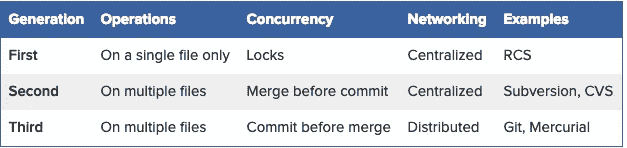
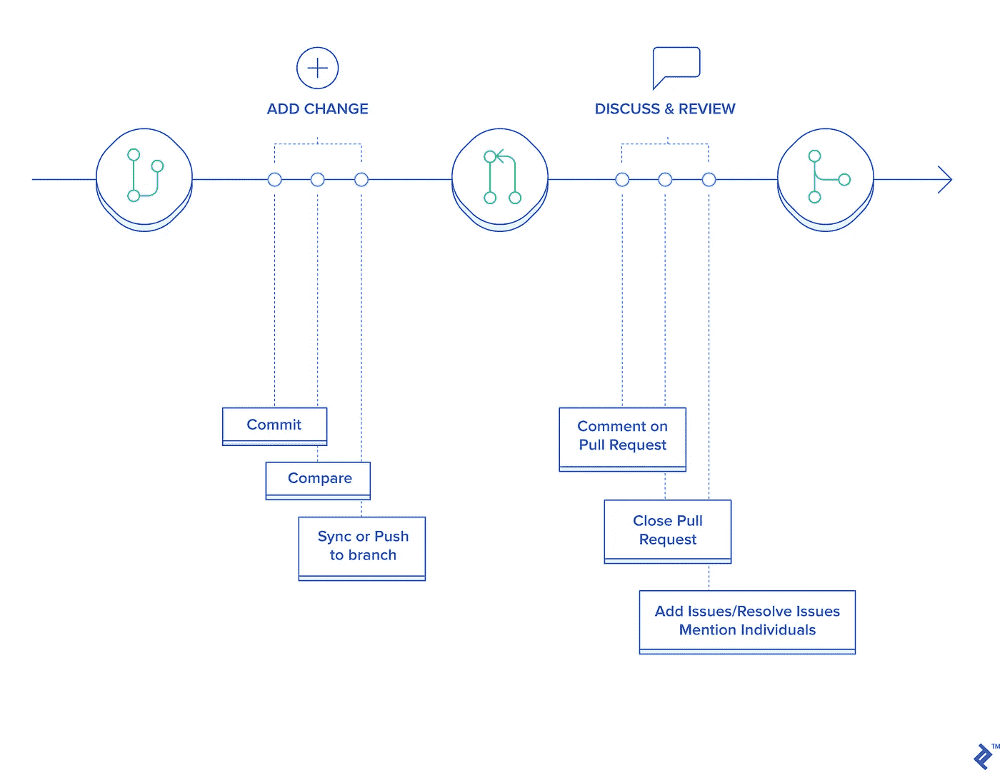
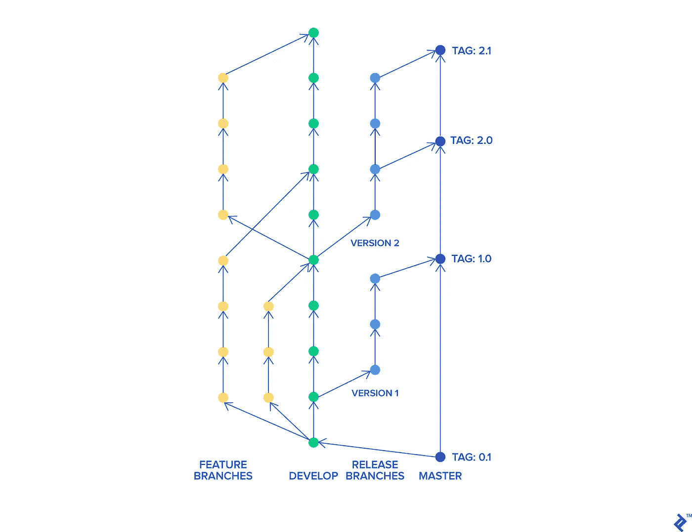
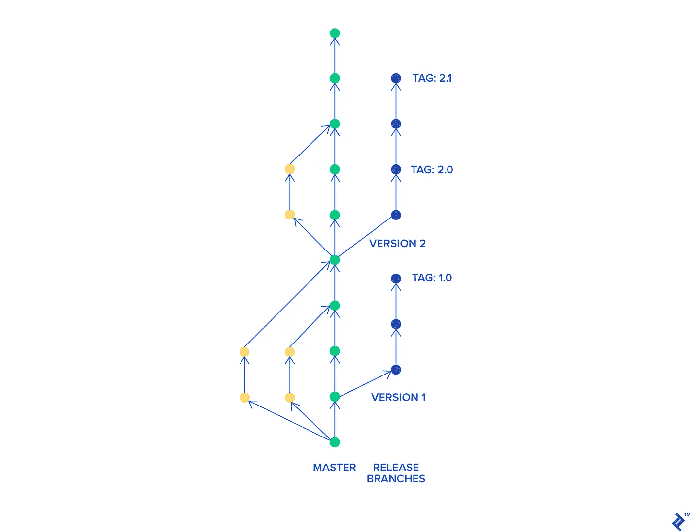

# 基于主干的开发与 Git 流

> 原文：<https://medium.com/hackernoon/trunk-based-development-vs-git-flow-b1b23044dfb>

注意:我之前在[的博客](https://www.toptal.com/software/trunk-based-development-git-flow#catch-just-dynamite-developers)上发表了这篇文章。

为了开发高质量的软件，我们需要能够跟踪所有的变更，并在必要时撤销它们。版本控制系统通过跟踪项目历史并帮助合并多人所做的变更来扮演这个角色。它们大大加快了工作速度，并使我们能够更容易地找到 bug。

此外，主要由于这些工具，在分布式团队中工作是可能的。它们使几个人能够同时在一个项目的不同部分工作，然后将他们的成果加入到一个产品中。让我们仔细看看版本控制系统，并解释基于主干的开发和 Git 流是如何产生的。

# 版本控制系统如何改变世界

在版本控制系统被创建之前，人们依赖于手工备份项目的先前版本。他们手动复制修改过的文件，以便将多个开发人员的工作整合到同一个项目中。

它耗费了大量的时间、硬盘空间和金钱。

当我们[看历史](https://rc.sydney.edu.au/git-user-guide/history.html)的时候，可以大致区分出三代版本控制软件。

让我们来看看它们:

我们注意到，随着版本控制系统的成熟，并行处理项目的能力越来越强。

最具突破性的变化之一是从锁定文件转向合并更改。它使程序员能够更有效地工作。

另一个显著的改进是分布式系统的引入。 [Git 是第一批融入这一理念的工具之一。它确实让开源世界繁荣起来。Git 允许开发人员在一个称为分叉的操作中复制整个存储库，并引入所需的更改，而无需担心合并冲突。](https://git-scm.com/book/en/v2/Getting-Started-A-Short-History-of-Git)

稍后，他们可以启动一个拉请求，以便将他们的更改合并到原始项目中。如果最初的开发人员对合并来自其他存储库的变更不感兴趣，那么他们可以自己将它们转换成单独的项目。这一切之所以成为可能，是因为没有中央储物的概念。

# 开发风格

如今，最流行的版本控制系统肯定是 Git，2016 年的市场份额约为 70%。

Git 随着 Linux 和开源场景的兴起而普及。GitHub ，目前最受欢迎的公共项目在线存储，也是其流行的重要原因。我们把易于管理的拉请求的引入归功于 Git。

简而言之，拉请求是由软件开发人员创建的请求，用于将他们创建的变更与主项目相结合。它包括审查这些变化的过程。评论者可以在他们认为可以改进或认为不必要的每一点上插入评论。

收到反馈后，创建者可以对其做出回应，创建一个讨论，或者简单地跟随它并相应地更改他们的代码。

Git 仅仅是一个工具。你可以用许多不同的方式使用它。目前，你能遇到的两种最流行的开发风格是 [Git flow](https://github.com/nvie/gitflow) 和[基于主干的开发](https://trunkbaseddevelopment.com/)。通常，人们熟悉其中的一种风格，而可能会忽略另一种。

让我们仔细看看这两个工具，并了解我们应该如何以及何时使用它们。

# Git 流

在 Git 流开发模型中，您有一个可以严格访问它的主要开发分支。它通常被称为`develop`分支。

开发人员从这个主分支创建特性分支，并在其上工作。一旦完成，他们就创建拉请求。在拉式请求中，其他开发人员对变更进行评论，并可能进行讨论，通常是相当长的时间。

就最终版本的变更达成一致需要一些时间。一旦达成一致，拉请求就被接受并合并到主分支。一旦决定主分支已经足够成熟，可以发布，就会创建一个单独的分支来准备最终版本。来自这个分支的应用程序经过测试，并应用了错误修复，直到它准备好发布给最终用户。一旦完成，我们将最终产品合并到`master`分支，并用发布版本标记它。与此同时，可以在`develop`分行开发新功能。

下面，你可以看到 Git 流程图，描绘了一般的工作流程:

Git 流的一个好处就是控制严格。只有经过授权的开发人员才能在仔细查看后批准变更。它确保代码质量，并有助于尽早消除错误。

然而，你需要记住，它也可能是一个巨大的劣势。它创造了一个减慢软件开发的漏斗。如果速度是你的首要考虑，那么它可能是一个严重的问题。单独开发的功能可能会创建难以与主项目结合的长期分支。

此外，拉请求只关注新代码的代码审查。他们只检查新引入的变更，而不是将代码作为一个整体来看待并努力改进它。在某些情况下，它们可能会导致[过早优化](https://www.toptal.com/full-stack/code-optimization)，因为总是有可能实现一些东西来执行得更快。

此外，拉请求可能会导致大量的微观管理，主要开发人员实际上管理每一行代码。如果你有可以信任的有经验的开发人员，他们可以处理，但是你可能会浪费他们的时间和技能。这也会严重挫伤开发人员的积极性。

在大型组织中，拉请求期间的办公室政治是另一个问题。可以想象，批准拉请求的人可能会利用他们的地位有目的地阻止某些开发人员对代码库进行任何更改。他们这样做可能是因为缺乏信心，而有些人可能会滥用他们的地位来解决个人问题。

# Git 流的利与弊

如您所见，进行拉取请求可能并不总是最佳选择。它们应该只在适当的时候使用。

# Git 流什么时候效果最好？

*   **当你运行一个开源项目时。**
    这种风格来自开源世界，在那里效果最好。因为每个人都可以做出贡献，所以你需要非常严格地访问所有的变更。你希望能够检查每一行代码，因为坦率地说，你不能相信人们的贡献。通常，那些不是商业项目，所以开发速度不是问题。
*   **当你有很多初级开发人员的时候。如果您主要与初级开发人员一起工作，那么您希望有一种方法来密切检查他们的工作。你可以给他们多种提示，告诉他们如何更有效地做事，帮助他们更快地提高技能。接受拉请求的人对重复发生的变更有严格的控制，这样他们可以防止代码质量恶化。**
*   **当你有了既定的产品。当你已经有一个成功的产品时，这种风格似乎也很适合。在这种情况下，关注点通常是应用程序性能和负载能力。这种优化需要非常精确的变化。通常，时间不是一个约束，所以这种风格在这里很好。更何况大企业非常适合这种风格。他们需要密切控制每一个变化，因为他们不想打破他们数百万美元的投资。**

# Git 流什么时候会出问题？

*   **刚起步的时候。**
    如果你刚刚起步，那么 Git 流不适合你。您可能希望快速创建一个最小的可行产品。做拉请求会产生一个巨大的瓶颈，使整个团队的速度大大降低。你根本买不起。Git 流的问题是拉请求会花费很多时间。用那种方式提供快速开发是不可能的。
*   **需要快速迭代的时候。一旦你得到了你的产品的第一个版本，你很可能需要旋转几次来满足你的客户的需求。同样，多个分支和拉请求会大大降低开发速度，在这种情况下不建议这样做。**
*   当你主要和高级开发人员一起工作时。如果你的团队主要由长期共事的高级开发人员组成，那么你就不需要前面提到的拉请求微观管理。您信任您的开发人员，并且知道他们是专业人员。让他们做他们的工作，不要让所有的 Git 流官僚作风拖累他们。

# 基于主干的开发工作流

在基于主干的开发模型中，所有开发人员都在一个分支上工作，并对其开放访问。通常只是简单的`master`分支。他们向它提交代码并运行它。超级简单。

在某些情况下，它们会创建短暂的特征分支。一旦他们分支上的代码编译并通过了所有测试，他们就直接将其合并到`master`。它确保开发是真正连续的，并防止开发人员创建难以解决的合并冲突。

让我们来看看基于主干的开发工作流。

用这种方法审查代码的唯一方法是进行完整的源代码审查。通常，冗长的讨论是有限的。没有人能严格控制源代码库中的修改内容——这就是为什么拥有可执行的代码风格非常重要。以这种风格工作的开发人员应该是有经验的，这样你就知道他们不会降低源代码质量。

当你和一个经验丰富的软件开发团队一起工作时，这种工作方式会很棒。这使他们能够快速引入新的改进，并且没有不必要的官僚主义。这也表明你信任他们，因为他们可以将代码直接引入`master`分支。在这个工作流程中，开发人员是非常自主的——他们直接交付，并在工作产品的最终结果上接受检查。在这种方法中，微观管理和办公室政治的可能性肯定要少得多。

另一方面，如果你没有一个经验丰富的团队，或者出于某种原因你不信任他们，你不应该使用这种方法——你应该选择 Git flow。会省去你不必要的担心。

# 基于主干开发的利与弊

让我们仔细看看成本的两个方面——最好和最坏的情况。

# 基于主干的开发什么时候效果最好？

*   当你刚刚起步的时候。
    如果你正在开发最小可行的产品，那么这种风格非常适合你。它以最少的形式提供最大的开发速度。由于没有拉取请求，开发人员可以以光速交付新功能。只是一定要雇佣有经验的程序员。
*   **需要快速迭代的时候。**
    一旦你完成了产品的第一个版本，你发现你的客户想要不同的东西，那么不要犹豫，用这种风格转向一个新的方向。您仍处于探索阶段，您需要能够尽快改变您的产品。
*   当您主要与高级开发人员一起工作时。如果你的团队主要由高级开发人员组成，那么你应该信任他们，让他们做自己的工作。这种工作流程给予他们所需的自主权，使他们能够掌握自己的专业。只要给他们目的(要完成的任务)并观察你的产品如何成长。

# 基于主干的开发什么时候会产生问题？

*   当你运行一个开源项目时。如果你正在运行一个开源项目，那么 Git flow 是更好的选择。您需要对变更进行非常严格的控制，并且您不能信任贡献者。毕竟谁都可以贡献。包括网络巨魔。
*   **当你有很多初级开发人员的时候。如果你雇佣的大多是初级开发人员，那么最好严格控制他们在做什么。严格的拉取请求将帮助他们提高技能，并更快地发现潜在的错误。**
*   **当你已经建立产品或管理大型团队时。如果你已经有了一个成功的产品，或者在一家大型企业中管理着一个大型团队，那么 Git flow 可能是一个更好的主意。你想要严格控制一个价值数百万美元的成熟产品所发生的事情。可能，应用程序性能和负载能力是最重要的。这种优化需要非常精确的变化。**

# 为正确的工作使用正确的工具

我之前说过，Git 只是一个工具。像其他工具一样，它需要被恰当地使用。

Git 流通过 pull 请求管理所有更改。它提供了对所有变更的严格访问控制。它非常适合开源项目、大型企业、拥有成熟产品的公司，或者一个没有经验的初级开发人员团队。您可以安全地检查源代码中引入了什么。另一方面，它可能会导致广泛的微观管理、涉及办公室政治的争议，以及明显较慢的开发。

基于主干的开发给了程序员充分的自主权，并表达了对他们和他们的判断的更多信任。访问源代码是免费的，所以你真的需要能够信任你的团队。它提供了优秀的软件开发速度并减少了流程。这些因素使得它在创建新产品或以全新的方向改变现有应用程序时非常完美。如果你主要和有经验的开发人员一起工作，会产生奇迹。

尽管如此，如果你和初级程序员或者你不完全信任的人一起工作，Git flow 是一个更好的选择。

有了这些知识，我希望你能够选择与你的项目完美匹配的工作流程。

# 了解基础知识

# 什么是软件中的主干？

在软件开发的世界中，“主干”意味着版本控制系统下的主要开发分支。这是一个项目的基础，所有的改进都融合在一起。

# 什么是代码分支和合并？

分支是从基础项目中创建的，目的是开发一个新的特性，修复一个 bug，或者只是做一些重构。它们防止软件开发人员相互干扰，并使他们能够并行工作。一旦完成并测试了一个变更，分支就被合并回主干。

# 版本控制中的分支是什么？

版本控制系统中的分支是基础项目的副本。它的创建是为了让变更可以在其他分支中并行发生。它本质上解决了同时处理相同文件的问题。

# 什么是特征分支？

特性分支有一个清晰且高度集中的目的——为项目添加特定的功能。它不应该包含任何修正错误、引入其他特性或作为重构一部分的其他更改。

# 什么是版本控制系统？

版本控制系统跟踪项目中文件发生的变化。它们可以在以后被召回或检查。这对于恢复以前的版本也非常有用。这使得开发人员可以毫不费力地找到 bug，因为他们可以看到并跟踪所有发生的变化。