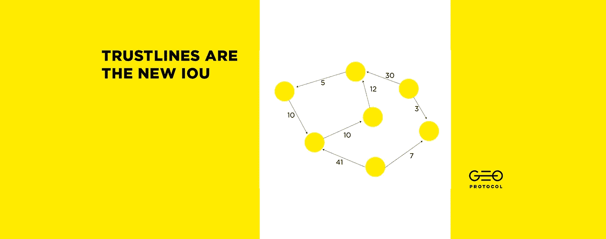
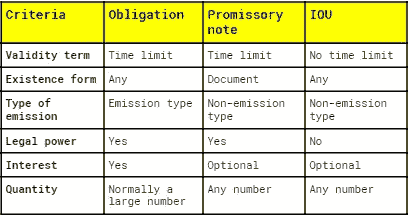
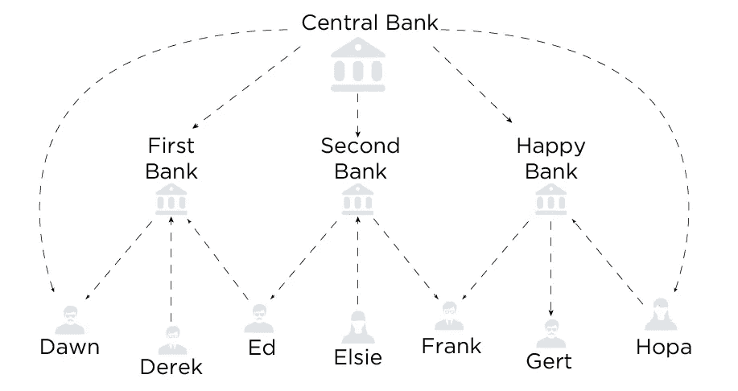
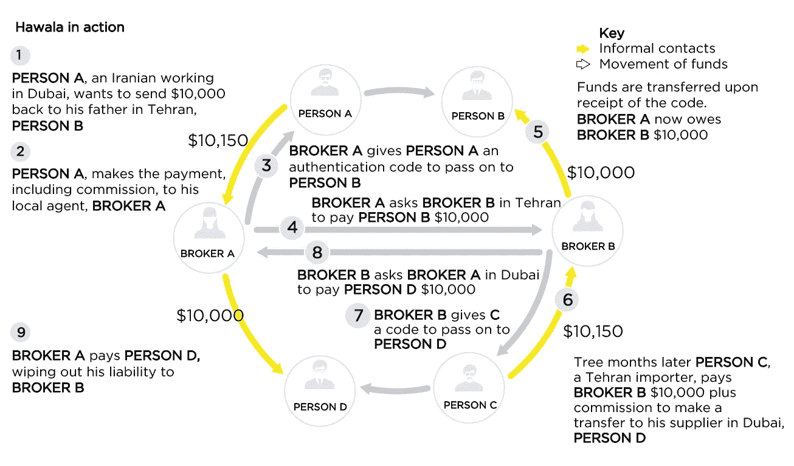
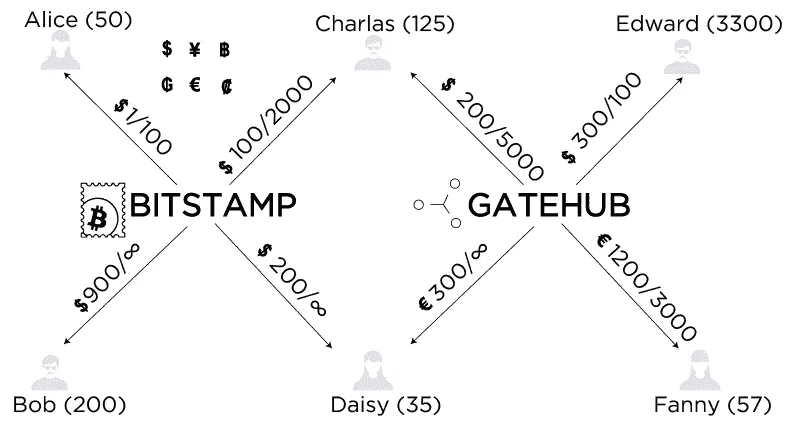
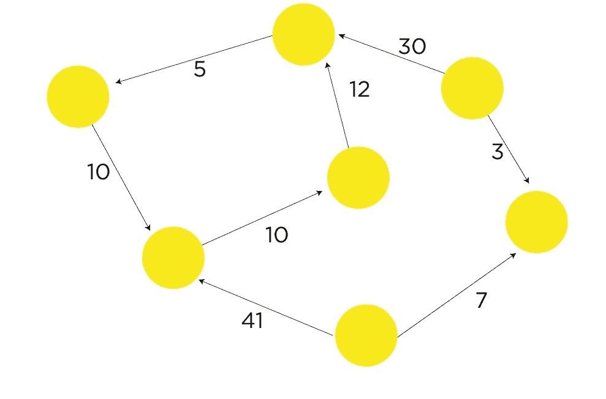
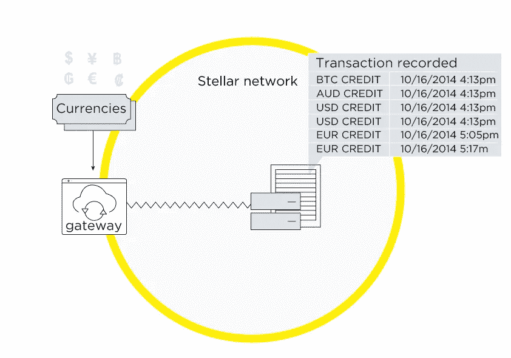
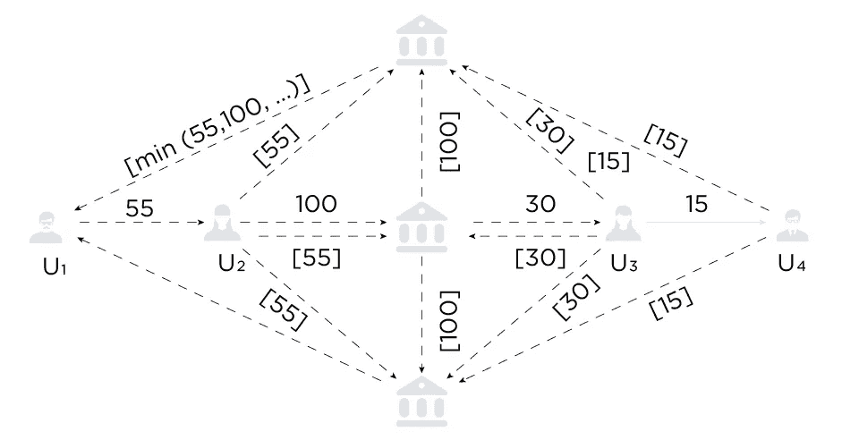
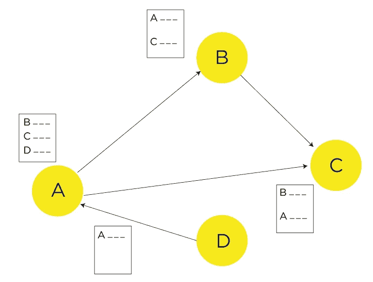

# 信用额度是新的借据

> 原文：<https://medium.com/hackernoon/trustlines-are-the-new-iou-17e71dc79458>

债的概念在古代最早是以物物交换的形式出现的。后来，当货币体系出现时，它成为金融体系不可分割的一部分，新的债务义务也随之产生。

我们无法想象我们的世界没有延期付款、信用或普通贷款。如今，所有这些联系和关系都是由中央金融机构——银行和政府——支持的。但是，由于分布式 IOU 网络，事情可能会在不久的将来发生巨大变化。

## 什么是欠条？

想象你借给一个朋友 10 美元。现在你有你朋友的借据了。换句话说，欠条，或债务，是一个不成文的(口头)合同，确认该义务。

现在你可以“花掉”这种债务，比如，让你的另一个朋友为你的咖啡买单，并告诉他钱会被你的第一个朋友归还。这种债务有几个区别:你只能在一个特定的圈子里花，即互相信任的人；此外，你也可以发行你自己的借据，借据的金额取决于你的第二个朋友(你的债权人)对你的信任。

还有许多其他种类的债务。请查看下表，了解它们之间的主要区别。

在现实世界中，我们与 IOU 系统打交道的次数比我们想象的要多得多——事实上几乎每天都是如此。我们在这里谈论的是普通(法定)货币，它本质上是一种借据债务的变体。通过接受它，我们确认了我们对发行政府的信任，而且，由于我们非常频繁地使用法定货币，我们对一个国家的信任程度与我们拥有和/或接受的该国货币的总和相当。

本质上，银行是这种借据系统中的信任中介。我们把钱交给银行，换取它的借据，然后我们付给其他人这些债务，加上银行本身收取少量利息。

*Schematic representation of the modern banking system*

## 但是如果任何人都可以成为中间人呢？

这样一个系统的优势是显而易见的:没有中央排放机构，没有佣金，不需要信任州或政府等等。

在本文中，我们将描述现有的和潜在的解决方案来实现这一点。

## 哈瓦拉

现有借据替代品的一个最突出的例子是哈瓦拉。它用于绕过银行系统的资金转移。用一个例子更容易解释它是如何工作的。

假设 A 国的一名公民计划向 b 国转账，但出于多种原因(费用、法律问题)，他不想通过银行系统转账。在这种情况下，他可以通过哈瓦拉经纪人使用哈瓦拉系统。我们的公民在他的国家 A 找到一个哈瓦拉经纪人，交给他所需的钱，然后得到一个密码，他必须把这个密码交给收款人。然后 A 国的 hawaladar 与 B 国的 hawaladar 通信，告诉他给与密码持有者相等的金额。所以，转移发生了，但同时，没有钱离开这个国家。

*This is how hawala works*

现在，A 国的哈瓦拉经纪人欠 B 国的哈瓦拉经纪人的钱。但是，当从 B 国向 A 国进行反向转移时，这笔债务可以得到偿还。

还有更复杂的共同债务保险计划。在上面的例子中，A 国和 B 国的经纪人可以在一个更大的经纪人网络中工作。在第一笔交易之后，经纪人 A 欠经纪人 B。但是经纪人 B 有一个客户想要转移到 C 国。如果他在 C 国没有合伙人，他可以求助于经纪人 A，请他在那里找到一个关联，另一个欠 A 的经纪人。因此，当哈瓦拉经纪人 C 代表经纪人 B 向收款人付款时，A、B 和 C 之间的所有债务都被视为已结清。

## 信托公司和区块链

分布式技术的出现迟早会导致这种关系转移到区块链。

早在 2004 年，Ryan Fugger 发表的“[金钱是社会信任网络中的借据&一份关于分散货币网络协议的提案](http://library.uniteddiversity.coop/Money_and_Economics/decentralizedcurrency.pdf)”中首次描述了创建这样一个系统的想法。它导致了一种全新技术的诞生——信任线，这种技术后来被用于 Ripple、Stellar、Trustlines Network 等项目。

该技术的名称表明，在特定网络的至少两个参与者之间存在信任。

因此，在我们的示例中，Alice 和 Bob 从 A 到 b 建立了 10 美元的信任额度，这意味着 Bob 可以在任何时候使用这笔金额进行购买。信用额度余额是镜像的:换句话说，如果 Bob 使用了资金，那么他这边的余额将为正，而 Alice 这边的余额将相应地为负(分别为+10 和-10)。

在这种情况下，其中一个参与者的负余额意味着另一个参与者(Bob)欠她(Alice)该余额的总和。这笔债务能否清偿完全取决于债务人。这就是*信用额度*得名的原因。人们应该只信任值得信任的人，否则，就有金钱损失的风险。

但当这种系统拥有大量用户时，就有可能创建一个完整的信贷网络，参与者可以用不同的货币或由此衍生的债务进行相互结算。

因此，让我们看看 trustlines 技术是如何在不同的项目中使用的。

## 涟漪

根据 CoinMarketCap 的数据，Ripple 可能是我们名单上最著名和最古老的项目，目前，它在所有加密货币中的市值排名第三。

由于 Ripple 项目本身由几种技术组成(XRP、xCurrent、xVia)，下面写的所有内容都只与 XRP 有关，与 Ripple 无关。

Ripple 最初的想法是使债务义务的交换更加分散，但后来大型金融机构成为该平台的目标受众，因此，为了保持系统的可操作性，引入了一定程度的集中化(例如，对验证者列表的集中控制，以确定谁负责生态系统中的交易验证)。随着 xCurrent 获得了越来越多的与银行和各种支付系统的新合作关系，体现了最初想法的 xRapid 项目放慢了开发步伐。

Ripple 中的信任线称为 *Ripple 状态对象*。当被创建时，这些对象中的每一个都有许多负责其特定特征的参数，例如将付费的用户、对每一方的限制、产生*涟漪*(清洁)的可能性等等。要创建一个新的信用额度，您需要预留 5 个 XRP，在信用额度停用后会返还。此外，Ripple 有一个名为*授权信托额度*的功能，允许限制可以拥有特定用户发行的基金的参与者圈子。

Ripple 的主要信用额度功能之一是执行*冻结*的可能性。冷冻有几种不同的形式:

1.  个人冻结(冻结特定的信用额度，禁止交易对手减少其余额)；
2.  全局冻结(冻结一个地址并禁止任何人减少与该地址相关的所有信用额度中的余额)；
3.  无冻结(禁止打开单个冻结，也禁止关闭全局冻结)。

此外，Ripple 还提供网关，可以将货币兑换成 XRP 区块链货币进行存取。通常，网关可以遵循三种基本的业务模型:

1.  将钱存入和取出系统
2.  货币兑换流动资金池
3.  为换取内部系统货币而提供的服务

网关激励通过存款/取款费、转账费、汇率差价、服务费等实现。

## 信任线网络

Trustlines Network 是另一个项目，旨在将现实生活中的社会和信用关系转移到分散的基础上。

*The digitized network of trust*

可能的用户信用额度的最大数量是无限的，这无疑是该项目的优势之一。但在实际操作中，set 连接的真实数量不会高于 150(根据 [Dumber 的数量](https://en.wikipedia.org/wiki/Dunbar%27s_number))。但私人货币网络的创建者可以随心所欲地设定这个参数。与 Ripple 不同，Trustlines 网络中不存在 trustline 或帐户冻结的可能性，但开发者团队已经考虑了在未来建立类似于*无 ripple-flag* 功能的可能性。

使用信任线路的项目的一个严重缺点是新的连接建立费用。信任线网络也不例外。建立新连接需要支付 ETH 佣金。新的资产创造，以及当前的信用额度平衡，发生在链上。一方面，这以令人钦佩的区块链安全性保护了项目，并且还避免了网络垃圾邮件，但是另一方面，这可能会排斥新用户并且为可伸缩性制造一些障碍。该项目的开发团队计划在不久的将来与雷电项目合作解决这个问题。

Trustlines Network 还允许其用户发行具有自己特征和限制的货币，因此用户可以明确定义他/她的货币的潜在用户圈子。所有发行的资产将在货币网络合同的帮助下在以太坊区块链上实施。

在讨论 trustline 技术时，我们不能不提到它的安全性和争议解决机制。当由网络或节点故障引起的问题出现时，为每个单独的定制货币网络定义冲突情况解决程序。如果没有定义这样的规则和程序，冲突将直接由参与者解决。Trustlines 网络的路由算法中内置了自动循环闭合功能( [Dijkstra 的算法](https://en.wikipedia.org/wiki/Dijkstra%27s_algorithm))。为了节点同步(例如，约定的信用额度余额)，所有信息都存储在以太坊区块链上的智能合约中。因此，如果一个节点突然出现故障，它可以通过这种智能合约检查其余额。尽管这种解决方案明显简单易用，但它有一个明显的缺点:持续的智能合同更新需要大量的 gas，因此当有更多用户时，支持网络是不可行的。Trustlines 本身也设置在 Trustlines 网络的链上。

**恒星**

恒星是 2015 年出现的波纹叉。流明(XLM)是这个项目的本地货币，但也有可能创造其他令牌。没有必要为 XLM 转让设立信用额度，但是如果您想转让其他资产，您必须使用它们。这些资产由特殊行为者发布，即所谓的*主播*，他们的行为类似于 PayPal，即接受真实资产并发布其数字化版本。

*An anchor operation scheme in Stellar*

从私人个体到大公司，任何人都可以成为主播。为了创造一个明星资产，主播需要特殊账户。每个新资产都有自己独特的代码。对于大多数资产而言，代码可以是任何格式，但货币和证券除外，因为它们必须相应地符合 ISO 4217 和 ISIS 标准。

锚能够冻结任何资产(甚至是由另一个帐户创建的资产)或限制对它的访问。相比之下，有一个选择退出冻结的可能性。

## 无声的低语

在这个项目中，信用额度以信用连接的形式存在。无声耳语项目渴望解决的主要问题是各种形式的隐私。所谓隐私，是指发送者的隐私、接收者的隐私以及信用关系本身的隐私。在类似的系统中，即 Ripple、Stellar，取而代之的只有伪隐私，因为所有的交易都是透明的，并且有办法通过各种分析方法将它们与真实的人或实体联系起来。

无声耳语中的隐私将由称为*信标*的特殊节点提供。他们的主要任务是建立信用路由(信用路由使用户能够通过利用其他网络参与者的现有连接，在不与对方建立直接连接的情况下借出或借入资金)，以及提供隐私。后者是通过*共享多方计算*实现的，这种技术使几个参与者能够根据他们每个人的秘密输入数据(这些是他们的信用连接余额)进行计算，其他参与者无法访问其他人的秘密输入数据的任何信息。

*Private credit limits calculation*

争议解决机制非常简单。每笔交易都会导致余额变化，交易对手必须签字并打上时间戳。如果任何交易参与者在任何时候有异议，它可以要求额外的验证。为了在无声耳语中执行该程序，发送一个*判断*协议。每一方都提交他们关于信道当前状态的数据。检查该数据的有效性(签名验证)，如果交易参与者处于已结算状态(没有执行任何可能影响余额的交易)，系统将通道的状态回滚到最新的时间戳。

通过利用所有上述技术，系统的用户能够彼此建立信任的信用关系，从而形成信用网络。

## [地理协议](https://geoprotocol.io)

我们自己的项目 GEO Protocol 旨在建立一个分散的 P2P 基础设施，允许任何类型的资产和价值的交换。它还使用户能够选择他们希望在什么基础上执行这样的交换:是可信的(使用信任线)还是不可信的(使用状态通道)。

GEO 网络中的信任线有许多特点。首先，所有信用额度在 GEO 中都是离线的；对于有关余额的完整信息，与其他节点的连接存储在每个单独节点的本地。这种本地存储不包含关于整个网络的过多数据，并允许节点成为完全自治的实体，独立于第三方(如中继服务器等)，也意味着它们不必为其服务付费。这种方法极大地增加了网络的可扩展性和经济效益。

此外，GEO network 支持发行各种等价物(在 GEO 中称为*跨单位*)，因此任何用户都可以创建他/她自己的货币或资产，进行自由和无限制的兑换。

*In GEO, all the relevant data is stored locally in every node*

尽管本地数据存储有许多优点，但在出现意外情况时，它需要一种争议解决机制。在 GEO 协议中有这样一种机制，即*信任线审计*，它会定期执行(频率可由用户设置)，或者在关键参数发生变化的情况下执行(例如，生成一组新的加密密钥)。

在审计过程中，会检查参与者的余额，以及信任线双方的流入(交易对手信任您的金额)和流出(交易对手信任您的金额)信任。

由于 GEO 旨在实现任何资产的自由和不受限制的交换，该协议没有提供完全或部分冻结账户或信用额度的可能性。

## 结论

债务凭证(或称借据)的发展经历了漫长的道路，从古代的物物交换到现代的各种解决方案的分散系统。当然，仍然存在重大挑战，如基于链的信任线、集中化尝试、法律问题和社会接受问题。后者尤其令人关注，因为最近对所有加密货币的大量注入和随之而来的倾销破坏了一些人对该行业和技术的信任，以至于这些人开始将它们视为复杂、不稳定、有时甚至是“非法”的东西。

当然，基于信任的转让的想法对当代观众来说听起来很超前，因为大多数人倾向于不信任彼此，但生活告诉我们，这一想法是可行的，可以实际实施。

当它被实施时，它可以重新定义一些根深蒂固的做法，以及打开一个有巨大可能性的全新视野。

## 遵循 GEO 协议:

[ [媒体](https://medium.com/geoprotocol/) | [推特](https://twitter.com/geo_protocol)|[GitHub](https://github.com/geo-protocol)|[Gitter](https://gitter.im/GEO_Protocol/)|[电报](https://t.me/geoprotocol)|[LinkedIn](https://www.linkedin.com/company/geoprotocol/)|[YouTube](https://www.youtube.com/channel/UC3jEvQvZAmCUXa7dCoX9_Lg/)]