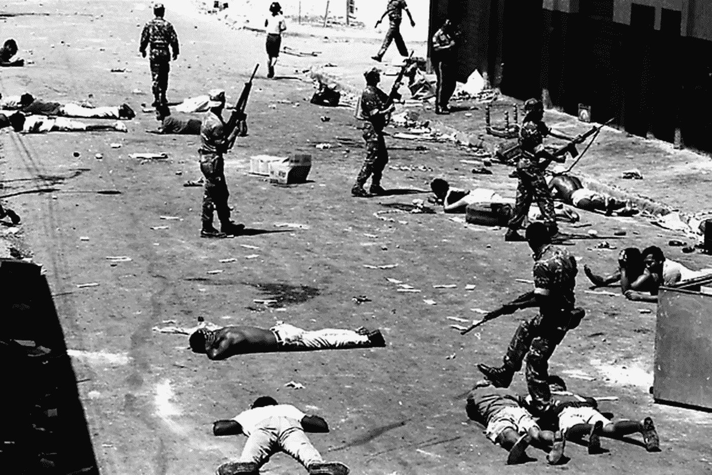
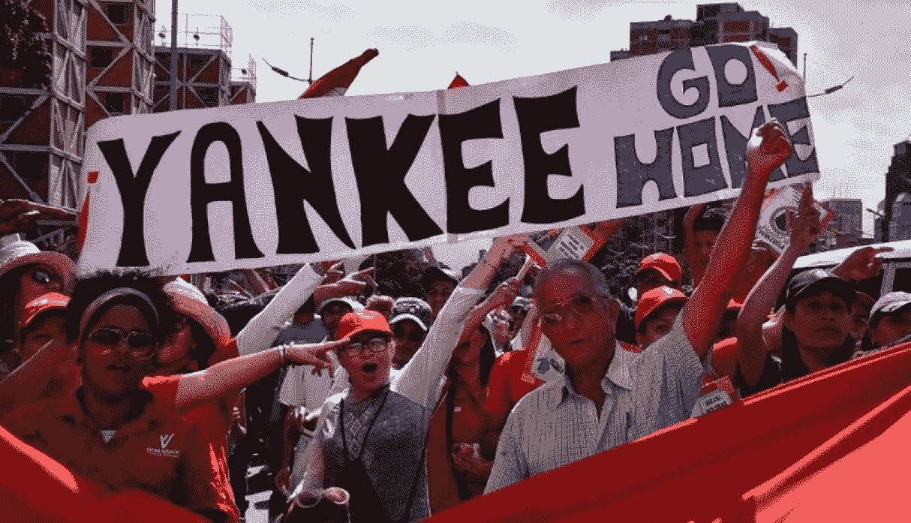
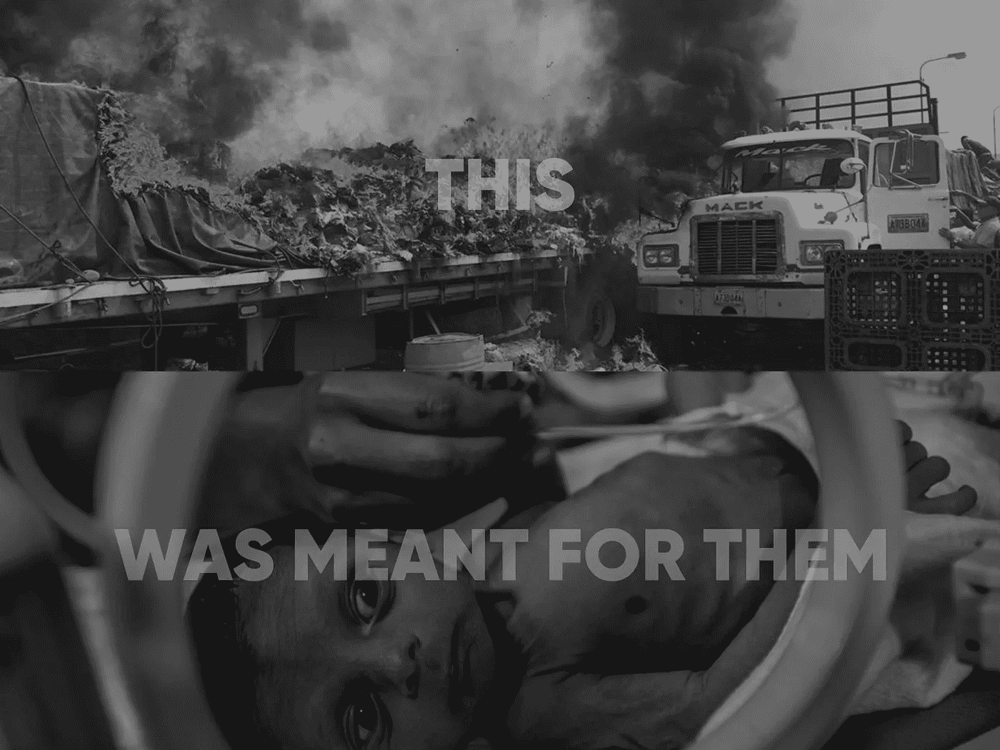
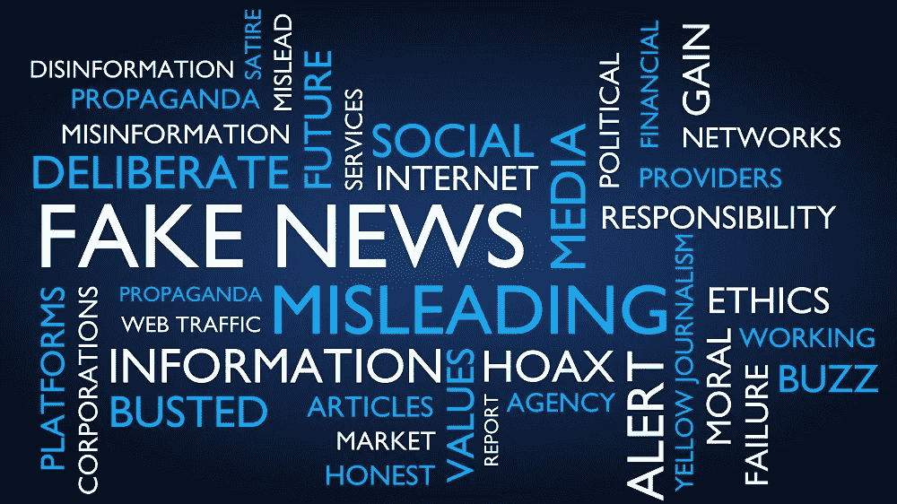
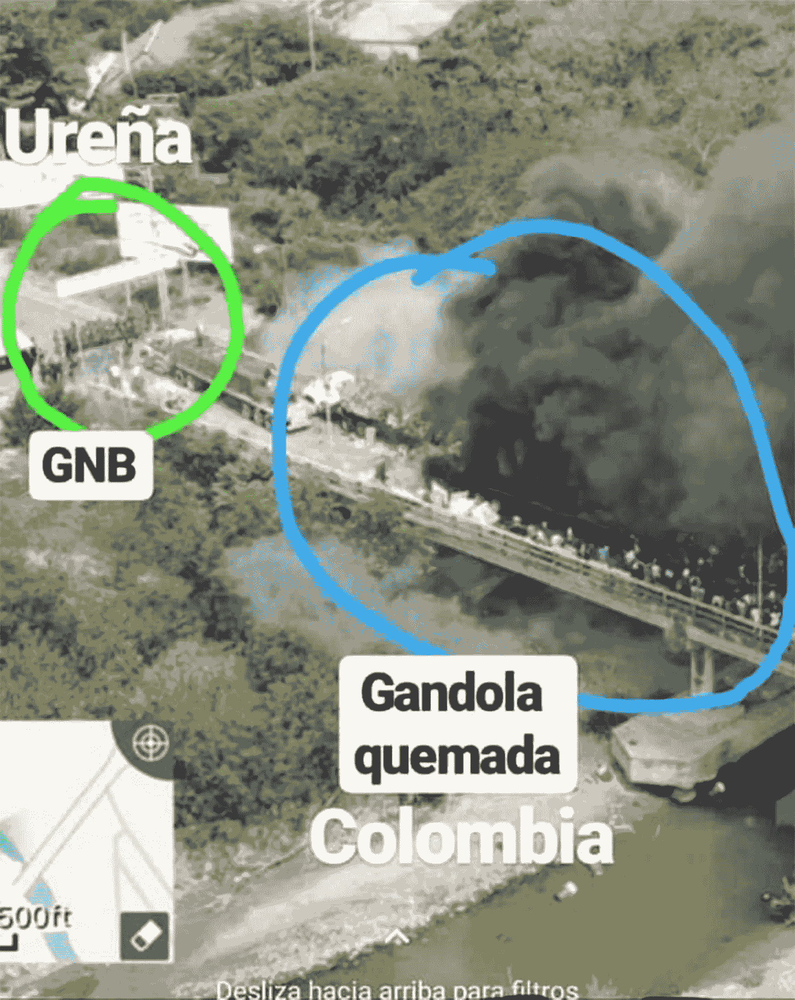

# 情人眼里出西施

> 原文：<https://medium.com/hackernoon/truth-is-in-the-eye-of-the-beholder-1b4516f34455>

每当我参加一个关于区块链的会议时，总有人将委内瑞拉作为加密货币应用的一个用例。我明白了。在没有足够的事实发现的情况下，这个用例具有证明加密货币是委内瑞拉问题的解决方案的所有要素。但一如既往，现实是非常不同的。由于虚假信息运动，事实调查已经成为一个巨大的问题。

写这篇文章的原因是，这个国家的苦难就在我的家门口。我的妻子是委内瑞拉人，我的家庭因为一个政权而四分五裂。这个家庭的很大一部分人住在国外，分散在世界各地。仍然留在国内的家庭成员之所以幸存下来，是因为他们得到了生活在国外的朋友和家人的帮助。他们很幸运，因为我们认识的许多人需要在没有国外帮助的情况下生存，他们真的很痛苦。

更重要的是看到媒体如何报道正在发生的事情。这么说吧，有很多观点和议程需要被扔出窗外。这篇文章是关于事实调查和澄清委内瑞拉正在发生的事情，以及一个拥有世界上最大石油储量的国家是如何成为乔治·奥威尔小说的主题的。它将解释中央政府控制媒体的问题有多大。这也解释了为什么我会为这个周末发生的事情哭。

# 真正的问题是

委内瑞拉面临的真正问题是，它有很多被一些人称为“魔鬼粪便”的东西。委内瑞拉是世界上石油储量最大的国家。它还拥有巨大的金矿和丰富的其他自然资源。此外，它是世界上最美丽的国家之一。它丰富的一切应该使它成为世界上最繁荣的国家之一。但是，不幸的是，事实并非如此。

有时你会听到委内瑞拉人说:“上帝想创造人间天堂，所以他创造了委内瑞拉。但他不想让全世界都生活在委内瑞拉，所以他创造了委内瑞拉”。这相当不公平，因为委内瑞拉的问题不是委内瑞拉人造成的。这是一个问题，有一个非常美味的大馅饼，世界想要一块。拥有大量石油储备并没有帮助。这导致了一种被委内瑞拉人称为“El facilismo”的思维方式。知道你只需要打开一个阀门就可以轻松赚钱，这导致了几十年的政治管理不善。

由于地缘政治、腐败和管理不善，石油繁荣带来的好处总是短暂的，甚至根本不存在。结果是大多数人口生活在贫困线以下。在 20 世纪 70 年代末和 80 年代初的繁荣时期，人们常说这样一句话:“Ta barato，Dame dos！”在迈阿密的每个街角都能听到。这种繁荣的原因是石油工业的国有化和由此产生的巨额支出。但由于管理不善，当油价暴跌时，该国背上了沉重的负担。此外，很大一部分人根本没有从繁荣中受益。它成为委内瑞拉今天的温床。

# 政治问题

如果你想知道当前问题的答案，你应该总是从历史中寻找其根源。1976 年 1 月 1 日，卡洛斯安德烈斯·佩雷斯总统签署了一项法律，将委内瑞拉的碳氢化合物工业和商业保留给政府。同一天，“PDVSA 石油公司”成立，负责规划、协调和监督石油工业。这是上面提到的委内瑞拉繁荣的开始。政府没有明智地管理额外收入，而是开始大举放贷。导致了一个极端的案例。

与此同时，当前的政府腐败成风，更糟糕的是，普通工人阶级根本没有从繁荣中受益。当油价下跌时，这个国家成了一个寻找导火索的火药桶。

1982 年，MBR-200 由 Hugo Chávez Frías 中校创建。MBR-200 是军方的秘密组织，他们的主要抱怨是卡洛斯·安德烈斯·佩雷斯的腐败以及委内瑞拉持续的经济困难和社会动荡。他们认为，为了实现社会变革，必须改变整个政治制度。

该组织还与菲德尔·卡斯特罗有联系。卡斯特罗将委内瑞拉视为盟友，因为它正经历着苏联改革带来的经济困难。他在委内瑞拉看到了一个存钱罐，最终可以提供他拼命寻找的资金。与此同时，人民的不满情绪在增长。

1989 年发生了被称为“Caracazo”的血腥街头暴乱。持续一周的冲突导致数百人死亡，有人称有数千人死亡，大部分死于安全部队和军队之手。1992 年乌戈·查韦斯发动政变失败后，这个国家陷入了危机。1992 年政变发生的这些情况很重要，因为它们为乌戈·查韦斯的崛起奠定了基础。

查韦斯向政府投降，身穿制服出现在电视上，呼吁剩余的政变成员放下武器，并说出了著名的话:“Por Ahora”。总是有这样一个问题:一个组织政变的人怎么可能被立即从监狱中释放，并在不久之后成为委内瑞拉总统。

拉斐尔·卡尔德拉上台了，他是一位杰出的知识分子，委内瑞拉前总统。卡尔德拉的第一届政府与其前任政府的一个关键区别在于外交政策领域。卡尔德拉总统恢复了与苏联和东欧社会主义国家的双边关系，还恢复了与一些军事独裁统治下的南美国家的关系，包括阿根廷、巴拿马和秘鲁。此外，尽管他是政治和经济体系的创始人之一，但他是最先看到其弱点的人之一。如此多的石油不仅导致了依赖，还导致了普遍的腐败和大众阶层日益增长的不满。

卡尔德拉的第二届政府面临着巨大的挑战。他需要拆除火药桶的雷管。为了消除民众的不满，他释放了对 1992 年 2 月 4 日和 11 月 27 日未遂政变负有责任的军官。由于这一旨在平定叛乱军事力量的政策，在卡尔德拉第二个任期的五年里，没有发生起义、未遂军事政变或因政治示威而死亡的事件。对他来说是胜利，但这样做，他释放了北海巨妖。

# 独裁政权的崛起

委内瑞拉有腐败和外国干涉的历史。一个有趣的例子是希斯内罗斯集团，百事最古老的独立特许经营公司之一。50 年来，在政府的支持下，他们得以向委内瑞拉市场大量销售百事产品。直到今天，可乐还被称为百事可乐，如果你要一杯可口可乐，你会看到一张奇怪的脸。

尽管卡尔德拉政府的特点是平静，但腐败猖獗。原因之一是寡头仍然掌权。当一切都很容易的时候，你就会变得懒惰。这就是委内瑞拉 1998 年选举期间发生的情况。委内瑞拉是一个分裂的国家，上层阶级低估了乌戈·查韦斯的受欢迎程度。乌戈·查韦斯的对手是前选美皇后艾琳·塞斯。委内瑞拉独唱。

查韦斯赢得了该国贫困和失望的中产阶级的支持，他们的生活水平在过去十年中迅速下降。查韦斯得到了卡斯特罗的支持，这不是什么秘密。即使卡尔德拉与卡斯特罗有联系，但当时没有人能想象这会对这个国家产生什么影响。雨果·查韦斯是一个非常聪明和有魅力的人。甚至我对他也有好感，尽管我对他的大部分政策都非常反感。他是那种魅力非凡的骗子，你会让他逃脱大部分罪行。

他的第一个任期就是你所说的“查韦斯主义之光”。它为委内瑞拉的灾难埋下了伏笔。从一开始，他的政府就带有裙带关系的特点。提拔他的家人、核心集团和前 MBR-200 成员担任要职。古巴风格的政治，目标是创造一个有推力的核心圈子。

为了兑现对卡斯特罗的承诺，他启动了古巴医生换石油计划。这个项目的目的是让每年给古巴 30 亿美元的施舍看起来是合法的。这个节目一直持续到今天。这一政策和其他政策将导致旧的统治阶级试图推翻他的政府。查韦斯知道这一点，只是等待它发生，因为他知道他有民众和军队的支持。

因此，在 2002 年，他们犯了一个遗憾的借口，跑车的时代。有史以来最大的错误之一。它失败了，它给了查韦斯一个崇拜的地位，因此它给了他完全重写规则书的支持。他随后推出的政策令人难以置信。可以这么说，事情变得一团糟。这是他的一些政策的简短选集。

由于一些私营广播公司在失败的政变中所扮演的角色，他有借口没收该国所有独立的新闻媒体、电台和电视台。他确实这么做了。不是一下子，而是一个又一个电视台，一份又一份报纸。现在，这个国家没有一个新闻来源不受政府控制。

他缓慢但稳步地摧毁了这个国家的每一个民主制度。一切可能对他的权力构成威胁的东西，他都改变了。从能够永远当选到创建一个没有任何监督并管理所有国家财政的名为“Fonden”的国家基金。他掠夺了国家，现在他可以随心所欲地使用国家。

他将腐败制度化。尽管这个国家有腐败的历史，但在他执政期间，腐败变得更加猖獗。他政府中的每个人都变得非常富有。另外，许多反对派人士也赚了不少钱。这是非常聪明的，因为每个人，包括反对派成员，都在作秀，让他的政府看起来合法。

而他发起的每一个“社会”改革计划，都只是他为自己的小圈子赚钱的又一个方案。教育项目，住房项目，建筑项目，所有的一切都只是另一个腐蚀和政治化公共利益的计划。我记得几年前我们在一次飞行中，在我们的正前方有一些他发起的学校教育项目的官员。他们享受着他们的特权，喝得酩酊大醉。他们开始为学校教育项目干杯，高呼应该有更多的学校教育项目，这样他们就可以在飞行途中喝更多的香槟...咬牙坚持了很久才保持冷静…

他腐蚀了玻利瓦尔，他彻底腐蚀了它。在委内瑞拉不能自由兑换外币。每一美元、欧元或瑞士法郎都要申请。进口货物？抱歉，你需要委婉地请求政府，以回扣的形式给他们一些说服。他知道结果将是一个繁荣的外汇黑市。猜猜谁是这个市场的驱动力？是的，政府的核心圈子。他们是唯一能接触到官方汇率的人。这个计划是以官方汇率买入美元，然后以黑市汇率卖出。在一次交易中，你将获得 x 倍的“投资”。这个有多大？好吧，如果你认为巴西的奥迪布里切特案很大，这可能会让你大吃一惊。

故事继续。他对进口商品实行固定售价。一份每天都在增长的名单。你知道结果是什么吗？是的，确实是另一个腐败的计划。以国家赞助的价格买些东西，然后运过边境。哦，当这个政策导致商品短缺时呢？嗯，你可以随时进口卫生纸，然后以每卷 5 美元的价格直接卖给政府。回扣总能达成交易..更糟糕的是汽油。国家支持的汽油价格如此之低，以至于当你把一卡车的汽油运过边境到哥伦比亚时，你会比把同样一卡车的可卡因运到欧洲赚得更多。可能又是一个十亿美元的计划。

是的，这一切都与增加他的权力有关。他成功了。故意腐蚀某人，意味着你控制了那个人。他们会帮助你保持合法，如果你再耍花招，他们会睁一只眼闭一只眼。这个人是不是反对派并不重要。见鬼，这甚至不要紧，如果它是另一个城市或国家。他贿赂国家，作为回报，他得到了他们的支持以保住权力。这里有一个疯狂的例子，[查韦斯与伦敦金融城的交易](https://www.theguardian.com/uk/2007/aug/21/london.venezuela) …留给他的国家的唯一东西就是桌上的一些面包屑。人们忘记了，在他执政期间，他曾因石油繁荣而大发横财。但这一次，受益的只有他的小圈子和其他国家。

查韦斯去世后，情况变得更加糟糕。委内瑞拉变成了一个外国控制的全面独裁国家和一个恐怖的国家。

# 生活在独裁的恐怖中

查韦斯最后的日子很奇怪。他死在了古巴..确切的日期还不知道。他的死亡情况可以在[维基百科](https://en.wikipedia.org/wiki/Death_of_Hugo_Ch%C3%A1vez)上读到。根据尼古拉斯·马杜罗的说法，他任命了一位名叫尼古拉斯·马杜罗的继任者。一个不仅仅是公交车司机的人。他的出身有点模糊。他在古巴接受训练，我说的训练是指严格训练。他曾经是查韦斯的保镖，人们忘记了他是 [MBR-200](https://en.wikipedia.org/wiki/Revolutionary_Bolivarian_Movement-200) 的关键人物之一。

没有古巴或俄罗斯的首肯，尼古拉斯·马杜罗寸步不让。如果你谈论外国干涉，那么这里是你拥有的最好的例子。他的选举完全是腐败的。书中的每一招都被用来让他继续掌权。用政府资金买选票？检查。死人投票？检查。选票填充？检查。贿赂反对派成员？检查。该政权几年前就已经失去了民众的支持，这是让他们继续掌权并让他们看起来合法的唯一方法。不幸的是，这个世界没有做很多事实调查。

最后，在 2015 年，政权的投票系统遇到了阻碍。反对党赢得了议会选举。原因？可能已经有了另一个计划，因为政权知道他们正在失去它的合法性给外部世界。输掉选举会让他们再次看起来合法。为他们争取时间来推行一些重大改革。

当时已经伪民主的各个方面都需要被摧毁。所以他们创建了最高法院。基本上是只由政权支持者组成的高等法院。更恰当的说法是纳粹法庭。他们创建了国民制宪议会，这基本上是一个纳粹议会。是的，这个政权与纳粹主义的关系比与社会主义的关系更密切。这些举动将委内瑞拉变成了一个完全独裁的国家。现在一切都是国有或国家控制的。这个独裁政权愿意为了继续掌权而抛弃人民。

曾经在桌子上的面包屑现在不见了。大多数人靠政府救济生活。所谓的拍手盒。有了这些盒子，政府就把食物政治化了...此外，这是另一个骗局，因为一些人得到了很多报酬来提供盒子。哪里都找不到医疗服务。公立医院停止运转，忘记了药品和医疗设备。人们正在死去。死亡是因为一个政权紧紧抓住权力不放。死于犯罪、营养不良或缺乏适当的医疗保健。

该政权正在打帝国主义牌。但是他们忘记提到，在没有实施任何制裁的时候，问题就已经存在了。显然，人们的记忆力很差。委内瑞拉人民已经失去希望。他们没有权力改变现有的制度。如果人们反对这个制度，他们就会被折磨和谋杀。这个政权根本不在乎委内瑞拉人。

因此，该国正在经历一场人道主义危机。就像我说的，孩子们正在死去，而政府表现得好像一切都很好。现在不是，而且很长时间以来都不是。该政权拒绝人道主义援助，因为这让他们看起来很虚弱。他们的所作所为就像卡斯特罗在古巴经历饥荒时所做的那样。去电视上问一个饥饿的人是否口渴。他当然会答应。卡斯特罗说:“看，这个人渴了，不饿。古巴没有饥荒”。

幸运的是，现在有一线希望。反对派正在合作，并且正在制定一个计划。他们终于和美国联手了。是的，人们认为不应该有任何外来干涉。持这种观点的人可能永远不会进入这个国家。对于委内瑞拉人来说，反抗现有的体制是不可能的。这就好比说，在纳粹统治时期，德国不应该有任何外来干涉。这个论点根本站不住脚！

向一个人民因缺医少药和营养不良而濒临死亡的国家提供人道主义援助只能受到赞扬。不管是谁设计的。你不能批评这个。即使有政治动机。就委内瑞拉而言，总是有政治动机，因为如果没有古巴支持的非法政权，这个国家就不会有现在的局面。看到 Mana 在委内瑞拉现场援助期间需要为他们的选择辩护是令人难过的。

2 月 23 日的开始是一个好的开始。我们通过 VPI 电视台(总部设在迈阿密)跟踪直播。随着消息的传来，救援可能会成功，我们的希望越来越大。然后，之后不久发生的事情让我的心一沉。一辆装载人道主义援助的卡车被点燃了……在委内瑞拉的领土上……一辆装载着本可以拯救儿童生命的物资的卡车。被一个政权剥夺了生存权利的儿童。更糟糕的是，我们的一个朋友当时告诉我们，她的一个亲戚刚刚失去了她 12 岁的儿子。这个男孩得了阑尾炎，这在其他任何国家都很容易治愈。但是因为这个男孩出生在委内瑞拉，他被剥夺了生命。被一个政权剥夺了生命。花点时间想想我刚刚写的东西。

你认为事情不会变得更糟，但它确实变了。国际媒体对委内瑞拉局势的报道少得可怜。它在 23 日超速运转。传播的虚假信息数量令人难以置信。外来干涉。报道参加委内瑞拉现场援助的人数。政治化的人道主义援助。古巴、俄罗斯和委内瑞拉的政治局加快了步伐。还有像罗格·沃特斯这样的人..

这是不合理的。显然是国家支持的虚假信息运动的来源被解释为是真实的。我只能对所有相关人员说，照照镜子，为自己感到羞耻。委内瑞拉的问题与意识形态无关。这是关于人们的死亡和需要帮助的人。

委内瑞拉现场援助组织的批评者显然站在了历史的错误一边。他们为一个杀戮和破坏的政权辩护。在你开口之前先做事实调查。这只会让你看起来很蠢。你被利用作为政权正在玩的一盘棋的一个棋子。当他们完成了你，他们会把你冲走

# 虚假信息的威胁和力量

现在让我们回到开始的地方。会议。如你所见，委内瑞拉的问题与经济无关。加密货币作为解决方案没有任何意义。能帮助这个国家的是事实调查和透明度。显然，这是该国面临的巨大挑战之一。

虚假信息已经成为世界上最强大的工具之一。原因是我们用于新闻和信息收集的所有渠道都是中央所有的。以委内瑞拉为例，所有的频道都是国家拥有和控制的。看看当他们发起运动时会发生什么。甚至像推特、youtube 和谷歌新闻这样的“推特网”资源也被使用。他们成功地改变了公众舆论。这里有一个例子。外交部长的推特信息(他碰巧娶了乌戈·查韦斯的一个女儿)。

看一下上图。他把它贴在了自己的 feed 上，声称卡车是在哥伦比亚被点燃的。来证明这是美国的策略..最精彩的虚假信息。让我们首先坚持事实，一辆装有人道主义救援物资的卡车被点燃了。在现场直播的时候，谁做了什么是毫无疑问的。是 PNB 发射了催泪瓦斯。是集体开枪，是集体放火烧了卡车。

这太疯狂了，以至于你往往会忘记真正的问题是什么。为人道主义援助封锁边境的政权。因此，该政权通过编造这一事实成功地淡化了这一部分。让我们再深入一点，再来看看这张照片。是的，你看到绿色的人关闭了边界。但是他们站在哪里？那是过境点吗？不，不是的。照片中的边境就是那条河…你认为为什么卡车就在河对岸被放火烧了？是的，这是委内瑞拉的领土，因此哥伦比亚军方不能提供支持。当然，你会派政府支持的团伙去做脏活。如果你编造故事，你会引起分裂。他实际上成功地这样做了。看看这篇关于今日俄罗斯的文章。但是想一想，这家伙是外交部长..和世界其他地方谈判的人。思考并知道这个国家面临的是什么。没有加密货币可以解决这个问题…

请分享，发微博和转发这个故事。如果你这样做，你将帮助委内瑞拉人民。当然，你会收到我永远的感激