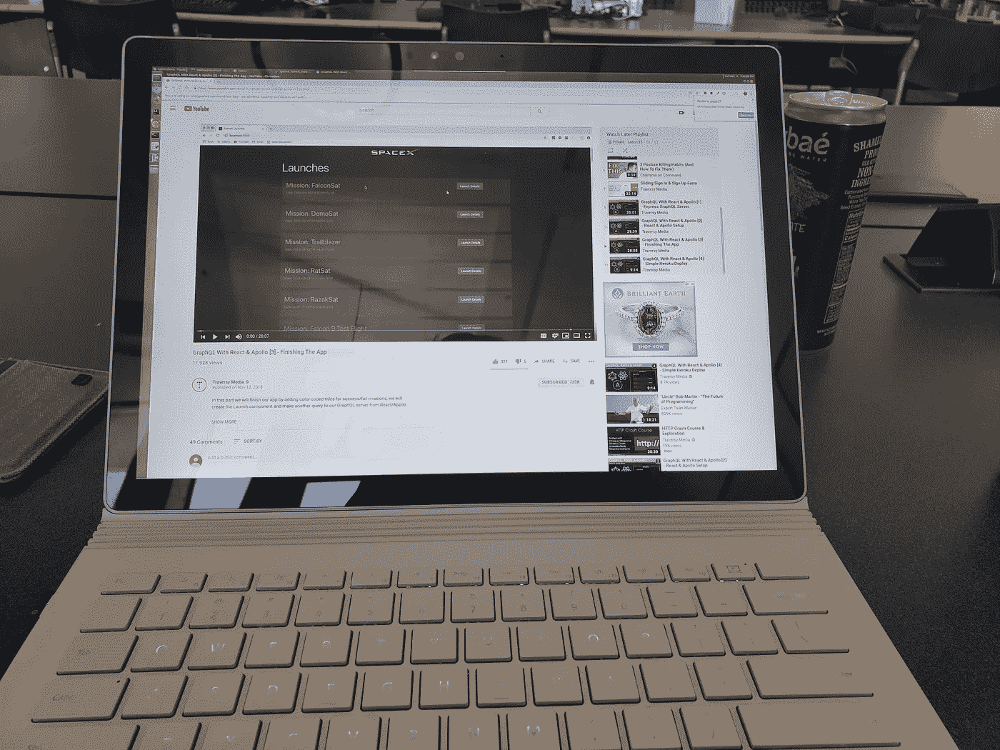
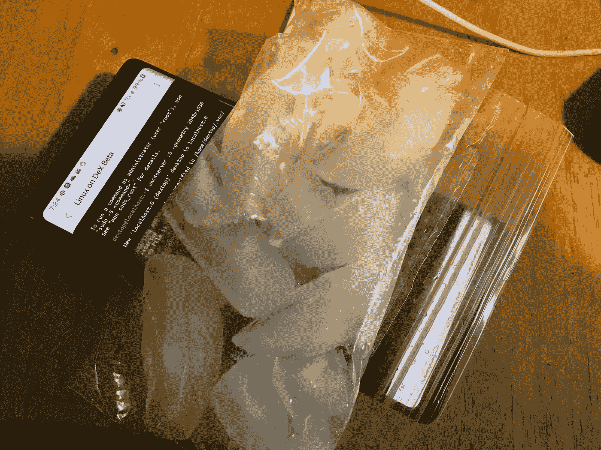

# 把你的三星手机变成 Linux 桌面，免费的方式。

> 原文：<https://medium.com/hackernoon/turning-your-samsung-phone-into-a-linux-desktop-the-free-way-18d3bef75ebc>

三星的 Note 9 有一个功能，叫做 Dex 上的 [Linux。基本的想法是让用户在购买了他们的](https://www.linuxondex.com/) [$99 配件](https://www.samsung.com/us/mobile/mobile-accessories/phones/dex-pad-ee-m5100tbegus/)后运行一个桌面环境。我们可以做得更好。

我将向您展示如何在任何设备(iPad、其他平板电脑、MAC 和 PC)上使用该功能。免费的。

首先，下载 Linux on Dex 应用程序并安装到您的三星手机上。

转到应用程序并在手机上运行终端，通过运行“sudo apt-get install vnc4server”安装 vnc4server。您需要输入密码，默认情况下密码是“秘密”的。安装 vnc4server 后，您可以运行“vnc4server :0 -geometry 1280x720”在本地 wifi 网络上为其提供服务。不过，您应该更改您的密码，以避免任何人查看您的环境。

First step

Second step

现在转到你手机的 wifi 设置，看看你手机所在的 IP 地址。

Linux running on a Surface Book at full 3000x2000 resolution.

最后，去你的 iPad(或笔记本电脑/其他)下载 [VNC 浏览器](https://www.realvnc.com/en/connect/download/viewer/ios/)。我建议您设置一个帐户，这样您就不必每次都设置新的连接。当您转到 VNC 查看器应用程序时，您必须设置您的连接，因此请输入之前手机中的 IP 地址并命名您的连接。接下来，您将被要求输入密码，默认情况下密码是“秘密”的。

您应该看到您的 linux 环境以 1280x720 的分辨率运行。

有几点需要注意:

*   您需要始终打开终端，否则系统会死机(但会保存状态)
*   VNC 不是最安全的协议，所以在公共网络上使用时要小心。您可能会发现有人试图通过猜测您的“秘密”密码来连接到您的系统。
*   您可以设定分辨率以适合您正在使用的屏幕。例如，旧 iPads 的分辨率为 1024x768，因此安装 vnc4server 后，您希望在终端中运行的命令是“vncserver :0 -geometry 1024x768”。对于其他设备，您可以使用以下命令:

retina iPad 9.7:` VNC server:0-geometry 2048 x 1536 '

iPad Pro 10.5:` VNC server:0-几何图形 2224x1668 '

iPad Pro 12.9:` VNC server:0-geometry 2732 x 2048 '

macbook Pro 13:` VNC server:0-几何图形 2560x1600 '

最棒的是，你可以将任何设备用作屏幕，同时将数据保存在手机上。随着手机变得越来越强大，你将能够在 Linux 上使用完整的桌面应用程序(比如 IntelliJ IDEA Ultimate)。

前几天在图书馆，笔记本没电了。我带了一个充电器，但我决定看看我能在 Mac 上从使用 Linux on Dex 过渡到 Surface Book(完全 3000x2000 分辨率)的情况如何。效果非常好。

正如你所料，手机可能会变热。虽然你可能会花 99 美元买一个内置风扇的花哨配件，因为这是一个关于拼凑解决方案的帖子，但这里有一个更便宜的解决方案:

I wonder if this works better than the fan in the Dex Pad

随着我们随身携带的手机每年变得越来越强大，这可能是未来计算的样子。我特别兴奋的是，发展中国家的人们有可能第一次通过使用他们的手机和任何旧的平板电脑进入桌面环境。

无论如何，让我知道你的想法，如果你遇到了任何错误，或者任何建议。