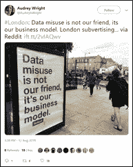
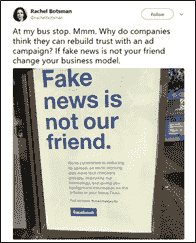
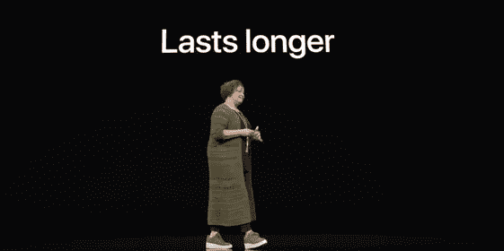

# 事实证明，收入模式设计很重要。这首先是一个产品问题。

> 原文：<https://medium.com/hackernoon/turns-out-revenue-model-design-is-important-and-its-a-product-matter-first-5bc50197e4f>

## **当一种商业模式不再足够时——2018 年的 3 堂商业设计课**

我在这里收集了我对 2018 年几个关键的“商业设计”课程的一些笔记和想法。

我认为，2018 年，成功的数字公司面临的主要威胁不是来自技术进步或客户行为的转变，而是来自他们的**商业模式**。

通过这里给出的三个例子，我还想探讨这样一个观点，即数字化的成功不是由采用特定的商业模式驱动的，而是由以不同方式将产品或生态系统货币化的能力驱动的——或者换句话说，实施 [**多模式商业模式**](https://a16z.com/2018/12/07/when-advertising-isnt-enough-multimodal-business-models-product-strategy/) 。

我认为所有公司都应该考虑这些趋势，在 2019 年加强和多元化他们的战略。

# 1.所有脸书丑闻最终都源于其商业模式

今天，我们正处于“产品时代”，没有哪家公司比脸书更能影响当前以产品为中心的文化。凭借建立在精心的产品体验设计上的成功和对传统营销渠道的几乎零预算投资，该公司致力于推广“产品就是一切”的理念，即增长不能委托给营销或销售，而是需要融入产品结构中。

然而，2018 年，脸书受到了各种丑闻的打击，这些丑闻的中心事实是，该公司在很少或根本不了解其商业模式后果的情况下，将用户数据货币化。

通过向参与数据收集的各种第三方公司-剑桥分析公司和其他许多大公司-提供访问权限，脸书不仅未能保护其用户的隐私，而且还助长了假新闻和恶意政治内容，影响了 2016 年美国大选和全球其他重要事件。

脸书为定义当前的数字产品文化做出了贡献，但我们需要更详细地分析它的发展，以加深我们对可持续竞争优势是如何创造和保持的理解。

## 数据滥用不是我们的朋友，而是我们的商业模式

消费者充分意识到产品和商业模式之间的相互联系。2018 年夏天，脸书发起了一场重建声誉的广告活动，但基本无效，最终被颠覆。不足为奇的是，大多数脸书广告牌的收购都是针对其商业模式的(下面是 Twitter 的一些例子)。

**这里的第一个教训是，尽管拥有一个全球多应用生态系统，但脸书在其主要收入模式受到攻击时承受了很大压力，**因为他们无法依赖替代模式。

这也表明，该公司没有足够重视他们的商业模式是如何设计的。商业模式不能脱离产品单独调查或发展，也不能委托给财务、销售或收入部门。它是产品设计的核心组成部分，需要与体验设计并行发展，以构建可持续的长期价值。

# 2.苹果不再报告设备单位销售，标志着一场更彻底的业务转型

多年来，苹果是智能手机行业唯一一家定期报告设备销量的公司，也可能是整个科技制造行业为数不多的几家公司之一。直到 2018 年 11 月 10 日周四该公司的盈利电话会议，苹果公司宣布他们将停止报告 iPhones，MAC 和 iPads 的单位销售。

停止报告单位销售额的决定最初是为了在竞争异常激烈的科技制造业中显示实力，但它不仅表明苹果与其竞争环境相关的方式发生了变化，还表明公司战略和商业模式发生了更根本的转变。

## 用户而非买家

一方面，随着智能手机市场越来越成熟，增长率下降，苹果的主要扩张领域越来越饱和。与此同时，手表和 Home Pod 等新硬件产品没有提供类似的增长机会，至少目前没有。

另一方面，如今大多数消费者至少拥有一台设备，并且不太可能更换不同的操作系统和硬件制造商。事实上，iOS 和 Android 多年来一直保留着几乎 90%的客户群。

这意味着苹果的优势在于其生态系统——iOS 和苹果商店——建立在 13/15 亿设备的总活跃设备基础上，每天都有高度忠诚和有价值的客户访问。

正如霍勒斯·德迪乌[指出的](http://5by5.tv/criticalpath/211)，停止报告单位销售额的决定标志着该公司更深远的商业模式转变。苹果不再将其业务视为“销售设备”，而是创造和保持客户。当一款设备卖给新客户时，该公司的目标是利用这一立足点扩大其钱包份额，销售其他硬件组件或服务。从这个意义上说，服务业务的启动至关重要。苹果服务是一个总括术语，包含越来越多的服务，包括音乐、iCloud 和 App Store 收入。服务业务在 2018 年每个季度的收入达到 100 亿美元，现在已经和脸书一样大了。

丽莎·杰克逊(Lisa Jackson)在 2018 年 9 月的主题报告中宣布“让设备持续更长时间”，这是从交易到关系的根本转变的又一个迹象。在一个产品寿命更长的世界里，销售更多产品的模式是不合逻辑的。

## 苹果不能再依赖一种商业模式

对于整个科技制造和物联网行业来说，这是一个巨大的转变。

不久前，似乎大多数科技制造商都认为他们必须复制 iPhone 的成功模式。也就是说，如果你想成为所在领域的市场领导者，你必须创造出一种融合了高品质材料、漂亮设计、顶级功能和简单 UX 的产品。例如，智能家居市场的第一批参与者创造了设计精美、超规格的设备。这种方法最终产生了一系列高端、非常昂贵的北欧简约设计产品。不幸的是，很少有公司能够在他们的细分市场复制 iPhone 的成功。

**与此同时，在过去几年中，一种相对更便宜的新型智能设备已经进入市场，它们的成功建立在一种多方面的商业模式上，在这种模式下，硬件被视为一种使能器和“锁定机制”，而集成服务则推动收入增长。**亚马逊的 Echo family 和 Peloton 就是实施这种模式的公司的例子，根据市场和竞争波动，以动态的方式混合使用硬件、服务、内容和市场收入。

这些建立在多元化收入模式基础上的成功故事改变了苹果和许多其他公司对消费科技和物联网市场商业模式的思考方式。

# 3.优步推出了它的订阅节目，蓝围裙则远离了它

2018 年 10 月，优步推出了一项名为[乘车证](https://www.uber.com/newsroom/ride-pass/)的新订阅计划。据该公司称，通过支付月租费，乘客可以获得每月不限次数的预设费用，节省高达 15%的月支出。

优步多年来一直在测试订阅服务，并设计了新的程序，为乘客提供更一致的价格，使其成为可靠和负担得起的驾车替代方式。乘车证不仅仅是一个留存工具，它被有机地集成在产品中，为某些类型的客户提供更好的体验。

如果你认为这是一个明确的迹象，表明订阅是 2019 年你所有问题的答案，请再想想。

一个反其道而行之的公司的例子是蓝色围裙。这家套餐订阅公司于 2017 年上市，但自那以来，其股票一直在缓慢下跌——今年[最终跌破 1 美元](https://nypost.com/2018/12/18/blue-apron-becomes-a-penny-stock-after-plunging-below-1/)。

该公司缺乏增长被归咎于其订阅模式的限制，因为客户的担忧和失望是由于对锁定计划缺乏控制而出现的。新的转型战略于 2018 年推出，追求更灵活的服务模式，提供更多选择和对膳食计划的控制，并通过零售商(好市多，Jet.com)扩大分销，使其更容易获得服务。

一些分析师将这些转变解读为某种收入模式优于其他模式的证据。**相反，我认为在今天的技术领域没有一个占主导地位的商业模式，关键是实施多种方式来有机地货币化你的生态系统**。

# 结论:当一种商业模式不再足够时，该怎么办

脸书 2018 丑闻表明，依赖单一收入模式是有风险的，即使你拥有当今数字领域最大的生态系统之一。
与此同时，苹果正在完成一个多年的转型过程，其核心理念是，他们可以通过多种方式，而不仅仅是通过硬件销售来赚钱。
最后，不要相信炒作。订阅本身不会解决你所有的问题。设计和测试不同的有机方式来将你的生态系统货币化。

第一点是，业务设计不仅仅是财务或销售部门的事情，也不是在不“损害用户体验”的情况下寻找获得收入的方法。**在这个产品时代，商业设计首先是产品问题，是有机驱动产品和增长思维的镜头。**

第二个要点是关于*多式商业模式*。对于老牌公司来说，如果不经历巨大的变革，就很难实现商业模式的转变，而这些变革需要对其产品进行相关投资。随着科技市场越来越成熟，增长机会越来越少，公司希望在发展过程中尽早采用多种收入模式，以在困难时期生存下来。**能够在其产品或生态系统中有机而优雅地设计两到三个收入流的公司更有机会产生长期的可持续竞争优势。**

所有没有认真投资加强和多样化其商业模式战略的老牌数字玩家现在都没有借口了。

来源:[*【asymco.com】*](http://www.asymco.com)*霍勒斯·德迪乌主持的各种播客是关于苹果和总体数字趋势的令人难以置信的丰富灵感来源。在我写这篇文章的时候，我还看到了康妮·陈(Connie Chan)关于中国数字商业模式演变的一篇* [*的伟大文章，并决定采用“多模态商业模式”这一术语。*](https://a16z.com/2018/12/07/when-advertising-isnt-enough-multimodal-business-models-product-strategy/)