# (教程 3)什么是 seq2seq 用于文本摘要，为什么

> 原文：<https://medium.com/hackernoon/tutorial-3-what-is-seq2seq-for-text-summarization-and-why-68ebaa644db0>

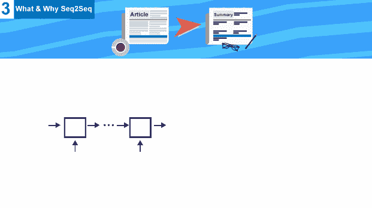

本教程是一系列教程中的第三个，将帮助您使用 tensorflow 构建一个抽象的文本摘要器，今天我们将讨论文本摘要任务的主要构建模块，从 RNN 开始，我们为什么使用它，而不仅仅是一个普通的神经网络，直到最后达到 seq2seq 模型

## 关于系列

这是一系列教程，将帮助您使用 tensorflow 使用多种方法构建一个抽象的文本摘要器， ***您不需要下载数据，也不需要在您的设备*** 上本地运行代码，因为**数据**可以在 **google drive** 上找到，(您可以简单地将其复制到您的 google drive，在此了解更多)，本系列的**代码**是用 Jupyter 笔记本编写的，可以在**上运行**

到目前为止我们已经讨论过了(这个系列的代码可以在[这里](https://github.com/theamrzaki/text_summurization_abstractive_methods)找到)

0.[深度学习免费生态系统概述](https://hackernoon.com/begin-your-deep-learning-project-for-free-free-gpu-processing-free-storage-free-easy-upload-b4dba18abebc)

1.  [概述文本摘要任务和用于该任务的不同技术](https://hackernoon.com/text-summarizer-using-deep-learning-made-easy-490880df6cd)
2.  [使用的数据以及如何表示我们的任务](https://hackernoon.com/abstractive-text-summarization-tutorial-2-text-representation-made-very-easy-ef4511a1a46)

所以让我们开始吧

EazyMind free Ai-As-a-service for text summarization

我在一个网站上添加了一个文本摘要模型 [eazymind](http://bit.ly/2VxhPqU) ，这样你就可以自己尝试生成你自己的摘要(看看你能构建什么)，它可以通过简单的 api 调用来调用，并且通过 [python 包](http://bit.ly/2Ef5XnS)，这样文本摘要就可以很容易地集成到你的应用程序中，而不需要设置 tensorflow 环境的麻烦，你可以免费注册，并享受免费使用这个 api 的乐趣。

# 快速回顾

我们的任务是文本摘要，我们称之为抽象，因为我们教神经网络生成单词，而不仅仅是复制单词。

将被使用的数据将是新闻和它们的标题，可以在我的 google drive 上找到，所以你只需将它复制到你的 google drive 上，而不需要下载它

我们将使用单词嵌入来表示数据，这只是简单地将每个单词转换成一个特定的向量，我们将为我们的单词创建一个字典([更多关于这个](https://hackernoon.com/abstractive-text-summarization-tutorial-2-text-representation-made-very-easy-ef4511a1a46))

有[种不同的方法](https://hackernoon.com/begin-your-deep-learning-project-for-free-free-gpu-processing-free-storage-free-easy-upload-b4dba18abebc)来完成这项任务，它们建立在一个基石概念之上，它们不断发展和建立，它们从一个名为 seq2seq 的网络开始，然后它们组合成不同的网络来提高整体精度，这些不同方法的代码可以在[这里找到](https://github.com/theamrzaki/text_summurization_abstractive_methods)

今天我们将讨论什么是 seq2seq 以及为什么首先使用它，所以让我们开始吧！！

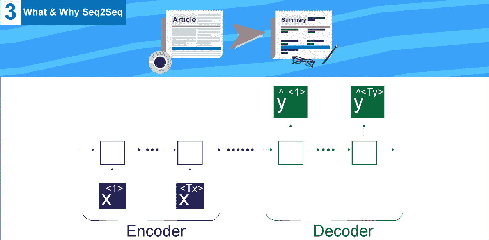

> 这个教程是基于 Andrew NG 的惊人工作，他关于 RNN 的课程非常有用，我推荐你去看

# 1-为什么我们使用复杂的网络结构而不是简单的神经网络

这确实是一个要问的重要问题，在自然语言任务中，重要的是网络理解单词本身，而不是将单词链接到特定位置，这就是我们所说的(**在文本的不同部分共享特征**

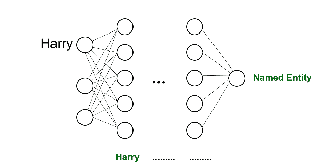

normal neural network inefficient for nlp

假设我们的任务是识别文本中的命名实体，正如我们在前面的 gif 中看到的，如果名字**哈利**出现在文本的不同部分，普通的神经网络将无法识别它

所以这就是为什么我们需要一个新的网络来完成这个任务，这个网络叫做(递归神经网络)RNN

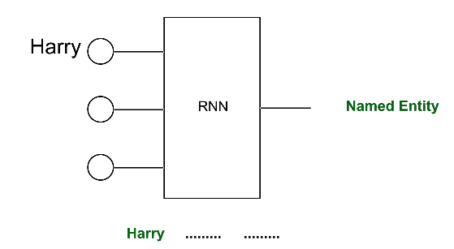

RNN for nlp

在这里使用 RNN，网络能够识别哈利这个名字，如果它出现在文本的不同部分。

如我们所见，RNN 是 seq2seq 的碱基

# 2-什么是 RNN(递归神经网络)

递归神经网络是一种神经网络，**将时间考虑在内**，每个框(gif 中的圆圈框)

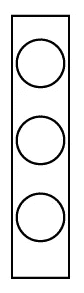

RNN network

实际上是我们的网络，我们多次使用它，每一次，都是一个时间步长，因为每一个时间步长我们都用我们句子中的一个词来填充它，它也接受前一个时间步长的输出，

概括一下，RNN 是

1.  考虑时间因素(及时运行多次)
2.  获取上一步的输出

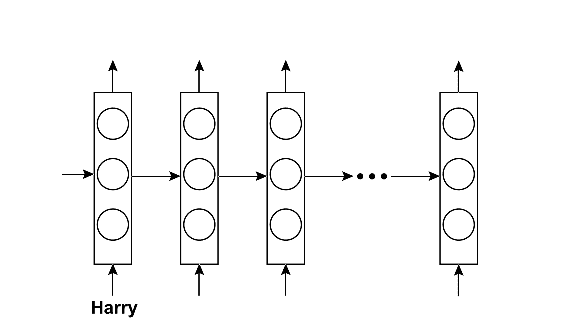

RNN ex 1

如我们所见，它从前面的步骤中获取输入

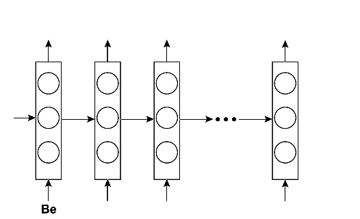

RNN ex 2

它可以理解独立于位置的命名实体识别，这是我们需要的行为

# 3- RNN 前馈步骤

像任何其他神经网络一样，我们需要一个前馈步骤

这里我们会有

1.  x 向量(蓝色向量)(输入，是我们句子中的单词)
2.  y 向量(绿色向量)(输出，将是从每个时间步导出的单词
3.  a 矢量(红色矢量)(每个时间步的激活)

还有 3 种重量

1.  蜡向量(蓝色)(将乘以输入)，**对所有时间步长都一样**
2.  Wya 向量(绿色)，(将乘以输出)，**对于所有时间步长都相同**
3.  魏如萱向量(红色)(将乘以激活)，**所有时间步长都相同**

管理我们工作的两个主要职能是

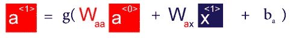

其使用先前的激活参数和具有偏差的先前输入来计算下一个激活参数，这里我们使用通常为 tanh 或 relu 的激活函数 g

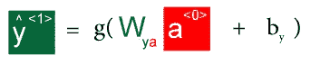

a

另一个函数用于计算每个时间步长的输出，这里我们使用激活参数和偏差，也使用 g 激活函数 tanh 或 relu

然后，我们需要计算用于反向传播的损耗

主要使用的函数是(训练损失)

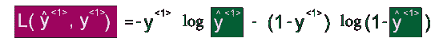

这里我们使用**产生的输出** yhat 和**给定的输出** y

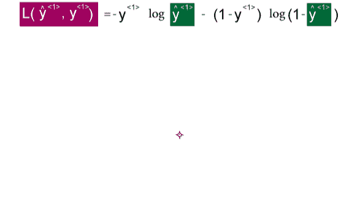

然后我们简单地将它们相加，得到总损耗

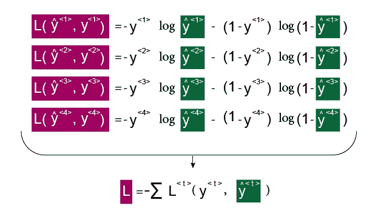

现在，在我们讨论了培训阶段之后，我们需要讨论如何运营我们的网络

# 4- RNN 跑步阶段

现在，在训练完我们的网络之后，我们需要运行它，这个阶段也被称为采样(*这里我们将根据训练好的语言模型对随机单词进行采样，以说明 rnn 如何运行*

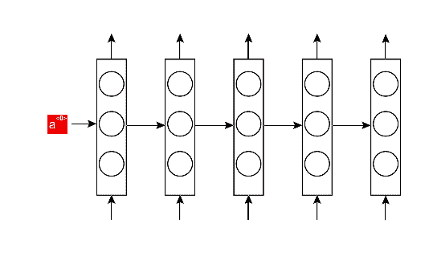

正如我们看到的，来自一个时间步骤的输入被转发到另一个时间步骤，直到我们到达最终输出，我们将需要一个 tokken <eot>，文本结束，然后我们将停止我们的运行。</eot>

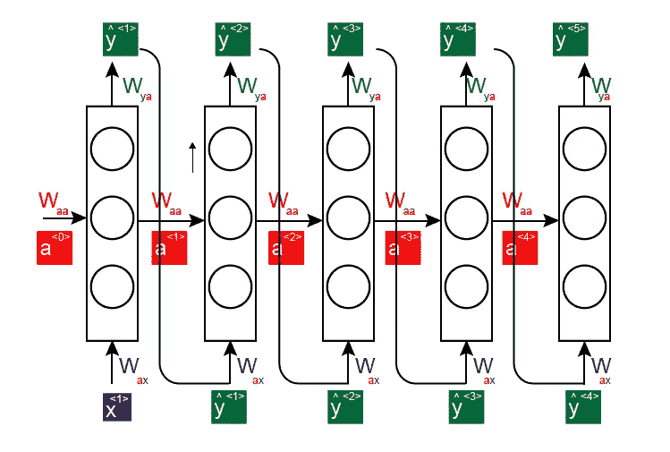

在这里，我们将计算这次运行的成本

其主要功能是

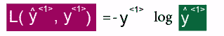

我们将同时使用生成的输出和原始输出

然后我们简单地将它们相加，得到总输出

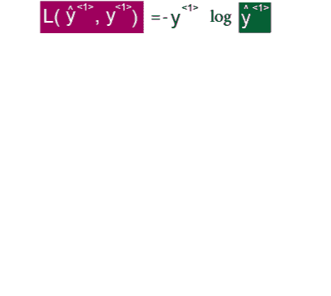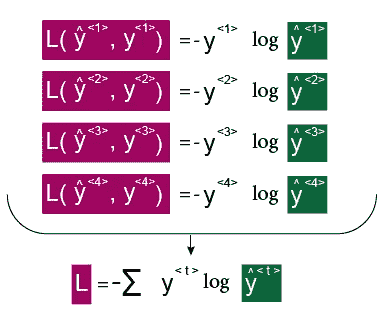

在上面的所有内容中，我们只讨论了一种类型的 RNN，即输入和输出长度相同的多对多架构，这不是我们的情况

至于文本摘要，我们需要拥有输入和输出不同长度的能力，为此我们最后会谈到 **Seq2Seq**

# 5-我们终于到了 Seq2Seq

我们需要一个特殊的网络，它接收长度为(Tx)的输入，并产生另一个不同长度(Ty)的输出，这种结构称为编码器解码器。

这里的两个编码器解码器都是 RNN 网络，但是编码器使用输入，并产生输出状态，该输出状态然后被用作解码器级的输入

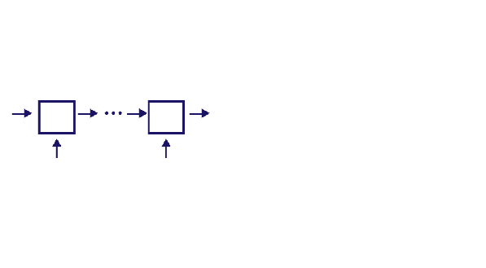

这种架构用于两种任务

1.  机器翻译
2.  文本摘要

# 概述

今天我们讨论了

1.  为什么我们使用 RNN 进行文本摘要而不是简单的神经网络，
2.  什么是 RNN(前馈，跑步)
3.  然后，我们最终使用编码器解码器实现了 seq2seq 架构

但是，我们甚至可以有一个更好的文本摘要架构，我们可以对 RNN 进行修改以提高其效率，并解决它的一些问题，我们还可以添加注意机制，这证明对我们的任务非常有益，我们还可以使用波束搜索

如果上帝愿意，所有这些概念都将在接下来的教程中讨论。

> 我真诚地希望你喜欢阅读这个教程，我希望我已经把这些概念讲清楚了，这一系列教程的所有代码都可以在这里找到，你可以简单地使用 google colab 来运行它，请查看教程并告诉我你对它的看法，希望再次见到你

# 后续教程

*   [多层双向 LSTM/GRU 使文本摘要变得简单(教程 4)](http://bit.ly/eazysum_tu4)
*   [波束搜索&注意让文本摘要变得简单(教程 5)](http://bit.ly/2G4XCo3)
*   [在 Tensorflow 的 94 行中构建一个抽象的文本摘要器！！(教程 6)](http://bit.ly/2ZeEmvO)
*   [用于文本摘要的抽象&提取方法的组合(教程 7)](http://bit.ly/2EhcRIZ)