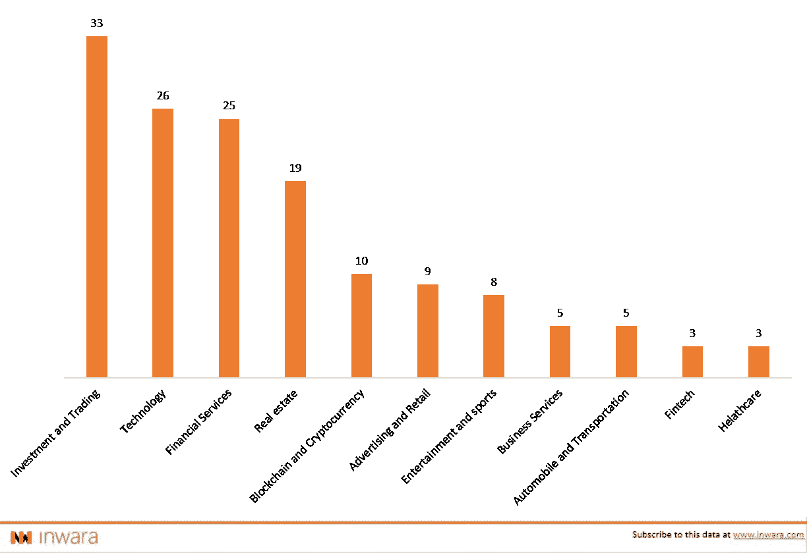

# tZERO:从 ICO 到 STO 的成功迁移，等待平台发布

> 原文：<https://medium.com/hackernoon/tzero-successful-migration-from-an-ico-to-sto-platform-launch-awaited-everything-you-need-to-know-48e976c3eb07>

免责声明:这不是财务建议。文章灵感来自 [*InWara*](http://www.inwara.com/?utm_source=tzerohacker&utm_medium=tzerohacker&utm_campaign=tzerohacker) *。有关更多详情，请访问* [*条款和条件。*](https://www.inwara.com/disclaimer)

[tZERO](https://www.tzero.com/) 由[Overstock.com](https://www.overstock.com/)通过首次发行硬币-ICO 发起，目的是为开发一个替代的分散交易平台筹集资金。据 CEO Patrick Byrne 称，期待已久的 tZERO 安全令牌交易平台将于本周末上线。Overstock 的 ATS(替代交易系统)是 tZERO 的前身，已经运行了两年，但交易量有限。

根据 coindesk 的报道，“tZERO 将由 Steven Hopkins 领导，他直到最近一直担任 Medici 的首席运营官和总法律顾问。霍普金斯将担任 tZERO 的总裁，现在正在寻找另外两个高管职位:发行主管和为 tZERO 客户服务的内部经纪交易商主管。

# 从 ICO 迁移到 STO

最初，tZERO 部署了代币合同，并创建了持有人在 2019 年 1 月 10 日之前无法访问的代币，这基本符合证券法规，即代币在发行后保留在保管钱包中 90 天。

代币的三个月锁定期已经结束，投资者可以选择在经纪交易商和 tZERO 合作伙伴恐龙金融集团开设经纪账户，或将代币放入他们的个人钱包。未经认可的投资者预计将通过批准的平台在 2019 年 8 月 6 日之前加入派对。tZERO 还计划通过注册其证券，允许在国际交易所进行二级交易。

# 尽管有 SEC 的规定，2018 年 ICO 数量仍激增

2018 年全球 ico 数量暴涨。根据 InWara 的数据，全球进行了 2135 次 ico。相比之下，2017 年只进行了 946 次 ico。

[Source: InWara’s ICO+STO database](http://www.inwara.com/?utm_source=tzerohacker&utm_medium=tzerohacker&utm_campaign=tzerohacker)

尽管有这种趋势，许多美国公民被禁止参与这些代币销售，这是因为这些代币不符合 SEC 的规定。

# 主要全球合作伙伴和筹集的资金

tZERO 的母公司 Overstock.com 一直对加密很友好，有趣的是，它是首批接受比特币支付的公司之一。Overstock.com 是一家总部位于美国的电子商务巨头，由帕特里克·M·伯恩创办，至今担任代理首席执行官。

中国私募股权公司 GSR capital 正在对 tZERO 及其母公司 overstock.com 进行一轮雄心勃勃的投资。GSR 计划在 tZERO 投资 2.7 亿美元，同时购买价值 3000 万美元的代币，尽管在 tZERO 投资巨大，GSR capital 还计划在 Overstock.com 投资 1 亿美元。

上个月早些时候，据报道，tZERO 子公司被 GSR Capital 聘用，开发一种交易钴的令牌。其目的是象征性的价值高达 2 亿美元的钴，这是电动汽车电池的关键组成部分。

tZERO 首席执行官 Saum Noursalehi 在一份声明中说:

> “这笔资金将使我们能够在全球范围内快速扩展我们的区块链资本市场平台，为全球经济开创一个通过技术实现信任的时代。”

tZERO 通过出售其 1925 万枚 TZRO 代币筹集了 1.34 亿美元。有趣的是，tZERO 的 ICO 销售时间异常漫长，从 2017 年 12 月开始，持续了几个月。去年底，此次发行开始时是一个更典型的预售 ICO，但在美国证券交易委员会(SEC)进行全面审查后，它于 3 月份成为第二阶段 STO。

# 即将到来的竞争

[Templum trading](https://templuminc.com/) 的目标是建立一个平台，提供受监管市场的稳定性，并将其交付给数字资产市场。该公司已经从多元化的投资公司集团筹集了 270 万美元的资金，如[猛禽集团](https://www.raptorgroup.com/)和[区块链资本](https://blockchain.capital/)，以开发其替代交易平台。

# 为什么 sto 在美国加快步伐？

由于 ico 在很大程度上不受监管，缺乏可行的法律框架，因此不符合 SEC 的规范。SEC 今年对 ico 的严厉打击可能是 sto 数量激增的一个原因，尤其是在美国。

[Source: Inwara’s ICO+STO database](http://www.inwara.com/?utm_source=tzerohacker&utm_medium=tzerohacker&utm_campaign=tzerohacker)

在美国的 91 家 sto 中，金融服务在贸易和投资等相关行业中处于领先地位。房地产股票毫不意外地位居第二。

# 根据全球行业的 STOs

[Source: InWara’s ICO+STO database](http://www.inwara.com/?utm_source=tzerohacker&utm_medium=tzerohacker&utm_campaign=tzerohacker)

到目前为止，投资和交易是 sto 的市场领导者，紧随其后的是技术。有趣的是，金融服务在 ico 中是市场领导者，但在 sto 中排名第三。

