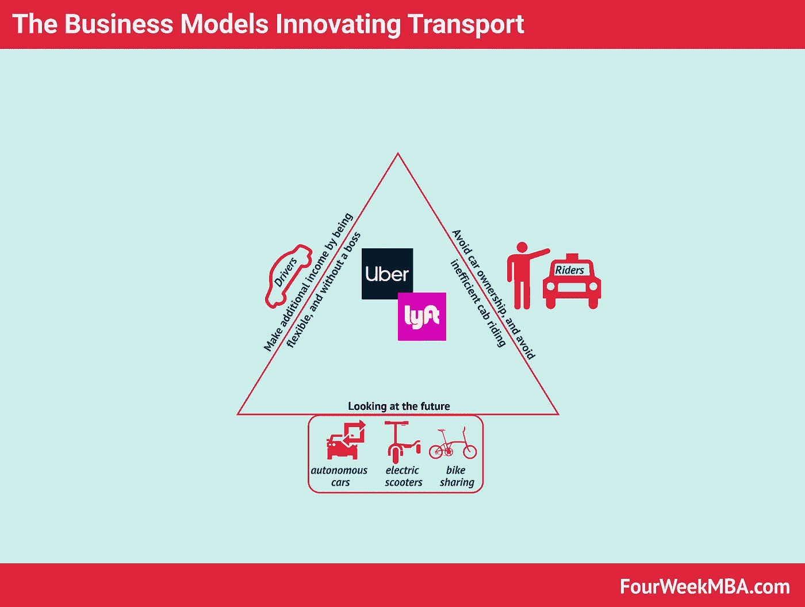
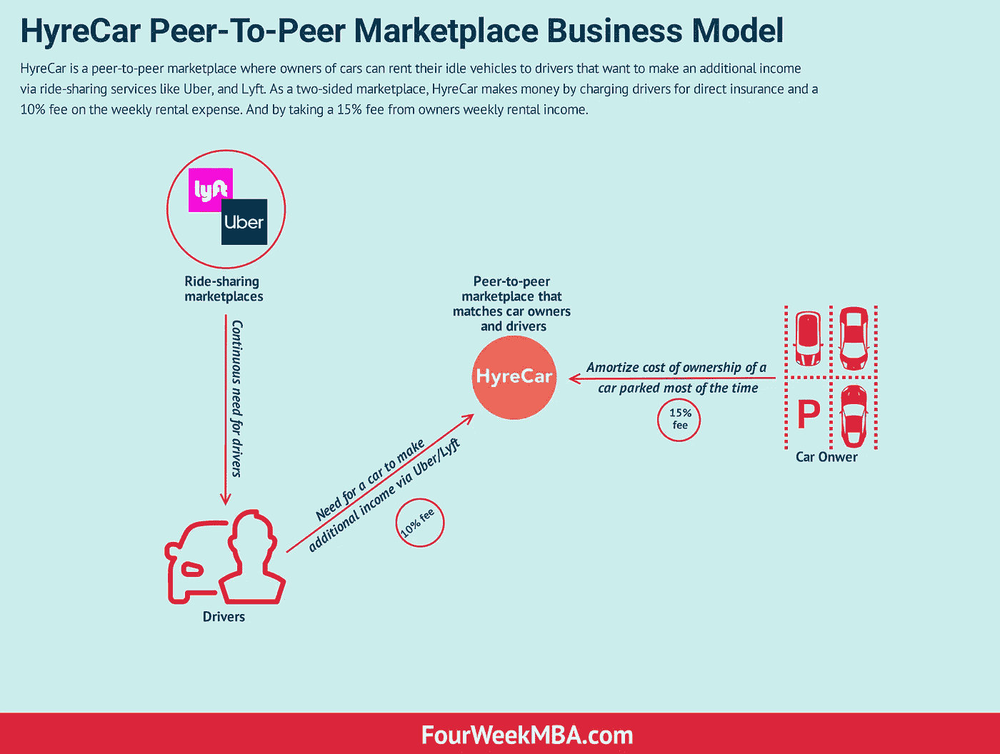
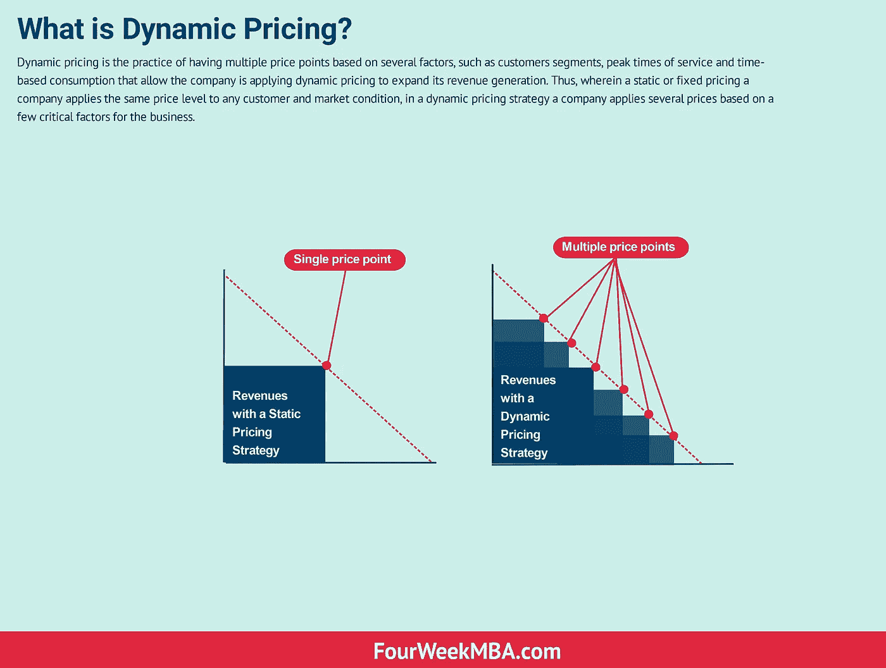
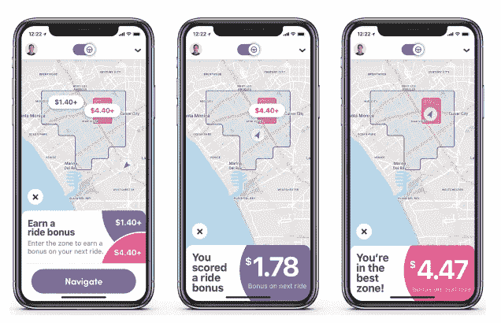
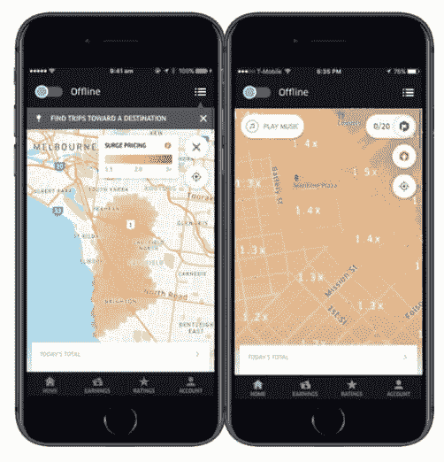
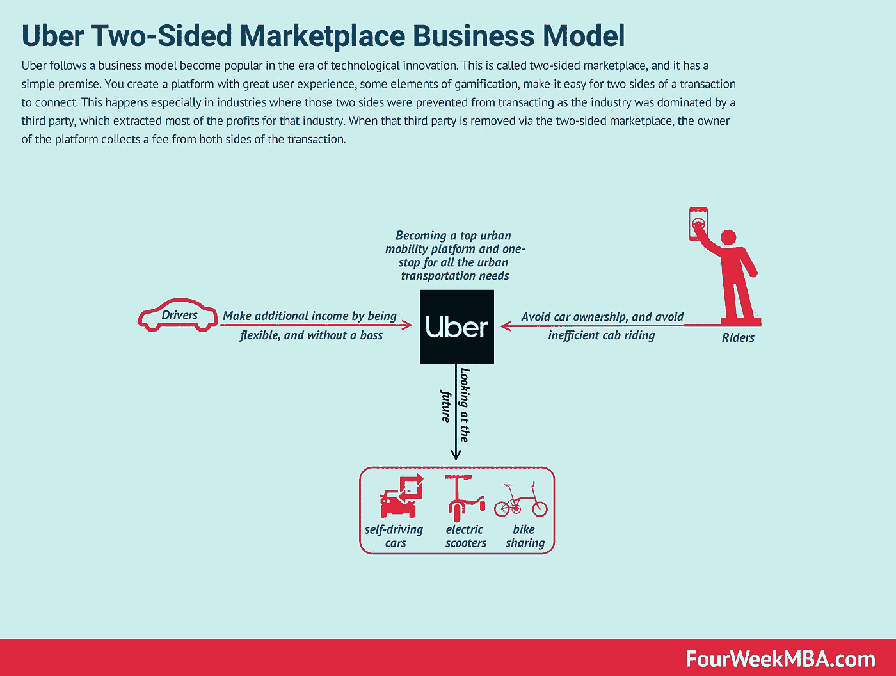
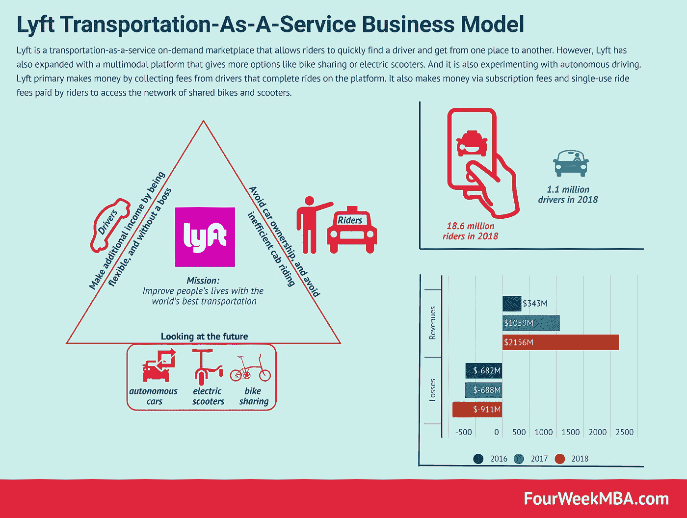
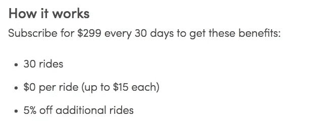

# 外行人眼中的优步和 Lyft 的商业模式

> 原文：<https://medium.com/hackernoon/uber-and-lyfts-business-models-in-laymen-s-terms-ca474fd11700>

不仅仅是 [**【优步】**](https://fourweekmba.com/uber-business-model/) 和 [**Lyft**](https://fourweekmba.com/lyft-business-model/) 之间的比较，这是一组可能有助于理解[创新商业模式](https://fourweekmba.com/business-model-innovation/)接管成熟行业的动态的想法和观察。

事实上，当建立一家公司时，传统的[战略](https://fourweekmba.com/business-strategy/)是设计一种商业模式，并在商业世界中推广。或者通过收集来自市场的反馈并对其进行迭代来一点一点地组装它。

然而在某些情况下，一个商业模式的成功需要整个社会的转变。当这种情况发生时，[商业模式](https://fourweekmba.com/what-is-a-business-model/)需要成为生态系统的建设者，而不仅仅是公司。例如，回到[优步](https://fourweekmba.com/uber-business-model/)和 [Lyft](https://fourweekmba.com/lyft-business-model/) ，他们的[商业模式](https://fourweekmba.com/what-is-a-business-model/)正试图改变我们日常生活的一个重要部分:交通。

# 大众汽车拥有量

优步和 Lyft 开始时更像是运动，而不是公司。事实上，与传统的交通系统相比，他们都有一个不同的愿景。

例如，[优步的终极目标](https://fourweekmba.com/uber-business-model/)是关于“让没有私家车的生活变得更容易。实现这一目标最终意味着通过减少拥堵、污染和对停车位的需求来改善城市生活。”

与此同时，Lyft 在 2012 年发起了一场运动，其使命是“用世界上最好的交通工具改善人们的生活”。

虽然它们的发展方向相同，但这些公司有着不同的核心价值观。优步重视:

*   扩展访问
*   交付可靠性
*   提供选择
*   调整需求
*   坦率直言

Lyft 重视以下方面:

*   文化和价值观
*   品牌真实性
*   多式联运

他们可能用不同的措辞来传递相同的信息。然而，从这些核心价值观中可以形成不同的文化，而这些文化是这些公司扩大规模的关键因素。

彼得·德鲁克说过一句话，“文化早餐吃[战略](https://fourweekmba.com/business-strategy/)”他是否说过，我们不能确定。但我认为这句话提出了一个重要的观点。

一般来说，战略可能坐在文化的同一张桌子上。在某些场合，当你推出一种全新的[商业模式](https://fourweekmba.com/what-is-a-business-model/)，这需要社会调整，那么文化就会把[战略](https://fourweekmba.com/business-strategy/)和[商业模式](https://fourweekmba.com/what-is-a-business-model/)作为早餐。

在[优步](https://fourweekmba.com/uber-business-model/)和 [Lyft](https://fourweekmba.com/lyft-business-model/) 的案例中，它们作为一种运动的开始并不是从真空中冒出来的，而是一场自下而上的运动，源于多年来大众拥有汽车所带来的弊端。这些显著的缺点包括:

*   大部分时间停放的车辆利用不足
*   拥有汽车的低效率导致城市在城市住宅中建造大量停车场
*   与汽车的好处相比，拥有汽车的成本是巨大的，尤其是在城市里

这些运动始于大城市，旧金山、洛杉矶和纽约等地是这些服务最先推出的地方，这并非偶然。

这就把我们带到了下一点。

# 新的宏观趋势的形成

全球化、数字化、不断增长的城市人口和越来越不稳定的工作都导致了新趋势的产生，帮助[优步](https://fourweekmba.com/uber-business-model/)和 [Lyft](https://fourweekmba.com/lyft-business-model/) 进入运输市场，并迅速发展。其中一些是:

*   越来越多的人倾向于避免拥有汽车
*   互联网使得按需使用某些服务成为可能
*   对额外收入的需求创造了一个平行的未被充分利用的“廉价就业市场”
*   人们越来越关注环境，这使得他们更加关注自己的交通选择
*   在一些城市，公共交通和出租车行业的低效率刺激了对新的替代方案的需求

这些宏观趋势无疑帮助[优步](https://fourweekmba.com/uber-business-model/)和 [Lyft](https://fourweekmba.com/lyft-business-model/) 推出了它们的[商业模式](https://fourweekmba.com/what-is-a-business-model/)，尽管如此，监管和来自现有行业(如出租车行业)的抗议。人们自下而上地推动这些公司取得成功。

这也给我们带来了另一个关键点。

# 当商业模式成为生态系统的制造者

虽然[优步](https://fourweekmba.com/uber-business-model/)和 [Lyft](https://fourweekmba.com/lyft-business-model/) 都有两个关键的合作伙伴(司机和骑手)，但它们商业模式的成功取决于与当地社区打交道的能力。

因此，这种新的运输[商业模式](https://fourweekmba.com/what-is-a-business-model/)的整体实施需要理解有助于构建生态系统的复杂动态。

事实上，如果你试图在一个成熟的行业建立一家公司，你所要做的就是创造一个可持续的商业模式，能够发展一个繁荣的社区。当你在一个全新的行业推出一个商业模式时，这个商业模式需要播下种子来建立一个新的生态系统。

因此，它需要向外看，而不是向内看，虽然它从建立一个社区开始，但它需要能够扩展整个生态系统！

# 随着新产业的出现，新的机会出现了

有趣的是，我们注意到优步和 Lyft 这样的公司的出现也促进了互补产业的发展。例如，Hyrecar 是一个点对点市场，车主可以将他们的闲置车辆出租给希望通过为优步或 Lyft 开车来获得额外收入的司机。

通过提供一个[平台](https://fourweekmba.com/platform-business-models/)让车主和司机之间的联系变得容易，Hyrecar 正在从零开始建立一项新的业务。

为什么会这样？平台不是一个简单的游戏，优步和 Lyft 多年来想出了聪明的策略，主要是让司机回到平台。

事实上，在两个关键的参与者(司机和乘客)中，可能对他们最重要的，产生[网络效应](https://fourweekmba.com/two-sided-marketplace/)的是司机。如果作为一名骑手，我上了应用程序，但周围没有骑手，或者我的等待时间太长，我可能会完全转向另一种服务或交通模式。

就此而言，[优步](https://fourweekmba.com/uber-business-model/)和 Lyft 都使用动态定价[策略](https://fourweekmba.com/business-strategy/):

*Lyft 动态定价激励驾驶员在特定区域驾驶*

*优步涨价让司机回到* [*平台*](https://fourweekmba.com/platform-business-models/) *赚取额外收入*

优步和 Lyft 成功吸引了大量司机，Hyrecar 等公司则受益于这些网络效应。

# 平台商业模式主导

优步和 Lyft 不仅仅是公司；那些是平台。一个[平台](https://fourweekmba.com/platform-business-models/)的核心是一个连接人们和群体的地方，让他们的互动尽可能顺畅。

由于允许这些互动平台收费，从长远来看，这种动态与纳税没有什么不同。

这也是为什么优步和 Lyft 不从事拥有汽车的业务。他们允许刺激市场的连接。从这些市场中，他们以收费的形式获取经济价值。

在过去的二十年里，网络允许许多平台形成，优步和 Lyft 也不例外。

# 交通即服务

另一个正在经历的根本性变化是从所有权到占有或使用的更广泛的转变。简而言之，在包括软件在内的许多行业(随着 [SaaS 商业模式](https://fourweekmba.com/what-is-saas/)的兴起)，公司正在从提供产品或一次性服务过渡到可以通过订阅计划受益的持续服务。

例如，Lyft 在[平台](https://fourweekmba.com/platform-business-models/)上引入了共享自行车和滑板车网络的订阅费，或者获得特殊促销。

正如 Lyft 博客上所指出的，通过订阅费，你可以获得一个有趣的交通套餐:

**来源** : Lyft 博客

许多公司正试图从以产品为中心转变为以客户为中心，这意味着从单一的销售接触点转变为向付费用户提供持续的服务和推荐。

如果这种趋势加快，那么像 Lyft 这样的其他企业也可能更容易实施和改进他们的订阅服务。

# 关键外卖

新的产业可以建立在旧的和已经存在的产业之上。在大众拥有汽车的情况下，越来越多的人选择了一种不再拥有汽车的模式。这种转变是一场更深远的运动的一部分，这场运动始于近十年前，目前仍在继续。

当新进入者进入并推出他们的[商业模式](https://fourweekmba.com/what-is-a-business-model/)时，这些商业模式还必须考虑到这样一个事实，即如果商业模式本身需要成功，就需要建立一个完整的生态系统。

就此而言，像优步和 Lyft 这样的公司从平台过渡到生态系统的建设者。只有当这个过程完成后，[商业模式](https://fourweekmba.com/what-is-a-business-model/)才会被证明是成功的，最终结果可能看起来不错！

*原载于 2019 年 3 月 2 日*[*fourweekmba.com*](https://fourweekmba.com/uber-vs-lyft/)*。*