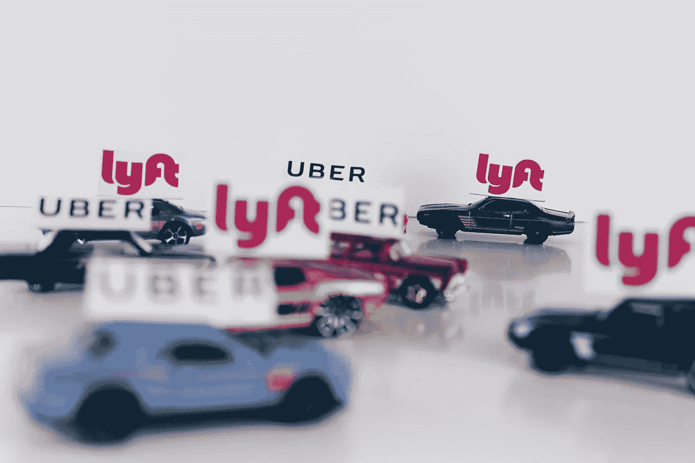
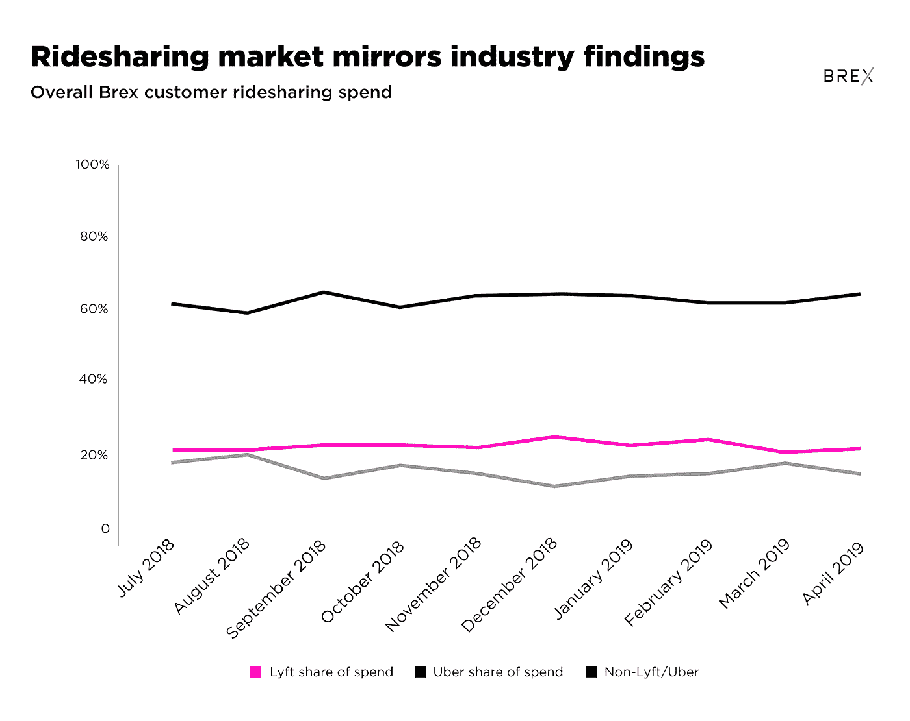
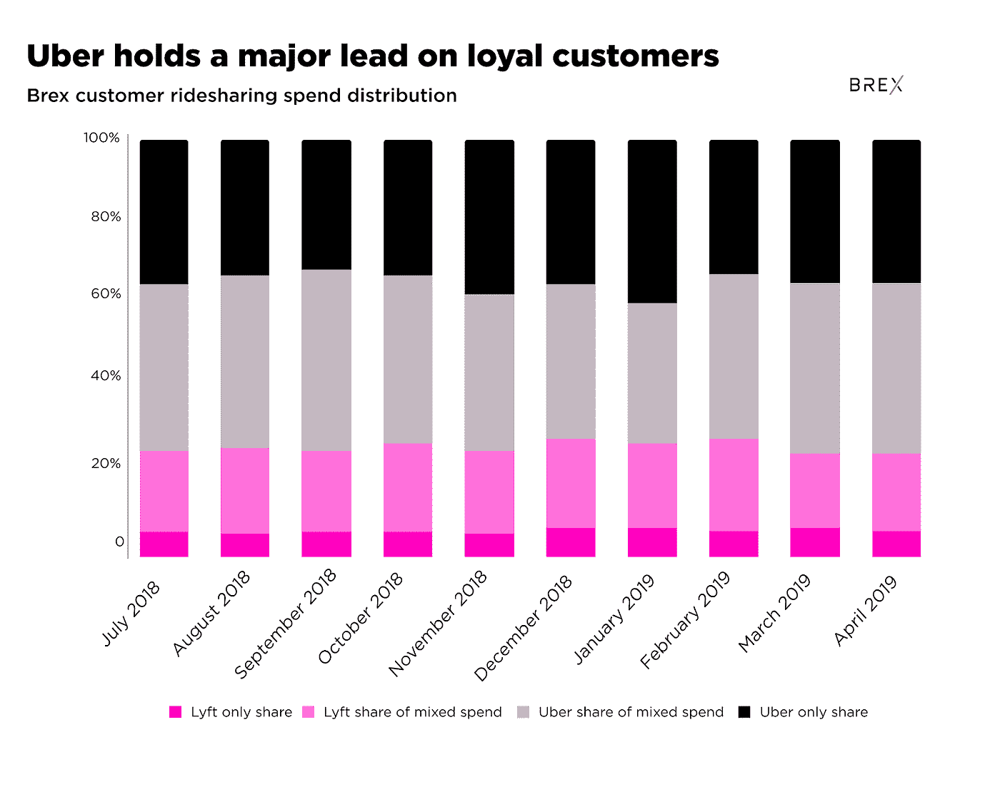
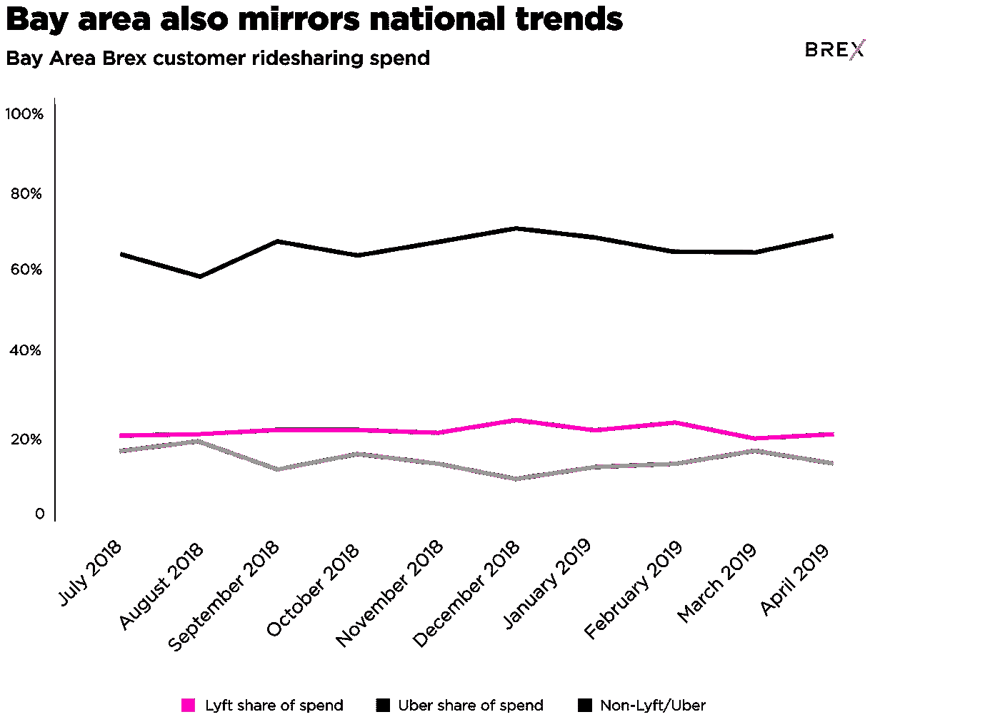
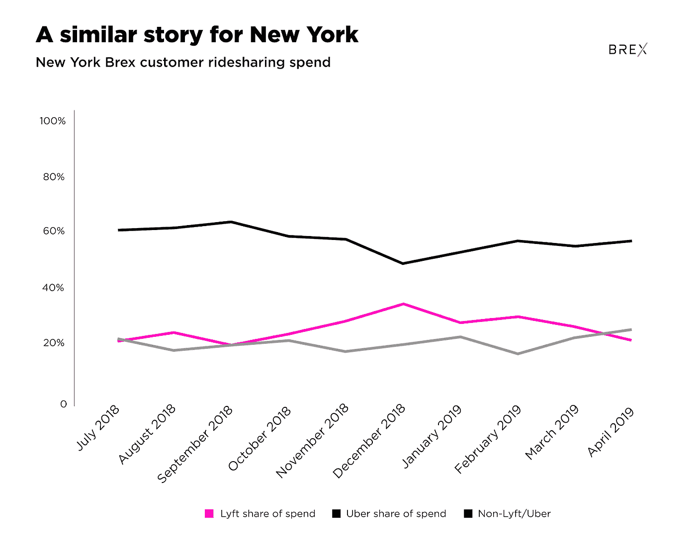

# 优步在初创公司中占有 60%的拼车市场份额

> 原文：<https://medium.com/hackernoon/uber-holds-60-ridesharing-marketshare-amongst-startups-e18504a2e3e5>

## 【Lyft 和优步之间的 Brex 客户奖励数据内幕

> [最初发表于 Brex 博客](http://bit.ly/2M0ChkG)

优步希望估值超过 800 亿美元是有充分理由的。优步的服务几乎遍布世界各地。如果不是优步产品本身，优步可能拥有你正在使用的任何拼车或运输公司的一部分。优步在 Grab、滴滴都有大量股份，几乎在每个大洲都有业务，它代表着一家改变格局的公司。尽管优步已经退出了中国等一些地区，但它成为全球业务的雄心当然不可低估。

它仍然面临着竞争，虽然它占据了少数市场份额，但 Lyft 在美国是一个相当大的竞争对手。Lyft 在美国主要城市的持续使用表明，这里有两个玩家的空间——而且优步也不是无懈可击的。

我们分析了 Brex 客户支出数据，以考虑优步和 Lyft 之间的动态关系。Brex 数据代表了初创公司和早期公司如何在包括软件、运营和其他费用在内的各种服务中部署资本的快照。Brex 的数据至少可以让我们了解过去一年优步和 Lyft 之间的故事。

这些早期采用者公司可能会选择优步或 Lyft 等服务作为他们的运输服务，而不是传统服务，因此优步希望与这些公司一起发展壮大。当然，这是 Lyft 的一个重要市场。在我们开始之前，我们可以看到，不出所料，优步在 Brex 用户中的使用率远远高于 Lyft。

## **看看全局——还有创业中心**

优步继续在 Brex 客户的总支出中占据主导地位，占去年拼车公司总支出的 60%左右。这一分配在过去一年中基本保持不变，而 Lyft 和其他出租车服务瓜分了剩余部分(Lyft 通常会拿走剩余部分的大部分)。

我们看到的可能看起来有点无聊——毕竟只有三条直线！然而，这仍然是优步的一个重要市场。由此，我们可以看到两家公司仍然保持着相当的竞争力，即使它们之间存在着实质性的差距。这些结果[大致反映了第二项措施](https://blog.secondmeasure.com/datapoints/rideshare-industry-overview/)等其他措施的发现，尽管非 Lyft/优步公司仍保留了一些份额。

虽然 Lyft 的整体支出仍占 Brex 客户支出的很大一部分，但其中大部分属于同时使用优步和 Lyft 的 Brex 客户。事实上，与优步相比，仅使用 Lyft 的 Brex 客户比例相当低。这种分布在我们所有的主要市场上大致一致。如果我们进一步探究消费结构，我们还会发现优步在使用 Lyft 和优步的 Brex 客户中也占据主导地位。

这告诉我们，大多数在拼车上花钱的 Brex 客户都在使用这两种产品。一个可能的解释是，初创公司选择最便宜的选择，这对于试图控制企业支出是有意义的。它还告诉我们，尽管大多数人在这两种产品上都花了钱，但 Lyft 在整体混合支出中仍占少数。第三，它告诉我们，Lyft 在 Brex 用户中的潜在“忠诚者”子集甚至更小——每月总支出不到 7%！

看看我们最大的市场——旧金山湾区，我们可以更清楚地了解优步在该国早期采用新技术方面的表现。该地区代表了 Brex 客户在优步和 Lyft with Brex 的大部分支出。

**超越我们的加州泡沫**

湾区以外的市场在 Brex 客户支出中所占的比例较小，但它们仍然让我们看到了初创公司如何在拼车服务上花钱。正如你所料，就优步和 Lyft 的客户支出而言，纽约州是 Brex 的第二大市场。为了更好地了解情况，我们分析了纽约 Brex 客户的消费数据，我们的情况与旧金山湾区截然不同。

在纽约，我们看到三种交通方式之间的竞争似乎更加激烈，而且 Lyft 和优步以外的服务(如出租车)仍然保持竞争力。尽管纽约可能传统上是一个你可以走出去在街角拦出租车的城市，但 Brex 的客户仍然明确选择让 Lyft 和优步成为他们日常运营的一部分。

我们可以看到，虽然优步已经占领了湾区的大部分地区，但它在一些市场如纽约州也并非无懈可击。这可能是因为用户同时呼叫两辆车并乘坐最先到达的车辆，或者一辆车的价格较低或任何其他因素。不管怎样，Lyft 和优步在过去的几个月里竞争更加激烈——出租车似乎仍然是一个实用的选择。

## **向前看，保持正确的观点**

随着优步上市，重要的是要记住，美国仍然占其市场的很大一部分。根据该公司的 S-1 文件，2018 年，美国和加拿大在优步 2018 年“核心平台”收入产生的 109 亿美元收入中占了超过 60 亿美元。虽然拼车行为在国外可能截然不同，但优步(和 Lyft)仍然需要在美国保持对拼车的控制——特别是在那些最终可能成为下一个优步的公司中。成为有朝一日可能拥有成千上万员工的公司的第一选择，是一个不容忽视的市场。

可能仍然很难准确定义优步是一家什么样的公司，或者它希望在未来几周开始交易时成为什么样的公司。它可以是一家运输公司，从 A 点到 b 点运输一切，包括人、食物等。它也可以是一家软件公司，创造推动这一切的技术。或者你可以认为它是一家基础设施公司，制造管道来推动一个新的产业。

然而，后一种可能并不完全是最好的比较。拼车行业作为一个整体正在大幅增长，但互联网的支柱:服务器也是如此。

毕竟，亚马逊将其 AWS 服务器业务转变为其最高效的业务之一，每年可以产生超过 100 亿美元的收入。优步可能正在颠覆运输行业，但它还不是一家互联网定义的公司。

## **方法论**

Brex 检查了 Lyft 和优步截至去年 6 月的支出数据，当时首张 Brex 卡推出。支出份额定义为在一段时间内，Lyft 或优步交易的美元总额占优步和 Lyft 的总支出。客户使用量被定义为在 Lyft 或优步上消费的账户总数与在 Brex 卡上授权交易的 Brex 客户总数之比。优步的数据不包括优步 EATS，对此我们非常感谢我们的数据科学团队。该数据还排除了一些公司的支出，这些公司出于运营目的大量使用优步或 Lyft。

## **关于 Brex**

> Brex 正在通过创建针对特定行业的金融产品来转变 B2B 支付。2018 年，Brex 推出了第一个专门为创业公司设计的公司卡和奖励计划。通过从头开始重建信用卡技术体系，Brex 能够重新想象公司卡的每个方面，包括承销、透明度和批准，为客户创造更好的体验。Brex 已经筹集了 2.15 亿美元的资金，并得到了 Y Combinator Continuity、彼得·泰尔、麦克斯·拉夫琴等公司的支持。该公司的总部设在旧金山。
> 
> 我们还很早，我们欢迎尽可能多的反馈。此外，我们正在疯狂招聘。看看我们有没有[的空缺](https://boards.greenhouse.io/brex)！
> 
> [最初发表于 Brex 博客](http://bit.ly/2M0ChkG)