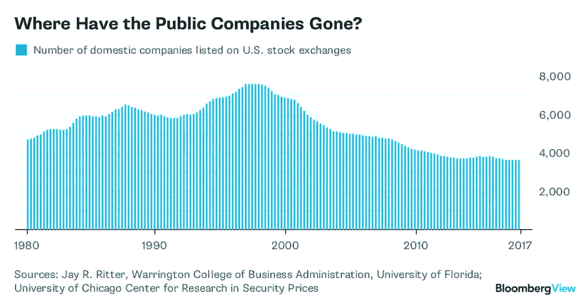
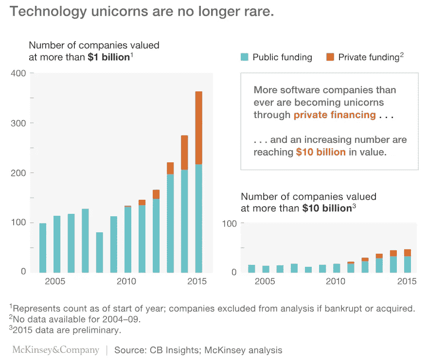
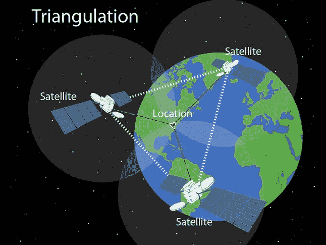
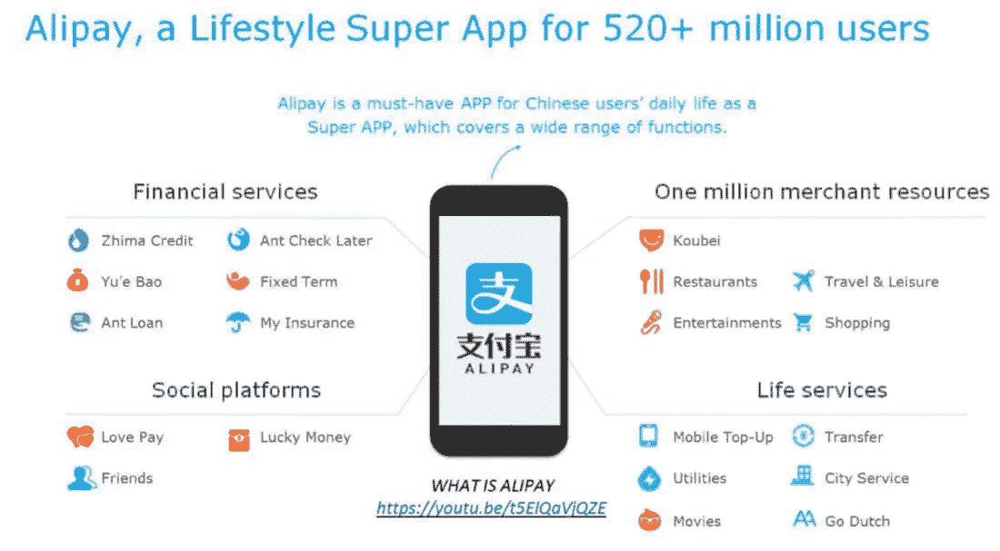
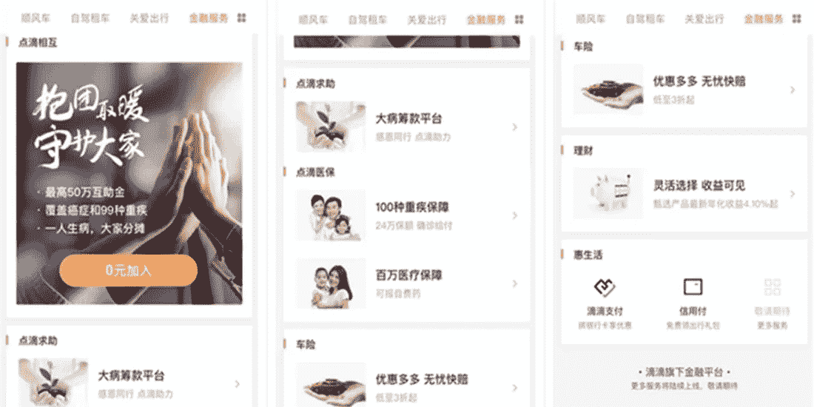
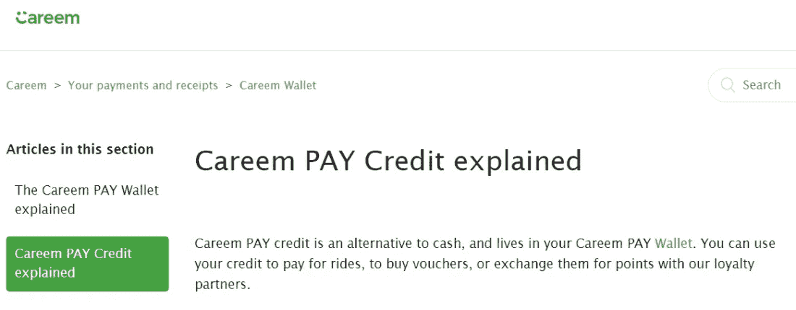
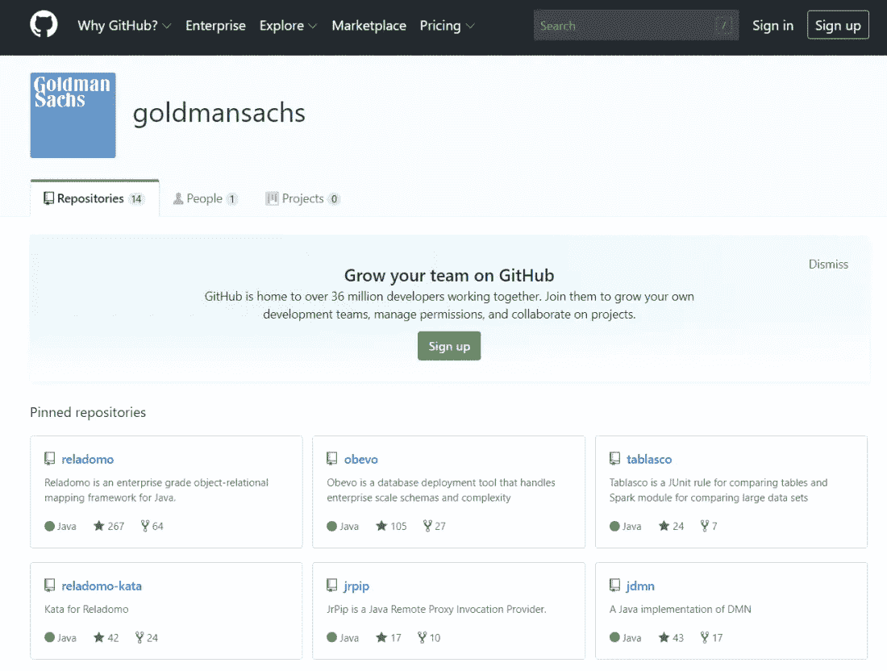

# 优步的首次公开募股和为金融服务提供动力的全球超级应用

> 原文：<https://medium.com/hackernoon/ubers-ipo-and-the-global-super-apps-powering-financial-services-735fffc634f2>

全世界都在谈论优步上市。该公司正在筹集大约 80 亿美元，估值超过 800 亿美元，正在创造一批硅谷百万富翁，他们将通过天使投资来保持私营公司的初创派对。不知道他们有几个会买比特币！你可以从[彭博](https://www.bloomberg.com/opinion/articles/2019-05-09/the-uber-ipo-day-is-finally-here)、[卫报](https://www.theguardian.com/business/2019/may/09/uber-value-wall-street-ipo-friday)、[商业内幕](https://www.businessinsider.com/uber-ipo-happened-worst-possible-time-2019-5?r=US&IR=T)和[福布斯](https://www.forbes.com/sites/daveknox/2019/05/10/the-second-order-consequences-of-the-uber-lyft-beyond-meat-ipos/#7af3ab867e5a)获得交易细节，我想思考一下像数字优先运输公司冲击零售市场这样的事件的一些推论。

# 保持隐私的含义

先说谁赚钱，什么时候赚钱。众所周知，公司上市的时间要晚得多，因此，推动其增长的资本是私人的，而不是公共的。公开市场充满了合规成本、以现金流为导向的对冲基金经理和被动的指数制造商——这不是一个让埃隆·马斯克(Elon Musk)类型的人做好工作的环境。另一方面，私募市场通常更着眼于长期，对投资者的保护更少。这具有分配影响。

根据定义，美国的私人市场是为富人合法构建的。作为散户投资者，你的正义甜点是 Betterment 的指数导向型资产配置。作为一个合格的投资者，你得到 AngelList，SharePost 和其他。我还没有在 Crowdcube 上看到优步。因此，科技公司正在通过其职能(权力法导致的垄断集中、自动化导致的失业)和资金制造不平等。

Collapse of public companies

Rise of the private billions

要对抗这种趋势，我看到的唯一答案就是令牌化。进入私人市场的障碍不仅仅是现有的法规——这可以随着像《就业法案》这样的立法而改变。也是市场结构本身。如果你向成长型股票投资者出售价值 1000 万美元的股票，该股票的形式因素是多份超过 50 页的定制法律合同，至少需要 5 万美元的法律费用。这使得 10，000 人拥有所有权不切实际。

即使强行进入一个专注于众筹的平台，最终结果仍然是更多的纸张，建立一个特殊目的的工具来合法地聚集个人，同时限制他们的权利。然而，如果我们真心实意地将风险资本转移到令牌化的轨道上，所有权可能会被分割和分配。这很难，主要是因为私人初创企业宁愿与一家大型机构投资者打交道，也不愿与一大群愤怒的 Twitter 流氓打交道。

# 价值背后的真正创新

第二个值得考虑的问题是优步在智能手机中的角色。在西方，像优步和 Lyft 这样的公司是数字出租车。这不是一个小壮举！他们可能渴望更多，拥有整个类别的交通工具。突然间，滑板车和自行车从你的手机里涌出，涌入旧金山的每个角落。在这个框架内，理解优步的实际趋势是很重要的。这种趋势不是“移动性”，也不是某种更高效的运输方式，或者点对点经济。那些仅仅是症状。

根本原因是你手机里的全球定位系统，因此也是物联网的根源。GPS 是一项伟大的人类成就，由美国政府建造，并作为公共产品(免费，不征税)提供给整个美国个人和商业部门。任何设备都可以寻找天空中的特殊卫星，并根据它如何听到无线电信号来三角测量自己在地球上的位置。为了做到这一点，核动力时钟被火箭发射到太空，到达用爱因斯坦最复杂的相对论数学计算出的位置。

知道东西在哪里让优步变得有价值。高效地连接乘客、食物、医院病人、汽车是他们专有的软件资产。受益于软件的双面人际网络是他们专有的商业资产。但如果你放眼全球，看看中国和中东的 Ubers，它们的价值主张就完全不同了。风险投资者称这样的玩家为“超级应用”，因为他们不只是卖给你出租车。他们通过遥控你的生活来卖给你一切。

一旦你将一个受益于软件解决方案的巨大的多方人际网络聚合成一项商业资产，你就获得了他们的关注。一旦你吸引了他们的注意力，你就可以用它来发短信、支付、储蓄、投资、理财和保险。这就是为什么中国拼车公司滴滴看起来更像蚂蚁金服和腾讯的微信。这就是为什么优步收购的中东竞争对手 [Careem 正在谈论该地区数百万现在接入数字网络的无银行账户消费者的银行账户](https://www.careem.com/en-ae/)。

Alipay’s services

Didi’s financial services

Careem’s bank accounts

# 胜利的权利

再退一步，从功能的角度来看，我非常清楚科技公司在成为银行方面和银行一样好，如果不是更好的话。在银行业尚不成熟的世界各地，科技或电信行业已经开始填补空白。金融产品、基础设施或传统知识没有什么特别的。西方的监管在很大程度上阻止了科技和电信发挥其金融科技潜力，但随着时间的推移，即便如此，这也正在变成噪音和废话。

从 T-Mobile，到苹果，到脸书，到谷歌和亚马逊，所有的科技公司都充斥着被第三方伪装的金融服务产品。这只是时间问题。随着我们向未来迈进几十年，更重要的是平台留住和满足用户的能力，同时创造道德的商业模式，用隐私和尊重取代微盗窃数据。创建和控制大规模人工智能云的能力将是任何竞争的先决条件。

我可以允许高盛、摩根大通和贝莱德这样的公司来做这些事情。但是，在我看来，优步、蚂蚁、腾讯、谷歌、Square、Stripe 和其他公司会做得更多。来自物联网的数据尚未在零售领域爆发，这场革命将彻底淹没银行。汽车制造商现在正在努力应对电动汽车和自动驾驶汽车的出现——这两种能力最好是由硅谷及其中国制造能力创造的。

一些[聪明地持有可能取代他们的公司的股份。但除了少数例外，我看不出银行同样在争取消费者的心，建设新的网络和功能，以及创新非产品聚焦的价值主张。](https://uk.reuters.com/article/uk-autonomous-uber-softbank-group/softbank-toyota-in-talks-to-invest-1-billion-in-ubers-self-driving-unit-sources-idUKKCN1QU331)

Goldman Sachs on Github

当它全部开源和免费时，调子将会改变。