# UI/UX 和公司经验

> 原文：<https://medium.com/hackernoon/ui-ux-and-the-company-experience-a-refined-know-it-all-guide-on-all-about-the-product-82e8662fda00>

## 一个精致的无所不知的产品指南

# 关于作者

Pavel Pekanov 是一位经验丰富的创意总监、艺术总监和设计师*(也是一名开发人员，但 tss-s 没有告诉任何人)。*2004 年开始创作生涯，随后于 2008 年成立了自己的创作公司。2013 年在 Upwork(前 Elance)上被评为收入最高的自由职业者。创办了几个自己的公司。CSS 设计奖上的特写。QUOINE 的前创意总监。Pavel 在品牌、产品设计、用户界面/UX 和品牌体验方面帮助初创公司、创始人和运营良好的企业超过 14 年。

个人网站:【pekanov.com 

# 用户界面/UX 和产品设计

如今，UI(用户界面)和 UX(用户体验)相伴而生。以为不总是这样。

大约 10 年前，我们有做用户界面的图形/数字设计师，以及可用性专家，他们确保在他们认为合理的点击量范围内可以访问某些东西。

每个人都对可用性如此着迷，每个人都是可用性专家。然而，目标是确保某些东西是可见的、可点击的、可访问的，并且很少考虑 UX。

> 每个人都对可用性如此着迷，每个人都是可用性专家。

令人欣慰的是，可用性设计(作为一门数字设计学科)逐渐消失，取而代之的是用户体验设计；或者演变成用户体验设计。

取代了两个实体(可用性专家和数字设计师)，我们现在只有一个——一个通用的 UI/UX 设计师。从现代产品努力达到的标准来看，这是非常合理的。

让我们从回顾产品在其设计周期(或周期、迭代和支点)中遵循的设计程序开始:

## **1。定义业务目标**

如果你曾经听说过类似于*“我们正在用我们的 Y 产品解决 X 问题”，*这就是事情的真相。

*“需要解决的问题”*是所有伟大产品设计的核心。除非你即将开始一个全新的市场，否则目标总是存在的，不管它有多大胆(例如*“用我们的 Y 彻底改变 X”*)。

## **2。了解用户旅程**

了解产品将如何被真实的人使用的重要性是你不能高估的。从一开始，你和你的产品就会面临许多问题、疑问和不确定性。

设计师倾向于认为产品本身是*、*的“体验”，就像使用产品是*“旅程”一样。*简单来说，*“旅程”*是一个人在使用产品时计划的一系列步骤。

一次旅行通常以一个:结束

*   转换(即用户注册)
*   购买
*   行动呼吁
*   对公司或产品有意义的参与

而有时候只是平淡简单的娱乐。

## **3。线框图产品流程**

您知道 90%的产品都是从一支笔和一张纸开始的吗？或者用画板上的马克笔？有些人画盒子和指向其他盒子的线，甚至更多的线指向更多的盒子。

本质上，这是一个线框。简化的设计。

> 您知道 90%的产品都是从一支笔和一张纸开始的吗？

不要被*“愚笨”所迷惑。*是的，可能不好看。好吧，大多数时候不是。然而，线框的目的不同于*“漂亮”。*目的是以屏幕、交互、非交互元素的形式勾勒出所有流程(或至少是核心功能)。

线框很受自由职业客户、早期和经验丰富的企业家以及任何出于一个简单原因有想法的人的欢迎。线框赋予一个模糊的概念以功能，并勾勒出产品用例。

## **4。高保真设计**

一旦定义了函数，表单就会开始工作。高保真设计是最终用户的产品展示。每当有人说一个产品要么设计得好，要么设计得差，这个设计通常是高保真设计。

大多数时候，高保真设计会偏离最初的线框图。这是由于过多的 UI 元素和 UX 的线框。

> 每当有人说一个产品要么设计得好，要么设计得差，这个设计通常是高保真设计。

高保真的设计目的是优化 UX 和简化用户界面，同时使产品更具吸引力和易于理解。最终，与线框的偏差将非常明显。

最后，高保真设计包括产品 UI 套件、品牌材料、插图和图标。

## **5。客户车载设计**

高效吸引客户的关键不在于你用多少词来解释产品的工作原理，而在于保持你的解释简短、切中要点且有趣。以下是我在过去的一些项目中提出的一些概念。

AI/机器学习移动应用的一系列酷炫动画:

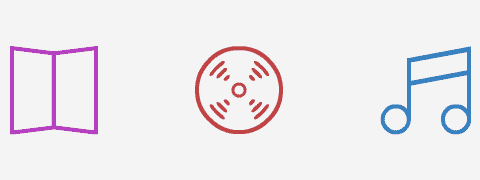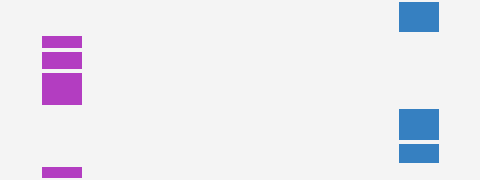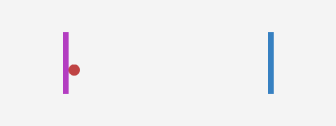

Left: the kind of media suggestions. Center: your social network profile data is used. Right: use the app with friends to get better suggestions accuracy.

入职可能会稍微复杂一点，如以下银行和投资应用程序设计所示:

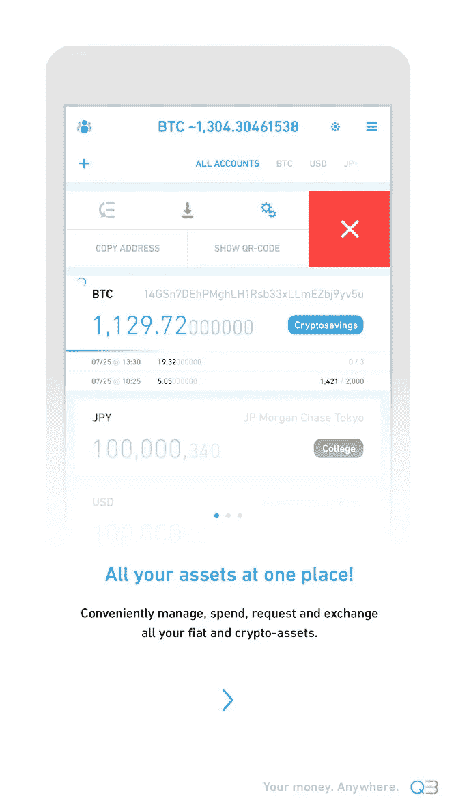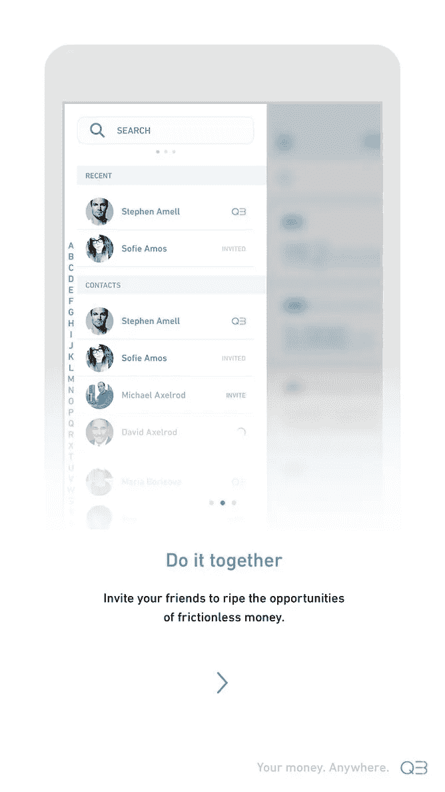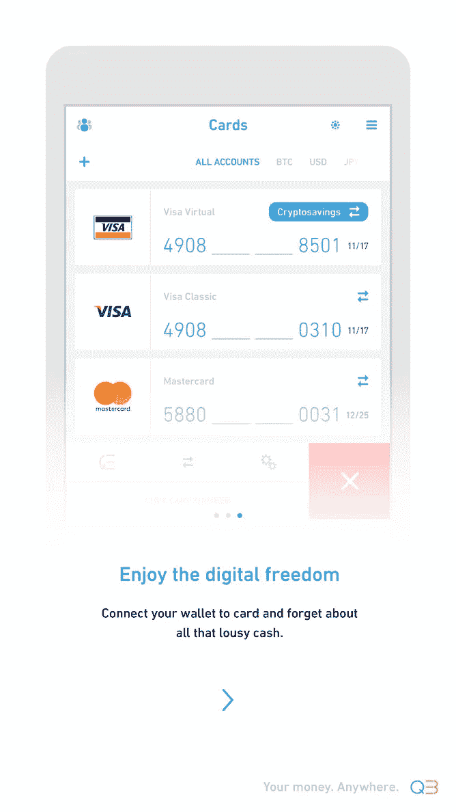

A set of on-boarding screens explaining core product function.

您可能希望将入门整合到实际的应用流程中，就像我对交易和交易应用程序所做的那样:

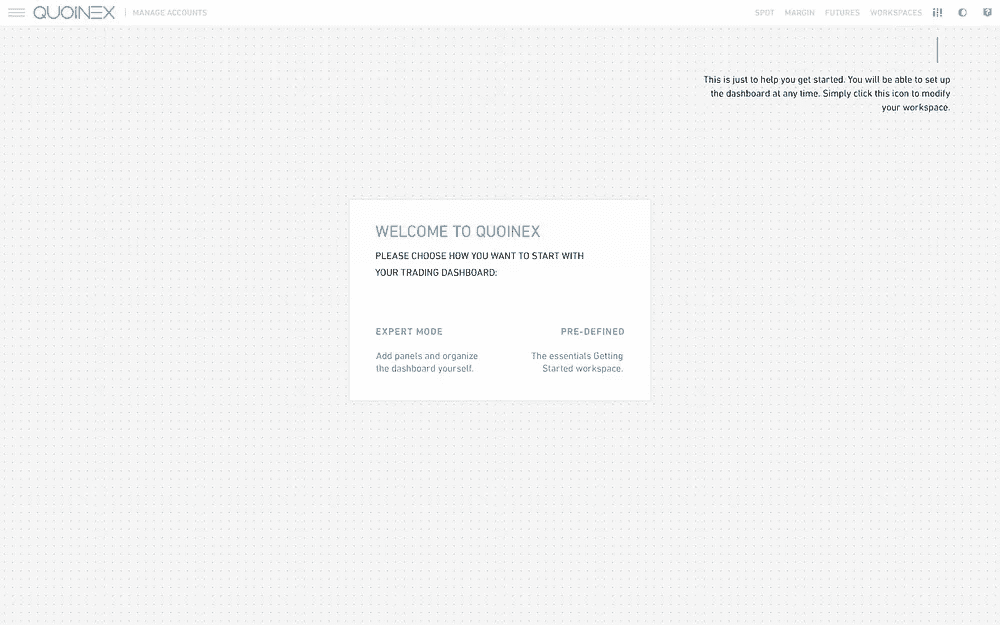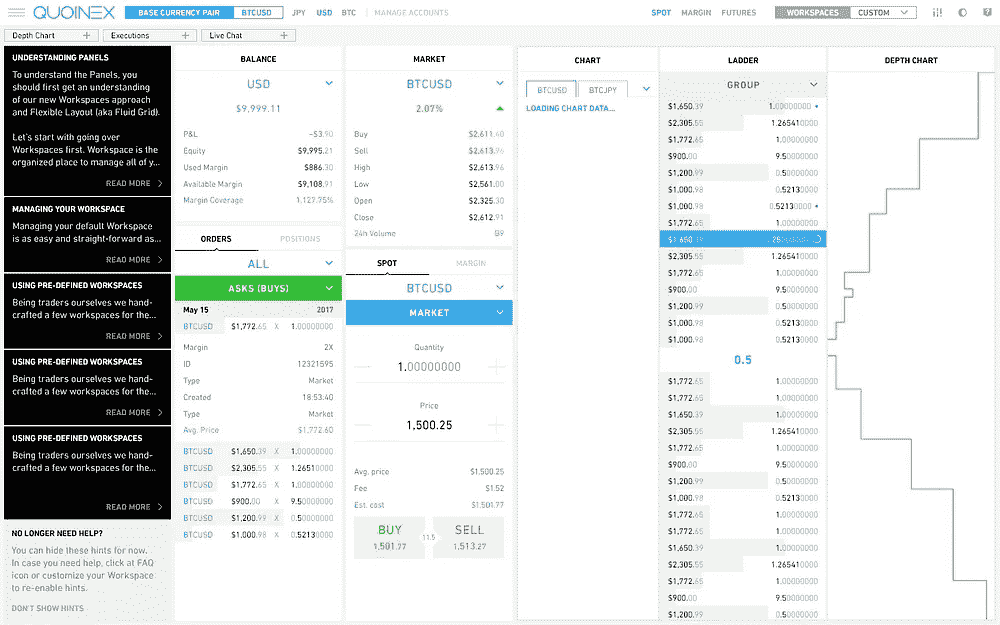

The prompt to start using the product (on the left). The dashboard fills up with essential pieces as the user adds them (on the right).

有时产品太大了(或者你当前产品的更新太大了)，以至于它需要自己的登机前网站:

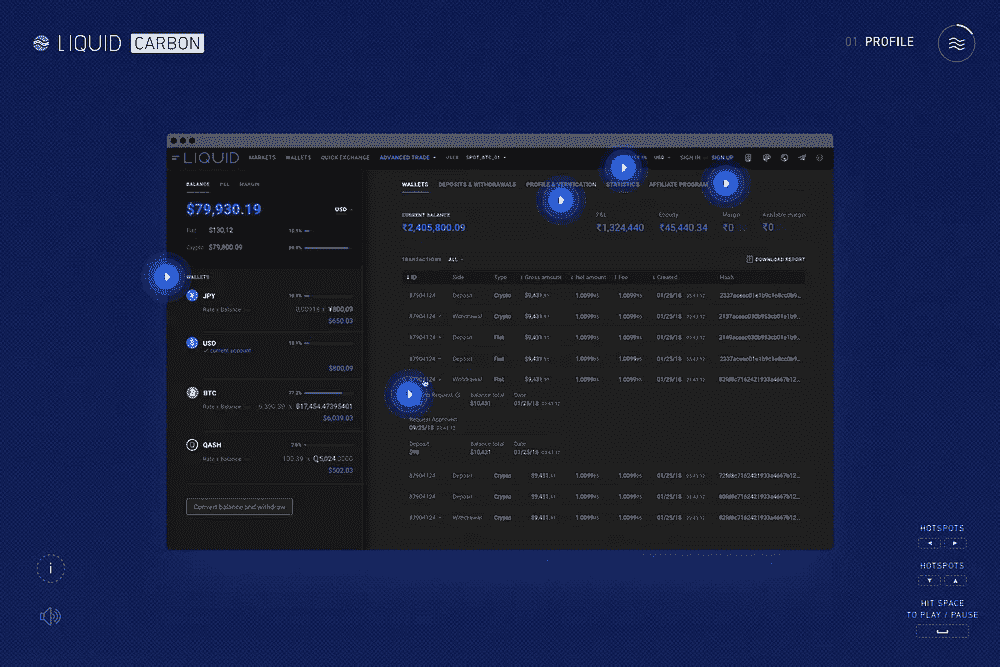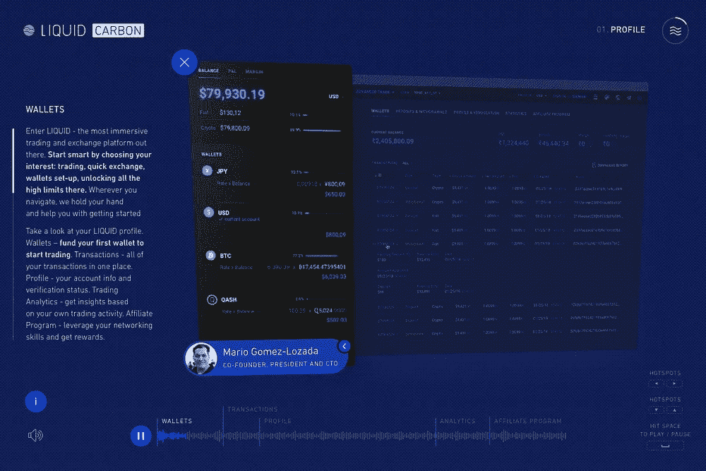

Interactive website narrated by company chief executives (early concept).

优秀的客户入职设计的关键在于你所说的和你要展示的之间的恰当平衡。

一个非常普遍的误解是，伟大的产品不需要解释。那是一个神话。最好的产品确实能吸引新顾客。

最终，一个恰当的入职培训会转化并真正销售产品。

## **6。客户参与设计**

启动屏幕和介绍是与客户开始互动的绝佳方式。在顾客有机会与实物互动之前，就把它看作是在早期展示产品的外观和感觉。

一些产品使用他们的标志动画，一些使用介绍视频。只要你保持合理，在这里表达自己是没有限制的(例如，让音乐在背景中播放可能不是一个好主意，除非产品是一个游戏应用)。

**下面是我为过去的项目所做的一些客户参与的例子:**

Processing data is visualized during load times; the app launches with a cool looking animation that installs the scifi-inspired AI/Machine Learning visual concept right from the start.

Intro animation for Investment & Banking app.

A logo animation with music background to set the mood for the game.

这是一个 fin-tech 应用程序的支出和活动屏幕的动画图标示例。

所有动画都是循环播放并与滚动对齐的，当用户进一步向下滚动时，它们会播放到最后，当用户开始向上滚动时，它们会反向播放:

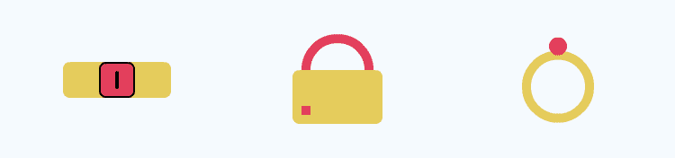

Accessories, bags, etc.

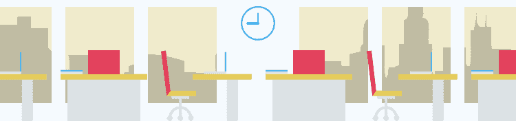

Business.

Clothing, tailors, suits, etc.

Health & fitness.

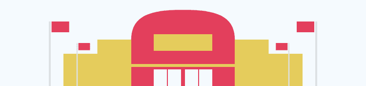

Groceries.

Leisure, gaming, etc.

一定要复杂吗？并没有。当你为客户互动而设计时，请记住，目标是在事情没有发生的时候让客户开心(即*【加载】*或等待应用程序/服务器响应)。

## **7。产品原型**

原型(或多个原型)通常用于向潜在投资者或公司决策者推销产品。另一个用例，是尽早拥有一个原型来测试 UX，让开发人员参与决策，从而优化流程。

由于缺乏 InVision/Figma 提供的交互式过渡，制作与原型一起的动画演示对于展示 UX 产品来说可能是巨大的。特别是，如果产品正在使用依赖于上下文的元 UX，这是不可能用有限的原型工具功能来显示的。

无论如何，原型本身就是对一个人设计技能的测试。这是第一次感觉产品是活的，你可以估计它会给你的顾客留下什么样的第一印象。

# 我的产品设计(用户界面/UX)工具箱

*   **MindMeister。用户旅程和流程的思维导图。**
*   **素描。**线框和高保真设计。
*   **Adobe Photoshop。**照片修饰、背景、高保真设计。
*   **Adobe Illustrator。**图标和矢量插图。
*   **土坯后的效果。**虽然听起来不太传统，但我仍然用它来制作令人惊叹的动画、视频、UI 特效和产品教程演示。过去，设计师使用 Flash 来展示产品(啊，手动放置所有关键帧直到整个事情被遗忘的那一刻，这种沸腾的紧张感)。
*   **搅拌机。我用它来展示产品和渲染酷炫的背景。也可以用于动画和用户界面特效，尽管在后期特效中更容易做到。**

# 下一步是什么？

这总结了关于产品、产品设计和产品体验的要点。然而，这只是你的产品的开始。

漂亮的设计、酷炫的视觉效果、巧妙的登机、优化的流程和旅程——这只是下一个体验层的基础。

当有了可用的产品和市场契合度、吸引客户和收入流时，就该考虑向客户提供什么样的公司体验了。

> 漂亮的设计、酷炫的视觉效果、巧妙的登机、优化的流程和旅程——这只是下一个体验层的基础。

# 公司经验

公司体验是产品体验、客户体验、品牌体验和公司价值主张的高度综合。

而产品体验回答了*的问题:“我有多渴望再次或永远使用这个产品？”，*公司经验回答问题*“我有多渴望再次或永远与这家公司扯上关系？”。*

这是一个更高层次的体验层，需要跨产品、营销和管理的沟通，以便在产品间、公司间和营销间的客户沟通模式中表现出来。

## 公司经验检查表:

1.  客户对支持感到满意
    *“哇，我的问题这么快就解决了。”*
2.  客户对产品
    *“我无法想象这么容易就能做到。”*
3.  客户积极参与公司
    *“X do Y 的这些家伙，你绝对应该试一试！”*
4.  仰视公司的客户
    *“X 的伙计们又让 Y 变得伟大了！”*
5.  客户认为首席执行官是新的救世主。已经把钱给他们了！”

> 而产品体验回答了“我有多渴望再次或永远使用这个产品？”，公司经验回答了“我有多渴望再次或永远与这家公司扯上关系？”。

**客户对支持感到满意。**看到客户支持引领潮流感到惊讶吗？其实也没那么意外。我坚信，随着我们的进一步发展，提供卓越的客户支持将最终成为常态。强大的客户支持意味着更高的客户参与度和对产品更高的满意度，就这么简单，应该被采纳并视为产品体验的基础。

顾客对产品很满意。然后我们就有了产品满意度。这个很简单。解决问题(即“痛苦”)、不引人注意的坚固用户界面、快速的客户支持——这是让客户满意的成功组合。我一直提到客户支持，只是为了强调这是任何产品在某个增长点之后的关键要素(通常，在产品找到市场适合度之前，当然也是之后)。

**客户积极参与公司事务。**然后，它会导致客户在没有激励的情况下主动与公司接洽。积极的评论，推荐他们的朋友，愉快地发微博和分享，所有这些嬉皮士的颜色，迷因和小马跑来跑去的活动。

**顾客仰望公司。**然后，我们让客户把公司及其产品视为他们的榜样。当你看到有人拥有最新的 iPhone 或使用最新的 Macbook Pro 或骑着他们的特斯拉 Model X 到处走时，你会认为那个人一定是一个成功的人。

客户认为首席执行官是新的救世主。最后，你的客户开始认为你的 CEO 是新的史蒂夫·乔布斯，产品团队是无所不能的天堂般的人，早餐吃彩虹。

# 好文章

我的另一篇关于客户参与的文章:[https://medium . com/swlh/design-for-Customer-Engagement-331 f 7 c 7 DC 535](/swlh/design-for-customer-engagement-331f7c7dc535)

# 未完待续？

如果你想了解更多关于公司体验、衡量和跟踪它的方法、改善和设计优秀公司体验的方法，请留下你的评论。我错过什么了吗？请在评论中告诉我。

# 你在追求最好的公司体验吗？

如果你在追求你的客户所能拥有的最好的公司体验，或者如果你在追求终极的产品体验，我很想听听你的意见。给我发封邮件。