# ui2 代码:如何微调背景和前景分析

> 原文：<https://medium.com/hackernoon/ui2code-how-to-fine-tune-background-and-foreground-analysis-fb269edcd12c>

## 阿里巴巴技术团队分享了他们在复杂 UI 设计中使用 UI2code 的最佳实践

UI2code 使用深度学习来分析一个 UI 设计，并将其直接转换为前端开发人员的骨架代码，在将设计师的工作实现到应用程序中时，节省了他们大量的时间。这个转换过程的第一阶段是布局分析，对于一个简单的白色背景的应用程序来说，将图像信息分割成 GUI 元素就像切蛋糕一样简单。

> 要了解阿里巴巴的 ui2 代码，请点击这里:
> 
> [介绍 UI2CODE:一个自动的颤振 UI 代码生成器](https://hackernoon.com/introducing-ui2code-an-automatic-flutter-ui-code-generator-7e0a575c193)

然而，在大多数情况下，这可能更像是第一次尝试取出一条鱼的内脏:结果可能会有点乱，直到你对方法进行了微调。阿里巴巴旗下的“闲鱼”应用程序的工作人员就是这种情况。闲鱼是一个供用户出售二手商品的平台。

具体来说，他们在流程的背景分析和前景分析部分遇到了困难，下图完整地展示了这些困难。

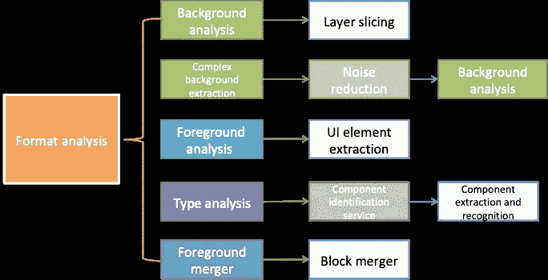

背景/前景分析需要使用上下文分离算法将 UI 图像分割成 GUI 元素:

**背景分析**:使用机器视觉算法分析背景颜色、渐变方向和背景的连通区域。

**前景分析**:利用深度学习算法整理、合并、识别 GUI 片段。

本文介绍了 Xianyu 团队在微调背景/前景分析算法方面的经验和结果。前景分析更复杂，需要更多的微调；因此，本文的大部分内容都是关于这个主题的。

# 背景分析

背景分析的关键是找到连通区域和区域边界。本节以实际的仙寓 UI 为例，一步步地介绍背景提取过程。

## 第一步

该步骤试图通过以下方式获得纯色和渐变背景区域:

识别背景块

通过边缘检测算法(例如 sobel、拉普拉斯、canny 等)计算梯度变化的方向。)

基于拉普拉斯算子的背景区域提取算法如下:

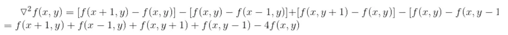

简单模板和扩展模板如下所示。

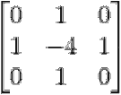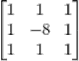

Simple (left) and extended (right) templates for the Laplacian operator

当区域点乘以模板点时获得的值越小，区域越平坦，因此越接近背景。如果结果是渐变区域，则计算渐变的方向(即从左到右、从右到左、从上到下或从下到上)。

提取效果如下:

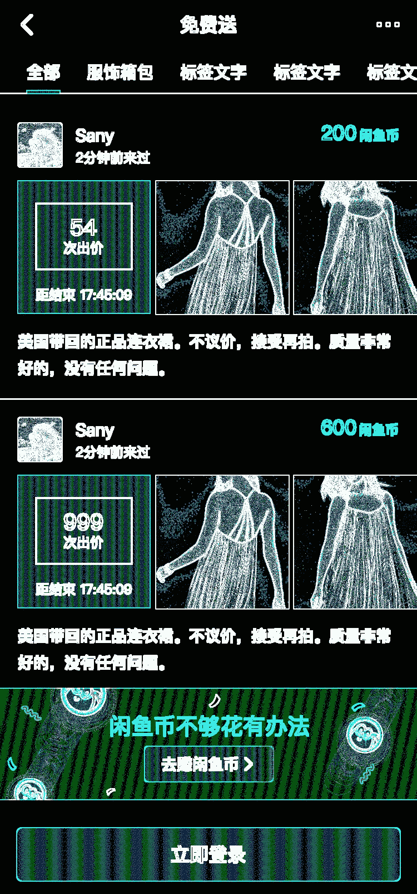

虽然图像的背景轮廓已经被很好地提取，但是梯度的结果相当差。如果在计算梯度方向时确定确实存在梯度，则进行步骤 2 以改进提取结果。

## 第二步

基于洪水填充算法，选择一个洪水的种子节点来过滤掉梯度背景的噪声。

def fill*color*diffuse*water from img*(*task*out*dir*， *image* ， *x* ， *y* ， *thres* up = (10，10，10)，thres*down*=(*10*， *10* ，

> **#创建 h+2、w+2、*的蒙版图层*
> 
> **#这里需要注意 OpenCV 的默认规则，**
> 
> **#遮罩层的形状必须是 h+2，w+2 且必须是 8 位单通道。我不知道为什么。**
> 
> **mask = np.zeros([h + 2，w + 2]，np.uint8)**
> 
> **#此时运行注水，参数表示:**
> 
> **# copyImg:要填充的图像**
> 
> **# mask:遮罩层**
> 
> **# (x，y):开始填充的位置(起始种子点)**
> 
> **# (255，255，255):填充值；这里的填充颜色是白色**
> 
> **# (100，100，100):起始种子点与整个图像像素值的最大负差**
> 
> **# (50，50，50):起始种子点与整个图像像素值之间的最大正差值**
> 
> **# cv。FLOODFILL_FIXED_RANGE:处理图像的方法，通常用于处理彩色图像**
> 
> **cv2.floodFill(图像，遮罩，(x，y)，fill_color，thres_down，thres_up，cv2。**
> 
> **cv2 . im write(task _ out _ dir+"/ui/tmp 2 . png "，image)**
> 
> **#遮罩是一个非常重要的区域。它显示哪些区域填充了颜色**
> 
> **#对于 UI 自动化，可以将遮罩设置为形状，宽度和高度小于 1。**
> 
> **返回图像，遮罩**

*处理后的效果如下:*

*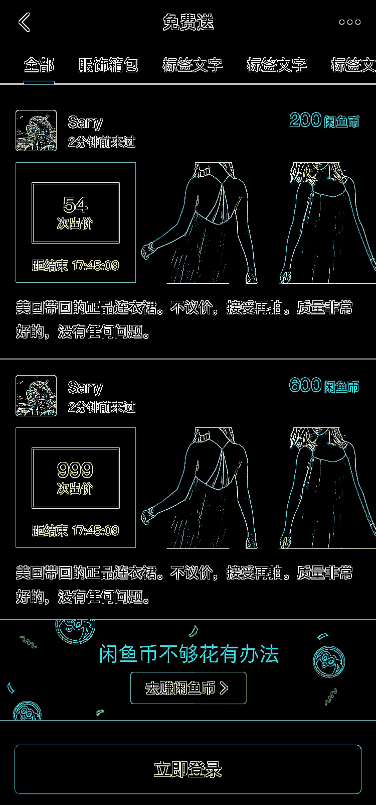*

## *第三步*

*通过 UI 切片提取 GUI 元素(切片方法如前所述)。*

*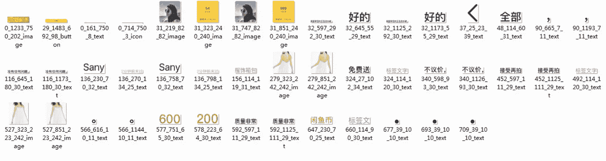*

*现在已经成功提取了 80%的 GUI 元素；然而，覆盖层的元素仍然没有被解析。*

## *第四步*

*使用霍夫线、霍夫圆和轮廓搜索找到对称的轮廓区域，然后在提取的轮廓区域上重复步骤 2 到 4，直到获得期望的结果。*

**

*Results of Hough line/circle and contour search*

*复杂背景的提取是后续前景分析的基础。提取背景区域后，通过连通区域识别分析前景区域，然后通过成分识别分析前景类别；最后通过语义分析对前景进行拆分和合并。*

# *摘要*

*对于相对简单的渐变背景，上述四个步骤足以产生令人满意的结果。简单来说，过程就是基于 Hough 线和 Hough 圆的思想搜索特定的轮廓区域，对这些轮廓区域进行详细分析，然后通过 flood fill 消除渐变背景。*

*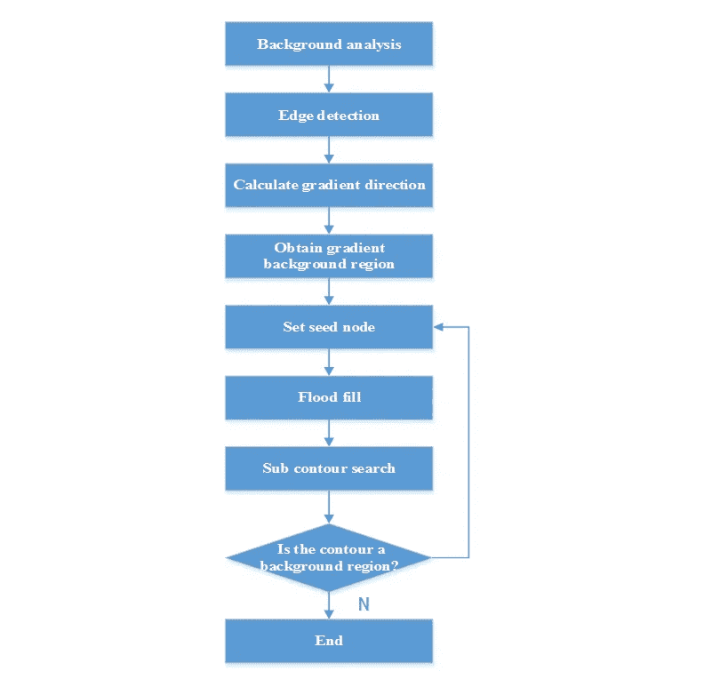*

*对于复杂的背景，我们可以利用目标检测找到特定的内容，然后利用马尔可夫随机场(MRF)来细化边缘特征。*

# *前景分析*

*前景分析的关键是组件切片和识别的完整性。可以通过连接区域分析、基于人工智能的组件类型识别以及基于所识别的组件类型的片段合并来防止组件碎片化。应该重复这些步骤，直到没有特征属性片段剩余。*

*然而，有些情况比这更复杂。一个例子是瀑布卡片布局环境中的卡片提取。*

*对于闲鱼 app 中的页面来说，瀑布卡片识别是布局分析的重要一步。要求如下:*

*当卡片完全显示在屏幕捕获图像中时，即使部分被图标遮挡，也应该能够被识别)*

*当卡片被背景部分遮挡时，不应该识别该卡片。*

*下图所示的瀑布式卡片布局，由于布局紧凑，风格多样，容易被遗漏或误认。*

*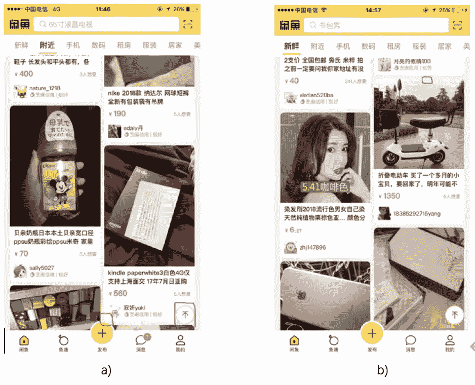*

*Examples of waterfall card layouts: the bottom-right card in (a) is partially obscured by an icon and the color of the image in the top-right card in (b) is similar to the background color*

*先宇团队采用了一种新颖的卡片识别方法，将传统的图像处理方法与深度学习相融合:*

*传统的图像处理，基于边缘梯度或连通区域识别，根据图像本身的灰度或形状特征提取卡片轮廓。它具有交并比高(IOU)和计算速度快的优点。缺点是易受干扰，召回率低。*

*基于目标检测或特征点检测的深度学习方法以监督的方式学习卡片的风格特征。这里的优点是抗干扰，召回率高。缺点是计算速度较慢，原因是由于回归过程导致 IOU 低于传统方法，并且需要大量的手工标注。*

*鲜宇团队的集成方法得益于两者的优势，具有高精度、高召回率和高 IOU 的特点。本节的其余部分更详细地概述了传统的深度学习和集成方法。*

## *传统方法*

***概述***

*传统图像处理方法的算法流程如下:*

*(1)将输入瀑布卡图像转换成灰度图像，并用对比度受限的自适应直方图均衡化(CLAHE)来增强它们。*

*(2)使用 Canny 算子进行边缘检测，得到二值化图像。*

*(3)对二值化图像使用形态学膨胀并连接开放边缘。*

*(4)提取连续边缘的外轮廓，根据外轮廓覆盖的面积大小丢弃较小的轮廓，输出候选轮廓。*

*(5)使用道格拉斯-普克算法进行矩形近似，保留与矩形最相似的外轮廓，并输出新的候选轮廓。*

*(6)对步骤 4 得到的候选轮廓进行水平和垂直投影，得到平滑的轮廓作为输出。*

*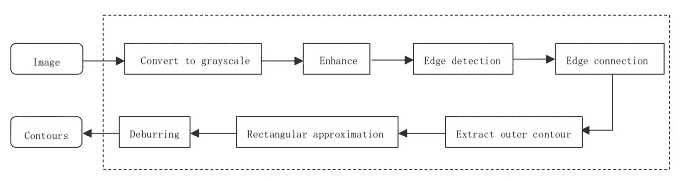*

*Card contour extraction process*

*算法流程的步骤 1-3 包括边缘检测，而步骤 4-6 包括轮廓提取。现在让我们更详细地看一下这些阶段中的每一个。*

***边缘检测(步骤 1-3)***

*由于各种原因，图像在转换为灰度期间会退化，需要增强以提高边缘检测的有效性。使用整个图像的单一直方图进行均衡显然不是最佳选择，因为截取的瀑布图像不同区域的对比度可能相差很大，增强后的图像可能会产生伪影。自适应直方图均衡(AHE)算法通过引入块处理对单一直方图方法进行了改进，但 AHE 有时会在增强边缘的同时放大噪声。*

*最新的方法 CLAHE 通过使用对比度阈值来消除噪声干扰，进一步改进了 AHE。如下图所示，CLAHE 不会丢弃直方图中超过阈值的部分，而是将其均匀分布在其他条柱之间。*

*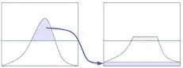*

*Diagram of CLAHE contrast limit*

*Canny 算子是给出精确边缘位置的经典边缘检测算子。Canny 检测流程有四个基本步骤:*

*(1)使用高斯滤波器来降低噪声。*

*(2)使用一阶偏导数的 FD 近似计算梯度的大小和方向。*

*(3)对梯度幅度使用非最大抑制。*

*(4)使用双阈值方法检测和连接边缘。需要多次尝试来选择最佳的双阈值参数。*

*检测到的边缘可能在某些位置断开。这可以通过使用特定形状和大小的结构元素对二值化图像进行形态学膨胀来纠正。*

*每个阶段的边缘检测结果如下图所示。*

*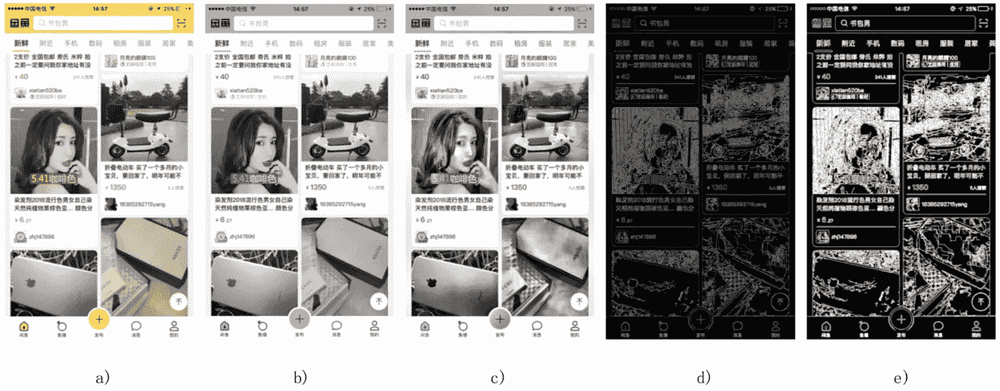*

*a) original image; b) grayscale conversion; c) CLAHE enhancement; d) Canny detection; e) morphological dilation*

*注意事项:*

*在 c)中，CLAHE 增强的对比度阈值是 10.0，区域的大小是(10，10)。*

*在 d)中，Canny 检测的双阈值是(20，80)。*

*在 e)中，形态学膨胀的结构元素是大小为(3，3)的十字准线。*

***轮廓提取(步骤 4-6)***

*对二值图像进行形态学膨胀后，首先提取连续边缘的外轮廓。下图显示了只有 0 和 1 的二进制图像。假设:*

*S1 是一组像素值为 0 的背景点。*

*S2 是一组像素值为 1 的前景点。*

*外部轮廓 B1 是在最远边缘的一串前景点。*

*内部轮廓 B2 是最内部区域中的一串前景点。*

*对二进制图像执行行扫描，并为不同的轮廓边界分配不同的整数值，以确定轮廓的类型以及它们之间的层次关系。提取外轮廓后，计算轮廓面积，舍弃面积相对较小的外轮廓，输出第一阶段候选轮廓。*

*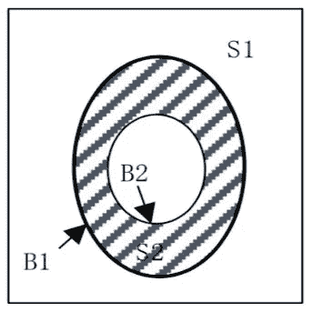*

*Inner and outer contours*

*仙寓中的瀑布卡轮廓为圆角矩形。在这种情况下，可以对提取的候选轮廓使用道格拉斯-普克算法进行矩形近似，并保留那些类似矩形的外部轮廓。Douglas-Peucker 算法将曲线或多边形表示的点集拟合为一组较少的点，从而将两组点之间的距离保持在设定的精度水平。然后，输出第二阶段候选轮廓。*

*通过水平和垂直投影与第二阶段候选轮廓的位置相对应的第一阶段候选轮廓来消除毛刺效应，并输出矩形轮廓。*

*各阶段的轮廓提取结果如下图所示。*

*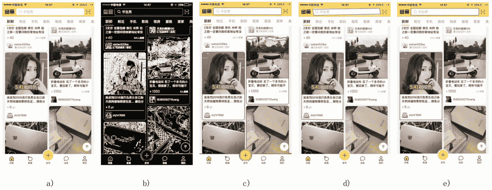*

*a) original image; b) morphological dilation; c) first-stage candidate contours (shown in red); d) second-stage candidate contours (shown in red); e) final output of rectangular contours (shown in red)*

*注意事项:*

*在 c)中，轮廓覆盖区域的阈值是 10，000。*

*d)中，道格拉斯-普克算法的精度为 0.01*[ *轮廓长度*。*

*本文中提到的所有提取轮廓都包含搜索框。*

## *深度学习方法*

*如前所述，使用传统的图像处理方法提取轮廓特征会产生一个问题:当图像不清晰或被遮挡时，轮廓无法提取(即召回率低)。*

*基于卷积神经网络(CNN)的目标检测算法可以通过输入大量的样本数据来学习更有代表性和区别性的特征。目前，目标检测算法主要分为两派:*

*以你为代表的单级流只看一次(YOLO)和单触发检测器(SSD)网络。*

*区域 CNN (R-CNN)族代表的两阶段流。*

***一级流程和二级流程***

*一阶段流程直接对预测目标进行分类和回归。它速度很快，但与两级流程相比，mAP 较低。*

*两阶段流程在分类和回归预测目标之前生成候选目标区域，因此在训练时更容易收敛。它的 mAP 更高，但比一级流慢。*

*下图显示了一阶段和两阶段流程中使用的对象检测推理。*

*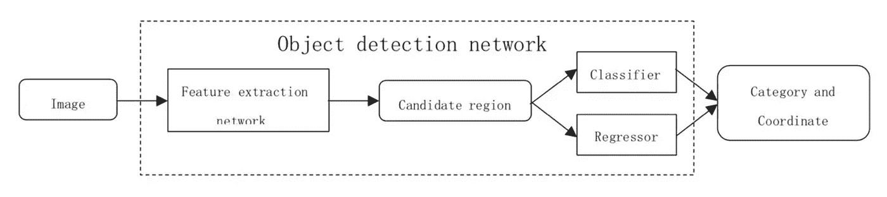*

*Target detection reasoning process*

*流程如下:*

*将图像输入到特征提取网络(经典的 CNN 网络，如 VGG、Inception、Resnet 等是可选的)以获得图像特征。*

*将特定区域特征分别发送到分类器和回归器，用于类别分类和位置回归。*

*输出盒子的类别和位置。*

***更快的 R-CNN***

*更快的 R-CNN 对 R-CNN 家族的最大贡献在于，它将生成候选目标区域的过程集成到了整个网络中。这导致整体性能的显著提高，尤其是在检测速度方面。*

*更快的 R-CNN 的基本结构如下图所示。它由四部分组成:*

*①**conv 层***

*一组基本的 conv+relu+池层，用于提取图像特征，然后与后续 RPN 网络和全连接层共享。*

*(2) **地区提案网***

*生成候选目标框，通过 softmax 判断是前景还是背景。使用回归来校正候选框的位置。*

*(3) **RoI 汇集***

*收集输入要素地图和候选区域。候选区域被映射到固定大小的区域，并被发送到后续的全连接层。*

*(4) **分类器***

*计算候选框的特定类别。使用回归再次校正候选框的位置。*

*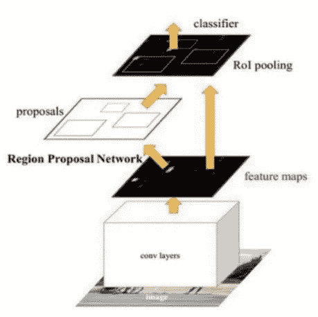*

*Basic structure of the Faster R-CNN*

*使用更快的 R-CNN 进行瀑布卡识别的结果如下图所示。*

*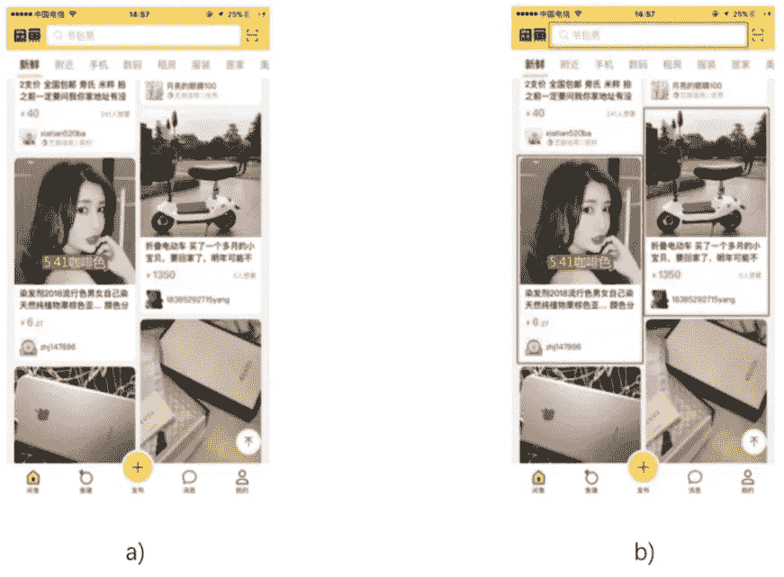*

*a) original image; b) recognized cards (shown in red)*

## *综合方法*

*传统的图像处理可以获得具有高 IOU 的牌位置，但是由于牌的显示方式，召回率不高。同时，深度学习方法具有高泛化能力并实现高召回率，但是在回归过程中不能在高 IOU 下获得卡片位置。*

*正如我们已经看到的，实际上这意味着对于上面的图像:*

*传统的图像处理无法检测右上牌。*

*深度学习检测右上和左上的卡片，但它们的边界几乎重叠。*

*融合两种方法得到的结果，取得了高精度、高召回率和高 IOU 的较好效果。*

*集成过程如下:*

*1.输入一幅图像，并行运行传统图像处理方法和深度学习方法，分别获得提取的卡盒 trbox(传统)和 dlbox(深度学习)。*

*IOU 以 trbox 为基准，精度和召回率以 dlbox 为基准。*

*2.过滤器 trbox。*

*规则是当 trbox 和 dlbox 的 IOU 大于某个阈值(比如 0.8)时，保持 tr box；否则丢弃它并获取 trbox1。*

*3.过滤器 dlbox。*

*规则是当 dlbox 和 trbox1 的 IOU 大于某个阈值(例如 0.8)时，丢弃 dl box；否则保留它并获取 dlbox1。*

*4.纠正 dlbox1 的位置。*

*规则是 dlbox1 的每条边都移动到离它最近的直线上，约束条件是移动的距离不能超过给定的阈值(比如 20 个像素)，移动的边不能越过 trbox1 的边。由此获得修改的 dlbox2。*

*5.输出 trbox1+dlbox2 作为最终合并的卡盒。*

*下表描述了用于衡量集成方法性能的性能指标。*

*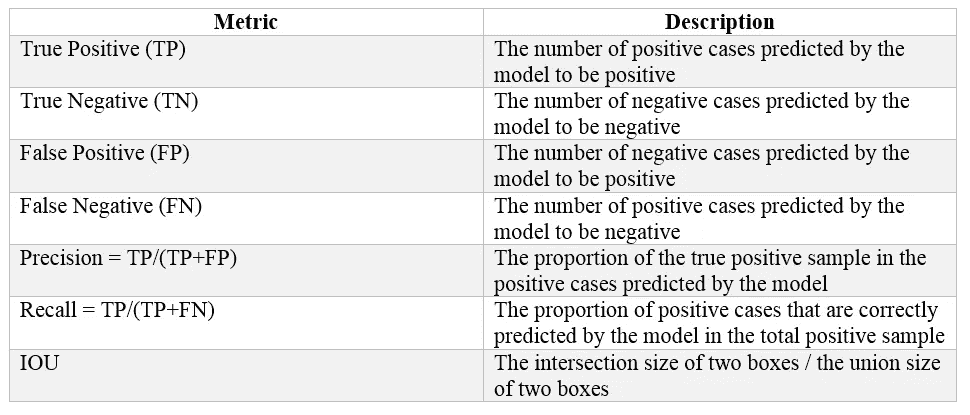*

*下图比较了每种方法的卡片识别结果。*

*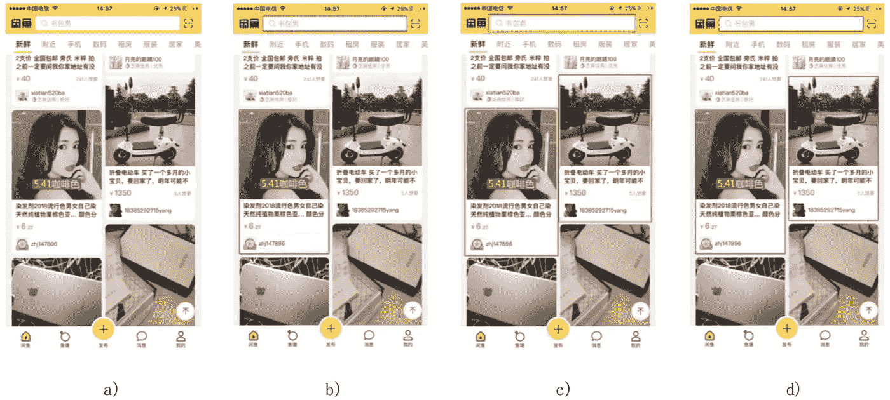*

*a) original image; b) traditional image processing; c) deep learning; d) integrated approach (combines b) and c))*

*显然，图像 d)比 b)具有更好的回忆，比 c)具有更好的 IOU。*

*下面的三组图片展示了更多的例子。对于每行图像:*

*第一列显示原始图像。*

*第二列显示了传统图像处理的结果。*

*第三列显示深度学习的结果。*

*第四栏显示了综合方法的结果。*

*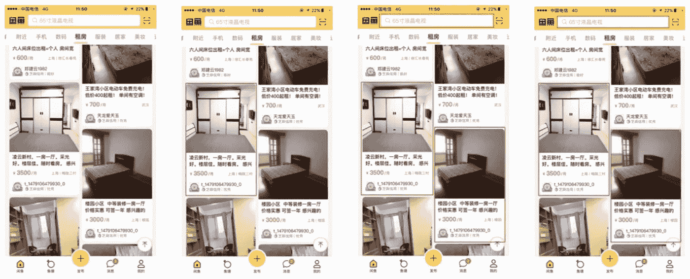**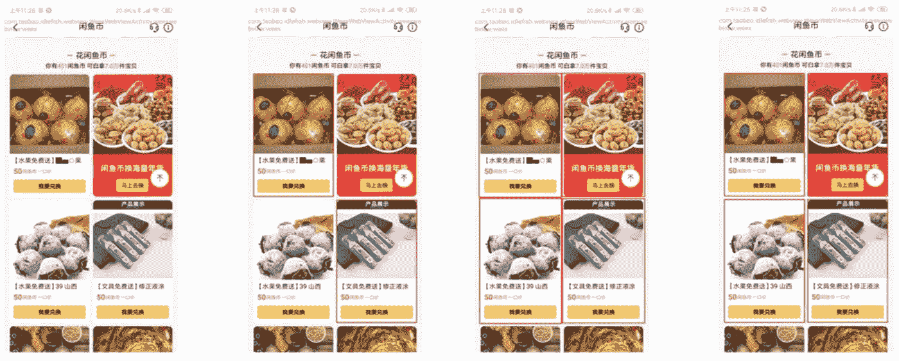**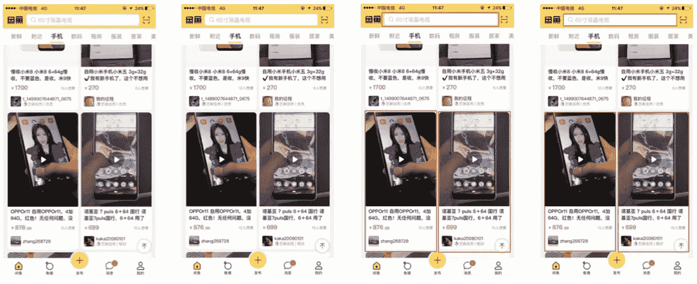*

*在前两行中，卡片轮廓被准确地识别。在第三行中，卡片的底边没有完全贴合。这是因为当在融合步骤中校正 dlbox1 位置时，使用传统的图像处理方法来寻找范围中最近的直线，这受到图像风格的影响。找到的直线不是卡片的预期底边。*

## *测试*

*传统、深度学习和集成方法在随机捕获的 50 张仙鱼瀑布卡片图像上进行测试，这些图像之间总共包含 96 张卡片(搜索框除外)。传统方法识别了 65 张卡片，深度学习方法识别了 97 张卡片，综合方法识别了 98 张卡片。*

*精度、召回和 IOU 如下表所示。结果证实，整合方法结合了传统方法和深度学习方法的优点。*

*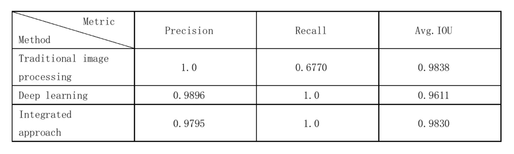*

*Summary of test results*

## *后续步骤*

*先宇团队提出的集成方法在识别任务中实现了高精度、高召回率和高 IOU 然而，它也不是没有缺点。例如，在融合过程中对组成元素的校正受到图像风格的干扰。未来的工作应寻求优化这一部分的进程。*

***(Original article by Chen Yongxin 陈永新, Zhang Tonghui 张仝辉 and Chen Jie 陈浩)***

> *要了解阿里巴巴的 ui2 代码，请点击这里:*
> 
> *[介绍 UI2CODE:一个自动的颤振 UI 代码生成器](https://hackernoon.com/introducing-ui2code-an-automatic-flutter-ui-code-generator-7e0a575c193)*

# *阿里巴巴科技*

*关于阿里巴巴最新技术的第一手深度资料→脸书: [**“阿里巴巴科技”**](http://www.facebook.com/AlibabaTechnology) 。推特: [**【阿里巴巴技术】**](https://twitter.com/AliTech2017) 。*