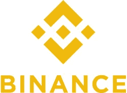
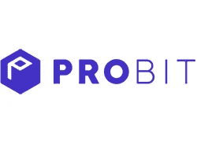
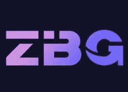
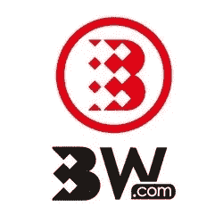
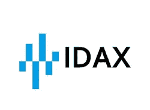
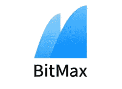
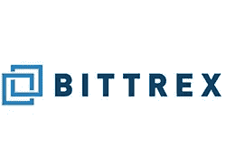
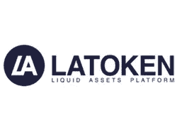
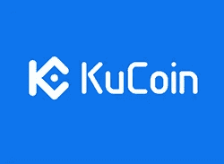
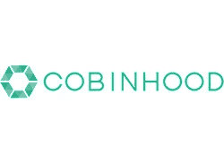

# IEO 平台/发射台终极列表:前 15+交易所

> 原文：<https://medium.com/hackernoon/ultimate-list-of-ieo-platforms-launchpads-top-15-exchanges-42af67dfda69>

IEO Launchpads/Platforms

IEO 平台正在迅速取代老式的 ico

我们最近见证了全球 ICO 市场的转变，从项目直接发行和销售代币的垂死模式转变为全新的模式，代币由交易所出售，在出售结束后立即上市。这种模式被恰如其分地称为首次交易所上市(IEO)，尽管第一批案例发生在 2017 年(Bread，Gifto)，但这一趋势直到 2019 年初才真正开始。

本质上，IEO 与 ICO 的众筹流程相同，只是发行代币并希望筹集资本的项目依赖交易所进行众筹，而不是自己进行。

币安开创了这种令牌销售方法，在币安 Launchpad 上取得了多次巨大成功，从而激励其他市场参与者开始开发自己的 IEO 平台。

目前，至少有 15 家交易所已经开始支持 IEOs，或者宣布他们正在开发 IEO 概念。

所以让我们来看看

**与 IEO 平台/发射台的交流综合列表:**

## 1.[币安发射台](https://launchpad.binance.com/)

Binance Launchpad

开创性的 IEO 平台于 2017 年开始运营，并于 2019 年成为主流。很多成功的案例包括**面包**、 **Gifto** 、 **Bittorent** 、 **Celer** 、 **Fetch** 还有一个即将推出的叫做 **Maric** 。

## 2.[霍比素数](https://www.huobi.com)

Huobi Prime

事实上，火币网是继币安之后的下一个主要交易所，它成功地完成了 IEO 和 T21 的顶级网络项目。他们在几秒钟内完成了第一次选择性代币销售活动，代币价格随即飙升了 250%。

## 3. [OKEx Jumpsmart](https://www.okex.com/lang/en-US/)

OKEx Jumpsmart

作为交易量领先的交易所之一，OKEx 不想被排除在 IEO 趋势之外并不奇怪。为了确保他们保持相关性，他们已经[宣布](https://www.chepicap.com/en/news/8147/okex-to-launch-platform-similar-to-binance-launchpad-ok-jumpstart-soon.html)他们自己的 IEO 平台，叫做 **OK Jumpsmart** 。到目前为止，还没有任何关于即将到来的项目的公开信息，但我们可以肯定的是，他们正在密切关注新的潜在项目。

## 4. [Probit Launchpad](https://www.probit.com/en-us/ieo)

Probit Launchpad

从交易量来看，Probit 并不是主要交易所之一，但它们正寻求将自己与其他小规模交易所区分开来，这些交易所在 IEO 的支持下扩大了市场。他们的网站上已经有不少 IEO 的案例，但是它们的完成并没有像币安的案例那样轰动。其中: **Spin 协议**、 **CharS** 、 **Wegen** 、 **Steemhunt** 等。

## 5. [Coineal Launchpad](https://www.coineal.com/ieo.html#en_US)

Coineal Launchpad

Coineal 是一个相当大的交易所，日交易量接近 7 亿美元，他们已经用自己的发射台跳上了 IEO 的列车。在已经完成的案例中，他们有 **IPW 令牌**、**左旋**和 **Kizuna 全局令牌**。另一项正在进行的销售是 **Rebglo Token** 。

## 6. [ZBG 发射台](https://www.zbg.com/launchpadList)

ZBG Launchpad

ZB.com 是另一家主要交易所的附属项目，ZBG 交易所是 2018 年的新人，但很快在 CoinMarketCap 上进入前 10 名。尽管他们被指控伪造他们的贸易额，但是，ZBG 已经在他们自己的发射台上完成了两个独立评估，分别是 V 系统项目和 Kamari 项目。

## 7. [BW 发射台](https://www.bw.com/TLP)

BW.com Launchpad

BW.com 是 ZB.com 交易所的核心战略合作伙伴，这是一家在亚洲市场根基深厚的加密交易所。BW Tokens Launchpad 迄今已支持了三个 IEO 项目，其中两个已于 2019 年 3 月底完成( **Blockbuster** 和 **V Systems** )，一个仍在进行中( **Grabity** )。

## 8. [Coinbene](https://www.coinbene.com)

Coinbene Launchpad

Coinbene 在 2018 年就已经开始谈论他们自己的 IEO 平台，但第一次 IEO 发布是在 2019 年 3 月正式[宣布的](https://www.thedailychain.com/blog/komodo-backed-project-redfox-labs-to-run-ieo-on-coinbene/)。由于 Coinbene 经常被列为前 10 大交易所之一，并拥有一个大的社区，我们可能会期待他们在 IEO 领域的另一个成功案例。

## 9. [BGOGO 阿波罗](https://bgogo.com)

BGOGO Apollo

BGOGO 是第一家拥有超级节点上市权限的数字资产交易所。现在，他们正在启动阿波罗(IEO 发射台)项目，并且[宣布了](https://bgogohelp.zendesk.com/hc/en-us/articles/360025351512-Bgogo-Apollo-Launchpad-Premium-Token-Listing-Channel-Launches-ARM)两项针对 **ARM** 和 **X-Block** 项目的令牌出售活动。

## 10. [IDAX 基金会](https://www.idax.pro/)

IDAX Foundation

IDAX 是一个全球数字金融服务平台，专注于日交易量高的比特币交易者的需求。IDAX[宣布](https://idax.zendesk.com/hc/en-us/articles/360025402571-IDAX-Foundation-new-project-ZB-ZeroBank-)他们的第一个 IEO 为 **ZeroBank** 项目，将于 2019 年 4 月举行。

## 11. [BitMax Launchpad](https://bitmax.io)

BitMax Launchpad

Bitmax 是一个相对较新的交易所，拥有一个新的代币销售平台。他们在 IEO 的第一个名为 **DOS Network** 的项目并没有让社区兴奋起来，已经有一种感觉，一旦上市，这些项目可能很难维持它们的价格。尽管 Bitmax Launchpad 还处于早期，但它可能会产生一些赢家。

## 12.[比特莱斯国际公司](https://international.bittrex.com/)

Bittrex International

历史悠久、广受欢迎的交易所 Bittrex 于 2019 年 2 月宣布了他们的第一个 IEO。但是第一个也是迄今为止唯一一个 IEO——因为突袭项目——被取消了。然而，预计 Bittrex 将在不久的将来追求另一个 IEO。

## 13.[拉托肯发射台](https://latoken.com)

Latoken Launchpad

Latoken 早在 2018 年就开始了他们的 IEO 发射台，并积极推广他们平台上列出的项目。就在最近，他们宣布了 T2 711 T3 项目的新 IEO。

## 14.[库币聚光灯](https://www.kucoin.com)

KuCoin Spotlight

KuCoin 是前十大交易所，由于最近交易量下降，它们失去了自己的地位。然而，它们仍然是全球最著名的交易所之一。最近，他们[宣布了](https://www.kucoin.com/news/en-token-sale-of-multivac-of-kucoin-spotlight-will-start-on-april-3rd)他们的第一个 IEO，用于他们全新平台上的 **MultiVac** 项目，名为 Spotlight，将于 2019 年 4 月举行。

## 15. [Exmarkets Launchpad](https://exmarkets.com/launchpad)

Exmarkets Launchpad

ExMarkets platform 是新一代的加密交易所，得益于后端框架，它提供了厚厚的订单簿和深度流动性。Exmarkets 网站上有 4 个已完成的和 4 个正在进行的 ieo。然而，他们还没有在他们的平台上发布任何已完成的 ieo 的结果。

## 16. [Cobinhood](https://cobinhood.com/ico-services)

Cobnihood

与使用 IEO 术语并通过单独的平台/发射台执行令牌销售的其他交易所和市场参与者不同，Cobinhood 仍然忠于传统的 ICO 术语，并作为交钥匙解决方案为项目提供 ICO 服务，包括业务模式优化、令牌化、营销和公关。到目前为止，已经完成了两个案例——他们自己的 token 出售 Cobinhood token 和另一个名为 CyberMiles 的项目。

> 这份名单是由 Artur Boytsov 在研究了近几个月的 IEO 市场后汇编的，并将随着时间的推移而扩大。如果你想推荐一个不在列表中的 IEO 平台，请在评论区分享。

如果你想知道如何接近 Exchagnes 和 IEO 平台/发射台与你的项目，请 PM 我在电报(@阿米汤加)

如果你喜欢这个汇编，请鼓掌👏并分享出来帮助别人找到。欢迎在下方留言评论。