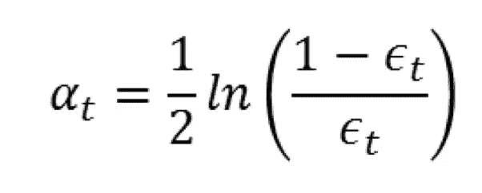
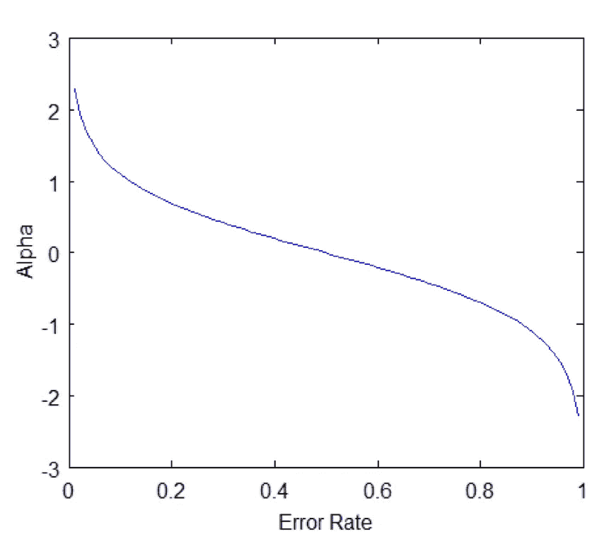
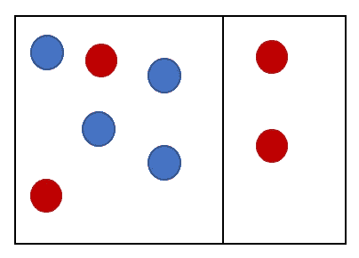
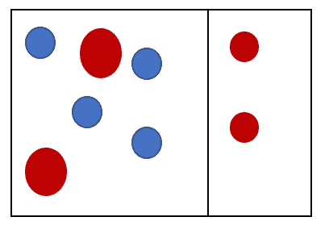
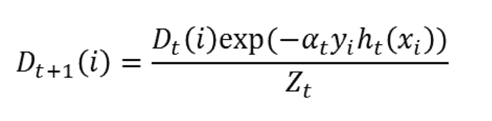

# 在 AdaBoost 的引擎盖下

> 原文：<https://medium.com/hackernoon/under-the-hood-of-adaboost-8eb499d78eab>

## *AdaBoost 算法简介*

*An Ensemble Orchestra:* Photo by [Kael Bloom](https://unsplash.com/@kaelbloom?utm_source=medium&utm_medium=referral) on [Unsplash](https://unsplash.com?utm_source=medium&utm_medium=referral)

在这篇文章中，我们将介绍*非常简短的*boosting 算法，以及深入研究流行的 boosting 算法 AdaBoost。这篇文章的目的是对 boosting 和 AdaBoost 的一些关键概念做一个简单的介绍。这不是 AdaBoost 与梯度增强等的明确优缺点，而是对理解该算法的关键理论点的总结。

## 【AdaBoost 的真实应用

AdaBoost 可用于解决各种现实世界的问题，例如预测[客户流失](https://www.cs.rit.edu/~rlaz/PatternRecognition/slides/churn_adaboost.pdf)以及对客户正在[谈论/致电](http://www.cs.princeton.edu/~schapire/talks/nips-tutorial.pdf)的主题类型进行分类。该算法主要用于解决分类问题，因为它在 R 和 Python 等语言中相对容易实现。

## **什么是 Boosting 算法？**

推进算法属于更广泛的集成建模家族。概括地说，在数据科学中有两种关键的建模方法；构建单一模型和构建模型集合。Boosting 属于后一种方法，并且参考 AdaBoost，模型构造如下:对于每次迭代，顺序引入新的弱学习器，并且旨在补偿先前模型的“缺点”以创建强分类器。这项工作的总体目标是连续拟合新的模型，以提供我们的反应变量更准确的估计。

Boosting 的工作原理是假设每个弱假设或模型都比随机猜测具有更高的准确性:这种假设被称为“弱学习条件”。

## **什么是 AdaBoost？**

AdaBoost 算法是由 Freund 和 Schapire 于 1996 年开发的，目前仍在各种行业中大量使用。AdaBoost 通过连续引入新模型来补偿先前模型的“缺点”,从而达到分类器的最终目标。Scikit Learn 将 AdaBoost 的核心原则总结为，它“在反复修改的数据版本上适合一系列弱学习者。”这个定义将允许我们理解和扩展 AdaBoost 的过程。

## 入门指南

首先，训练一个弱分类器，并且所有的示例数据样本被赋予相等的权重。一旦训练了初始分类器，就会发生两件事。为分类器计算权重，更准确的分类器被给予更高的权重，较不准确的分类器被给予较低的权重。权重的计算基于分类器的错误率，即训练集中的错误分类数除以总训练集大小。每个模型的输出重量被称为“alpha”。

## **计算阿尔法值**

每个分类器都有一个基于分类器错误率计算的权重。

对于每次迭代，计算分类器的 alpha，错误率越低= alpha 越高。这可以想象如下:

*Image from Chris McCormick’s excellent AdaBoost tutorial*

直观上，训练样本的权重和 alpha 之间也有关系。如果我们有一个具有高 alpha 的分类器，它错误地分类了一个训练样本，那么这个样本将比一个同样错误地分类了一个训练样本的较弱的分类器被给予更多的权重。这被称为“直觉”，因为我们可以认为具有较高 alpha 的分类器是更可靠的见证；当它错误分类时，我们希望进一步调查。

# **了解训练样本的权重:**

其次，AdaBoost 算法通过为每个数据样本分配权重，将其注意力引向来自我们的第一个弱分类器的错误分类的数据样本，其值由分类器对样本的正确分类还是错误分类来定义。

我们可以将每个示例的权重分解如下:

**第一步:我们的第一个模型，其中** wi=1/N

在这种情况下，我们可以看到每个训练示例都具有相同的权重，并且模型对某些示例进行了正确和错误的分类。在每次迭代之后，样本权重被修改，并且那些具有较高权重的样本(被错误分类的样本)更有可能被包括在训练集中。当一个样本被正确分类时，在下一步的模型构建中，它被赋予较小的权重。

*新款车型的一个例子，重量已经改变*:

此权重更新的公式如下所示:

## 构建最终分类器

一旦所有的迭代完成，所有的弱学习器与它们的权重结合以形成强分类器，如下面的等式所示:

因此，最终分类器由“ *T* ”个弱分类器组成， *ht(x)* 是弱分类器的输出，其中*在*处是应用于分类器的权重。因此，最终输出是所有分类器的组合。

这是对 AdaBoost 理论的一个简单介绍，应该被看作是对 boosting 算法的介绍性探索。对于进一步的阅读，我推荐以下资源:

## 推荐进一步阅读

纳特金，a .诺尔，A. (2018)。梯度推进机，教程。神经生物学前沿。[在线]可在:[https://core.ac.uk/download/pdf/82873637.pdf](https://core.ac.uk/download/pdf/82873637.pdf)找到

李(2018)。渐变增强的温和介绍。【在线】可在:[http://www . CCS . neu . edu/home/VIP/teach/ml course/4 _ boosting/slides/gradient _ boosting . pdf](http://www.ccs.neu.edu/home/vip/teach/MLcourse/4_boosting/slides/gradient_boosting.pdf)

沙皮雷河(2018 年)。解释 AdaBoost。【在线】可在:[https://math . Arizona . edu/~ hzhang/math 574m/Read/explaining-AdaBoost . pdf](https://math.arizona.edu/~hzhang/math574m/Read/explaining-adaboost.pdf)

YouTube。(2018).扩展机器学习算法 AdaBoost 分类器| packtpub.com。[在线]可在:[https://www.youtube.com/watch?v=BoGNyWW9-mE](https://www.youtube.com/watch?v=BoGNyWW9-mE)找到

Scikit-learn.org(2018)。1.11.整体方法-sci kit-学习 0.20.2 文件。[在线]可从以下网址获得:[https://sci kit-learn . org/stable/modules/ensemble . html # AdaBoost](https://scikit-learn.org/stable/modules/ensemble.html#AdaBoost)

McCormick，C. (2013 年)。AdaBoost 教程克里斯麦考密克。[在线]可从[http://mccormickml.com/2013/12/13/adaboost-tutorial/](http://mccormickml.com/2013/12/13/adaboost-tutorial/)获得

沙皮雷河(2018 年)。解释 AdaBoost。【在线】可在:[https://math . Arizona . edu/~ hzhang/math 574m/Read/explaining-AdaBoost . pdf](https://math.arizona.edu/~hzhang/math574m/Read/explaining-adaboost.pdf)

莫赫利，M. (2018)。机器学习基础[在线]可在:[https://cs.nyu.edu/~mohri/mls/ml_boosting.pdf](https://cs.nyu.edu/~mohri/mls/ml_boosting.pdf)获得