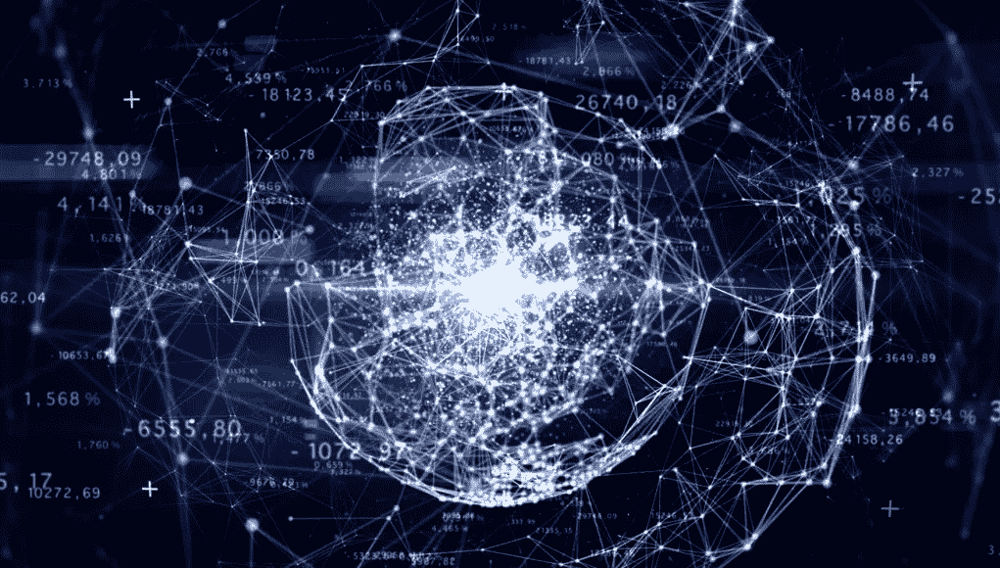
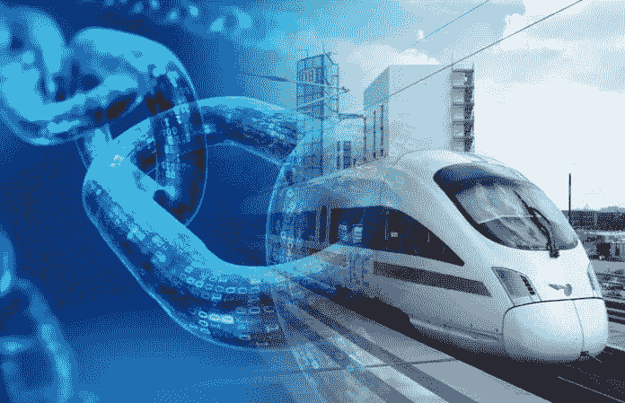

# 了解区块链及其解决的问题

> 原文：<https://medium.com/hackernoon/understanding-blockchain-and-what-problems-does-it-solve-7ac8f06706a9>

什么是区块链？当人们听说这项新技术时，这个问题首先出现。创始人中本聪甚至不是一个真实的人，而是一个假名，或者可能是一群人。这引发了更多的问题，也让它变得有点神秘。

区块链允许数字信息在互联网上分发，但不能复制。在这种情况下，它使用比特币，一种数字货币，通过在线网络转移。区块链使用称为链的数据块。

**块**

这些模块是分布式计算机网络的一部分。数据受加密原则保护，并且彼此相关。当数据被添加到块中时，会出现一个时间戳，并且记录不能再被更改。

这听起来不是很壮观，但这项技术仍然有一些破坏性的可能性。首先，它没有中央所有者，因此是一个民主制度。第二，它具有透明性，任何感兴趣的人都可以看到添加到分类账中的信息。

**解释和区块链背后的理念**

区块链没有交易成本。区块链以完全自动化和安全的方式将信息从 A 传递到 B。当一台计算机(称为节点)想要开始使用网络时，它必须首先创建一个块。该块将在网络上分发，并由网络上的其他节点验证。

**节点**

这些节点可以是数千甚至数百万，这完全取决于整个网络的规模。当一个块被网络接受时，它将被添加到链中。此时，总链用这个新的数据块更新。网络上的所有节点将立即在它们的硬盘上存储这个新链。这是非常重要的，因为这使得伪造链几乎不可能。

**分权**

原因是因为现在你有数以千计甚至数百万计的副本与这个独特的链存储在本地。这种数据的分散存储保护了链和整个网络的安全。有史以来第一个区块链比特币用它来存储网络上的数字交易，但它可以有很多用途。

**铁路作为真实世界的用例**

例如铁路公司。可以在 app 或者网站上买票。交易完成后，信用卡公司收取服务费。区块链的理念是将第三方排除在交易过程之外。在这种情况下，信用卡公司将被删除。铁路运营商不仅节省了交易费用，还可以将票务流程完全外包给区块链。那么这是如何工作的呢？

在这种场景下，存在一个‘门票区块链’。当乘客买票时，会创建一个区块(或车票)并添加到‘车票区块链’中。在创建这个区块之后，区块链将验证交易是否有效。如果有效，车票将被添加到链中，乘客已经购买了车票。此外，该票证将存储在链上，如果需要，可以随时跟踪。

总结一下，这个区块链的使用是完全免费的！当双方需要进行交易时，可以使用区块链来节省交易费用。

**智慧城市**

目前，超过一半的世界人口居住在城市，这一数量的城市化人口将在未来几年继续上升。为不断增长的人口提供数字服务的政府和公司不得不面对新的挑战。这种对市民数字数据的收集已经把世界各地的普通城市变成了所谓的智能城市。

如今，这些智能城市使用集中式系统来存储用户数据，以提供服务。智能城市使用各种输入和传感器来收集、处理和解释数据，以便高效地管理资产和资源。

**区块链解决什么问题**

你可以想象这些中央集权的城市也会被坏人滥用。收集数据并将其存储在中心方会带来以下问题:

—欺诈和操纵

—安全性和信任的高成本

公共资金和税收

**资金和税收**

让我们放大到最后一项，即公共资金和税收。如今，公共资金由中央政党控制，这也增加了腐败的可能性，腐败是一个非常传统的问题。

正确使用区块链网络可以大大降低欺诈的发生率。在这个区块链网络上处理的所有交易都可以被跟踪和追踪，这带来了真正的透明度。目前，在公共部门，当需要资金时，这是以有偏见的方式进行的，诚实的公平竞争环境并不真正存在。

区块链带来的另一个好处是数据主权的重新引入。公民将控制自己的私人数据，并可以决定他们愿意分享哪些数据，并以数字令牌(例如比特币)的形式获得激励。

此外，由于区块链的透明性质，公民可以随时跟踪交易。这让他们清楚地了解哪些资金被用于公共服务，如交通、铁路和地铁系统或警察局。

**结论**

数据的分散化将是在线网络发展的下一步。使用加密货币进行在线支付的替代解决方案正在全球范围内发展。

最近，这些公司开始研究利用区块链技术发行代币的方法。这一新兴趋势导致了安全令牌发行者[的出现，他们通过将真实世界的资产放在区块链上进行令牌化。](https://www.securities.io/businesses/token-issuers/)

目前，人们对脸书或谷歌等大型网络公司处理我们私人数据的方式不满意。通过以正确的方式实现区块链技术(！)全世界的用户都可以重新掌控自己的数据。