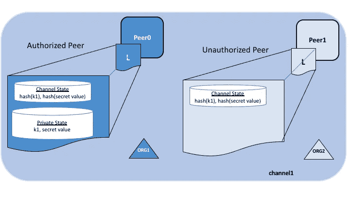
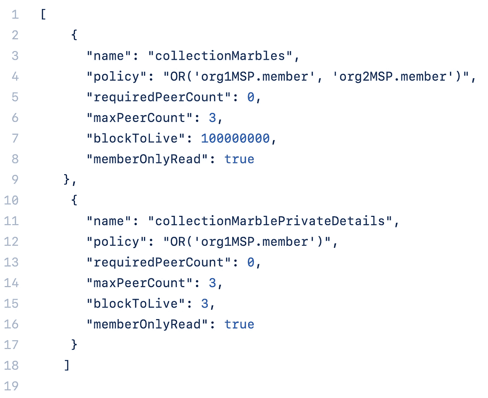
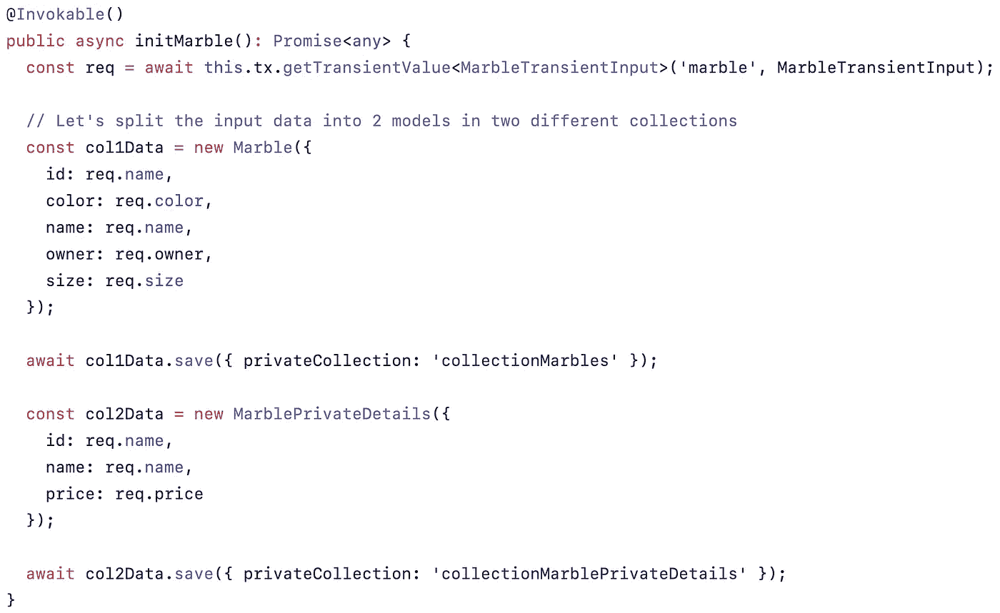
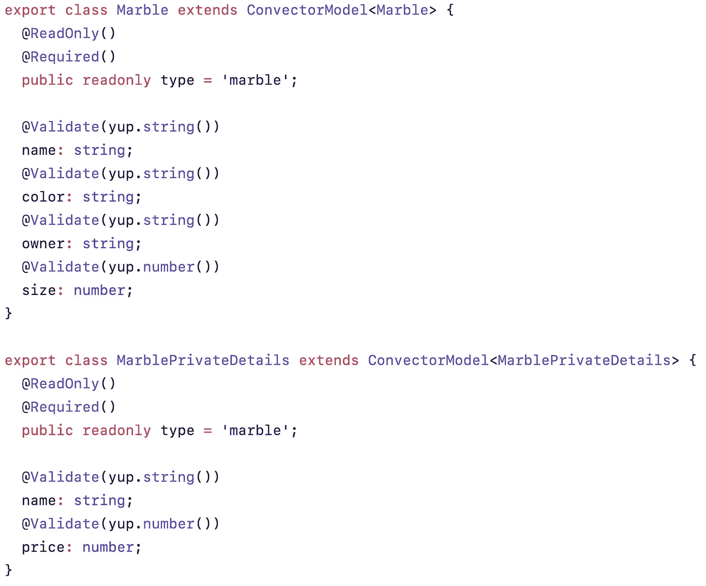
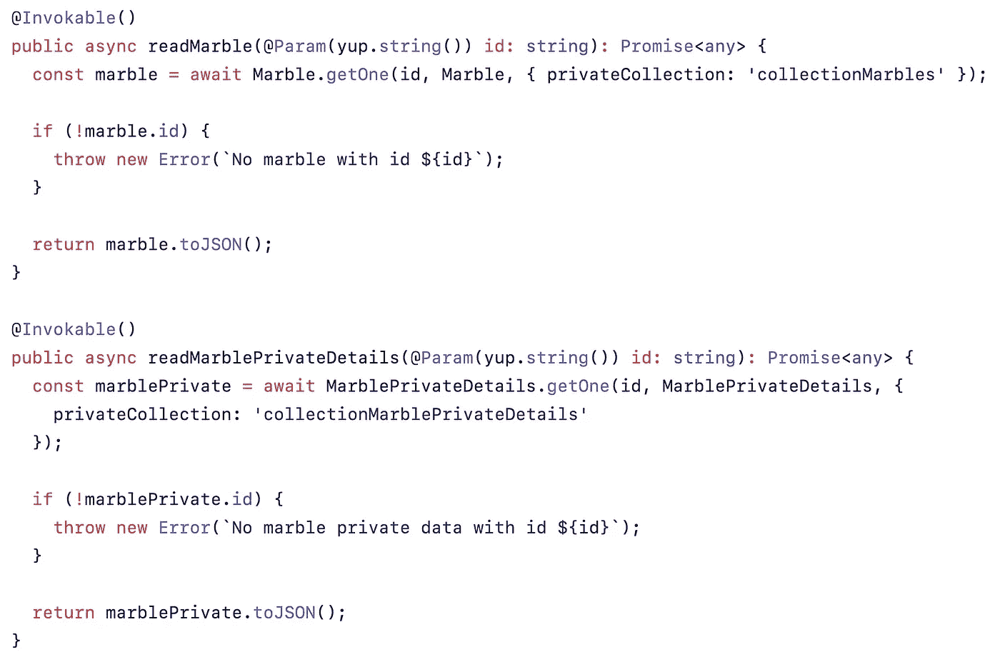
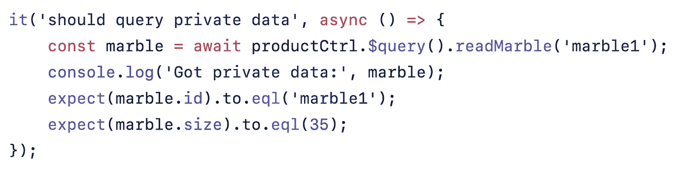

# 了解区块链私有数据。实际操作的例子

> 原文：<https://medium.com/hackernoon/understanding-blockchain-private-data-a-hands-on-example-eacc3efe4ad6>

## Hyperledger Fabric 1.2+支持一项名为私有数据的新功能。在这个对流器的例子中，我想展示它是如何工作的。

企业对区块链技术的主要担忧之一是大多数框架和网络的默认“公共”状态。

私有数据是一种功能，它允许网络中的组织在同一通道中共享“公共”数据(所有参与者都可以访问)和私有数据。

> Hyperledger 结构中的渠道是实际的分类帐。它有自己的策略和设置，通常是多个组织连接在一起的结果。

例如，商业网络中的 10 个组织可能希望看到他们之间的每一笔交易，但是更愿意对不涉及的组织隐藏一些特定的数据，即价格。

在这种情况下，数据可以存储在不同的 ***集合中。*** 通过集合，数据可以根据策略进行分离，因此一些对等点可能有更多的数据，而所有相关的对等点将只存储相关数据的散列。



Official Hyperledger diagram — [https://hyperledger-fabric.readthedocs.io/en/release-1.4/private-data/private-data.html](https://hyperledger-fabric.readthedocs.io/en/release-1.4/private-data/private-data.html)

需要多少集合就有多少集合，这些集合可能包含智能协定中定义的不同数据。

例如，*价格*可能存储在一个名为*完全私有数据*的集合中(只对直接相关的组织开放)，然后交付细节可能存储在一个名为*半私有细节*的集合中(对相关各方和政府开放)，最后在常规分类帐中存储其余的细节。

> 想了解更多关于私人数据的信息吗？[https://hyperledger-fabric . readthedocs . io/en/release-1.4/private-data/private-data . html](https://hyperledger-fabric.readthedocs.io/en/release-1.4/private-data/private-data.html)

数据从*应用*通过名为 ***瞬态数据*** *的对象发送到*对等体*。*此外，存储中的数据可能有“清除”策略，从而可以根据监管策略删除数据(如果需要)。不变性和证明与散列一起保存。

# 这个例子

这个例子以官方的弹珠例子为基础，并用[换流器](https://worldsibu.tech/convector/convector-smart-contracts/)对其进行了增强。

集合是以 JSON 格式定义的。



正如您在之前的 JSON 中所注意到的，策略包括有权访问数据的组织以及唯一名称和一些其他设置，如定义何时(以及是否)应该清除数据的 *blockToLive* 。

完整示例位于此处:

[](https://github.com/worldsibu/convector-example-private-data) [## worldsibu/convector-示例-私有-数据

### 对流器-测试-私人数据。通过创建帐户为 world sibu/convector-example-private-data 开发做出贡献…

github.com](https://github.com/worldsibu/convector-example-private-data) 

在安装或升级代码时，该 JSON 文件在智能合约的实例化过程中传递。

这里的一个好的实践是接收*瞬态*数据作为一个唯一的*模型*，然后分割它以存储在多个集合中(如果需要的话)。例如:



[https://github.com/worldsibu/convector-example-private-data/blob/master/packages/product-cc/src/product.controller.ts](https://github.com/worldsibu/convector-example-private-data/blob/master/packages/product-cc/src/product.controller.ts)

数据作为键*弹球*上的*瞬态数据*被接收，当它通过`getTransientValue`时，它将返回准备好被处理的数据的 JSON 版本。Convector 会自动解析为通过 getTransientValue<…>(' key '，…)传递的*模型类型*。

> 请注意，函数中没有参数，因为函数中的参数是公共值，所有对等体都可以访问，与策略无关。

然后在这里创建了两个新模型`col1Data`和`col2Data`，它们中的每一个都接收了它们应该存储的数据，当我们继续保存它时，我们需要向`.save()`函数传递一个参数，指定使用哪个集合`{ privateCollection: '...' }`。

您可以看到，模型不需要任何特殊的东西就可以用于私有数据。



[https://github.com/worldsibu/convector-example-private-data/blob/master/packages/product-cc/src/product.model.ts](https://github.com/worldsibu/convector-example-private-data/blob/master/packages/product-cc/src/product.model.ts)

当你需要从一个函数中检索数据时，你可以调用常规的`.getOne`函数，传递一个属性`privateCollection`来告诉控制器在哪里寻找数据。在这种情况下，`id`参数是公共的，因为每个参与者都可以看到这些数据。



引用的 repo 有一个单元测试来模拟一个 **NodeJS** 后端调用来创建私有数据。


[https://github.com/worldsibu/convector-example-private-data/blob/master/packages/product-cc/tests/product.e2e.ts](https://github.com/worldsibu/convector-example-private-data/blob/master/packages/product-cc/tests/product.e2e.ts)

该单元测试文件通过*瞬态数据*到`.$config(...)`。该示例还从 WorldState (CouchDB)中查询数据，以演示集合是如何基于策略分开存储的。

但是您也可以像这样查询我们之前看到的函数:



## 测试代码示例

确保安装了 Node 8.x(如果需要，可以使用 NVM 来管理 Node 的多个版本)和 Docker。

```
$ git clone [https://github.com/worldsibu/convector-example-private-data.git](https://github.com/worldsibu/convector-example-private-data.git)
$ cd convector-example-private-data
$ npm i# Start a development blockchain on your computer
$ npm run env:restart# Install the smart contract
$ npm run cc:start -- product# Run a test
$ npm run test:e2e
```

这就对了。您已经在您的计算机上正式创建并查询了真实区块链中的私人数据。

*   点击加入我们的 Discord 聊天应用 [Convector 社区。](http://discord.gg/twRwpWt)
*   点击此处了解更多关于 WorldSibu 的信息。

> Hyperledger Fabric 是最成熟的区块链框架之一。Convector 智能合同是获得许可的区块链项目的主要智能合同框架之一。