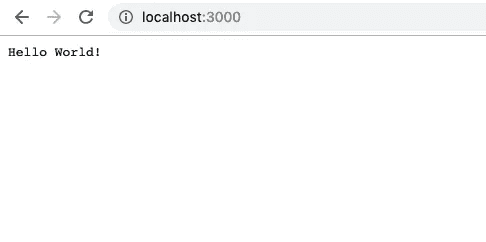
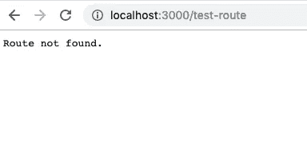

# 理解 Express.js:创建自己的节点 HTTP 请求路由器

> 原文：<https://medium.com/hackernoon/understanding-express-js-creating-your-own-node-http-request-router-4190a9b6aad6>


Do-It-Yourself: Node HTTP Router

Express 是一个非常棒的 JavaScript 框架，可以作为许多全栈 web 应用程序的后端。我们中的许多人每天都在使用它，并精通如何使用它，但可能对它的工作原理缺乏了解。今天，在不深入研究 Express 源代码的情况下，我们将重新创建一些路由功能，以便更好地理解框架运行的环境以及如何处理响应和请求。

如果你想看最终的源代码，你可以在 Github 上找到它。为了更好的学习体验，请继续和我一起编码！

**注意:**如果这篇文章帮助您更好地理解了 Node 后端路由，请为它鼓掌👏(还是 50！)来帮助传播消息！

***

## 通过注册我的免费时事通讯，在您的收件箱中获得快速 JavaScript 技巧！

***

# 入门指南

让我们从模仿快递应用开始。我们将对其稍作修改，因为我们不会引入`express`，而是引入我们自己创建的模块。

首先，创建一个新的项目文件夹，并使用默认配置启动一个 npm 项目。

```
mkdir diy-node-router
cd diy-node-router
npm init -y
```

验证您的`package.json`文件如下所示:

```
{
  "name": "diy-node-router",
  "version": "1.0.0",
  "description": "", 
  "main": "index.js",
  "scripts": {
    "test": "echo \"Error: no test specified\" && exit 1"
  },
  "author": "",
  "license": "ISC"
}
```

接下来，我们将创建我们的`index.js`文件。在这个文件中，我们将复制`express`“Hello World”示例，但是引入我们自己的模块(我们将在短时间内创建这个模块)。

这与`express`“Hello World”的例子本质上是一样的。基于这段代码，我们知道我们的`router`模块应该是一个在被调用时返回`app`对象的函数。这个对象应该有一个`listen`方法来开始监听端口上的请求，还有一个`get`方法来设置`get`请求处理。我们还将设置一个`post`方法，因为我们最终希望我们的应用程序处理帖子。

# 搭建`diy-router`模块

现在我们创建实际的路由器模块。在新的`src`目录下创建`diy-router.js`文件。

```
mkdir src
cd src
touch diy-router.js
```

我们不想一次吃掉太多，所以让我们先创建一个模块，导出必要的方法。

希望到目前为止这些都有意义:我们创建了一个`router`函数，当被调用时，它返回一个`get`和一个`listen`方法。此时，每个方法都忽略它的参数，只记录它被调用过。然后，这个函数被包装在一个立即调用的函数表达式(IIFE)中。如果你不知道我们为什么使用生命，我们这样做是为了数据隐私。当我们有不想暴露在模块本身之外的变量和函数时，下面的步骤会更加明显。

此时，我们可以返回到根目录，使用 node 运行我们的应用程序。

```
node .
```

如果一切正常，您将看到如下输出:

```
Get method called!
Listen method called!
```

太好了，所有东西都连在一起了！现在，让我们开始响应 http 请求提供内容。

# 处理 HTTP 请求

为了获得一些基本的 HTTP 请求处理功能，我们将节点的内置`http`模块引入到我们的`diy-router`中。`http`模块有一个`createServer`方法，该方法采用带有请求和响应参数的函数。每当一个 http 请求被发送到在`listen`方法中指定的端口时，这个函数就会被执行。下面的示例代码显示了如何使用`http`模块在端口`8080`上返回文本“Hello World”。

```
http.createServer((req, res) => {
   res.write('Hello World!');
   res.end();
}).listen(8080);
```

我们希望在我们的模块中使用这种功能，但是我们需要让用户指定他们自己的端口。此外，我们希望执行一个用户提供的回调函数。让我们在`diy-router`模块的`listen`方法中使用这个示例功能，并确保更加灵活地使用端口和回调函数。

让我们运行我们的应用程序，看看会发生什么。

```
node .
```

我们看到控制台中记录了以下内容:

```
Get method called!
Example app listening on port 3000!
```

这是一个好迹象。让我们打开我们最喜欢的网络浏览器，导航到 [http://localhost:3000](http://localhost:3000.) 。



Simple “Hello World!” App

看起来不错！我们现在通过端口 3000 提供内容。这很好，但我们仍然不提供依赖路线的内容。例如，如果您导航到[http://localhost:3000/test-route](http://localhost:3000/test-route)，您将看到同样的“Hello World！”消息。在任何真实的应用程序中，我们都希望提供给用户的内容依赖于所提供的 URL 中的内容。

# 添加和查找路线

我们需要能够向我们的应用程序添加任意数量的路由，并在调用该路由时执行正确的路由处理函数。为此，我们将在模块中添加一个`routes`数组。此外，我们将创建`addRoute`和`findRoute`函数。名义上，代码可能看起来像这样:

我们将使用`get`和`post`方法中的`addRoute`方法。`findRoute`方法简单地返回`routes`中匹配所提供的`method`和`url`的第一个元素。

在下面的代码片段中，我们添加了数组和两个函数。此外，我们修改了我们的`get`方法并添加了一个`post`方法，这两个方法都使用`addRoute`函数将用户指定的路线添加到`routes`数组中。

**注意:**由于`routes`数组和`addRoute`和`findRoute`方法只能在模块内访问，我们可以使用我们的 IIFE“揭示模块”模式，不将它们暴露在模块外。

最后，让我们在传递给`createServer`方法的函数中使用`findRoute`函数。当成功找到一条路由时，我们应该调用与之关联的处理函数。如果没有找到路由，我们应该返回一个 404 错误，说明没有找到路由。该代码在概念上将如下所示:

```
const method = req.method.toLowerCase();
const url = req.url.toLowerCase();
const found = findRoute(method, url);if (found) {
  return found.handler(req, res);
}res.writeHead(404, { 'Content-Type': 'text/plain' });
res.end('Route not found.');
```

现在，让我们将其纳入我们的模块。当我们这样做时，我们将添加一段额外的代码，为我们的响应对象创建一个`send`方法。

让我们看看这是怎么回事！同样，从根目录运行您的应用程序。

```
node .
```

您应该看到该应用程序正在端口 3000 上运行。在浏览器中，导航至 [http://localhost:3000](http://localhost3000.) 。你应该看看“你好，世界！”但是现在，如果你导航到[http://localhost:3000/test-Route](http://localhost:3000/test-route,)，你应该得到一个“Route not found”的消息。成功！



Route not found

现在，我们想确认我们确实可以在应用程序中添加`/test-route`作为路线。在`index.js`，设置了这条路线。

重启服务器并导航到[http://localhost:3000/test-route](http://localhost:3000/test-route.)。如果你看到“测试测试”，你已经成功地设置了路由！

**注:**如果玩够了，可以到此结束！这是一个很好的路由入门。如果你想更深入一点，并能够从我们的路线中提取参数，请继续阅读！

# 提取路线参数

在现实世界中，我们很可能在 url 字符串中有参数。例如，假设我们有一组用户，希望根据 url 字符串中的参数获取一个用户。我们的 url 字符串可能以类似于`/user/:username`的形式结束，其中`username`表示与用户相关联的唯一标识符。

为了创建这个函数，我们可以开发一些正则表达式规则来匹配任何 url 参数。与其这样做，我建议我们引入一个叫做`route-parser`的伟大模块来为我们做这件事。`route-parser`模块为每条具有`match`方法的路线创建一个新对象，所有的正则表达式都包含在其中。要在我们的模块中进行所需的更改，请执行以下操作:

从命令行安装模块:

```
npm i route-parser
```

在`diy-router.js`文件的顶部，要求模块。

```
const Route = require('route-parser');
```

在`addRoute`函数中，不是添加计划 url 字符串，而是添加一个`Route`类的新实例。

```
const addRoute = (method, url, handler) => {
  routes.push({ method, url: new Route(url), handler });
};
```

接下来，我们将更新`findRoute`函数。在这次更新中，我们使用`Route`对象的`match`方法来匹配提供的 url 和路由字符串。换句话说，导航到`/user/johndoe`将匹配路线字符串`/user/:username`。

如果我们找到了匹配，我们不仅要返回一个匹配，还要返回从 url 中提取的参数。

```
const findRoute = (method, url) => {
  const route = routes.find(route => {
    return route.method === method && route.url.match(url);
  }); if (!route) return null; return { handler: route.handler, params: route.url.match(url) };
};
```

为了处理这个新功能，我们需要重新访问在传递给`http.createServer`的函数中调用`findRoute`的地方。我们需要确保路由中的任何参数都作为请求对象的属性添加。

```
if (found) {
  req.params = found.params;
  res.send = content => {
    res.writeHead(200, { 'Content-Type': 'text/plain' });
    res.end(content);
};
```

因此，我们的最终模块将如下所示:

让我们来测试一下！在我们的`index.js`文件中，我们将添加一个新的用户端点，看看是否可以通过改变我们的 url 查询字符串来切换用户。如下更改您的`index.js`文件。这将根据所提供请求的`params`属性过滤我们的`user`数组。

现在，重启你的应用。

```
node .
```

先导航到[http://localhost:3000/user/John doe](http://localhost:3000/user/johndoe)，观察内容，再导航到[http://localhost:3000/user/janes with](http://localhost:3000/user/janesmith.)。您将分别收到以下响应:

```
Hello, John Doe!Hello, Jane Smith!
```

# 最终代码

这个项目的最终代码可以在 [Github 这里](https://github.com/nas5w/diy-node-router)找到。感谢您的参与！

# 结论

在本文中，我们观察到，虽然 Express 是一个不可思议的工具，但是我们可以通过实现我们自己的定制模块来复制它的路由功能。经历这种练习真的有助于拉开“帷幕”，让你意识到真的没有任何“魔法”在进行。也就是说，我绝对不建议为你的下一个节点项目开发你自己的框架！像 Express 这样的框架如此不可思议的一个原因是它们受到了许多优秀开发人员的关注。它们具有健壮的设计，并且比任何一个开发人员部署的解决方案都更加高效和安全。

你觉得这个练习怎么样？这是否激励你尝试复制 Express 其他方面的功能？请在评论中告诉我！