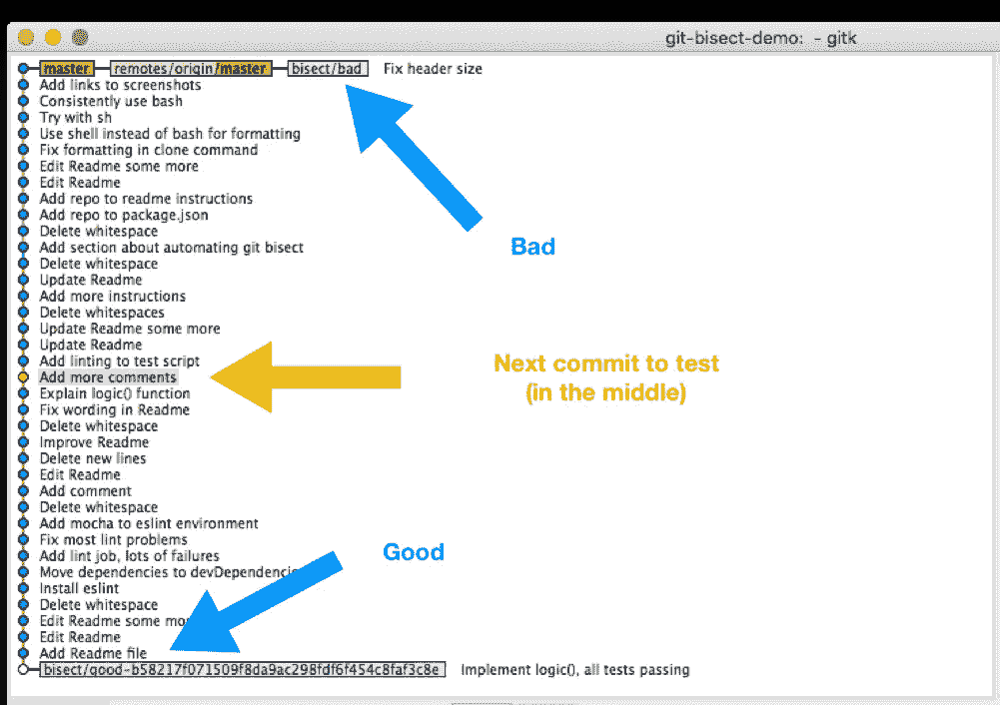
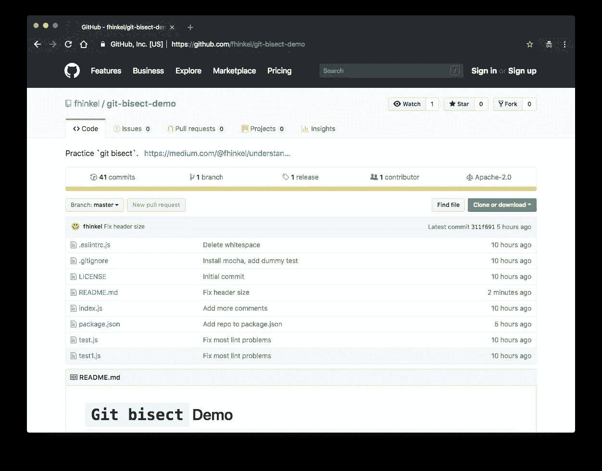

# 理解 Git-平分，即使用二分搜索法来找到引入 Bug 的变更

> 原文：<https://medium.com/hackernoon/understanding-git-bisect-i-e-use-binary-search-to-find-the-change-that-introduced-a-bug-89489b4c9fa6>

Git 是一个强大的工具。一旦掌握了`commit`和`merge`，就有无限可能。很有用的一个是`[git-bisect](https://git-scm.com/docs/git-bisect)`。它帮助你找到一个导致行为改变的提交。

当你发现一个**回归，一些曾经工作**的东西被破坏了，使用`git-bisect`找到破坏它的提交。将当前提交标记为`bad`，并将旧的提交标记为`good`，其中该特性仍然有效。`Git-bisect`然后用二分搜索法将这两个提交之间的所有变更一分为二。在每一步，都要求您将提交标记为`good`或`bad`，直到`bisect`发现**第一个错误提交**。

## 如何使用 git-平分

```
git bisect start
npm test   #  Double check that this commit is broken.
git bisect bad
git log --oneline   # Find the hash of a good commit.
git checkout 7425633   #  Checkout that good commit.
npm test   # Double check that everything was green.
git bisect good
```

`Bisect`使用二分搜索法，因此范围呈指数递减。每一步都将范围减半。如果您提交两倍的数量，平均需要一个额外的步骤——而不是两倍的时间。因此，将大范围的提交一分为二相当快。



Git bisect view. The range of commits to test is cut in half at every step.

我们在 [Node.js 项目](https://github.com/nodejs/node)中大量使用`git-bisect`。Node.js 项目具有良好的持续集成性，但有些 bug 只有在发布后才能发现。使用`git-bisect`，很容易发现错误的提交。

## 试试看！

如果你想试用`git-bisect`，这里有一个[演示库](https://github.com/fhinkel/git-bisect-demo)。在某个时候，引入了一个 bug，您可以通过运行`npx mocha test1.js`看到这一点。你能找到错误的提交吗？



[Use this repository to practice git bisect.](https://github.com/fhinkel/git-bisect-demo)

## 自动化 git-二分

您可以使用脚本运行`git-bisect`,而不是手动测试每个步骤。它将在每一步使用脚本并自动标记提交，直到找到第一个错误的提交。