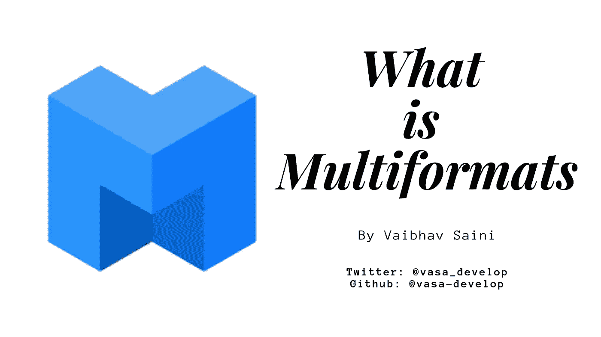

# 深入了解 IPFS(4/6):什么是多格式？

> 原文：<https://medium.com/hackernoon/understanding-ipfs-in-depth-4-6-what-is-multiformats-cf25eef83966>

## 计算中的每个选择都有一个权衡。是时候制造面向未来的系统了。

An Ultimate Tutorial Guide to Multiformats