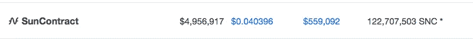

# 了解加密中的市值

> 原文：<https://medium.com/hackernoon/understanding-market-capitalization-in-crypto-9e1d4145a445>

## 以及为什么它很重要…

如果你从事加密货币交易，你会经常听到的一个术语是“资本化”或“市值”。在今天的博客文章中，我将向你简单解释一下市值意味着什么，以及它为什么重要。

如果你去 coinmarketcap.com，你可以看到所有不同的加密资产以及它们的市值。加密资产的市值基本上是所有流通供应的市值——加起来。市场上的流通供应量，就是在给定的时间里，市场上的购买者所持有的硬币的数量。所以总结一下:

> **市值=价格 x 流通供应量**

从上面的函数中，我们可以推导出价格函数:

> **价格=市值/流通供应量**

为了证明这一点，让我们以 [SunContract](https://suncontract.org) SNC 令牌为例:

如果我们将流通的 **122，707，503 枚 SNC 代币**，乘以撰写本文时的价格**0.040396 美元**，我们将得出上面所示的资本化值——4，956，917 美元:

> **当前 MC = 122，707，503 x 0.040396 美元= 4，956，917 美元。**

同时，我们将得出价格:

> **当前 P = 4956917 美元/122707503 美元= 0.040396 美元**

## **价格、流通供应量与市值的关系:**

我们将通过下面的例子来说明这三者之间的相互联系:

***SNC 令牌***

假设你以当前价格 0.040396 美元购买了 10，000 SNC 代币。您的购买成本将为:

> **费用= 10，000 SNC x 0.040396 = 403.96 美元**

假设新的资金进入项目，市值上升到 10，000，000 美元。**由于 SNC 总供给= SNC 流通供给，**供给永远不会改变。因此，10，000 SNC 的新价值为:

> **新价格=新市值/供应量**
> 
> **N.P = 10，000，000 / 122，707，503 = 0.08149 美元**
> 
> **新投资价值= 10000 SNC x 0.08149 = 814.9 美元**

***令牌 X(举例)***

现在，想象另一个令牌 X，它的流通供应量不同于总供应量。先说目前的流通供应量=**122707503**。代币 X 的价格和 SNC 代币完全一样——**$ 0.040396**。您购买的代币 X 的数量与购买 SNC 代币的数量相同: **10，000 代币 X。**您的购买成本相同:

> **费用= 10，000 SNC x 0.040396 = 403.96 美元**

假设新的资金进入了项目，市值上升到 10，000，000 美元，就像上面的例子一样。**此外，假设新的流通供应量增加到 250，000，000 代币 X。**你的 10，000 代币 X 投资的新价值现在将是:

> **新价格=新市值/新流通供应量**
> 
> **N.P = 10，000，000 / 250，000，000 = 0.04 美元**
> 
> **新价值= 10，000 SNC x 0.04 美元= 400 美元**

## **市值概述及其在加密中的重要性:**

1.  市值反映了整体情况，因为它结合了供应和价格因素

2.价格取决于流通供给和进入项目的资金(市值)

3.一旦流通供给=总供给，价格就不受流通供给的影响。此时，只有市值的变化会影响价格

4.市值>价格:)

[*Winfred k . Mandela*](https://www.linkedin.com/in/winfred-k-mandela/)*是区块链领域卓有成就的营销人员和业务开发人员。她负责将各公司产品团队的创新与业务部门以客户为中心的运营联系起来，以建立区块链品牌，在实施项目的地区创造消费者意识，并每天通过他们的渠道推动客户对品牌的偏好。Winfred 喜欢在户外骑自行车，喜欢分析市场，并且总是喜欢读一本好书！*