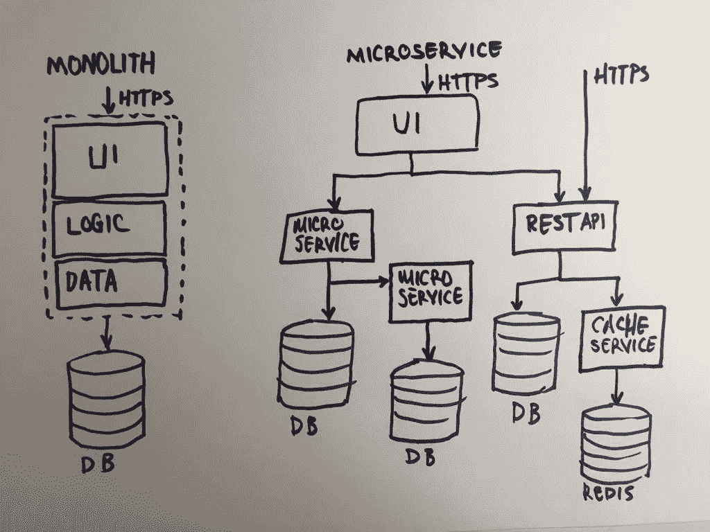
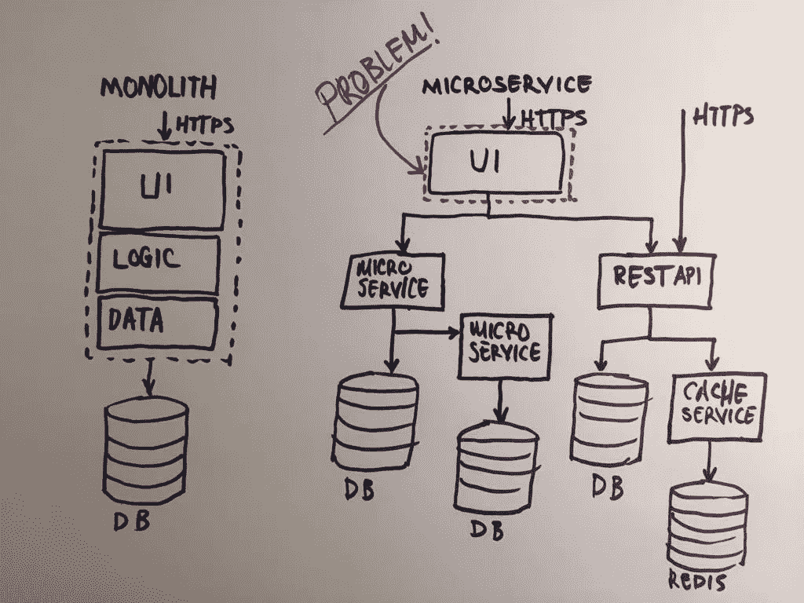
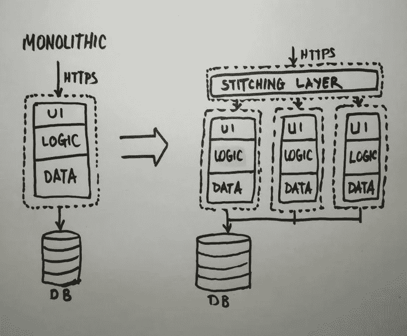
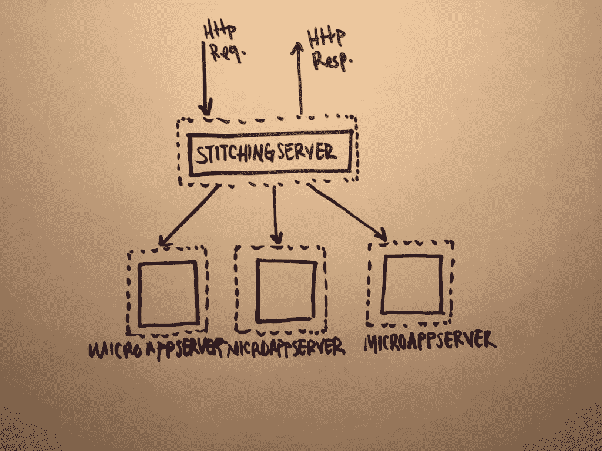
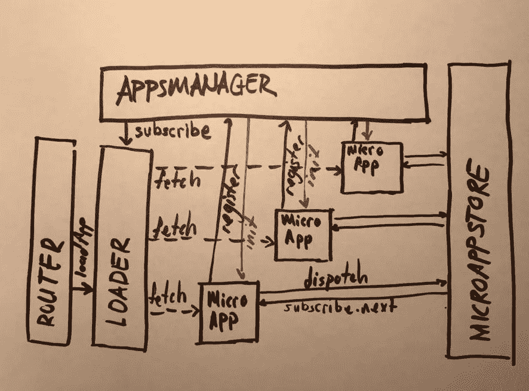
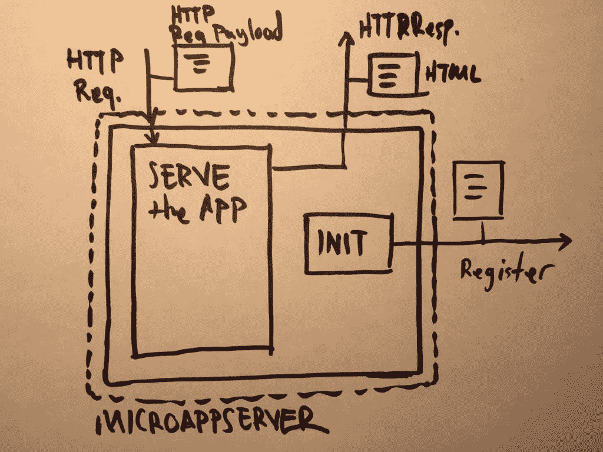
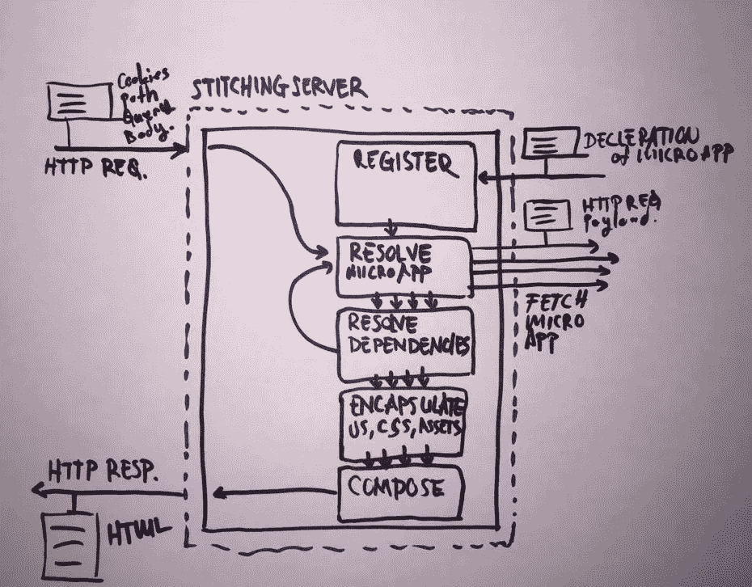

# 了解微前端

> 原文：<https://medium.com/hackernoon/understanding-micro-frontends-b1c11585a297>

作为一名前端开发人员，这些年来你一直在开发 monoliths，尽管你已经知道这是一种不好的做法。您将代码分成组件，使用 *require* 或 *import* 并在 package.json 中定义 npm 包，或者将 sub git 存储库装入项目中，然而您最终构建了一个整体。是时候改变了。

# 为什么你的代码是一个整体？

除了已经实现微前端的应用程序之外，所有前端应用程序本质上都是一个整体应用程序。原因是，如果您使用 React 库进行开发，并且如果您有两个团队，两个团队都应该使用相同的 React 库，并且两个团队应该在部署上保持同步，并且在代码合并期间总是会发生冲突。它们并没有完全分离，很可能它们维护着同一个存储库，拥有同一个构建系统。单一应用程序的退出被定义为微服务。但这是为了后端！😱

# 实际上什么是微服务？

一般来说，对微服务最简单的解释是，它是一种开发技术，允许开发人员为平台的不同部分进行独立部署，而不会损害其他部分。独立部署的能力允许他们构建隔离的或松散耦合的服务。为了将这个架构放在一个更稳定的基础上，需要遵循一些规则，这些规则可以总结如下:每个服务应该只有一个任务，并且应该很小。所以负责这项服务的团队应该很小。关于团队和项目的规模，[詹姆斯·刘易斯和马丁福勒](https://martinfowler.com/articles/microservices.html#HowBigIsAMicroservice)在互联网上做了一个最酷的解释，如下:

> 在我们与微服务从业者的交谈中，我们看到了各种规模的服务。报道的最大尺寸遵循亚马逊的两个披萨团队的概念(即整个团队可以吃两个披萨)，意思是不超过 12 个人。在较小的规模上，我们已经看到由六个人组成的团队支持六项服务。

我画了一个简单的草图，对整体材料和微服务进行了直观的解释:

从上图可以看出，除了 UI 之外，微服务中的每个服务都是独立的应用程序。UI 还是一片的！当所有服务都由一个团队处理，而公司正在扩大规模时，前端团队将开始挣扎，无法跟上，这是该架构的瓶颈。

除了瓶颈之外，这种架构还会导致一些组织问题。假设公司正在成长，并将采用敏捷开发方法，这需要*跨职能*小团队。在这个常见的例子中，自然地，产品负责人会开始将故事定义为前端和后端任务，而*跨职能*团队永远不会成为真正的*跨职能*单位。这将是一个浅泡，看起来像一个敏捷团队，但它将在内部被分离。更重要的是，管理这种团队将是一项非常棘手的任务。在每个计划中，都会有一个问题，在 sprint 中是否有足够的前端任务或足够的后端任务。为了解决这里描述的所有问题和许多其他问题，几年前出现了**微前端** **想法**，它开始很快流行起来。

# 微服务瓶颈问题的解决方案:微前端🎉

解决方案实际上很明显，采用了多年来为后端服务工作的相同原则:将前端整体分成小的 UI 片段。但是 UI 与服务不太相似，它是最终用户和产品之间的接口，它应该是一致和无缝的。更有甚者，在单页面应用时代，整个应用都是在客户端的浏览器上运行的。它们不再是简单的 HTML 文件，相反，它们是非常复杂的软件。现在我觉得微前端的定义是必要的:

> 微前端背后的想法是将一个网站或网络应用程序想象成由独立团队拥有的功能组合。每个团队都有自己关心和擅长的**不同的业务领域**或**任务**。一个团队是**跨职能**并开发其端到端的功能**，从数据库到用户界面。([micro-fontend.org](https://micro-frontends.org/))**

从我目前的经验来看，对于很多公司来说，直接采用上面提出的架构真的很难。许多其他人有巨大的遗留负担，这使他们无法迁移到新的架构。出于这个原因，一个更软的中间解决方案是至关重要的，它更灵活，允许容易采用和安全迁移。在更详细地概述了架构之后，我将尝试对架构提供一些见解，这种架构确认了上面的提议，并允许遵循更灵活的方式。在深入细节之前，我需要建立一些术语。

# 整体结构和一些术语

让我们想象一下，我们正在通过业务功能垂直划分单一的应用程序结构。我们将最终得到几个更小的应用程序，它们与单片应用程序具有相同的结构。但是，如果我们在所有这些小应用程序的基础上添加一个特殊的应用程序，用户将与这个新的应用程序进行交流，它将把每个小应用程序的旧的单一用户界面组合成一个。这个新层可以被命名为**缝合层**，因为它从每个微服务中获取生成的 UI 部分，并为最终用户组合成一个*无缝* UI，这将是微前端最直接的实现🤩

为了更好地理解，我将每个小型单片应用称为**微应用**，因为它们都是独立的应用，而不仅仅是微服务，它们都有 UI 部分，每个都代表一个端到端的业务功能。

众所周知，今天的前端生态系统是高度通用的，并且可能极其复杂。因此，这种简单的解决方案不足以在实际产品中实现。

# 要解决的问题

虽然这篇文章只是一个想法，但我在 Reddit 上发了一个帖子来讨论这个想法。感谢社区和他们的回应，我可以列出一些需要解决的问题，我会试着一一描述。

*当我们拥有一个完全独立的* ***微应用*** *时，如何打造无缝一致的 UI 体验？*

这个问题没有灵丹妙药，但其中一个想法是创建一个共享的 UI 库，它本身也是一个独立的微应用。顺便说一下，所有其他微应用程序都将依赖于那个共享 UI 库微应用程序。在这种情况下，我们只是创建了一个共享的依赖关系，并取消了独立的**微应用**的想法。

另一个想法可以是在根级别共享 [CSS 自定义变量](https://developer.mozilla.org/en-US/docs/Web/CSS/Using_CSS_variables)。这种解决方案的优势是应用程序之间的全局可配置主题。

或者我们可以简单地在应用团队之间共享一些 SASS 变量和 mixins。这种方法的缺点是 UI 元素的重复实现，并且应该对所有的**微应用程序检查和验证相似元素设计的完整性。**

我们如何确保一个团队没有覆盖另一个团队编写的 CSS？

一种解决方案是通过由微应用名称精心选择的 CSS 选择器名称来确定 CSS 范围。通过将这个范围界定任务交给**缝合层**将减少开发开销，但将增加**缝合层**的责任。

另一个解决方案可以是强制每个**微应用**成为一个[定制 web 组件](https://developer.mozilla.org/en-US/docs/Web/Web_Components/Using_custom_elements)。这种解决方案的优点是由浏览器来确定范围，但这是有代价的:用 shadow DOM 进行服务器端渲染几乎是不可能的。此外，浏览器对定制元素还没有 100%的支持，尤其是如果你必须支持 IE 的话。

*微 app 之间应该如何共享全局信息？*

这个问题指出了这个话题上最受关注的问题之一，但解决方案非常简单:HTML 5 有非常强大的功能，但大多数前端开发人员并不了解。例如，**自定义事件**就是其中之一，它是在微应用内共享信息的解决方案。

或者，任何共享的发布-订阅实现或 T39 可观察实现都可以做到。如果我们想要一个更复杂的全局状态处理程序，我们可以实现一个共享的微型 Redux，通过这种方式，我们可以实现更具反应性的架构。

*如果所有的微 app 都是独立 app，我们怎么做客户端路由？*

这个问题取决于每个设计实现。所有主要的现代框架都通过使用浏览器历史状态在客户端提供强大的路由机制。问题是哪个应用程序负责路由以及何时负责。

我目前的实用方法是创建一个共享的客户端路由器，它只负责顶级路由，其余的属于各自的微应用程序。假设我们有一个/content/:id 路由定义。共享路由器将解析/content 部分，并且解析的路由将被传递到 ContentMicroApp。ContentMicroApp 是一个独立的服务器，将只使用/:id 调用它。

*我们肯定需要服务器端渲染，但是微前端有可能吗？*

服务器端渲染是一个棘手的问题。如果你正在考虑用 iframes 来缝合微应用程序，那么忘掉服务器端渲染吧。类似地，用于拼接任务的 web 组件也没有 iframes 强大。但是如果每个**微型应用**能够在服务器端呈现其内容，那么**拼接层**将只负责在服务器端连接 HTML 片段。

与传统环境的集成至关重要！但是怎么做呢？

为了整合一个遗留系统，我想描述一下我自己的策略，我将其命名为“*渐进入侵*”。

首先，我们必须实现缝合层，它应该有一个透明代理的功能。然后我们可以通过声明一个通配符路由将遗留系统定义为一个**微应用**:*legacy microapp*。因此，所有流量都将到达拼接层，并透明地代理到遗留系统，因为我们还没有任何其他微应用程序。

下一步将是我们的第一个*渐进入侵*动作:我们将从 *LegacyMicroApp* 中取一小部分，删除主导航并用一个依赖项来代替它。这种依赖将是一个用全新技术实现的**微应用**:*NavigationMicroApp*。

现在，拼接层将把每条路线解析为 *LegacyMicroApp* ，并且它将把依赖项解析为 *NavigationMicroApp* ，并且通过连接这两个来服务它们。

然后下一步将是页脚，遵循主导航的相同模式。

然后，我们将继续从 *LegacyMicroApp* 中获取类似的一小部分，直到一无所有。

如何编排客户端，这样我们就不需要每次都重新加载页面了？

嗯，**缝合层**解决了服务器端的问题，但没有解决客户端的问题。在客户端，在将已经粘合的片段作为无缝 HTML 加载之后，我们不需要每次在 URL 改变时都加载所有的部分。因此，我们必须有一些异步加载片段的机制。但问题是，这些片段可能有一些依赖关系，这些依赖关系需要在客户端解决。这意味着微前端解决方案应该提供加载微应用的机制和依赖注入的机制。

根据上面的问题和可能的解决方案，我可以在以下主题下总结一切:

**客户端**

*   管弦乐编曲
*   按指定路线发送
*   隔离微应用
*   应用程序对应用程序通信
*   微应用 ui 之间的一致性

**服务器端**

*   服务器端渲染
*   按指定路线发送
*   依赖性管理

# 灵活、强大而简单的架构

所以，这篇文章值得等待！微前端架构的基本元素和需求终于开始显露出来了！

在这些需求和关注的指导下，我开始开发一个解决方案，我将其命名为 ***microfe*** 。😎在这里，我将通过以抽象的方式强调其主要组件来描述该项目的架构目标。

从客户端开始很容易，它有三个独立的主干结构: *AppsManager* 、 *Loader* 、*路由器*和一个额外的*微应用商店。*

## AppsManager

AppsManager 是客户端微 app 编排的核心。AppsManager 的主要功能是创建依赖关系树。当解决了微应用的所有依赖性时，它实例化该微应用。

## 装货设备

客户端微应用编排的另一个重要部分是加载器。加载器的职责是从服务器端获取未解析的微应用。

## 路由器

为了解决客户端路由问题，我在 ***microfe*** 中引入了路由器。与常见的客户端路由器不同， ***microfe*** 路由器的功能有限，它不解析页面，而是解析微应用。假设我们有一个 URL /content/detail/13 和一个 *ContentMicroApp* 。在这种情况下， ***microfe*** 路由器将解析到/content/*的 URL，并调用*content microapp*/detail/13 URL 部分。

## 微应用商店

为了解决微应用到微应用的客户端通信，我将 MicroAppStore 引入到了 ***microfe 中。*** 与 Redux 库功能相似，区别在于:对异步数据结构变化和 reducer 声明具有弹性。

服务器端部分在实现上可能稍微复杂一点，但在结构上更简单。它仅由两个主要部件 *StitchingServer* 和许多*微应用服务器*组成。

## 微应用服务器

一个*微应用服务器*的最低功能可以概括为*初始化*和*服务*。

当*微应用服务器*启动时，它应该做的第一件事是用*微应用声明*调用*静态应用服务器*注册端点，该声明定义了*微应用服务器*的*依赖关系*、*类型*和 *URL 模式*。我认为没有必要提及服务功能，因为它没有什么特别的。

## 缝合服务器

*StitchingServer* 为*微应用服务器提供一个*寄存器*端点。*当*微应用服务器*向 *StichingServer* 注册时， *StichingServer* 记录*微应用服务器的声明。*

稍后， *StitchingServer* 使用声明从请求的 URL 解析*微应用服务器*。

在解析了一个*微应用服务器*及其所有依赖关系后，CSS、JS 和 HTML 中的所有相对路径都将以相关的*微应用服务器*公共 URL 为前缀。一个额外的步骤是用唯一的标识符*微应用服务器*作为 CSS 选择器的前缀，以防止客户端微应用之间的冲突。

然后 *StitchingServer* 的主要职责出现了:从所有收集的部分组成并返回一个无缝的 HTML 页面。

# 对其他实现的一瞥

即使在 2016 年被称为微前端之前，许多大公司都在试图解决类似的问题，如脸书的 [BigPipe](https://www.facebook.com/notes/facebook-engineering/bigpipe-pipelining-web-pages-for-high-performance/389414033919/) 。如今，这种想法越来越流行。不同规模的公司都对这个主题感兴趣，并为此投入时间和金钱。例如， *Zalando* 将其解决方案开源，称为 [Project Mosaic](https://www.mosaic9.org/) 。我可以说, ***microfe*** 和 Project Mosaic 采用了相似的方法，但有一些重要的区别。虽然 microfe 采用完全分散的路线定义来赋予每个微应用程序更多的独立性，但 Project Mosaic 更喜欢集中的路线定义和每条路线的布局定义。顺便说一下，Project Mosaic 允许轻松地进行 A/B 测试和动态布局生成。

还有一些其他的方法，比如使用 iframes 作为缝合层，这显然不是在服务器端，而是在客户端。这是一个非常简单的解决方案，不需要太多的服务器结构和 DevOps 的参与。这项工作只能由前端团队来完成，因此它给公司带来的组织负担较少，成本也较低。

已经有一个框架叫做[*单 spa*](https://single-spa.js.org/) 。该项目依靠每个应用的命名约定来解析和加载**微应用**。很容易掌握想法和遵循模式。因此，这可能是在您自己的本地环境中试验这个想法的一个很好的初始介绍。但这个项目的缺点是，你必须以特定的方式构建每个微应用程序，这样它们才能很好地与框架配合。

# 最后的想法

我相信，随着时间的推移，微前端的话题将会被更频繁地讨论。如果这个话题设法得到越来越多公司的关注，这将是大型团队事实上的发展方式。对于任何前端开发人员来说，在不久的将来掌握一些关于这种架构的见解和经验都是非常有益的。

## 考虑捐款

我怀着一个崇高的目标在微前端上进行大量的实验:创建一个微前端框架，它可以解决大多数问题，而不会影响性能、开发的简易性和可测试性。如果你有任何好主意要展示，请不要犹豫，访问我的知识库，打开一个问题或通过下面的评论或 [Twitter DM](https://twitter.com/onrzfr) 联系我。我会在那里帮助你！🙂

 [## onerzafer/micro-fe-registry

### 微 fe 应用程序注册服务器。在 GitHub 上创建一个帐户，为 onerzafer/micro-fe-registry 的开发做出贡献。

github.com](https://github.com/onerzafer/micro-fe-registry)  [## oner zafer/微铁

### 微型前端基础设施。在 GitHub 上创建一个帐户，为 onerzafer/micro-fe 开发做出贡献。

github.com](https://github.com/onerzafer/micro-fe)