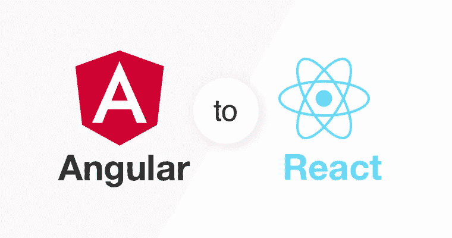
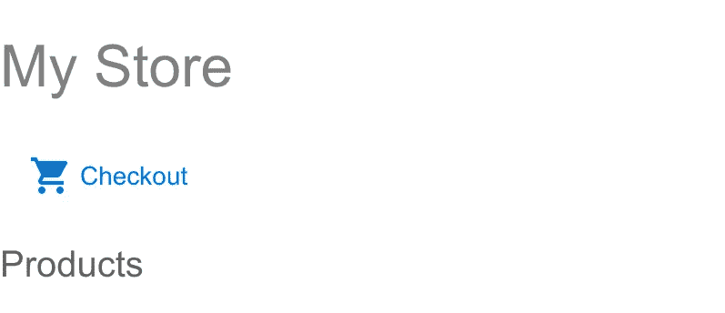
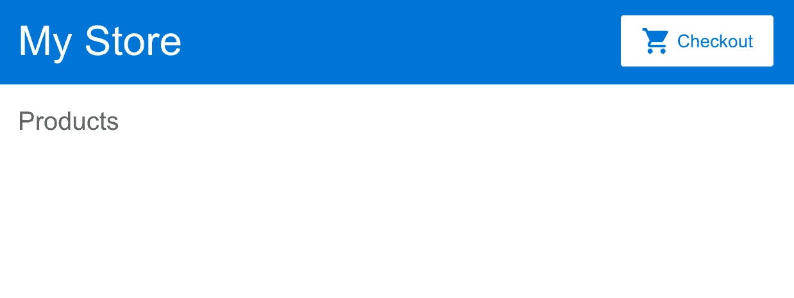
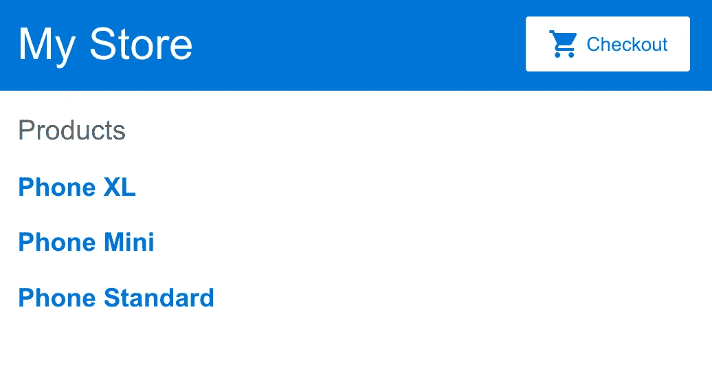
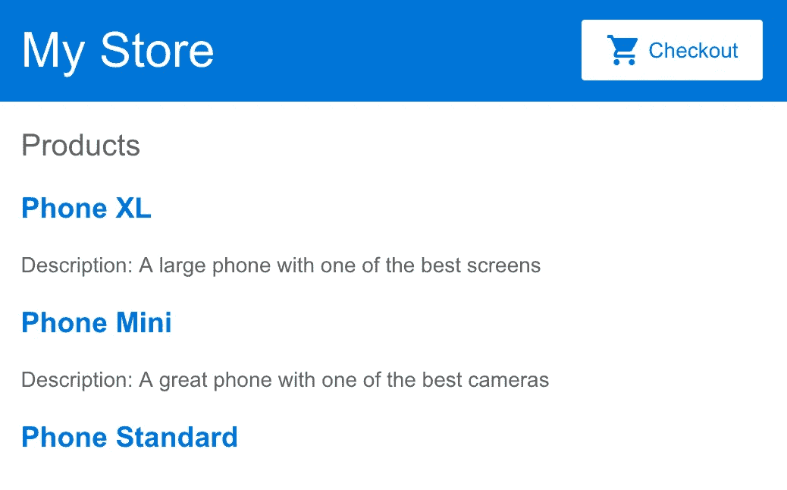
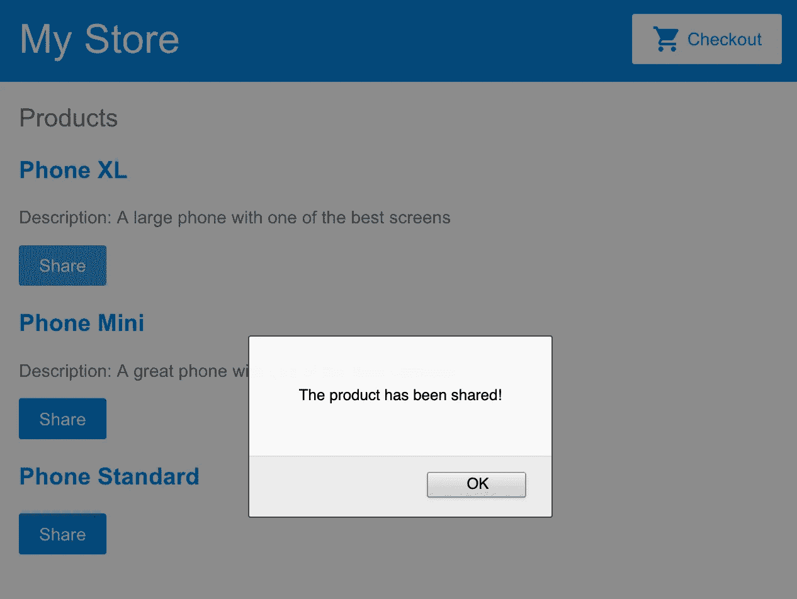
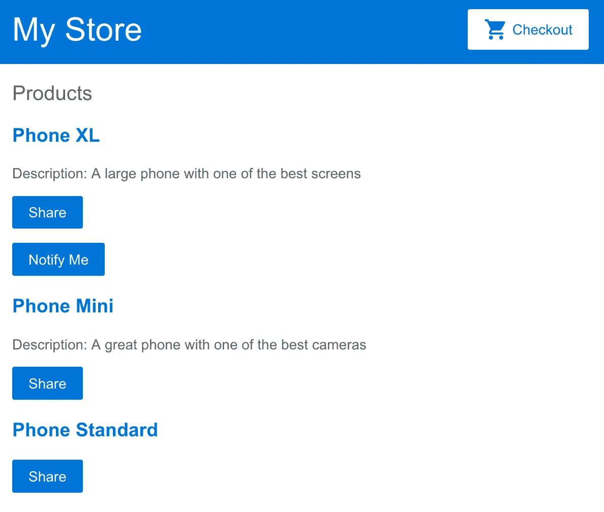
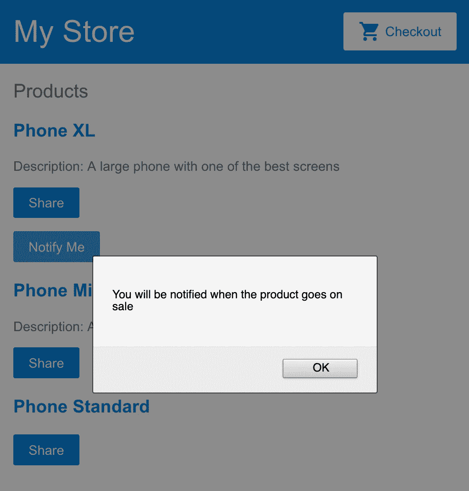

# 用你的角度知识理解反应

> 原文：<https://medium.com/hackernoon/understanding-react-using-your-angular-knowledge-5b0cd0ca4d9>



在用 Angular 在不同的 web 应用程序中工作了大约六年之后(我的第一个应用程序是 Angular.js)，我终于有机会在我的专业组合中添加几个 React 应用程序。让我的大脑适应“*反应风格*来做事需要我大量的时间。在这篇文章中，我将讲述我从 ***角度*** 到 ***反应*** 的一些经历。

这篇文章**不是 React 和 Angular 的比较**，而是指导你如何更轻松地在这些工具之间切换。您必须理解，必须对这两种框架有深入的了解。

**我的第一个建议**

> 我强烈推荐停止尝试使用角度方法来解决 React 中的问题，:D 快乐编码！

## 开始之前，让我们说同一种语言

为了刷新你的角度词汇，请在这里快速浏览一下官方文档[。](https://angular.io/guide/glossary)

**反应**最常用的术语是:

1.  编译器:允许我们使用 JavaScript 最新特性的工具。
2.  **Bundlers:** 大部分时候指的是 Webpack。这些工具将文件映射到开发工作中，并使用 JavaScript 优化技术创建产品包，包括对遗留浏览器的支持。
3.  **包管理器:**我们应用程序的库管理器。在 package-lock.json 出现之前，人们更喜欢使用 Yarn。如今，NPM 和纱线之间没有太大的区别。
4.  **JSX:**React 模板系统。去这里找个[基础介绍](https://reactjs.org/docs/introducing-jsx.html)或者去官方文档找个[完整教程](https://reactjs.org/docs/jsx-in-depth.html)。

这转变了:

在此:

5.**元素:**代表你想在屏幕上看到的内容的代码。`const element = **<h1>Hello, world </h1>**`。

6.**组件:**具有每个元素行为的功能/类。

7.**道具:****的`@inputs`反作用**组件。**道具**代表从父母到孩子的沟通渠道。

8.**道具.儿童:**保留**道具**谁包含了开始和结束标签之间的内容:`<**myHair**>{/* props.children */}</**myHair**>`。

9.**状态:**由组件管理的可以触发 UI 更新的变量。

10.**事件:**组件执行的功能。**反应**事件可以与 HTML 事件相关联。

## 入门指南

Angular 是 Google 创建的 JavaScript 框架。它包括一个完整的生态系统，允许您创建动态的 web 应用程序。它由一个模块和**模板系统**，一个**管理表单的方法**，一个 **HTTP 库**，一个**路由系统**等等组成。这就是为什么我们被允许不用考虑**额外的软件包**就能创建应用程序。大多数 Angular 开发者开始使用 Angular 生态系统中的命令行[界面工具](https://cli.angular.io/)来创建他们的应用。

React 是一个 JavaScript 库，它允许我们创建 web 组件。在创建动态 web 应用程序时，React 需要与不同的库进行交互。最典型的设置包括集成一个管理表单的方法、一个 HTTP 库、一个路由系统等等。关于哪个库组合是最好的，没有正确的答案。React 开发者大多以“ [*创建 React App*](https://github.com/facebook/create-react-app) ”或“ [*React 弹弓*](https://github.com/coryhouse/react-slingshot) ”开头。我建议从[官方文档](https://github.com/coryhouse/react-slingshot)开始，并根据每个项目的需求选择初学者工具包。

## 代码结构

**角度**有清晰的代码结构。您已经有了模板、样式和 JavaScript 文件。每个文件都有自己的域，并保留了本地语言。模板使用 HTML，样式使用 CSS/SCSS/SASS，JavaScript 文件使用 Typescript。这种结构允许后端开发人员用他们熟悉的代码生成用户界面。

在 **React** 中，场景不同。一些开发人员觉得他们是国王，因为他们完全控制了项目。这意味着开发者可以像 Angular 一样使用**单独的文件**，或者使用包含模板、样式和行为的**单一 JavaScript** 文件。

## 理论够多了，让我们来看看一些真实的代码

开始使用新技术的建议之一是从官方文档开始。在这一部分，我将遵循相同的方法，但略有不同。让我们使用 **React** 一起构建“[*Angular 入门:你的第一个 App*](https://angular.io/start) ”。

## **创建新项目**

按照与正式文档相同的方式，我准备一个 StackBlitz 回购。

> 去[这里](https://stackblitz.com/edit/xthecapx-angular-react-starter-kit)叉项目开始。

初始配置完成后，应用程序应该如下所示:



Starter state for React tutorial

## 风格问题

在 Angular 中，每次我们生成组件时，都会创建一个新的有效 HTML 元素。React world 是关于返回 JSX 的函数，它不会创建任何额外的元素来包装组件。在本教程中，我们使用 Angular started 工具包，这需要确保应用程序将与 React 实现一起工作。如果我们转到 *style.css* ，有一个 css 规则指向`app-top-bar`，那么这个选择器在 React 中将不存在。为了快速修复它，让我们添加一个带有类的 div 来标识该元素，而不是像这样创建一个新的标记选择器:

1.  转到 *TopBar.js*
2.  确保父元素为`<div **className="app-top-bar"**>`。
3.  转到 style.css，用`**.app-top-bar**`替换`*app-top-bar*`。
4.  拆下`router-outlet + *`选择器，并在`.container`上添加衬垫。

此时，应用程序应该看起来像这样:



## 遍历列表

在 React 中，JSX 没有具体的迭代指令。一切都是 JavaScript，然后我们使用 JavaScript 进行迭代。要在 ProductList 组件中呈现产品，请执行以下步骤:

1.  转到 *ProductList.js*
2.  在`**<h2>Products</h2>**`下面添加以下代码:

完成这些更改后，应用程序看起来应该是这样的:



Products names

**这是什么？**
记住，React 里的一切都是 JavaScript。关于产品的信息存在于产品变量中。因此，我们可以使用运算符`map`来生成所需的 **JSX 码**。

注意锚元素使用花括号添加了属性标题。它允许 JSX 执行 JavaScript 表达式。在这个例子中，我们使用文字字符串生成标题。

## 条件渲染

要在 React 中有条件地呈现元素，我们应该使用以下选项之一:1)if else 语句，2)三元条件，或者 3)使用短路评估技术。

1.  转到 *ProductList.js*
2.  对于短路评估，在`**</h3>**`结束标签下添加以下代码。

3.对于三元条件使用:

4.对于 if-else 语句，添加以下行

该应用程序应该看起来像:



App with description and conditional rendering

## HTML 事件监听器

有了 JSX，开发者可以直接在元素中访问 HTML 事件。点击按钮后，要执行`share()`功能，请执行以下操作:

1.  转到 *ProductList.js*
2.  在产品描述元素下，添加以下内容

点击按钮后，应用程序看起来是这样的:



## 创建组件

React 中的组件系统由返回所需 JSX 代码的函数组成。**函数的参数**是组件收到的道具**，**模板**是 **JSX 返回的**语句。要生成新的 React 元素，请执行以下操作:**

1.  添加新文件: *ProductAlerts.js*
2.  在 *ProductAlerts.js* 中，添加以下代码:

3.转到 *ProductList.js*

4.导入组件

```
import **ProductAlerts** from ‘./ProductAlerts’;
```

5.在按钮结束标记下添加以下代码

```
<**ProductAlerts** product={product} />
```

该应用程序应该看起来像:



App with children notification component

**这是什么？**

我们正在生成一个新的 React 组件。React 组件是一个 JavaScript 文件，它导入 React 并导出一个返回 JSX 代码的函数。在产品列表文件中，我们提供适当的产品。它允许我们通过函数的参数在`ProductsAlerts`中使用这个变量。

## 反应“输出”

让我们从这一节开始说，**角度的输出概念在 React** 中不存在。组件之间的通信以一种方式进行。然而，可以执行父方法，向子方法提供函数的引用。

1.  转到 *ProductList.js*
2.  在`share()`函数下面添加下面的代码。

3.给`ProductAlert`组件添加一个新的**道具**，并通过`onNotify`函数的引用。

```
<ProductAlerts product={product} **notify={onNotify}** />
```

4.转到 *ProductAlerts.js*

5.将新的道具名称添加到参数中

```
const ProductAlerts = ({ product, **notify** }) => {
```

6.附加 click 事件，将接收到的属性提供给按钮的 onClick 属性。

```
<button **onClick={notify}**>Notify Me</button>
```

现在，如果您单击通知按钮，应用程序应该看起来像这样:



Notification system message

**什么事？**

在 JavaScript 中，当我们将一个函数重新赋值给一个变量时，我们不是在创建该函数的一个新实例，而是一个引用。因此，如果我们在 ProductAlerts 组件中执行【the onNotify 函数就会被执行。

## 项目的代码

本教程的角度解可以在[这里](https://stackblitz.com/edit/xthecapx-angular-first-app)找到:

The Angular

本教程的 React 解决方案可以在[这里](https://stackblitz.com/edit/xthecapx-react-angular-first-app)找到:

The react solution

## 下一步是什么？

在下面的帖子中，我将使用 React 创建“[*Angular 入门:你的第一个应用*](https://angular.io/start) ”教程的以下部分。我希望这对作为 Angular 开发人员理解 React 背后的概念有所帮助。

感谢阅读，请支持我分享这篇文章或在[媒体](/@xthecapx)和 [Twitter](https://twitter.com/thecapnews) 或 [LinkedIn](https://www.linkedin.com/in/cristian-marquez/) 上关注我。